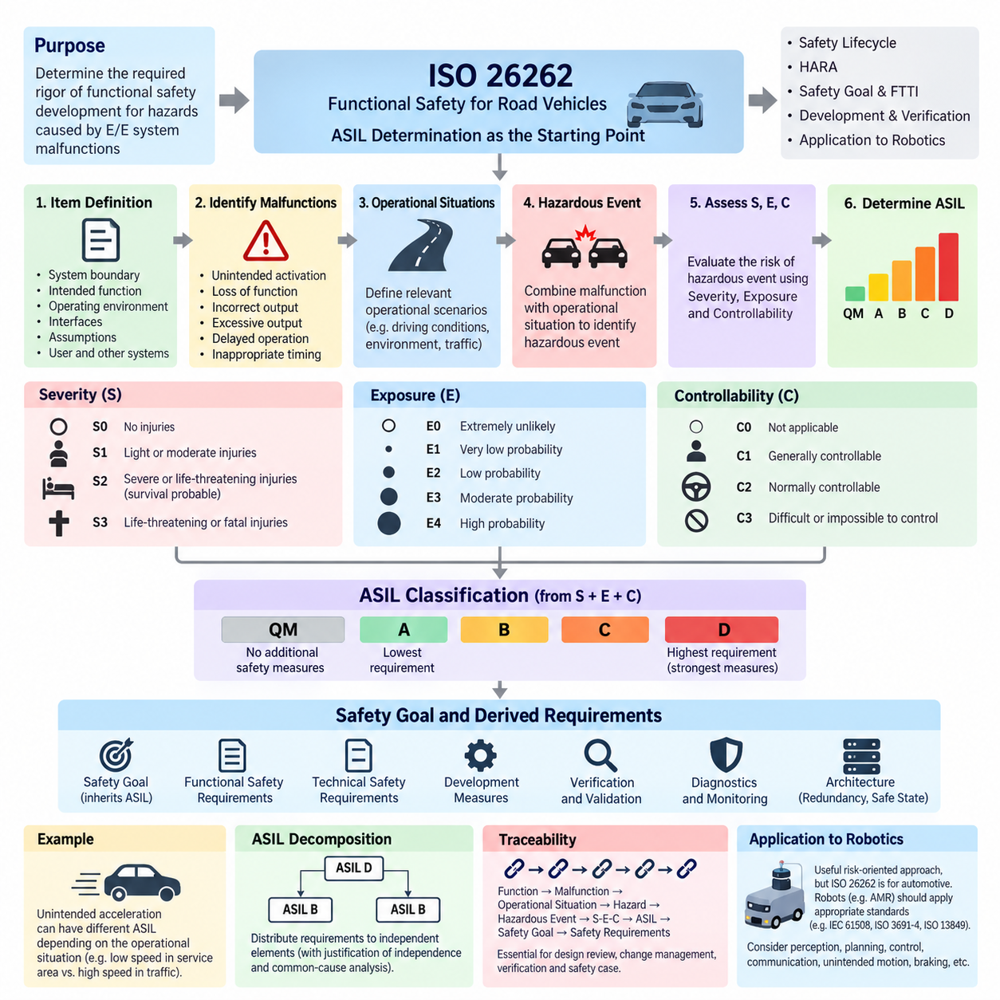
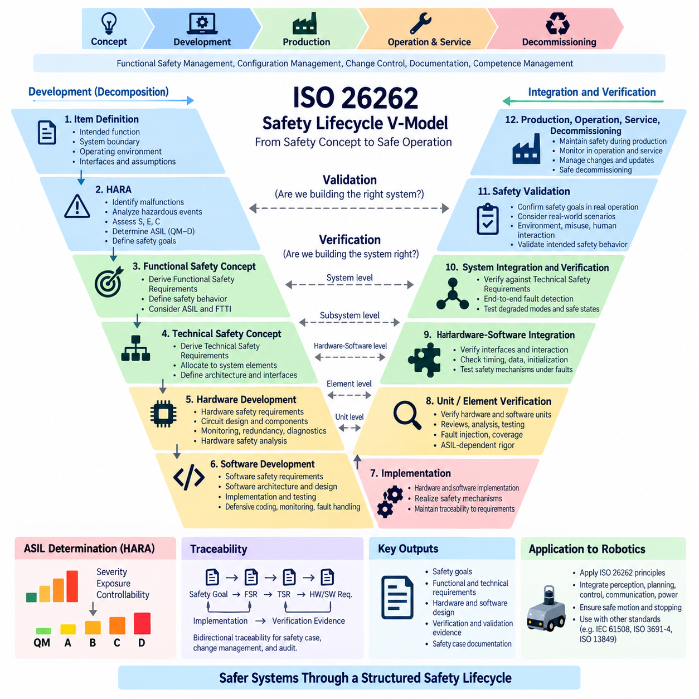
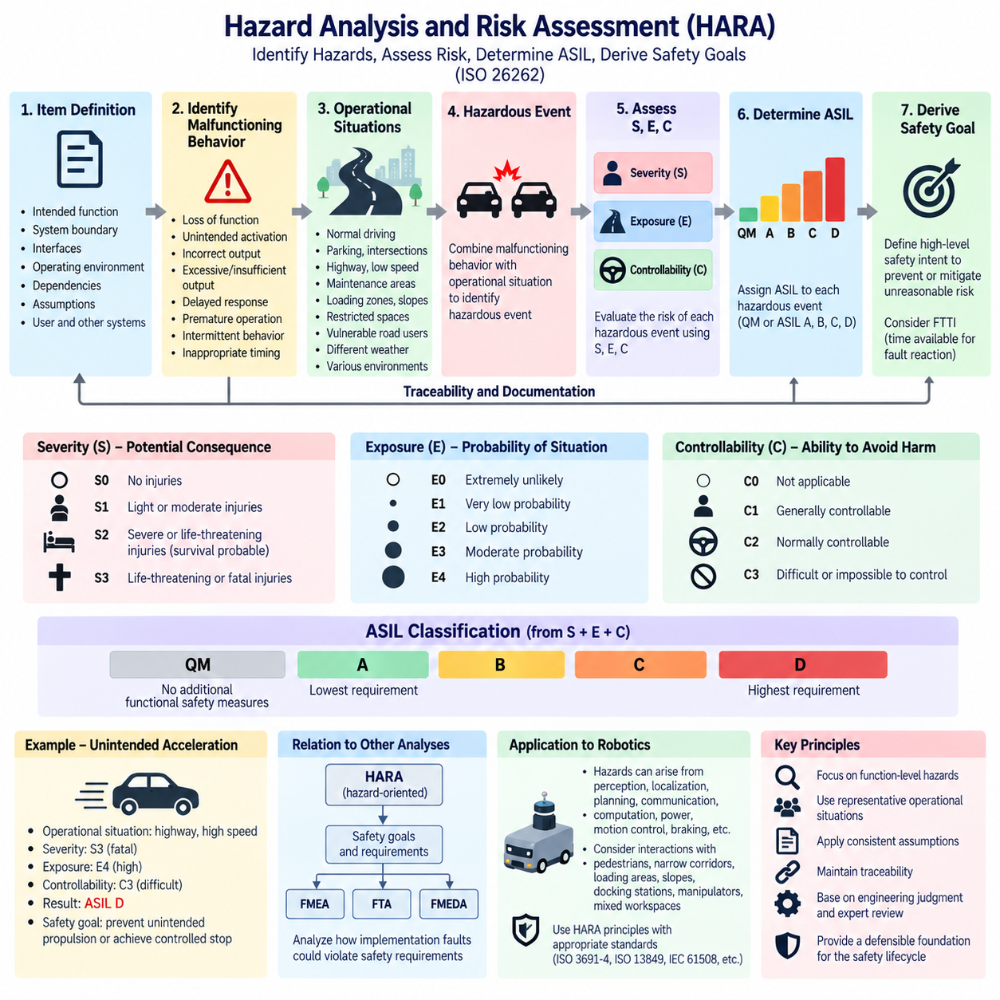
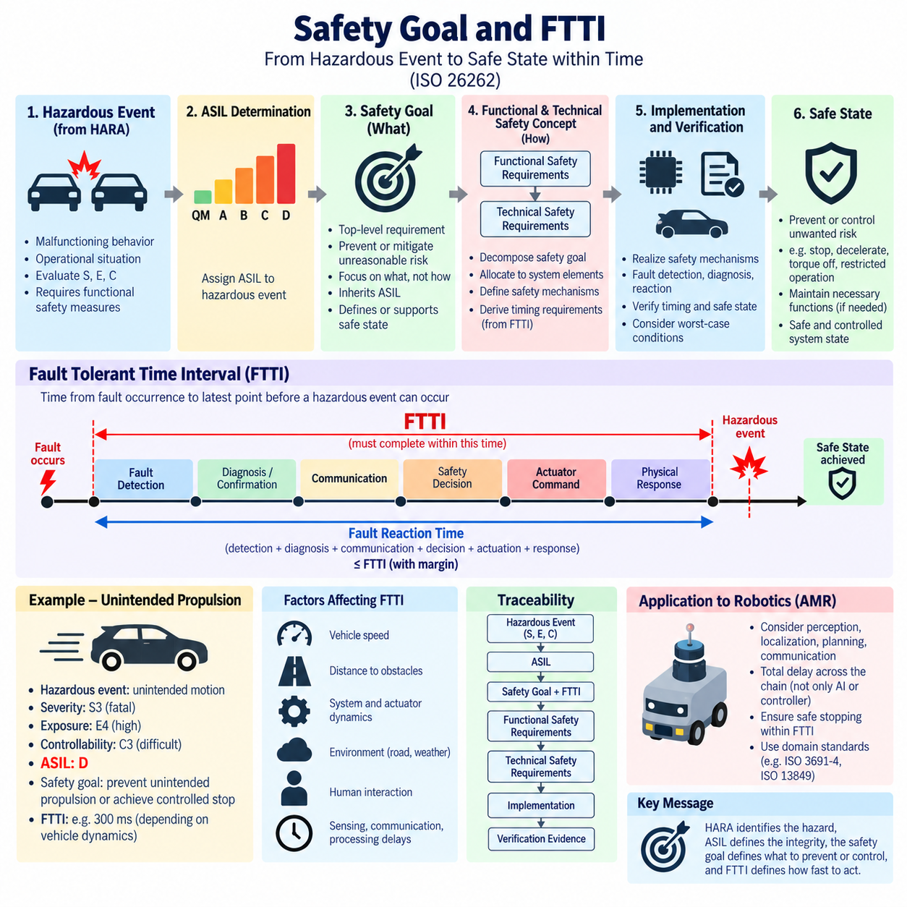
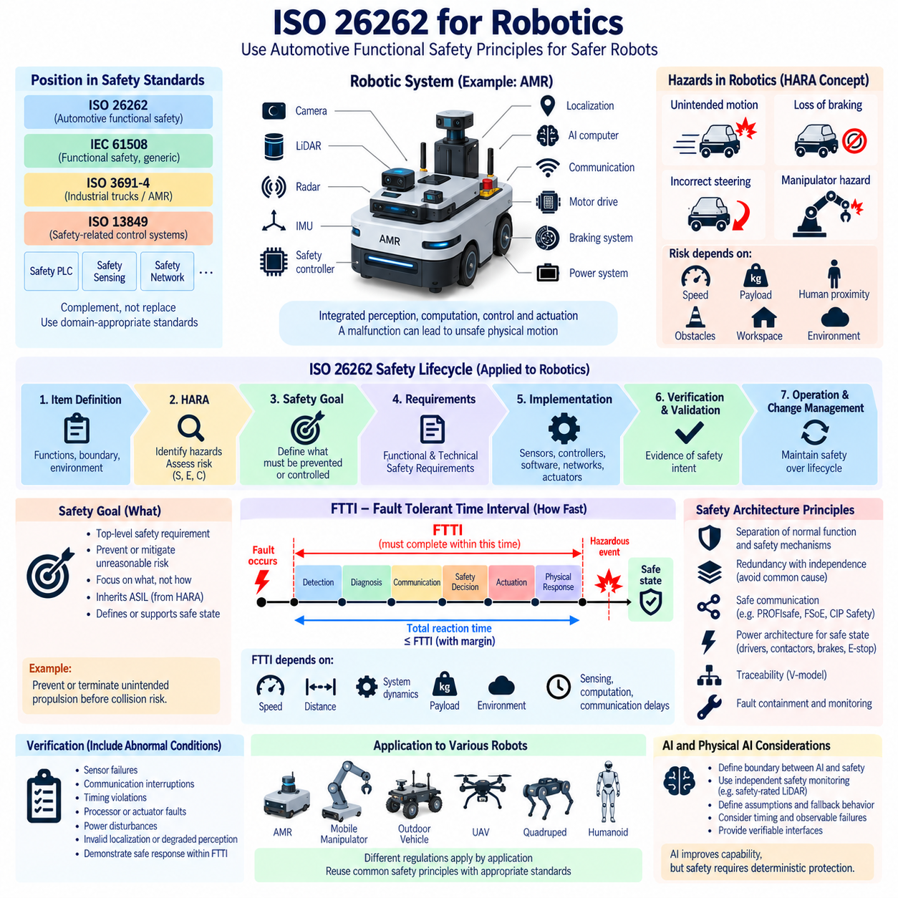

**Volume 12. Safety Architecture**

# Chapter 01. ISO 26262

## 01.01. ASIL A to D Determination

{width="7.268055555555556in" height="7.268055555555556in"}

Automotive Safety Integrity Level (ASIL) determination is a central activity in ISO 26262 because it establishes the required rigor of functional safety development for hazards caused by malfunctioning behavior of electrical and electronic systems. Within the provided safety architecture, this topic forms the starting point of the ISO 26262 chapter and provides the foundation for the subsequent safety lifecycle, HARA, safety goals, FTTI, and robotics-oriented applications.

ASIL is determined during Hazard Analysis and Risk Assessment (HARA), where hazardous events are identified by combining a potential system malfunction with an operational situation. The assessment does not simply classify components such as sensors, controllers, or actuators according to their importance. Instead, it evaluates the risk associated with the consequences of specific hazardous events and establishes the integrity level required for the corresponding safety goals.

Three parameters form the basis of ASIL determination: Severity (S), Exposure (E), and Controllability (C). Severity represents the potential degree of harm that could result when a hazardous event occurs. Exposure describes how frequently or for how long the operational situation associated with that hazard is expected to occur. Controllability represents the ability of the driver or other persons involved to avoid or mitigate the resulting harm once the hazardous situation develops.

Severity is commonly divided into classes S0 through S3. S0 represents situations without injuries, while S1 corresponds to light or moderate injuries, S2 represents severe or potentially life-threatening injuries where survival is probable, and S3 represents life-threatening or fatal injuries. The classification concerns potential consequences rather than the probability that an electrical or electronic component itself will fail, which is an important distinction in functional safety analysis.

Exposure is classified from E0 through E4 according to the probability of encountering the relevant operational situation. A malfunction that can create a hazard only under an extremely unusual operating condition may therefore receive a lower exposure classification than one that becomes hazardous during normal driving. Exposure must be evaluated for the operational scenario itself rather than interpreted as the failure rate of the hardware or software responsible for the malfunction.

Controllability is categorized from C0 through C3 and considers whether persons affected by the hazardous event can reasonably prevent the resulting harm. C1 represents situations generally considered controllable, C2 represents normally controllable situations, and C3 represents situations that are difficult or impossible to control. This parameter is particularly important because two hazards with similar physical consequences can receive different classifications when their opportunities for human intervention differ substantially.

The combination of severity, exposure, and controllability produces a classification ranging from Quality Management (QM) to ASIL A, B, C, or D. QM indicates that the analyzed hazardous event does not require additional ISO 26262 safety measures beyond normal quality-management processes. ASIL A represents the lowest automotive safety integrity requirement, while ASIL D represents the highest level and consequently requires the strongest development, verification, independence, diagnostic, and safety-assurance measures.

ASIL should not be interpreted as a direct numerical probability of failure or as a universal statement that one component is more dangerous than another. It expresses the risk reduction rigor required for a safety goal derived from a hazardous event. The same physical component can therefore participate in functions having different ASIL classifications depending on operating conditions, malfunction behavior, system architecture, and the consequences associated with each safety-related function.

A practical determination process begins with item definition. Engineers establish the system boundary, intended functions, operating environment, interfaces, assumptions, and interactions with users and neighboring systems. Potential malfunctioning behaviors are then identified, including unintended activation, loss of function, incorrect output, excessive output, delayed operation, or operation at an inappropriate time. Each malfunction is combined with relevant operational situations to identify hazardous events.

Consider an electronically controlled propulsion function. Unintended acceleration at very low speed in an isolated service area may produce a different risk classification from unintended acceleration at road speed in dense traffic. The underlying controller failure could be identical, but severity, exposure, and controllability change with the operating scenario. Consequently, ASIL determination must preserve the relationship between malfunction, operational situation, hazardous event, and resulting harm.

Once hazardous events have been classified, safety goals are established to prevent or sufficiently mitigate unreasonable risk. A safety goal inherits the ASIL associated with the hazardous event that motivated it. These goals subsequently drive functional safety requirements, technical safety requirements, hardware and software development measures, verification activities, diagnostic concepts, and architectural mechanisms such as monitoring, redundancy, fault containment, and transition to safe states.

Higher ASIL classifications progressively increase the required confidence that faults will be prevented, detected, controlled, or tolerated. An ASIL D function may therefore require stronger architectural independence, diagnostic coverage, systematic development controls, verification rigor, and quantitative hardware evaluation than an ASIL A function. However, ASIL alone does not prescribe a particular circuit or software implementation; the architecture must demonstrate that the allocated safety requirements are adequately satisfied.

ASIL decomposition can sometimes distribute a safety requirement across sufficiently independent elements while maintaining the required overall safety integrity. This is not a simple method for reducing development effort. Independence assumptions, common-cause failures, dependent failures, interfaces, and freedom from interference must be carefully justified. A decomposition that appears mathematically acceptable can still be unsafe when two supposedly independent channels share power, clocks, communication paths, software resources, or environmental vulnerabilities.

The determination must also be supported by traceability. Engineers should be able to follow the chain from system function and malfunction through operational situation, hazard, hazardous event, S-E-C classification, resulting ASIL, safety goal, and derived safety requirements. This traceability becomes essential during design reviews, change management, verification, confirmation measures, and safety-case preparation because modifications to system behavior or operating assumptions can invalidate an earlier classification.

For robotics, ASIL concepts provide a useful risk-oriented engineering reference, although ISO 26262 is fundamentally an automotive functional safety standard. The supplied architecture therefore separates ISO 26262 from IEC 61508, ISO 3691-4, and ISO 13849 while later providing dedicated SIL/ASIL assessment and AMR safety case chapters. An AMR or mobile robot should consequently apply the safety standard appropriate to its product domain rather than automatically assigning automotive ASIL labels.

Nevertheless, the reasoning behind ASIL determination transfers valuable discipline to Physical AI systems. Autonomous robots combine perception, localization, planning, communication, AI computation, motor control, braking, and power electronics, creating long causal chains between faults and physical consequences. Hazard analysis should therefore examine not only component failures but also incorrect commands, stale sensor information, timing failures, communication loss, unintended motion, insufficient braking, and failures to enter a safe operating condition.

The essential principle is that ASIL A through D are outputs of structured hazard and risk analysis rather than labels selected according to engineering intuition. Correct determination requires clearly defined functions, credible hazardous events, defensible severity, exposure, and controllability assessments, and traceable safety goals. This disciplined classification establishes the foundation upon which the remaining ISO 26262 safety lifecycle and the broader safety architecture can be systematically developed.

## 01.02. Safety Lifecycle (V-Model)

{width="7.268055555555556in" height="7.268055555555556in"}

The safety lifecycle V-model provides a structured framework for developing safety-related electrical and electronic systems from initial concept through implementation, integration, verification, validation, production, operation, and eventual decommissioning. Within ISO 26262, the lifecycle ensures that safety is engineered systematically rather than added after the design has been completed. Each development stage establishes safety requirements and corresponding evidence that later stages must verify.

The characteristic V shape represents two closely connected development directions. The left side progressively decomposes the system from high-level safety concepts into increasingly detailed system, hardware, and software requirements. The bottom represents implementation of these requirements, while the right side progressively integrates and verifies the resulting elements. This structure creates an explicit relationship between every important specification activity and an appropriate verification or validation activity.

Development begins with item definition, where the intended functionality, system boundaries, operating environment, interfaces, dependencies, and assumptions are established. A precise item definition is essential because subsequent safety analysis depends on understanding what the system is expected to do and how it interacts with users, other systems, and the physical environment. Ambiguous boundaries can propagate incorrect assumptions throughout the entire safety lifecycle.

Hazard Analysis and Risk Assessment (HARA) follows the conceptual definition and examines malfunctioning behavior in relevant operational situations. Hazardous events are evaluated according to Severity, Exposure, and Controllability, producing classifications from QM through ASIL A, B, C, and D. Safety goals are then established for hazards representing unreasonable risk, providing high-level statements describing what must be prevented, controlled, or mitigated.

The functional safety concept translates safety goals into Functional Safety Requirements (FSRs). These requirements describe the safety behavior expected from the system without prematurely constraining the detailed implementation. They can define fault detection, warning behavior, degraded operation, redundancy, monitoring, safe-state transitions, and fault reaction. The allocated ASIL and associated Fault Tolerant Time Interval (FTTI) influence how rapidly and reliably these safety mechanisms must operate.

System-level development transforms functional safety requirements into a Technical Safety Concept and corresponding Technical Safety Requirements (TSRs). At this stage, responsibilities are allocated among sensors, electronic control units, communication networks, power systems, actuators, and other architectural elements. Engineers determine how the physical architecture will detect faults, maintain required functionality, isolate failures, or transition the system into an acceptable safe or degraded condition.

Hardware development forms one branch of the detailed implementation process. Safety requirements allocated to hardware are refined into hardware safety requirements and implemented through circuit architecture, component selection, power distribution, monitoring, redundancy, diagnostic mechanisms, and fault containment. Hardware safety analysis considers random hardware failures as well as dependent failures and supports quantitative evaluation of whether the architecture achieves the integrity expected by its assigned ASIL.

Software development follows a corresponding refinement process from software safety requirements toward software architecture, unit design, implementation, and testing. Safety-related software must provide predictable behavior under both normal and abnormal conditions. Appropriate partitioning, defensive programming, data integrity protection, timing supervision, watchdog mechanisms, range checking, communication monitoring, and controlled fault responses may be introduced according to the allocated safety requirements and architectural strategy.

At the bottom of the V-model, detailed hardware and software designs become implemented elements. This point should not be interpreted as the end of safety engineering. Instead, it represents the transition from decomposition toward integration. Requirements, assumptions, interfaces, safety mechanisms, and verification criteria established on the left side must remain traceable so that the implemented system can be evaluated systematically while moving upward through the right side of the model.

The right side begins with unit-level and element-level verification. Individual software units, hardware elements, and safety mechanisms are examined against the requirements and design specifications established during decomposition. Verification can include reviews, analysis, static and dynamic testing, fault injection, boundary testing, timing measurements, and structural coverage activities. The required rigor increases according to safety relevance and the applicable ASIL.

Hardware-software integration then evaluates whether the implemented elements operate correctly when combined. Interfaces become particularly important because independently correct components can create unsafe behavior when assumptions about timing, data representation, initialization, communication, power sequencing, or fault responses differ. Integration testing therefore examines both nominal functionality and the effectiveness of safety mechanisms under representative faults and abnormal operating conditions.

System integration and verification continue upward on the V-model by combining subsystems and confirming compliance with Technical Safety Requirements. Tests can examine end-to-end fault detection, communication failures, sensor faults, actuator faults, power disturbances, diagnostic behavior, redundancy management, degraded modes, and transitions toward safe states. Verification evidence should demonstrate not merely that nominal functions work, but that defined safety mechanisms behave correctly when faults occur.

At the upper right side, safety validation determines whether the integrated item satisfies its safety goals in the intended operating environment. Verification primarily asks whether the system was developed according to specified requirements, whereas validation asks whether those requirements and their implementation actually provide the intended safety behavior. Representative operating scenarios, environmental conditions, foreseeable misuse, human interaction, and system-level hazardous situations therefore become important considerations.

Traceability connects both sides of the V-model. A safety goal should be traceable to functional and technical safety requirements, then to hardware or software requirements, implementation elements, and corresponding verification evidence. The reverse direction should also be possible, allowing engineers to identify why a safety mechanism exists and which higher-level requirement it satisfies. This bidirectional relationship is fundamental to safety reviews, audits, impact analysis, and change management.

The lifecycle extends beyond the graphical V-model itself. Functional safety management, configuration management, change control, documentation, confirmation measures, and competence management support development throughout the project. Production, operation, service, maintenance, field monitoring, modification, and decommissioning must also preserve relevant safety assumptions. A system that was correctly validated can become unsafe if later software updates, replacement components, or operational changes invalidate those assumptions.

For robotics and Physical AI systems, the V-model provides a useful engineering structure even when additional domain-specific safety standards are required. The supplied architecture places ISO 26262 alongside IEC 61508, ISO 3691-4, ISO 13849, safety PLCs, safety LiDAR, safety networks, and dedicated AMR and UAV safety topics. This organization emphasizes that safety lifecycle principles must ultimately connect system intelligence with physical sensing, computation, communication, power, motion, and stopping mechanisms.

In an autonomous mobile robot, for example, a safety requirement may originate from a hazardous unintended-motion scenario and then propagate through obstacle detection, localization, motion planning, safety control, communication, motor drive, and braking functions. Verification must subsequently reconstruct this chain from individual elements toward complete vehicle behavior. AI-based perception or planning does not eliminate the V-model principle; instead, its outputs must be integrated within an architecture whose safety assumptions and fallback behavior remain verifiable.

The essential value of the safety lifecycle V-model is therefore disciplined correspondence between specification and evidence. Safety goals are progressively transformed into implementable requirements, while verification and validation progressively demonstrate that the resulting system satisfies those requirements and controls the identified hazards. Combined with HARA, ASIL determination, FTTI, traceability, and lifecycle management, the V-model establishes a coherent foundation for developing defensible functional safety architectures.

## 01.03. Hazard Analysis (HARA)

{width="7.268055555555556in" height="7.268055555555556in"}

Hazard Analysis and Risk Assessment (HARA) is the ISO 26262 process used to identify hazardous events caused by malfunctioning behavior of an automotive electrical or electronic system and to determine the safety integrity required to control the resulting risk. Within the safety architecture, HARA follows item definition and provides the analytical bridge from understanding system behavior to establishing ASIL classifications, safety goals, and subsequent functional safety requirements.

HARA begins with a sufficiently precise item definition. The intended functions, system boundaries, interfaces, operating environments, dependencies, assumptions, and interactions with users and neighboring systems must be understood before hazards can be evaluated. An incomplete item definition can hide important failure paths or create incorrect assumptions about responsibility, causing the resulting hazard analysis and safety requirements to become unreliable.

The analysis first considers potential malfunctioning behavior rather than beginning with individual component failure modes. Examples include loss of a required function, unintended activation, incorrect output, excessive or insufficient output, delayed response, premature operation, intermittent behavior, or a function occurring at an inappropriate time. This functional perspective allows hazards to be identified before detailed hardware and software architectures have necessarily been selected.

A hazard is a potential source of harm, but HARA evaluates risk through hazardous events. A hazardous event is created by combining a hazard resulting from malfunctioning behavior with a relevant operational situation. Loss of propulsion, unintended steering, or insufficient braking may represent hazards, while their actual risk depends strongly on circumstances such as vehicle speed, road geometry, traffic density, weather, proximity to pedestrians, or other environmental conditions.

Operational situations therefore require systematic consideration. Normal driving, parking, intersections, highways, low-speed maneuvering, maintenance areas, loading zones, slopes, restricted spaces, and interaction with vulnerable road users can expose the same malfunction to very different consequences. The objective is not to create an unlimited list of scenarios but to identify sufficiently representative situations that capture meaningful differences in the risk produced by the malfunction.

Each identified hazardous event is evaluated using Severity (S), Exposure (E), and Controllability (C). Severity estimates the potential degree of injury resulting from the hazardous event. Exposure evaluates the likelihood of encountering the operational situation in which the hazard can occur. Controllability evaluates the ability of the driver or other persons involved to avoid or mitigate harm after the hazardous event begins to develop.

Severity is classified according to potential consequences rather than component damage or financial loss. The classes extend from S0, representing no injuries, toward S3, representing life-threatening or fatal injuries. Engineers must consider credible consequences of the hazardous event without artificially reducing severity because a failure is believed to be unlikely. Failure probability is not the purpose of the severity parameter and is addressed through other safety engineering activities.

Exposure similarly refers to the probability of the operational situation, not the probability that a sensor, processor, communication link, or actuator will fail. Classes range from E0 toward E4 as exposure increases. For example, a hazardous behavior relevant only to an extremely unusual operating condition may receive a different exposure classification from the same behavior occurring during a routine operating mode that the system encounters frequently.

Controllability considers whether affected persons can reasonably respond to the hazardous event. The assessment must consider available reaction time, vehicle dynamics, warning information, environmental constraints, and the capability of a representative user rather than assuming exceptional skill. As controllability progresses toward C3, avoiding harm becomes increasingly difficult. Highly automated functions require particular care because the user may have limited awareness or opportunity to intervene.

The combination of S, E, and C determines whether the hazardous event is classified as Quality Management (QM) or ASIL A, B, C, or D. Increasing ASIL represents increasing functional safety rigor, with ASIL D carrying the highest requirements. This classification is assigned to the hazardous event and subsequently inherited by the associated safety goal; it should not simply be attached to a component because that component appears important.

After classification, safety goals are derived for hazardous events requiring functional safety measures. A safety goal expresses the high-level safety intent necessary to prevent or mitigate unreasonable risk. For an unintended-motion hazard, for example, a goal might require prevention of unintended propulsion or achievement of controlled motion termination. Detailed implementation is intentionally deferred so that later architectural development can determine appropriate technical mechanisms.

Fault Tolerant Time Interval (FTTI) becomes important when transforming the hazardous-event analysis into an implementable safety concept. FTTI represents the time available between the occurrence of a relevant fault and the point at which a hazardous consequence can no longer be prevented. Detection, communication, decision making, actuator response, and transition toward a safe state must collectively operate within the available timing constraints established by system dynamics.

HARA must maintain traceability between item functions, malfunctioning behavior, operational situations, hazards, hazardous events, S-E-C assessments, ASIL classifications, and safety goals. The rationale behind classifications is as important as the resulting letters and numbers. Documented assumptions allow reviewers to determine whether assessments remain valid when system functions, operating environments, interfaces, automation levels, or intended uses change during development.

Consistency is particularly important because HARA contains engineering judgment. Similar hazardous events should be evaluated using comparable assumptions, terminology, and interpretation of S, E, and C. Reviews involving system engineers, functional safety specialists, domain experts, and other relevant stakeholders help prevent classifications from being influenced by one individual\'s expectations and provide stronger justification for decisions that later drive significant architectural effort.

HARA also interacts with subsequent analytical methods without replacing them. Once safety goals and requirements are established, techniques such as Failure Mode and Effects Analysis (FMEA), Fault Tree Analysis (FTA), and Failure Modes, Effects and Diagnostic Analysis (FMEDA) can investigate how implementation faults could violate those requirements. The supplied architecture accordingly places these methods later within SIL/ASIL assessment, preserving the progression from hazard-oriented analysis toward implementation-oriented safety evidence.

For autonomous mobile robots and Physical AI systems, HARA reasoning becomes especially valuable because hazardous behavior may emerge across perception, localization, planning, communication, computation, power, motion control, and braking. A robot may move unexpectedly because of a sensor fault, stale localization, incorrect planning output, communication delay, controller malfunction, or actuator failure. Hazard-oriented analysis helps prevent safety engineering from becoming restricted to isolated component failures.

Robotic operational situations can include interaction with pedestrians, narrow corridors, loading areas, slopes, outdoor roads, blind corners, docking stations, manipulators, and mixed human-machine workspaces. However, ISO 26262 remains an automotive standard. The broader supplied safety architecture therefore complements it with IEC 61508, ISO 3691-4, ISO 13849 and dedicated AMR safety topics, allowing HARA principles to inform analysis while domain-appropriate requirements govern actual robot safety engineering.

The central purpose of HARA is ultimately to transform potentially vague concerns about dangerous system behavior into structured and traceable safety decisions. By connecting malfunctioning behavior with operational situations, evaluating resulting hazardous events through Severity, Exposure, and Controllability, assigning ASIL where appropriate, and deriving safety goals, HARA establishes the risk-based foundation from which the functional safety concept and the remainder of the ISO 26262 safety lifecycle can proceed.

## 01.04. Safety Goal and FTTI

{width="7.268055555555556in" height="7.268055555555556in"}

A safety goal is a top-level functional safety requirement derived from a hazardous event identified during Hazard Analysis and Risk Assessment (HARA). It expresses the essential safety intent needed to prevent or mitigate unreasonable risk without prematurely defining a detailed technical solution. Within ISO 26262, safety goals connect hazard analysis and ASIL determination with the functional and technical safety concepts developed during the subsequent safety lifecycle.

Safety goals originate from hazardous events rather than directly from individual hardware or software failures. HARA first identifies malfunctioning behavior, combines it with relevant operational situations, and evaluates the resulting hazardous events using Severity, Exposure, and Controllability. When a hazardous event requires functional safety treatment, a safety goal is formulated to describe the system-level behavior necessary to control that hazard.

A well-defined safety goal focuses on what must remain safe rather than specifying exactly how the implementation must achieve it. For example, a hazardous event involving unintended propulsion may lead to a safety goal requiring prevention or timely termination of unintended vehicle motion. Whether this objective is ultimately achieved through redundant sensing, independent monitoring, motor torque inhibition, braking, power isolation, or combinations of mechanisms is addressed in later development stages.

Each safety goal inherits the ASIL associated with the hazardous event from which it is derived. Consequently, a goal associated with an ASIL D hazardous event carries substantially stronger development and assurance expectations than one classified ASIL A. The assigned ASIL influences requirement decomposition, architectural measures, verification rigor, hardware metrics, software development methods, independence considerations, and confirmation activities throughout the safety lifecycle.

A safety goal must also define or support determination of an appropriate safe state. A safe state is a system condition in which unreasonable risk is prevented or sufficiently controlled after a fault has occurred. Depending on the function and operating situation, this may mean complete stopping, controlled deceleration, torque removal, restricted operation, maintenance of steering capability, or another condition that minimizes hazardous consequences.

Not every system can transition instantaneously from normal operation to a safe state. Physical systems contain sensing delays, communication latency, computational processing time, actuator dynamics, mechanical inertia, and diagnostic delays. ISO 26262 safety engineering must therefore consider how long the system can tolerate a fault before the resulting malfunction becomes hazardous. This temporal boundary is represented by the Fault Tolerant Time Interval (FTTI).

FTTI is the time interval from the occurrence of a relevant fault until the point at which a hazardous event could occur if no effective safety mechanism intervenes. It therefore establishes an upper timing constraint for the complete fault reaction chain. Fault detection, diagnosis, communication, decision making, safety mechanism activation, actuator response, and achievement of a safe or sufficiently controlled state must collectively fit within the available interval.

FTTI should not be confused with the execution time of a single diagnostic function or controller task. The relevant quantity is the end-to-end response of the safety architecture. If a hazardous condition can develop 300 milliseconds after a fault, detecting the fault within 250 milliseconds may still be inadequate when communication, decision processing, braking activation, and physical deceleration require additional time.

A useful timing relationship can be considered as fault occurrence followed by fault detection, confirmation or diagnosis, fault communication, safety decision, actuator command, and physical response. The accumulated fault reaction time must provide sufficient margin relative to the FTTI. Timing budgets are therefore allocated among sensing, processing, networking, control, and actuation so that no individual element consumes an unacceptable portion of the available safety response time.

FTTI is strongly dependent on system dynamics and the hazardous event being considered. A fault affecting high-speed propulsion or steering can have a much shorter tolerable interval than a fault associated with a slowly developing degraded function. Vehicle speed, acceleration, braking capability, distance to obstacles, road geometry, actuator dynamics, and human interaction can therefore influence the time available before a malfunction produces unacceptable consequences.

The relationship between FTTI and fault handling also introduces the concept of fault reaction. When a safety mechanism detects a fault, the system may immediately enter a safe state or temporarily maintain functionality through redundancy or degraded operation. The appropriate strategy depends on whether immediate shutdown itself could create another hazard. Functional safety therefore concerns controlled risk reduction rather than simply switching every affected system off.

For example, an unintended propulsion command may require monitoring capable of identifying inconsistency between requested and actual torque. Once detected, the architecture could suppress torque, command braking, isolate the propulsion path, or enter a controlled degraded mode. The combined detection and reaction must occur early enough that vehicle displacement, velocity, or collision risk remains within the assumptions used when establishing the safety goal and FTTI.

Safety goals are progressively refined during the safety lifecycle. The Functional Safety Concept translates them into Functional Safety Requirements describing required system behavior, fault detection, degradation, warning, redundancy, and safe-state transitions. The Technical Safety Concept subsequently converts these requirements into Technical Safety Requirements allocated to sensors, controllers, communication networks, power systems, actuators, and other architectural elements.

This refinement must preserve both ASIL and timing intent. A high-level FTTI may therefore become multiple lower-level timing requirements covering sensor fault detection, network transmission, processor monitoring, actuator command generation, and mechanical response. These allocations cannot be made independently because the complete end-to-end timing chain must remain below the system-level limit with appropriate engineering margin and consideration of worst-case behavior.

Verification must demonstrate that implemented safety mechanisms satisfy these timing requirements under realistic conditions. Average response time alone is insufficient when safety depends on guaranteed reaction before a physical hazard develops. Engineers may therefore evaluate worst-case execution time, communication latency, task scheduling, diagnostic intervals, actuator response, fault injection results, and transitions to safe states under representative operating and environmental conditions.

Traceability connects the hazardous event, S-E-C classification, ASIL, safety goal, FTTI, functional safety requirements, technical safety requirements, implementation, and verification evidence. If vehicle dynamics, operating speed, payload, braking capability, communication architecture, or actuator characteristics change, the original timing assumptions may no longer remain valid. FTTI and associated safety mechanisms must therefore participate in formal change and impact analysis.

For autonomous mobile robots and Physical AI systems, the same timing principle is especially important because safety reactions may cross many computational and physical layers. A hazardous motion can involve perception, localization, planning, AI inference, communication, safety control, motor drives, and mechanical braking. The total delay across this chain must be considered rather than evaluating the latency of an AI model or individual controller in isolation.

An AMR approaching a pedestrian illustrates this interaction. A perception or motion-control fault can become hazardous according to robot speed, separation distance, payload, braking performance, and environmental conditions. Safety monitoring must detect the relevant abnormal behavior and initiate an effective response before the available physical stopping margin is exhausted. Domain standards such as ISO 3691-4 and ISO 13849 complement the broader functional safety reasoning for such robotic applications.

The essential relationship is therefore straightforward: HARA identifies the hazardous event, ASIL defines the required safety integrity, the safety goal defines what dangerous behavior must be prevented or controlled, and FTTI defines how quickly the architecture must act before that behavior can produce unacceptable harm. Together, these concepts transform risk analysis into concrete functional, architectural, and timing constraints that guide the remainder of safety development and verification.

## 01.05. ISO 26262 for Robotics

{width="7.268055555555556in" height="7.268055555555556in"}

ISO 26262 provides a systematic framework for managing functional safety risks caused by malfunctioning behavior of electrical and electronic systems in road vehicles. For robotics, its value lies primarily in the engineering principles it establishes rather than in automatically treating every robot as an automotive product. Within the supplied safety architecture, ISO 26262 is therefore positioned alongside IEC 61508, ISO 3691-4, ISO 13849, safety PLC, safety sensing, and safety network technologies.

Robotic systems increasingly resemble highly automated vehicles in their integration of perception, computation, communication, power electronics, motion control, and physical actuation. An autonomous mobile robot may contain cameras, LiDAR, radar, IMUs, localization functions, AI accelerators, safety controllers, motor drives, braking systems, and communication networks. A malfunction in any part of this chain can propagate through software and hardware until it produces unsafe physical motion.

ISO 26262 contributes a lifecycle-oriented way of reasoning about these failures. Safety engineering begins by defining the item, its intended functions, boundaries, interfaces, operating environment, and assumptions. Hazards are then analyzed before detailed implementation decisions dominate the design. Safety goals are derived, requirements are progressively refined, hardware and software are developed, and verification and validation provide evidence that the resulting architecture satisfies its safety intent.

Hazard Analysis and Risk Assessment (HARA) is particularly transferable to robotics as an analytical concept. Rather than asking only which component can fail, engineers consider what malfunctioning behavior could become hazardous under a particular operational situation. Unexpected acceleration, loss of braking, incorrect steering, failure to stop, unintended manipulator motion, or loss of safety monitoring can produce very different risks depending on speed, payload, workspace, obstacles, and human proximity.

The ISO 26262 concepts of Severity, Exposure, and Controllability also provide a disciplined way to reason about risk, although automotive ASIL classification should not simply be copied into another regulatory domain. For a robot, the potential consequence of collision, frequency of exposure to people, ability of affected persons to avoid the hazard, robot velocity, mass, payload, and workspace characteristics can all influence the engineering assessment of required risk reduction.

This distinction is important because ISO 26262 is fundamentally intended for road-vehicle functional safety, while different robotic applications can fall under other safety frameworks. The supplied architecture explicitly separates ISO 26262 from IEC 61508, ISO 3691-4, and ISO 13849 and later provides dedicated chapters for AMR safety requirements, performance levels, emergency stopping, safety PLCs, safety LiDAR, and safety networks. ISO 26262 should therefore complement rather than indiscriminately replace domain-appropriate robotics standards.

Safety goals provide another useful architectural principle. Once a hazardous robotic behavior is identified, a high-level safety objective can define what must be prevented or controlled without immediately prescribing a particular implementation. A mobile robot hazard involving unintended propulsion, for example, can produce a safety objective requiring unintended motion to be prevented or terminated before it creates unacceptable collision risk.

Such goals can subsequently be refined into functional and technical safety requirements. Functional requirements may specify detection of inconsistent motion commands, monitoring of localization validity, controlled degraded operation, warning behavior, or transition toward a safe state. Technical requirements can then allocate these responsibilities across safety sensors, independent controllers, communication paths, motor drives, brakes, power isolation devices, and other physical elements.

Fault Tolerant Time Interval (FTTI) provides an especially valuable concept for robotic safety because robots connect digital decision making with mechanical motion. A safety architecture must detect a relevant fault and achieve an effective reaction before the fault develops into hazardous physical behavior. The available interval depends on robot speed, distance to people or obstacles, braking capability, actuator dynamics, payload, environmental conditions, and the particular hazard being controlled.

This timing requirement must be considered end to end. Camera or LiDAR acquisition, perception processing, localization, AI inference, network transmission, safety monitoring, control decisions, motor-drive response, and mechanical deceleration all consume time. Demonstrating that an AI model executes quickly is therefore insufficient by itself. The complete safety reaction chain must remain compatible with the physical time available before unacceptable harm can occur.

Robotics also benefits from the ISO 26262 distinction between normal functionality and safety mechanisms. High-performance autonomy can perform perception, planning, prediction, and optimization, while independent mechanisms supervise conditions relevant to physical safety. This architectural separation becomes increasingly important when complex AI algorithms cannot provide the same deterministic evidence as conventional safety functions or when their behavior may vary under unfamiliar environmental conditions.

For example, an AMR may use AI-based perception for semantic understanding while a safety-rated LiDAR independently supervises a protective field. The navigation system may calculate an efficient trajectory while a safety controller retains authority to request controlled stopping when defined conditions are violated. Such architectures avoid making every intelligent function directly responsible for the final safety guarantee and provide more explicit boundaries between autonomy and safety enforcement.

Redundancy alone, however, does not guarantee safety. Two processing channels can share the same power source, clock, communication network, sensor assumptions, software defect, or environmental vulnerability. ISO 26262 reasoning emphasizes dependent failure analysis, independence, diagnostic coverage, monitoring, and fault containment. These principles are directly relevant to robots whose distributed architectures may otherwise appear redundant while retaining hidden common failure mechanisms.

Communication is another critical area because modern robots distribute safety-relevant information among sensors, compute nodes, motor controllers, and safety devices. Message corruption, loss, repetition, excessive delay, incorrect sequence, or stale data can result in unsafe commands even when individual nodes remain operational. The broader safety architecture therefore includes dedicated safety-network topics such as PROFIsafe, FSoE, CIP Safety, the Black Channel Principle, and safety-network latency.

Power architecture must similarly participate in functional safety reasoning. A robot cannot necessarily reach a safe state merely because software commands it to stop. Motor drivers, contactors, braking systems, battery protection, power distribution, and emergency-stop circuits determine whether commanded risk reduction becomes physical reality. Safety design must therefore trace requirements from high-level hazardous behavior through computation and communication to actual electrical and mechanical actuation.

The V-model and bidirectional traceability provide useful development discipline for these distributed systems. A robotic safety goal should be traceable through functional and technical requirements to sensors, controllers, software, networks, actuators, and verification evidence. Conversely, each implemented safety mechanism should have a defensible relationship to an identified hazard and requirement rather than existing simply because a particular component or diagnostic feature was available.

Verification must include abnormal conditions rather than demonstrating only successful autonomous operation. Sensor failures, communication interruptions, timing violations, processor faults, actuator discrepancies, power disturbances, invalid localization, degraded perception, and unsuccessful primary control actions can be deliberately introduced or simulated. The objective is to demonstrate that safety mechanisms detect relevant conditions and produce the required system response within the assumed timing and operating boundaries.

Physical AI expands this challenge because learned models increasingly participate in perception, world modeling, prediction, planning, and action selection. Functional safety architecture must therefore establish explicit boundaries between probabilistic intelligence and mechanisms responsible for preventing unacceptable physical consequences. AI can improve operational capability, but safety arguments still require defined assumptions, observable failure responses, timing constraints, fallback behavior, and verifiable interfaces.

For AMRs, mobile manipulators, quadrupeds, humanoids, outdoor autonomous vehicles, and UAVs, the detailed regulatory framework will differ according to application. The overall Robotics E/E Hardware structure accordingly separates AMR, mobile manipulator, outdoor vehicle, cargo UAV, quadruped, and humanoid architectures while maintaining dedicated safety and validation volumes. This allows common functional-safety principles to be reused without assuming that one automotive standard governs every robotic platform.

ISO 26262 for robotics should therefore be understood as a disciplined architectural reference for hazard-oriented development, requirement decomposition, timing analysis, independence, traceability, verification, and lifecycle management. Combined with the appropriate robotics and industrial safety standards, these principles help connect intelligent software to deterministic protective mechanisms so that increasingly autonomous Physical AI systems can interact with the physical world through a structured and defensible safety architecture.
