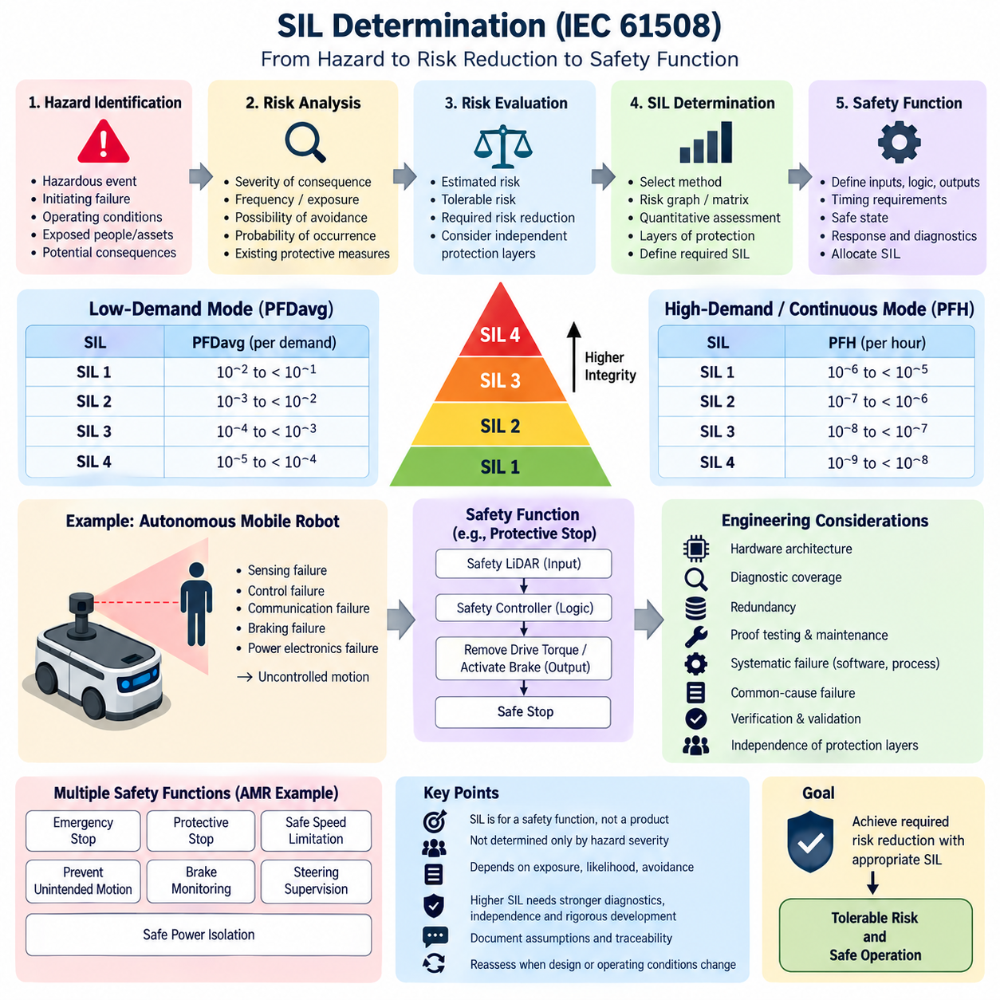
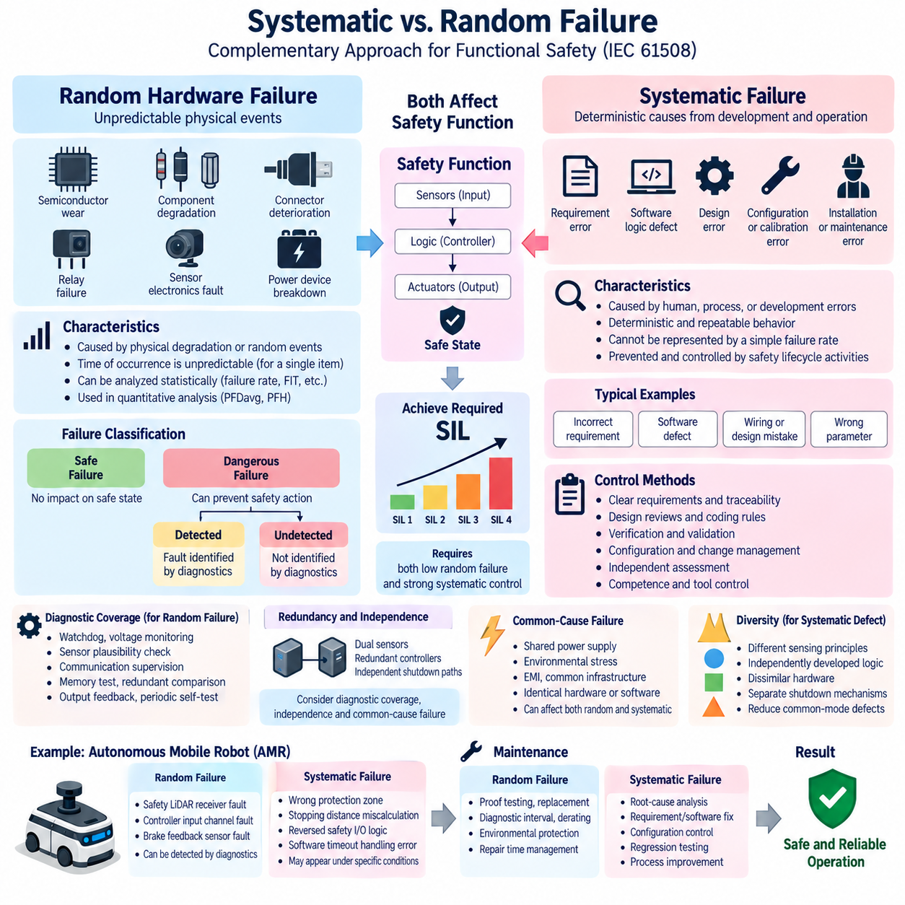
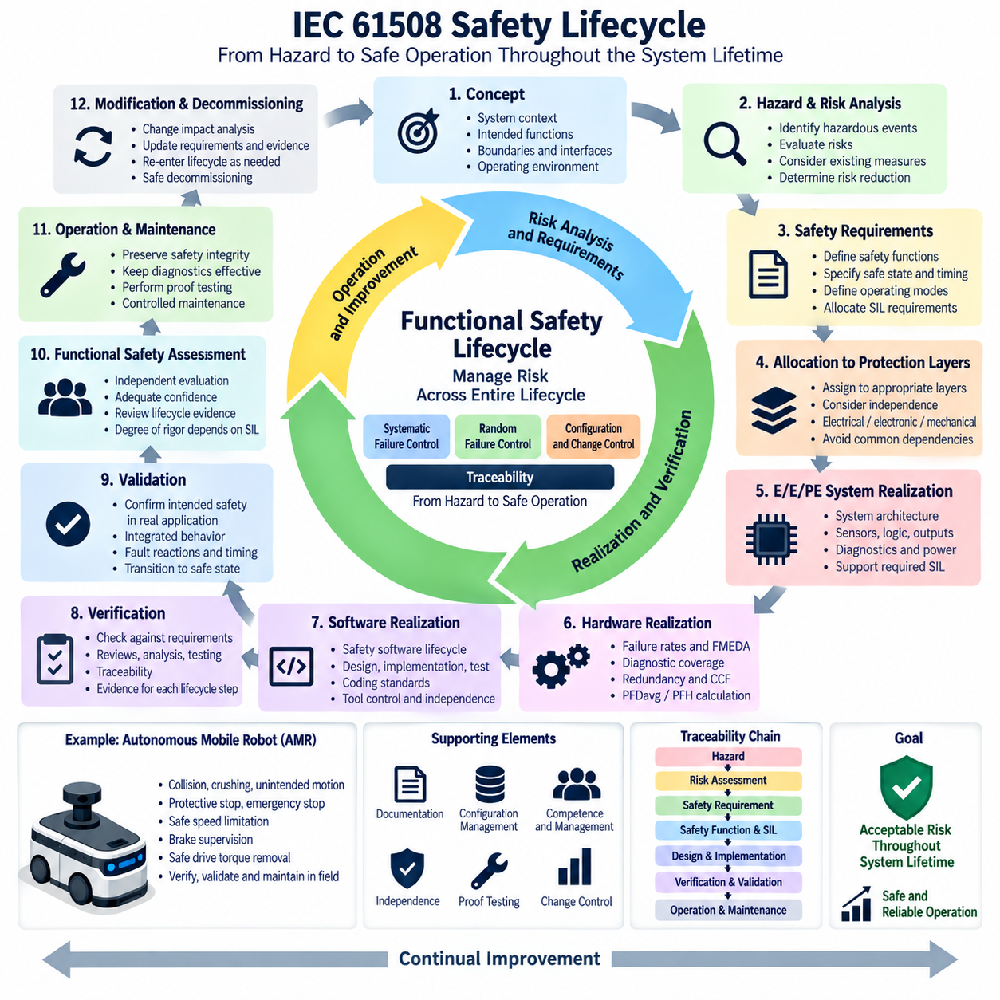
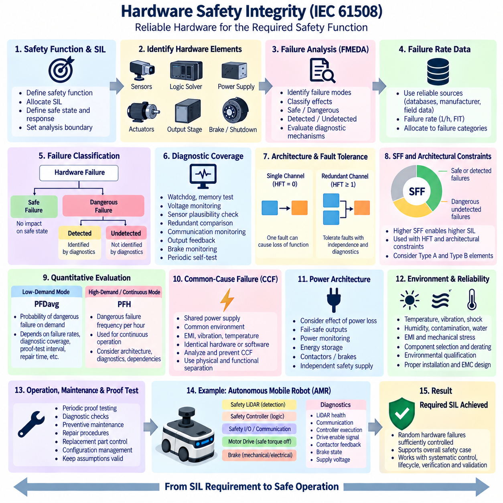
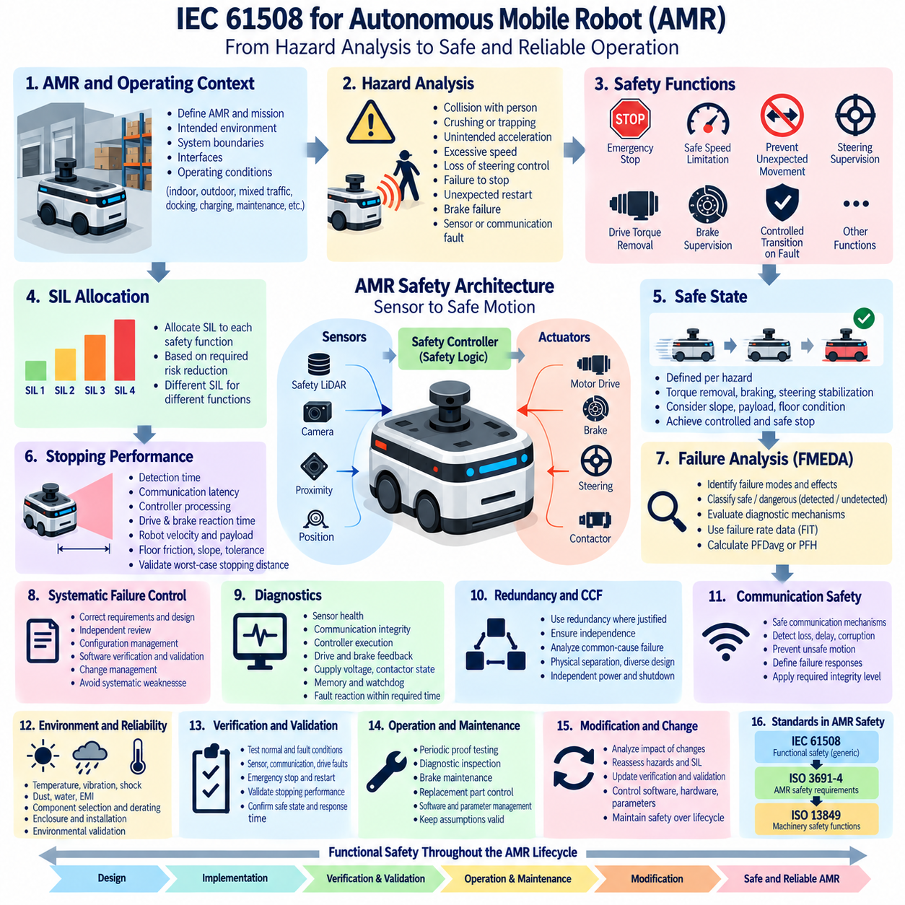

**Volume 12. Safety Architecture**


# Chapter 02. IEC 61508

##  

## 02.01. SIL 1 to 4 Determination

{width="7.268055555555556in" height="7.268055555555556in"}

Safety Integrity Level (SIL) expresses the required integrity of a safety function within the IEC 61508 framework. SIL is assigned to the safety function rather than simply to a product or component, and it represents the degree of risk reduction that the function must reliably provide. Four discrete levels are defined, SIL 1 through SIL 4, with SIL 4 representing the highest required safety integrity.

SIL determination begins with a clear definition of the hazardous event and the safety function intended to prevent or mitigate it. Engineers identify the initiating failure, possible operating conditions, exposed persons or assets, and potential consequences. The analysis must establish what unacceptable risk would remain without the safety function before determining how much risk reduction is required from the protective system.

The fundamental concept is the comparison between existing or estimated risk and tolerable risk. If the unprotected risk exceeds the acceptable level, additional risk reduction must be achieved through independent protection measures and safety-related systems. The required risk reduction factor can then be translated into an integrity requirement. Higher required risk reduction generally leads to a higher SIL assignment for the corresponding safety function.

IEC 61508 distinguishes between safety functions operating in low-demand mode and those operating in high-demand or continuous mode. For low-demand functions, integrity is characterized primarily by the average probability of failure on demand, commonly written as PFDavg. For high-demand or continuous operation, the relevant measure is the probability of dangerous failure per hour, commonly represented as PFH.

For low-demand operation, SIL 1 corresponds to PFDavg from 10\^-2 to less than 10\^-1, SIL 2 from 10\^-3 to less than 10\^-2, SIL 3 from 10\^-4 to less than 10\^-3, and SIL 4 from 10\^-5 to less than 10\^-4. These ranges indicate increasingly stringent reliability expectations and approximately correspond to risk reduction factors spanning from tens to tens of thousands.

For high-demand or continuous operation, SIL 1 corresponds to a dangerous failure frequency from 10\^-6 to less than 10\^-5 per hour, SIL 2 from 10\^-7 to less than 10\^-6, SIL 3 from 10\^-8 to less than 10\^-7, and SIL 4 from 10\^-9 to less than 10\^-8 per hour. The operating mode must therefore be established before numerical integrity targets are interpreted or allocated.

A practical SIL determination may use quantitative risk assessment, a risk graph, a risk matrix, layers of protection analysis, or another documented method appropriate to the application. A risk graph commonly considers consequence severity, frequency or duration of exposure, possibility of avoiding the hazardous event, and probability of the unwanted occurrence. Their combined evaluation establishes the required safety integrity.

SIL should not be interpreted as a direct measurement of how dangerous a machine is. A severe hazard does not automatically produce SIL 4, because the required integrity also depends on exposure, likelihood, avoidance possibilities, and other independent protective measures. SIL instead defines the reliability required from a particular safety function after the overall risk and available risk reduction measures have been systematically evaluated.

Consider an autonomous mobile robot operating near personnel. A hazardous uncontrolled motion could result from failures in sensing, motion control, communication, braking, or power electronics. A safety function may therefore be defined to detect a person entering a protected region and command a safe stop. SIL determination evaluates the risk associated with failure of this function rather than assigning a SIL to the complete AMR without functional decomposition.

The safety function must have precisely defined inputs, logic, outputs, timing requirements, and safe state. For an AMR protective-stop function, inputs may include safety LiDAR or other certified protective sensors, logic may reside in a safety controller, and outputs may remove drive torque or activate braking. Response time, stopping distance, diagnostic behavior, reset conditions, and fault reactions become part of the safety requirements.

Once a SIL target has been established, achieving it requires more than selecting components with sufficiently low failure rates. IEC 61508 addresses both random hardware failures and systematic failures, which are treated separately in the safety lifecycle. Hardware architecture, diagnostic coverage, redundancy, proof testing, common-cause failures, software development practices, configuration management, verification, and validation collectively influence whether the required SIL can be demonstrated.

The allocated SIL therefore propagates into architectural and engineering decisions. Higher SIL requirements normally demand stronger fault detection, greater independence, more rigorous diagnostics, controlled development processes, and stronger verification evidence. Redundant channels alone do not guarantee a particular SIL because correlated failures, insufficient diagnostics, incorrect requirements, software defects, and integration errors can defeat apparently redundant architectures.

SIL allocation should also consider independence between protection layers. If multiple measures are credited for reducing the same hazardous risk, their independence and failure dependencies must be justified. A normal motion controller and a safety controller cannot automatically be treated as independent merely because they execute different software. Shared power supplies, sensors, communication paths, processors, environmental stresses, or common requirements can create common failure mechanisms.

Proof-test intervals, mission time, repair assumptions, component failure rates, diagnostic test intervals, and detected versus undetected dangerous failures affect quantitative integrity calculations. Consequently, the same hardware architecture can produce different PFDavg or PFH results under different maintenance and operating assumptions. SIL verification must therefore use assumptions that realistically represent the deployed machine and its intended maintenance strategy.

For robotics, SIL determination should be connected to the broader safety architecture rather than performed as an isolated numerical exercise. IEC 61508 provides the functional-safety foundation, while application-specific machinery and robotic standards may define additional requirements for protective fields, stopping behavior, human interaction, operating modes, validation, and safeguarding. The attached architecture accordingly places IEC 61508 alongside ISO 3691-4 and ISO 13849 topics.

An AMR may consequently contain several safety functions with different integrity requirements. Emergency stopping, protective stopping, safe speed limitation, prevention of unintended motion, brake monitoring, steering supervision, or safe power isolation need not receive identical SIL targets. Each function should be derived from its associated hazardous event, required risk reduction, operating mode, and contribution from other independent safeguards.

SIL 4 deserves particular caution in practical system design. It represents an exceptionally demanding integrity requirement and should not be selected simply to make a system appear safer. Excessively conservative SIL allocation can introduce unnecessary architectural complexity, verification effort, development cost, and certification burden. Conversely, selecting a lower SIL without adequate risk justification can leave insufficient protection against hazardous failures.

The final SIL determination must remain traceable from hazard identification through risk estimation, tolerable-risk criteria, required risk reduction, safety-function definition, and integrity allocation. Assumptions and credited safeguards should be documented so that later design changes can trigger reassessment. This traceability becomes especially important when sensors, controllers, drive systems, operating environments, payloads, speeds, or human interaction conditions change.

In a complete safety lifecycle, SIL determination is therefore an engineering bridge between hazard analysis and implementation. It converts an abstract statement that a hazard must be controlled into measurable integrity requirements for specific safety functions. Those requirements subsequently guide hardware architecture, software rigor, diagnostics, testing, validation, maintenance planning, and the evidence needed to demonstrate that residual risk remains tolerable.

안전 무결성 수준(Safety Integrity Level, SIL)은 IEC 61508 체계에서 안전 기능(Safety Function)에 요구되는 무결성 수준을 나타낸다. SIL은 단순히 제품이나 부품 자체에 부여되는 등급이 아니라 특정 안전 기능에 할당되며, 해당 기능이 요구되는 위험 저감(Risk Reduction)을 얼마나 신뢰성 있게 제공해야 하는지를 나타낸다. SIL 1부터 SIL 4까지 네 단계로 정의되며, SIL 4가 가장 높은 안전 무결성 요구 수준이다.

SIL 결정(SIL Determination)은 위험 사건(Hazardous Event)과 이를 예방하거나 완화하기 위한 안전 기능(Safety Function)을 명확하게 정의하는 것에서 시작한다. 엔지니어는 사고를 유발하는 초기 고장(Initiating Failure), 가능한 운전 조건, 노출되는 사람이나 자산, 잠재적 결과를 식별한다. 이후 안전 기능이 없을 때 남게 되는 허용 불가능한 위험을 평가하여 보호 시스템이 제공해야 하는 위험 저감 수준을 결정한다.

기본 개념은 현재 또는 추정 위험(Estimated Risk)과 허용 가능한 위험(Tolerable Risk)을 비교하는 것이다. 보호되지 않은 위험이 허용 수준을 초과하면 독립적인 보호 수단과 안전 관련 시스템(Safety-Related System)을 통해 추가적인 위험 저감이 이루어져야 한다. 필요한 위험 저감 계수(Required Risk Reduction Factor)를 산정한 후 이를 안전 무결성 요구사항으로 변환하며, 일반적으로 더 큰 위험 저감이 필요할수록 더 높은 SIL이 요구된다.

IEC 61508은 안전 기능의 운전 방식을 저요구 모드(Low-Demand Mode)와 고요구 또는 연속 모드(High-Demand or Continuous Mode)로 구분한다. 저요구 기능에서는 평균 요구 시 고장 확률(Average Probability of Failure on Demand, PFDavg)이 주요 무결성 지표가 된다. 고요구 또는 연속 운전에서는 시간당 위험 고장 확률(Probability of Dangerous Failure per Hour, PFH)이 주요 평가 지표로 사용된다.

저요구 운전(Low-Demand Operation)의 경우 SIL 1은 PFDavg가 10\^-2 이상 10\^-1 미만, SIL 2는 10\^-3 이상 10\^-2 미만, SIL 3은 10\^-4 이상 10\^-3 미만, SIL 4는 10\^-5 이상 10\^-4 미만에 해당한다. 이러한 범위는 SIL이 증가할수록 더욱 엄격한 신뢰성 요구가 적용됨을 의미하며, 대략 수십 배에서 수만 배 수준까지의 위험 저감 계수(Risk Reduction Factor)에 대응한다.

고요구 또는 연속 운전(High-Demand or Continuous Operation)의 경우 SIL 1은 시간당 위험 고장 빈도가 10\^-6 이상 10\^-5 미만, SIL 2는 10\^-7 이상 10\^-6 미만, SIL 3은 10\^-8 이상 10\^-7 미만, SIL 4는 10\^-9 이상 10\^-8 미만에 해당한다. 따라서 수치적인 무결성 목표를 해석하거나 할당하기 전에 해당 안전 기능의 운전 모드를 먼저 명확하게 정의해야 한다.

실제 SIL 결정에서는 정량적 위험 평가(Quantitative Risk Assessment), 위험 그래프(Risk Graph), 위험 매트릭스(Risk Matrix), 보호 계층 분석(Layers of Protection Analysis) 또는 적용 분야에 적합한 다른 문서화된 방법을 사용할 수 있다. 위험 그래프는 일반적으로 결과의 심각도, 위험 노출 빈도 또는 지속시간, 위험 사건을 회피할 가능성, 원하지 않는 사건의 발생 가능성을 종합적으로 평가하여 필요한 안전 무결성을 결정한다.

SIL은 기계가 얼마나 위험한지를 직접 나타내는 척도로 해석해서는 안 된다. 매우 심각한 위험이 존재한다고 해서 자동으로 SIL 4가 요구되는 것은 아니다. 필요한 무결성은 노출 정도, 발생 가능성, 위험 회피 가능성 및 다른 독립적인 보호 수단에 의해서도 결정된다. 따라서 SIL은 전체 위험과 적용 가능한 위험 저감 수단을 체계적으로 평가한 후 특정 안전 기능에 요구되는 신뢰성 수준을 정의한다.

사람 주변에서 운행하는 자율이동로봇(Autonomous Mobile Robot, AMR)을 예로 들 수 있다. 센싱(Sensing), 모션 제어(Motion Control), 통신(Communication), 제동(Braking), 전력전자(Power Electronics)의 고장으로 위험한 비제어 움직임이 발생할 수 있다. 이에 따라 보호 영역에 사람이 진입하는 것을 감지하고 안전 정지(Safe Stop)를 명령하는 안전 기능을 정의할 수 있으며, SIL은 AMR 전체가 아니라 이 기능의 실패와 관련된 위험을 기준으로 결정한다.

안전 기능에는 입력(Input), 로직(Logic), 출력(Output), 시간 요구사항(Timing Requirement), 안전 상태(Safe State)가 명확하게 정의되어야 한다. AMR의 보호 정지 기능(Protective-Stop Function)에서는 안전 라이다(Safety LiDAR)와 같은 인증된 보호 센서가 입력을 제공하고, 안전 제어기(Safety Controller)가 로직을 수행하며, 출력이 구동 토크를 제거하거나 제동을 작동시킬 수 있다. 응답시간, 정지거리, 진단 동작, 리셋 조건 및 고장 대응 역시 안전 요구사항에 포함된다.

SIL 목표가 설정되면 이를 달성하기 위해 단순히 충분히 낮은 고장률을 가진 부품을 선택하는 것만으로는 부족하다. IEC 61508은 랜덤 하드웨어 고장(Random Hardware Failure)과 체계적 고장(Systematic Failure)을 구분하여 안전 수명주기(Safety Lifecycle)에서 관리한다. 하드웨어 구조, 진단 범위(Diagnostic Coverage), 이중화(Redundancy), 검증 시험(Proof Testing), 공통 원인 고장(Common-Cause Failure), 소프트웨어 개발, 형상 관리(Configuration Management), 검증(Verification) 및 유효성 확인(Validation)이 SIL 달성 여부에 영향을 준다.

할당된 SIL은 시스템 아키텍처와 엔지니어링 의사결정으로 전파된다. 높은 SIL은 일반적으로 더욱 강력한 고장 검출(Fault Detection), 높은 독립성, 강화된 진단, 엄격한 개발 프로세스 및 강력한 검증 증거를 요구한다. 이중화 채널만으로 특정 SIL이 보장되지는 않는다. 상관 고장(Correlated Failure), 부족한 진단, 잘못된 요구사항, 소프트웨어 결함 및 통합 오류가 외형적으로 이중화된 구조의 안전성을 무력화할 수 있기 때문이다.

SIL 할당에서는 보호 계층(Protection Layer) 사이의 독립성도 고려해야 한다. 동일한 위험을 줄이기 위해 여러 보호 수단의 효과를 인정하려면 각 수단의 독립성과 고장 종속성을 입증해야 한다. 일반 모션 제어기와 안전 제어기가 서로 다른 소프트웨어를 실행한다는 이유만으로 자동적으로 독립적이라고 판단할 수 없다. 전원, 센서, 통신 경로, 프로세서, 환경 스트레스 또는 공통 요구사항을 공유하면 공통 고장 메커니즘(Common Failure Mechanism)이 발생할 수 있다.

검증 시험 주기(Proof-Test Interval), 임무 시간(Mission Time), 수리 조건, 부품 고장률, 진단 시험 주기, 검출된 위험 고장과 검출되지 않은 위험 고장은 정량적 무결성 계산에 영향을 미친다. 따라서 동일한 하드웨어 아키텍처라도 유지보수 및 운전 조건에 따라 서로 다른 PFDavg 또는 PFH 결과를 가질 수 있다. SIL 검증은 실제 배치된 기계의 운전 환경과 유지보수 전략을 현실적으로 반영하는 조건을 사용해야 한다.

로보틱스(Robotics)에서 SIL 결정은 독립적인 수치 계산으로 수행하기보다 전체 안전 아키텍처(Safety Architecture)와 연계되어야 한다. IEC 61508은 기능 안전(Functional Safety)의 기반을 제공하며, 기계 및 로봇 분야의 응용 표준은 보호 영역, 정지 동작, 인간과의 상호작용, 운전 모드, 검증 및 안전 보호에 대한 추가 요구사항을 정의할 수 있다. 따라서 전체 안전 체계에서는 IEC 61508을 ISO 3691-4 및 ISO 13849와 연계하여 고려할 수 있다.

하나의 AMR에는 서로 다른 무결성 요구사항을 가진 여러 안전 기능이 존재할 수 있다. 비상 정지(Emergency Stop), 보호 정지(Protective Stop), 안전 속도 제한(Safe Speed Limitation), 의도하지 않은 움직임 방지, 브레이크 감시(Brake Monitoring), 조향 감시(Steering Supervision), 안전 전원 차단(Safe Power Isolation)에 반드시 동일한 SIL을 적용할 필요는 없다. 각 기능은 관련 위험 사건, 필요한 위험 저감, 운전 모드 및 다른 독립적인 보호 수단의 기여도를 기준으로 평가해야 한다.

특히 SIL 4는 실제 시스템 설계에서 신중하게 적용해야 한다. SIL 4는 매우 높은 수준의 안전 무결성을 요구하며 단순히 시스템을 더 안전하게 보이도록 하기 위해 선택해서는 안 된다. 지나치게 보수적인 SIL 할당은 불필요한 아키텍처 복잡성, 검증 작업, 개발 비용 및 인증 부담을 증가시킬 수 있다. 반대로 충분한 위험 분석 근거 없이 낮은 SIL을 선택하면 위험 고장에 대한 보호 수준이 부족해질 수 있다.

최종 SIL 결정은 위험 식별(Hazard Identification), 위험 추정(Risk Estimation), 허용 위험 기준(Tolerable-Risk Criteria), 요구 위험 저감, 안전 기능 정의 및 무결성 할당까지 추적 가능성(Traceability)을 유지해야 한다. 분석 과정에서 사용된 가정과 인정된 보호 수단도 문서화하여 이후 설계 변경 시 재평가할 수 있어야 한다. 센서, 제어기, 구동 시스템, 운전 환경, 적재물, 속도 또는 인간과의 상호작용 조건이 변경되면 이러한 추적성이 특히 중요해진다.

완전한 안전 수명주기(Safety Lifecycle)에서 SIL 결정은 위험 분석(Hazard Analysis)과 실제 구현(Implementation)을 연결하는 엔지니어링 가교 역할을 한다. 즉, 위험을 제어해야 한다는 추상적인 요구를 특정 안전 기능에 대한 측정 가능한 무결성 요구사항으로 변환한다. 이러한 요구사항은 이후 하드웨어 아키텍처, 소프트웨어 개발 엄격성, 진단, 시험, 검증, 유지보수 계획 및 잔여 위험(Residual Risk)이 허용 가능한 수준임을 입증하기 위한 안전 증거(Safety Evidence)의 기준이 된다.

##  

## 02.02. Systematic vs Random Failure

{width="7.268055555555556in" height="7.268055555555556in"}

Systematic failures and random hardware failures represent two fundamentally different failure mechanisms within the IEC 61508 functional safety framework. Distinguishing them is essential because they arise from different causes and therefore require different prevention, detection, and mitigation strategies. The safety architecture places this distinction directly after SIL determination because both failure classes influence whether a safety function can achieve its required integrity.

A random hardware failure results from physical degradation or an unpredictable physical event affecting an electronic, electrical, or electromechanical component. Semiconductor wear, resistor or capacitor degradation, connector deterioration, memory-cell faults, relay contact failures, sensor electronics faults, and power-device breakdown are typical examples. Their occurrence cannot normally be predicted at an exact time for an individual component.

Although the occurrence of a specific random failure is unpredictable, the behavior of a sufficiently large population of components can often be characterized statistically. Failure rates expressed in failures per hour, FIT values, reliability distributions, and field-return data can therefore support quantitative safety analysis. This statistical property allows random hardware failures to be incorporated into calculations such as PFDavg and PFH used for SIL verification.

Random hardware failures are further classified according to their effect on the safety function. A failure may be safe when it does not prevent the system from reaching or maintaining a safe state, or dangerous when it can prevent the required safety action. Dangerous failures may also be divided into detected and undetected failures depending on whether diagnostic mechanisms identify the fault before it contributes to an unsafe condition.

Diagnostic coverage is consequently a major architectural mechanism for controlling random hardware failures. Watchdogs, voltage monitoring, sensor plausibility checks, communication supervision, memory tests, redundant comparisons, output feedback, and periodic self-tests can convert otherwise undetected dangerous failures into detected failures. Once detected, the system can transition to a defined safe state before the fault develops into a hazardous event.

Redundancy can further reduce the probability that a single random hardware failure causes loss of the safety function. Dual sensors, redundant processing channels, independent shutdown paths, or monitored output stages can maintain protection when one element fails. However, redundancy must be analyzed together with diagnostic coverage, independence, common-cause failure, and architectural constraints rather than being treated as an automatic guarantee of safety integrity.

Systematic failures have a fundamentally different origin. They are related to deterministic causes introduced during specification, design, implementation, manufacturing, installation, operation, maintenance, or modification. Examples include an incorrect safety requirement, a software logic defect, an unsuitable component specification, a wiring design error, an incorrect calibration parameter, or a maintenance procedure that consistently restores a system to an unsafe configuration.

Unlike random hardware failures, systematic failures generally cannot be represented meaningfully by a simple constant failure rate. If a specific combination of inputs or environmental conditions activates a design defect, the same defect may repeatedly produce the same incorrect behavior. The engineering objective is therefore not primarily to calculate its probability, but to prevent the defect and increase confidence that systematic faults have been eliminated or adequately controlled.

Systematic capability is achieved through disciplined safety lifecycle activities. Clear requirements, traceability, design reviews, coding rules, configuration management, verification, validation, independence of assessment, controlled tools, change management, and documented competence contribute to systematic failure control. As the required SIL increases, the rigor and independence expected from these development and assurance activities generally increase accordingly.

Software is particularly important because most software failures are systematic rather than random. A safety controller may execute millions of cycles without error and then consistently produce an incorrect output when a rare combination of states activates a latent software defect. Increasing processor redundancy alone may not solve this problem if identical software containing the same defect is executed on both processing channels.

The same principle applies to requirements errors. If an AMR safety specification defines an incorrect stopping-distance requirement, every correctly implemented controller may reproduce the same unsafe behavior. Hardware reliability cannot compensate for an incorrect requirement. Hazard analysis, requirement validation, traceability, independent review, simulation, scenario testing, and system-level validation are therefore essential defenses against systematic faults originating early in development.

Common-cause failure creates an important connection between random and systematic safety analysis. Two redundant channels may appear independent but can fail simultaneously because of a shared power supply, excessive temperature, electromagnetic interference, common communication infrastructure, identical design weakness, or environmental stress. Safety analysis must therefore investigate dependencies rather than simply multiplying independent component failure probabilities.

Common-mode systematic defects are especially significant in redundant architectures using identical hardware and software. Two processors running the same erroneous algorithm can generate identical incorrect outputs, making comparison-based diagnostics ineffective. Diversity may therefore be considered where appropriate, using different sensing principles, independently developed monitoring logic, dissimilar hardware, or separate shutdown mechanisms to reduce vulnerability to shared systematic defects.

For an autonomous mobile robot, random hardware failure might involve a safety LiDAR receiver circuit failing, a safety-controller input channel becoming defective, or a brake feedback sensor experiencing an electrical fault. Diagnostics can detect many such conditions and command a safe stop. Quantitative failure-rate information can then contribute to evaluating whether the protective-stop function satisfies its allocated hardware safety integrity requirement.

A systematic AMR failure could instead originate from incorrectly configured protection zones, an error in stopping-distance calculation, reversed safety I/O logic, incorrect speed-dependent field switching, or software that handles a sensor timeout improperly. Such defects may remain dormant during normal testing yet appear repeatedly under specific operating conditions. Their control depends strongly on engineering process quality and scenario-based validation.

The distinction also influences maintenance. Random hardware failure risk can often be controlled through proof testing, preventive replacement, diagnostic intervals, component derating, environmental protection, and repair-time management. Systematic failures require different actions, including root-cause analysis, requirements correction, software modification, configuration control, process improvement, regression testing, and verification that the corrective action has not introduced additional faults.

Failure Mode and Effects Analysis (FMEA), Fault Tree Analysis (FTA), and Failure Modes, Effects and Diagnostic Analysis (FMEDA) can support understanding of hardware failure behavior, diagnostic effectiveness, and architectural vulnerability. These analyses complement rather than replace systematic safety activities. A system may demonstrate excellent numerical hardware reliability while still containing a requirements, software, configuration, or integration defect capable of defeating its safety function.

Functional safety therefore requires two complementary forms of confidence. Quantitative evidence demonstrates that random dangerous hardware failures are sufficiently improbable, while systematic capability provides confidence that avoidable design and development defects have been prevented or detected through appropriate lifecycle processes. Neither dimension alone is sufficient for demonstrating that a safety-related system achieves the intended safety integrity.

For robotic systems, this distinction becomes increasingly important as safety functions combine sensors, programmable electronics, communication networks, motion controllers, software, and AI-enabled subsystems. Hardware failure metrics address only part of this architecture. The safety concept must additionally establish deterministic safety boundaries, independent monitoring, validated fallback behavior, controlled configuration, and conventional safety mechanisms where complex intelligent functions cannot provide sufficient safety assurance.

A robust IEC 61508 safety architecture consequently treats random hardware failure and systematic failure as parallel engineering concerns throughout the lifecycle. Random failures are primarily managed through reliability analysis, diagnostics, fault tolerance, testing, and architectural measures, while systematic failures are primarily controlled through disciplined development and verification. Their combined treatment provides the foundation for maintaining the required SIL throughout design, operation, maintenance, and modification.

체계적 고장(Systematic Failure)과 랜덤 하드웨어 고장(Random Hardware Failure)은 IEC 61508 기능 안전(Functional Safety) 체계에서 근본적으로 서로 다른 두 가지 고장 메커니즘(Failure Mechanism)을 의미한다. 두 고장은 발생 원인이 서로 다르므로 예방, 검출 및 완화 전략도 다르게 적용해야 한다. 안전 무결성 수준(SIL) 결정 이후에는 두 고장 유형을 모두 고려해야 안전 기능이 요구되는 무결성을 달성할 수 있는지를 판단할 수 있다.

랜덤 하드웨어 고장(Random Hardware Failure)은 전자, 전기 또는 전기기계 부품에 영향을 주는 물리적 열화(Physical Degradation)나 예측하기 어려운 물리적 사건으로 인해 발생한다. 반도체 마모, 저항 및 커패시터 열화, 커넥터 성능 저하, 메모리 셀 고장, 릴레이 접점 고장, 센서 전자회로 고장 및 전력소자 파손 등이 대표적인 사례이다. 개별 부품에서 이러한 고장이 발생하는 정확한 시점을 일반적으로 예측할 수는 없다.

특정 랜덤 고장의 발생 시점은 예측하기 어렵지만 충분히 많은 부품 집단의 고장 특성은 통계적으로 표현할 수 있다. 따라서 시간당 고장률(Failure Rate), FIT 값, 신뢰성 분포(Reliability Distribution), 현장 반품 데이터(Field-Return Data) 등을 정량적 안전 분석에 활용할 수 있다. 이러한 통계적 특성을 이용하여 랜덤 하드웨어 고장을 SIL 검증에 사용되는 PFDavg 및 PFH 계산에 반영할 수 있다.

랜덤 하드웨어 고장은 안전 기능에 미치는 영향에 따라 추가적으로 분류된다. 고장이 시스템의 안전 상태(Safe State) 도달이나 유지에 영향을 주지 않으면 안전 고장(Safe Failure)으로 볼 수 있으며, 요구되는 안전 동작을 방해할 가능성이 있다면 위험 고장(Dangerous Failure)으로 분류할 수 있다. 위험 고장은 진단 메커니즘의 검출 여부에 따라 검출 위험 고장(Detected Dangerous Failure)과 미검출 위험 고장(Undetected Dangerous Failure)으로 다시 구분될 수 있다.

따라서 진단 범위(Diagnostic Coverage)는 랜덤 하드웨어 고장을 제어하기 위한 중요한 아키텍처 메커니즘이다. 워치독(Watchdog), 전압 감시, 센서 타당성 검사(Sensor Plausibility Check), 통신 감시, 메모리 검사, 이중화 비교, 출력 피드백 및 주기적 자기 진단(Periodic Self-Test)을 이용하면 미검출 위험 고장을 검출 가능한 고장으로 전환할 수 있다. 고장이 검출되면 위험 사건으로 발전하기 전에 시스템을 정의된 안전 상태로 전환할 수 있다.

이중화(Redundancy)는 단일 랜덤 하드웨어 고장으로 인해 안전 기능 전체가 상실될 가능성을 더욱 낮출 수 있다. 이중 센서, 중복 처리 채널, 독립적인 셧다운 경로(Shutdown Path), 감시 기능을 갖춘 출력단 등을 이용하면 하나의 요소가 고장 나더라도 보호 기능을 유지할 수 있다. 그러나 이중화는 그 자체로 안전 무결성을 자동 보장하는 것이 아니며 진단 범위, 독립성, 공통 원인 고장(Common-Cause Failure) 및 아키텍처 제약조건과 함께 분석해야 한다.

체계적 고장(Systematic Failure)은 근본적으로 다른 원인에서 발생한다. 이는 요구사항 정의, 설계, 구현, 제조, 설치, 운전, 유지보수 또는 변경 과정에서 유입된 결정론적 원인(Deterministic Cause)과 관련된다. 잘못된 안전 요구사항, 소프트웨어 로직 결함, 부적절한 부품 사양, 배선 설계 오류, 잘못된 보정 파라미터 또는 시스템을 반복적으로 위험한 설정으로 복원시키는 유지보수 절차 등이 대표적인 사례이다.

랜덤 하드웨어 고장과 달리 체계적 고장은 일반적으로 단순한 일정 고장률(Constant Failure Rate)로 의미 있게 표현하기 어렵다. 특정 입력 조합이나 환경 조건이 설계 결함을 활성화하면 동일한 결함이 반복적으로 동일한 잘못된 동작을 발생시킬 수 있다. 따라서 주요 엔지니어링 목표는 발생 확률을 계산하는 것이 아니라 결함의 유입을 예방하고 체계적 결함이 제거되었거나 적절하게 통제되었다는 신뢰성을 확보하는 것이다.

체계적 능력(Systematic Capability)은 엄격한 안전 수명주기(Safety Lifecycle) 활동을 통해 확보한다. 명확한 요구사항, 추적성(Traceability), 설계 검토, 코딩 규칙, 형상 관리(Configuration Management), 검증(Verification), 유효성 확인(Validation), 평가의 독립성, 통제된 개발 도구, 변경 관리(Change Management) 및 문서화된 역량 관리가 체계적 고장 제어에 기여한다. 요구되는 SIL이 높아질수록 이러한 개발 및 보증 활동의 엄격성과 독립성도 일반적으로 강화된다.

소프트웨어는 특히 중요하다. 대부분의 소프트웨어 고장은 랜덤 고장이 아니라 체계적 고장에 해당하기 때문이다. 안전 제어기(Safety Controller)가 수백만 번의 주기를 오류 없이 수행하더라도 특정한 상태 조합이 잠재적인 소프트웨어 결함을 활성화하면 항상 잘못된 출력을 생성할 수 있다. 동일한 결함을 포함하는 소프트웨어를 두 처리 채널에서 실행한다면 단순히 프로세서를 이중화하는 것만으로는 이러한 문제를 해결할 수 없다.

동일한 원리는 요구사항 오류(Requirements Error)에도 적용된다. AMR 안전 사양에서 잘못된 정지거리 요구사항을 정의했다면 정확하게 구현된 모든 제어기가 동일한 위험 동작을 재현할 수 있다. 하드웨어 신뢰성으로 잘못된 요구사항을 보완할 수는 없다. 따라서 위험 분석(Hazard Analysis), 요구사항 유효성 확인, 추적성, 독립 검토, 시뮬레이션, 시나리오 시험 및 시스템 수준 유효성 확인(System-Level Validation)이 초기 개발 단계에서 발생하는 체계적 결함을 방지하는 핵심 수단이 된다.

공통 원인 고장(Common-Cause Failure)은 랜덤 고장과 체계적 안전 분석을 연결하는 중요한 요소이다. 두 개의 이중화 채널이 외형적으로 독립되어 있어도 공통 전원, 과도한 온도, 전자기 간섭(Electromagnetic Interference), 공유 통신 인프라, 동일한 설계 취약점 또는 환경 스트레스로 인해 동시에 고장 날 수 있다. 따라서 안전 분석에서는 단순히 독립 부품의 고장 확률을 곱하는 것이 아니라 채널 사이의 종속성을 조사해야 한다.

동일한 하드웨어와 소프트웨어를 사용하는 이중화 아키텍처에서는 공통 모드 체계적 결함(Common-Mode Systematic Defect)이 특히 중요하다. 두 프로세서가 동일하게 잘못된 알고리즘을 실행하면 동일한 오류 출력을 생성하여 비교 기반 진단을 무력화할 수 있다. 필요한 경우 서로 다른 센싱 원리, 독립적으로 개발된 감시 로직, 이종 하드웨어 또는 별도의 셧다운 메커니즘을 사용하는 다양성(Diversity)을 적용하여 공통 체계적 결함에 대한 취약성을 줄일 수 있다.

자율이동로봇(Autonomous Mobile Robot, AMR)의 경우 랜덤 하드웨어 고장의 사례로 안전 라이다(Safety LiDAR)의 수신 회로 고장, 안전 제어기 입력 채널의 결함 또는 브레이크 피드백 센서의 전기적 고장을 들 수 있다. 진단 기능은 이러한 상태 중 많은 부분을 검출하여 안전 정지를 명령할 수 있다. 이후 정량적인 고장률 정보를 이용하여 보호 정지 기능(Protective-Stop Function)이 할당된 하드웨어 안전 무결성 요구사항을 만족하는지를 평가할 수 있다.

반면 체계적 AMR 고장은 잘못 설정된 보호 영역(Protection Zone), 정지거리 계산 오류, 반대로 구성된 안전 입출력 로직, 잘못된 속도 연동 보호 영역 전환 또는 센서 타임아웃을 부적절하게 처리하는 소프트웨어 등에서 발생할 수 있다. 이러한 결함은 일반적인 시험 과정에서는 잠재된 상태로 남아 있다가 특정 운전 조건에서 반복적으로 나타날 수 있으며, 이를 제어하기 위해서는 높은 수준의 엔지니어링 프로세스 품질과 시나리오 기반 유효성 확인이 필요하다.

두 고장의 차이는 유지보수(Maintenance) 전략에도 영향을 준다. 랜덤 하드웨어 고장 위험은 검증 시험(Proof Testing), 예방 교체, 진단 주기, 부품 디레이팅(Derating), 환경 보호 및 수리시간 관리를 통해 제어할 수 있다. 체계적 고장은 근본 원인 분석(Root-Cause Analysis), 요구사항 수정, 소프트웨어 변경, 형상 관리, 프로세스 개선, 회귀 시험(Regression Testing) 및 수정 조치가 추가적인 결함을 발생시키지 않았는지 확인하는 검증 활동이 필요하다.

고장 형태 및 영향 분석(Failure Mode and Effects Analysis, FMEA), 결함 트리 분석(Fault Tree Analysis, FTA), 고장 형태·영향 및 진단 분석(Failure Modes, Effects and Diagnostic Analysis, FMEDA)은 하드웨어 고장 동작, 진단 효과 및 아키텍처 취약성을 이해하는 데 활용할 수 있다. 그러나 이러한 분석은 체계적 안전 활동을 대체하는 것이 아니라 보완한다. 수치적으로 매우 높은 하드웨어 신뢰성을 입증한 시스템이라도 안전 기능을 무력화할 수 있는 요구사항, 소프트웨어, 설정 또는 통합 결함이 존재할 수 있다.

따라서 기능 안전(Functional Safety)에서는 상호 보완적인 두 가지 형태의 신뢰성이 요구된다. 정량적 증거(Quantitative Evidence)는 랜덤 위험 하드웨어 고장의 발생 가능성이 충분히 낮다는 것을 입증하고, 체계적 능력(Systematic Capability)은 적절한 수명주기 프로세스를 통해 예방 가능한 설계 및 개발 결함이 방지되거나 검출되었다는 신뢰성을 제공한다. 어느 한 측면만으로는 안전 관련 시스템이 의도된 안전 무결성을 달성했다고 입증하기에 충분하지 않다.

로봇 시스템에서는 안전 기능이 센서, 프로그램 가능 전자장치, 통신 네트워크, 모션 제어기, 소프트웨어 및 인공지능 기반 하위 시스템(AI-Enabled Subsystem)을 결합하면서 이러한 구분이 더욱 중요해진다. 하드웨어 고장 지표만으로는 전체 아키텍처의 일부만 평가할 수 있다. 따라서 안전 개념에는 결정론적 안전 경계(Deterministic Safety Boundary), 독립 감시, 검증된 폴백 동작(Fallback Behavior), 통제된 설정 및 복잡한 지능 기능이 충분한 안전 보증을 제공할 수 없는 영역에서의 전통적인 안전 메커니즘이 추가되어야 한다.

결과적으로 견고한 IEC 61508 안전 아키텍처(Safety Architecture)는 전체 수명주기에 걸쳐 랜덤 하드웨어 고장과 체계적 고장을 병렬적인 엔지니어링 과제로 다룬다. 랜덤 고장은 주로 신뢰성 분석, 진단, 결함 허용(Fault Tolerance), 시험 및 아키텍처 수단으로 관리하고, 체계적 고장은 엄격한 개발 및 검증 프로세스를 통해 통제한다. 두 고장 유형을 함께 관리하는 것이 설계, 운전, 유지보수 및 변경 과정 전체에서 요구되는 SIL을 지속적으로 유지하기 위한 기반이 된다.

##  

## 02.03. Safety Lifecycle (IEC61508)

{width="7.268055555555556in" height="7.268055555555556in"}

IEC 61508 defines a structured functional safety lifecycle that manages safety from the earliest concept activities through design, implementation, operation, maintenance, modification, and eventual decommissioning. The lifecycle prevents functional safety from becoming a final-stage verification exercise by requiring hazards, safety requirements, implementation decisions, and evidence to remain connected throughout the system lifetime.

The lifecycle begins by establishing the system context and defining the equipment under control, its intended functions, operating environment, interfaces, boundaries, and foreseeable operating conditions. These definitions determine what must be included in subsequent hazard analysis. Incorrect or incomplete boundaries can cause important hazards or dependencies to remain outside the safety assessment and undermine later safety decisions.

Hazard and risk analysis then identifies hazardous events and evaluates the risks associated with them. Engineers examine initiating events, operating states, human exposure, environmental conditions, failure consequences, and existing protection measures. The objective is to establish which risks require additional reduction and to provide a defensible basis for defining the safety functions necessary to achieve tolerable residual risk.

Once the required risk reduction is understood, overall safety requirements are specified. Each safety function must describe the condition to be detected, the required response, the intended safe state, timing constraints, operating modes, reset behavior, fault responses, and relevant interfaces. Safety Integrity Level requirements are then allocated where appropriate so that each function has both functional and integrity requirements.

Safety requirements are subsequently allocated to appropriate protection layers and safety-related systems. Risk reduction may involve electrical, electronic, programmable electronic, mechanical, or other independent measures. Allocation must consider independence and dependencies between layers because multiple protective functions cannot automatically be credited as independent when they share sensors, power, communications, processing resources, or common design assumptions.

The electrical, electronic, and programmable electronic safety-related system then enters its realization lifecycle. System architecture is developed from the allocated safety requirements, including sensors, logic solvers, communication paths, output devices, shutdown mechanisms, diagnostics, and power architecture. The design must support both the required safety behavior and the safety integrity associated with each allocated safety function.

Hardware realization addresses random hardware failure as well as architectural constraints. Component failure rates, dangerous and safe failure modes, diagnostic coverage, redundancy, common-cause failures, proof-test intervals, and fault-tolerance characteristics contribute to hardware safety integrity evaluation. Quantitative calculations such as PFDavg or PFH are used according to the operating mode to demonstrate that dangerous hardware failure targets are satisfied.

Software realization follows a corresponding safety lifecycle rather than being treated as ordinary application programming. Safety software requirements are derived from system requirements and transformed into software architecture, detailed design, implementation, integration, and testing. Coding standards, defensive programming, traceability, configuration management, verification, tool control, and independence become increasingly important as the required SIL increases.

Verification is performed throughout the lifecycle rather than only after implementation. Requirements are checked against higher-level safety objectives, architecture against requirements, detailed design against architecture, and implementation against detailed design. Reviews, analyses, inspections, simulations, tests, and traceability records provide evidence that each lifecycle output correctly satisfies the requirements established by the preceding activities.

Functional safety validation has a different purpose from verification. Verification asks whether a lifecycle output was produced correctly according to its specified inputs, whereas validation determines whether the completed safety-related system actually fulfills the intended safety requirements in its real application context. Validation therefore evaluates integrated behavior, operating modes, fault reactions, timing, interfaces, and transitions to safe states.

Functional safety assessment provides an additional level of confidence by evaluating whether the overall lifecycle activities and resulting evidence adequately demonstrate functional safety. Appropriate independence is important because the assessment should not simply repeat the conclusions of the designers responsible for implementation. The required degree of independence and rigor depends on factors including the safety integrity requirements and project organization.

Operation and maintenance are integral parts of the safety lifecycle. A system that satisfies its SIL targets at commissioning can lose safety integrity if diagnostics are disabled, proof tests are missed, replacement components are unsuitable, configurations are changed without control, or faults remain unrepaired. Operating procedures must therefore preserve the assumptions used during safety analysis and maintain the effectiveness of safety functions.

Proof testing is particularly important for failures that automatic diagnostics cannot detect during normal operation. Periodic tests reveal latent dangerous failures and restore the safety function to an appropriate condition through repair or replacement. Proof-test coverage and interval influence quantitative safety integrity, especially for low-demand functions, so maintenance schedules should remain consistent with the assumptions used in PFDavg calculations.

Modification requires controlled re-entry into the safety lifecycle. Changes to hardware, software, parameters, sensors, communication networks, operating speed, payload, environment, or maintenance procedures may invalidate earlier hazard analyses or integrity calculations. Change impact analysis determines which requirements, hazards, verification results, validation activities, and safety evidence must be updated before the modified system is returned to service.

Configuration management supports this lifecycle by ensuring that the safety evidence corresponds to the actual deployed system. Hardware versions, software releases, safety parameters, calibration values, diagnostic settings, test procedures, and documentation must remain identifiable and controlled. Without configuration integrity, successful verification of one version cannot reliably demonstrate the safety of another version operating in the field.

Competence and functional safety management span the lifecycle rather than belonging to a single technical phase. Responsibilities, authorization, planning, documentation, reviews, independence, and personnel competence must be defined so that safety activities are executed consistently. This organizational discipline is particularly important for systematic failure control because many such failures originate from requirements, communication, process, or configuration weaknesses.

For an autonomous mobile robot, the lifecycle may begin with hazards such as collision, crushing, unintended motion, excessive speed, or failure to stop. These hazards lead to safety functions such as protective stopping, emergency stopping, safe speed limitation, brake supervision, or safe drive torque removal. Requirements are then allocated to safety LiDARs, safety controllers, drive interfaces, braking systems, and other protective mechanisms.

The AMR implementation must subsequently demonstrate that sensing, safety logic, communication, and actuation collectively satisfy the required response. Stopping time and distance, sensor coverage, diagnostic behavior, communication failures, drive faults, brake response, reset conditions, and degraded operating modes must be verified and validated. Field operation must then preserve these characteristics through controlled maintenance and configuration.

The lifecycle also creates a continuous chain of traceability from hazard to safety evidence. A hazardous event should be traceable to the associated risk assessment, safety goal or requirement, safety function, SIL allocation, architecture, implementation, verification test, validation result, and operational constraint. When a requirement or design element changes, this chain helps engineers identify the safety evidence that must be reconsidered.

IEC 61508 therefore treats functional safety as a managed lifecycle property rather than a characteristic obtained simply by purchasing certified components. Certified devices can support a safety architecture, but system-level integrity depends on correct requirements, allocation, integration, diagnostics, verification, validation, operation, and maintenance. A collection of individually capable safety components does not automatically create a compliant safety function.

For robotics and AMR engineering, the lifecycle provides the organizational framework connecting SIL determination, systematic and random failure control, hardware integrity, and application-specific safety requirements. Within the attached safety architecture, this IEC 61508 foundation logically supports later treatment of hardware safety integrity and IEC 61508 application to AMRs, followed by robot-specific standards and assessment methods.

The final purpose of the IEC 61508 safety lifecycle is to preserve acceptable risk throughout the complete existence of the system. Hazard analysis establishes why protection is necessary, safety requirements define what protection must accomplish, SIL specifies required integrity, realization creates the protective system, verification and validation build evidence, and operation, maintenance, modification, and decommissioning ensure that safety remains controlled over time.

IEC 61508은 초기 개념 활동부터 설계, 구현, 운용, 유지보수, 변경 및 최종 폐기까지 안전을 관리하는 체계적인 기능 안전 수명주기(Functional Safety Lifecycle)를 정의한다. 이 수명주기는 기능 안전이 개발 마지막 단계에서 수행되는 단순한 검증 활동이 되지 않도록 하며, 시스템 전체 수명 동안 위험, 안전 요구사항, 구현 결정 및 안전 증거(Safety Evidence)가 지속적으로 연결되도록 요구한다.

수명주기는 시스템 상황(System Context)을 설정하고 제어 대상 장비(Equipment Under Control), 의도된 기능, 운용 환경, 인터페이스, 시스템 경계 및 예측 가능한 운용 조건을 정의하는 것에서 시작한다. 이러한 정의는 이후 위험 분석(Hazard Analysis)에 포함되어야 할 범위를 결정한다. 경계를 잘못 설정하거나 불완전하게 정의하면 중요한 위험 또는 시스템 종속성이 안전 평가에서 누락되어 이후의 안전 관련 의사결정을 약화시킬 수 있다.

이후 위험 및 리스크 분석(Hazard and Risk Analysis)을 통해 위험 사건(Hazardous Event)을 식별하고 관련 위험을 평가한다. 엔지니어는 초기 사건, 운용 상태, 사람의 노출, 환경 조건, 고장 결과 및 기존 보호 수단을 검토한다. 목적은 추가적인 위험 저감(Risk Reduction)이 필요한 위험을 식별하고, 허용 가능한 잔여 위험(Tolerable Residual Risk)을 달성하기 위해 필요한 안전 기능(Safety Function)을 정의할 수 있는 타당한 근거를 마련하는 것이다.

필요한 위험 저감 수준이 파악되면 전체 안전 요구사항(Overall Safety Requirements)을 정의한다. 각 안전 기능에는 검출해야 하는 조건, 요구되는 대응, 목표 안전 상태(Safe State), 시간 제약조건, 운전 모드, 리셋 동작, 고장 대응 및 관련 인터페이스가 명시되어야 한다. 필요한 경우 안전 무결성 수준(Safety Integrity Level, SIL)을 할당하여 각 기능이 기능적 요구사항과 무결성 요구사항을 모두 갖도록 한다.

안전 요구사항은 이후 적절한 보호 계층(Protection Layer)과 안전 관련 시스템(Safety-Related System)에 할당된다. 위험 저감은 전기, 전자, 프로그램 가능 전자, 기계 또는 기타 독립적인 수단을 통해 구현될 수 있다. 여러 보호 기능이 센서, 전원, 통신, 처리 자원 또는 공통 설계 가정을 공유한다면 자동으로 독립적인 보호 수단으로 인정할 수 없으므로, 할당 과정에서 보호 계층 간 독립성과 종속성을 함께 고려해야 한다.

전기·전자·프로그램 가능 전자 안전 관련 시스템(Electrical/Electronic/Programmable Electronic Safety-Related System)은 이후 구현 수명주기(Realization Lifecycle)에 들어간다. 할당된 안전 요구사항으로부터 센서, 로직 솔버(Logic Solver), 통신 경로, 출력 장치, 셧다운 메커니즘, 진단 및 전원 아키텍처를 포함하는 시스템 구조를 개발한다. 설계는 요구되는 안전 동작뿐 아니라 각 안전 기능에 할당된 안전 무결성도 만족할 수 있어야 한다.

하드웨어 구현(Hardware Realization)에서는 랜덤 하드웨어 고장(Random Hardware Failure)과 아키텍처 제약조건을 함께 다룬다. 부품 고장률, 위험 및 안전 고장 모드, 진단 범위(Diagnostic Coverage), 이중화(Redundancy), 공통 원인 고장(Common-Cause Failure), 검증 시험 주기(Proof-Test Interval), 결함 허용 특성 등이 하드웨어 안전 무결성 평가에 반영된다. 운전 모드에 따라 PFDavg 또는 PFH 등의 정량 계산을 수행하여 위험 하드웨어 고장 목표가 충족되는지를 입증한다.

소프트웨어 구현(Software Realization) 역시 일반적인 응용 소프트웨어 개발로 취급하지 않고 별도의 안전 수명주기를 따른다. 시스템 요구사항으로부터 안전 소프트웨어 요구사항을 도출하고 이를 소프트웨어 아키텍처, 상세 설계, 구현, 통합 및 시험으로 전개한다. 요구 SIL이 높아질수록 코딩 표준, 방어적 프로그래밍(Defensive Programming), 추적성(Traceability), 형상 관리(Configuration Management), 검증(Verification), 도구 관리 및 독립성이 더욱 중요해진다.

검증(Verification)은 구현이 완료된 이후에만 수행되는 것이 아니라 전체 수명주기에 걸쳐 수행된다. 요구사항은 상위 수준의 안전 목표와 비교하고, 아키텍처는 요구사항과, 상세 설계는 아키텍처와, 구현 결과는 상세 설계와 비교하여 확인한다. 검토, 분석, 검사, 시뮬레이션, 시험 및 추적성 기록을 통해 각 수명주기 산출물이 이전 단계에서 정의된 요구사항을 올바르게 만족한다는 증거를 확보한다.

기능 안전 유효성 확인(Functional Safety Validation)은 검증과 다른 목적을 가진다. 검증은 각 수명주기 산출물이 지정된 입력과 요구사항에 따라 올바르게 만들어졌는지를 확인하는 반면, 유효성 확인은 완성된 안전 관련 시스템이 실제 적용 환경에서 의도된 안전 요구사항을 충족하는지를 판단한다. 따라서 통합 동작, 운전 모드, 고장 대응, 시간 특성, 인터페이스 및 안전 상태로의 전환을 종합적으로 평가한다.

기능 안전 평가(Functional Safety Assessment)는 전체 수명주기 활동과 생성된 안전 증거가 기능 안전을 충분히 입증하는지를 평가함으로써 추가적인 신뢰성을 제공한다. 평가자가 구현을 담당한 설계자의 결론을 단순히 반복하지 않도록 적절한 독립성(Independence)을 확보하는 것이 중요하다. 필요한 독립성과 평가의 엄격성은 안전 무결성 요구사항과 프로젝트 조직 등의 요소에 따라 달라진다.

운용(Operation)과 유지보수(Maintenance)는 안전 수명주기의 필수적인 부분이다. 시운전 시점에 SIL 목표를 만족한 시스템이라도 진단 기능이 비활성화되거나 검증 시험이 누락되고, 부적절한 교체 부품이 사용되거나 설정이 통제 없이 변경되고, 고장이 수리되지 않는다면 안전 무결성을 상실할 수 있다. 따라서 운용 절차는 안전 분석에서 사용된 가정을 유지하고 안전 기능의 효과가 지속되도록 해야 한다.

검증 시험(Proof Testing)은 정상 운전 중 자동 진단으로 검출할 수 없는 고장에 특히 중요하다. 주기적인 시험을 통해 잠재 위험 고장(Latent Dangerous Failure)을 발견하고 수리 또는 교체를 통해 안전 기능을 적절한 상태로 복원한다. 검증 시험의 범위와 주기는 특히 저요구 기능(Low-Demand Function)의 정량적 안전 무결성에 영향을 미치므로 유지보수 일정은 PFDavg 계산에서 사용한 가정과 일치해야 한다.

시스템 변경(Modification)이 발생하면 통제된 방식으로 안전 수명주기에 다시 진입해야 한다. 하드웨어, 소프트웨어, 파라미터, 센서, 통신 네트워크, 운행 속도, 적재물, 환경 또는 유지보수 절차의 변경은 기존 위험 분석이나 무결성 계산을 무효화할 수 있다. 변경 영향 분석(Change Impact Analysis)을 통해 수정된 시스템을 다시 운용하기 전에 어떤 요구사항, 위험, 검증 결과, 유효성 확인 활동 및 안전 증거를 갱신해야 하는지를 결정한다.

형상 관리(Configuration Management)는 안전 증거가 실제 배치된 시스템과 일치하도록 보장함으로써 수명주기를 지원한다. 하드웨어 버전, 소프트웨어 릴리스, 안전 파라미터, 보정 값, 진단 설정, 시험 절차 및 문서는 식별되고 통제되어야 한다. 형상 무결성(Configuration Integrity)이 확보되지 않으면 특정 버전에서 성공한 검증 결과를 현장에서 운용되는 다른 버전의 안전성을 입증하는 근거로 신뢰성 있게 사용할 수 없다.

역량(Competence)과 기능 안전 관리(Functional Safety Management)는 특정 기술 단계에 한정되지 않고 전체 수명주기에 걸쳐 적용된다. 책임, 권한, 계획, 문서화, 검토, 독립성 및 담당자의 역량을 정의하여 안전 활동이 일관되게 수행되도록 해야 한다. 이러한 조직적 규율은 많은 체계적 고장(Systematic Failure)이 요구사항, 의사소통, 프로세스 또는 형상 관리의 취약성에서 발생하기 때문에 특히 중요하다.

자율이동로봇(Autonomous Mobile Robot, AMR)의 경우 수명주기는 충돌, 압착, 의도하지 않은 움직임, 과도한 속도 또는 정지 실패 등의 위험에서 시작할 수 있다. 이러한 위험으로부터 보호 정지(Protective Stop), 비상 정지(Emergency Stop), 안전 속도 제한(Safe Speed Limitation), 브레이크 감시(Brake Supervision), 안전 구동 토크 제거(Safe Drive Torque Removal) 등의 안전 기능을 도출하고, 이를 안전 라이다, 안전 제어기, 구동 인터페이스, 제동 시스템 및 기타 보호 메커니즘에 할당한다.

이후 AMR 구현에서는 센싱, 안전 로직, 통신 및 액추에이션(Actuation)이 결합되어 요구되는 안전 대응을 만족한다는 것을 입증해야 한다. 정지 시간과 거리, 센서 검출 범위, 진단 동작, 통신 고장, 구동계 고장, 브레이크 응답, 리셋 조건 및 성능 저하 운전 모드(Degraded Operating Mode)를 검증하고 유효성을 확인해야 한다. 현장 운용에서도 통제된 유지보수와 형상 관리를 통해 이러한 특성을 지속적으로 유지해야 한다.

안전 수명주기는 또한 위험에서 안전 증거까지 이어지는 연속적인 추적성 체계(Traceability Chain)를 형성한다. 하나의 위험 사건은 관련 위험 평가, 안전 목표 또는 요구사항, 안전 기능, SIL 할당, 아키텍처, 구현, 검증 시험, 유효성 확인 결과 및 운용 제약조건까지 추적할 수 있어야 한다. 요구사항이나 설계 요소가 변경될 경우 이러한 연결 관계를 이용하여 재검토해야 하는 안전 증거를 식별할 수 있다.

따라서 IEC 61508은 기능 안전을 인증된 부품을 구매함으로써 단순히 확보되는 특성이 아니라 관리되는 수명주기 속성(Managed Lifecycle Property)으로 취급한다. 인증된 장치는 안전 아키텍처를 구성하는 데 도움을 줄 수 있지만 시스템 수준의 무결성은 올바른 요구사항, 할당, 통합, 진단, 검증, 유효성 확인, 운용 및 유지보수에 의해 결정된다. 개별적으로 안전 능력을 가진 부품들을 조합하는 것만으로 규격을 만족하는 안전 기능이 자동으로 완성되는 것은 아니다.

로보틱스(Robotics)와 AMR 엔지니어링에서 이러한 수명주기는 SIL 결정, 체계적 고장 및 랜덤 고장 제어, 하드웨어 무결성(Hardware Integrity), 응용 분야별 안전 요구사항을 연결하는 조직적 프레임워크를 제공한다. 전체 안전 아키텍처에서 IEC 61508의 이러한 기반은 이후 하드웨어 안전 무결성과 AMR에 대한 IEC 61508 적용을 다루고, 다시 로봇 특화 안전 표준 및 평가 방법으로 연결되는 논리적인 기반을 형성한다.

IEC 61508 안전 수명주기의 최종 목적은 시스템의 전체 존재 기간 동안 허용 가능한 위험(Acceptable Risk)을 지속적으로 유지하는 것이다. 위험 분석은 왜 보호가 필요한지를 정의하고, 안전 요구사항은 보호 기능이 무엇을 수행해야 하는지를 규정하며, SIL은 필요한 무결성을 정의한다. 이후 구현, 검증과 유효성 확인, 운용, 유지보수, 변경 및 폐기 과정을 통해 시간의 흐름에도 기능 안전이 지속적으로 통제되도록 한다.

##  

## 02.04. Hardware Safety Integrity

{width="7.268055555555556in" height="7.268055555555556in"}

Hardware safety integrity describes the ability of the hardware portion of a safety-related system to perform its required safety function despite random hardware failures. Within IEC 61508, it complements systematic capability by providing quantitative and architectural evidence that dangerous hardware faults occur with sufficiently low probability for the required Safety Integrity Level (SIL).

The assessment begins with a precisely defined safety function and its allocated SIL. Engineers identify the hardware elements participating in the function, including sensors, input circuits, logic solvers, communication interfaces, power supplies, output stages, actuators, and shutdown devices. The analysis boundary must include components whose failures can prevent the system from achieving or maintaining the defined safe state.

Every relevant hardware element is analyzed for possible failure modes and their effects on the safety function. Failures are commonly classified according to whether they are safe or dangerous and whether dangerous failures are detected or undetected. This classification establishes how individual component failures contribute to the overall probability that the safety function becomes unavailable when protection is required.

Failure-rate data provide the quantitative foundation for random hardware failure analysis. Component reliability information may be obtained from recognized reliability databases, manufacturer information, field experience, or justified engineering estimates. Failure rates are typically expressed as failures per hour or FIT, where one FIT represents one failure per billion operating hours, and are allocated among the relevant failure categories.

Failure Modes, Effects and Diagnostic Analysis (FMEDA) extends conventional failure analysis by evaluating both the effect of each hardware failure and the ability of diagnostics to detect it. FMEDA can identify safe failures, dangerous detected failures, dangerous undetected failures, and the diagnostic mechanisms associated with them. Its results provide important inputs for hardware architectural metrics and quantitative SIL calculations.

Diagnostic coverage indicates how effectively diagnostic mechanisms detect dangerous hardware failures. Watchdogs, memory tests, voltage supervision, sensor plausibility checks, redundant comparisons, communication monitoring, output feedback, brake monitoring, and periodic self-tests can improve detection. High diagnostic coverage reduces the proportion of dangerous failures that remain latent and therefore reduces the probability of losing the safety function without warning.

IEC 61508 hardware integrity is not determined by failure probability alone. The architecture must also provide appropriate fault tolerance according to the required integrity and characteristics of the subsystem. A single-channel architecture may be adequate for some lower-integrity applications, while higher integrity can require redundancy, diagnostics, independent shutdown paths, or architectures capable of maintaining or restoring safety after specified hardware faults.

Hardware Fault Tolerance (HFT) expresses the number of faults that can occur before the safety function is lost. An HFT of zero means that one relevant fault may cause loss of the function, while an HFT of one means that the architecture can tolerate one such fault before the safety function is lost. Increasing HFT can strengthen integrity, but only when redundant channels have adequate independence and diagnostic effectiveness.

Safe Failure Fraction (SFF) characterizes the proportion of failures that either lead to a safe condition or are dangerous but detected by appropriate diagnostics, relative to the relevant total failure population under the applicable IEC 61508 definitions. Higher SFF generally indicates that fewer failures remain dangerously undetected. SFF and HFT are used with architectural constraints when determining whether a subsystem can support a particular SIL.

IEC 61508 also distinguishes subsystem behavior through concepts such as Type A and Type B elements when applying architectural constraints. Type A elements have well-understood failure modes and sufficiently established behavior, whereas Type B elements involve greater complexity or less completely characterized failure behavior. Programmable and complex electronic devices frequently require more conservative architectural treatment than simple, well-understood components.

Quantitative hardware integrity is evaluated differently according to the demand mode of the safety function. Low-demand functions are commonly evaluated using the average probability of dangerous failure on demand, PFDavg. High-demand or continuous functions are evaluated using the dangerous failure frequency per hour, PFH. The calculation model must therefore reflect how the safety function is actually demanded during system operation.

PFDavg depends on factors including dangerous undetected failure rates, diagnostic effectiveness, proof-test interval, proof-test coverage, repair time, architecture, and common-cause assumptions. A latent dangerous fault can remain hidden until a periodic proof test discovers it, so extending the proof-test interval can significantly increase average unavailability. Maintenance assumptions are therefore integral to the claimed hardware safety integrity.

For high-demand or continuous operation, PFH represents the frequency at which dangerous hardware failure can lead to loss of the safety function. Continuous motion-control applications in robotics can make this measure particularly relevant because protection may be continuously active rather than requested only occasionally. Accurate modeling must account for architecture, diagnostics, repair behavior, dependencies, and operating conditions.

Redundancy reduces hardware risk only when failures between channels are sufficiently independent. Two identical channels supplied from the same power source, installed in the same thermal environment, or exposed to the same electromagnetic disturbance may fail together. Common-Cause Failure (CCF) analysis therefore evaluates shared mechanisms that could defeat multiple channels and invalidate assumptions of statistically independent failures.

Physical and functional separation can improve independence. Separate power paths, isolated safety communication, diverse routing, independent monitoring, protected wiring, appropriate grounding, environmental separation, and independent shutdown mechanisms can reduce common dependencies. However, independence must be demonstrated through architecture and analysis rather than assumed simply because two devices or processing channels are present.

Power architecture is an important part of hardware safety integrity because a safety function may become unavailable when its sensing, logic, or output devices lose power. Designers must determine whether power loss naturally creates a safe condition or instead creates a dangerous state. Power monitoring, energy storage, fail-safe outputs, contactors, brake mechanisms, and independent safety supplies may therefore become part of the integrity concept.

An autonomous mobile robot provides a practical example. A protective-stop function may consist of a safety LiDAR, safety controller, communication or safety I/O path, motor-drive safety input, and mechanical or electrical braking mechanism. Hardware integrity analysis considers whether failures in any of these elements could prevent detection of a person, inhibit the stop command, retain drive torque, or prevent sufficient braking.

Diagnostics for the AMR may supervise LiDAR health, safety communication, controller execution, drive enable signals, contactor feedback, brake state, supply voltage, and internal processor faults. When a dangerous fault is detected, the architecture should transition toward a defined safe condition within the required fault reaction time. Diagnostic performance must therefore be considered together with the physical stopping behavior of the robot.

Environmental conditions can substantially influence real hardware reliability. Temperature, vibration, shock, humidity, contamination, water ingress, connector degradation, electromagnetic interference, and repeated mechanical stress can alter failure rates or create dependent failures. Hardware safety integrity calculations should therefore be supported by component selection, derating, environmental qualification, EMC design, and installation practices appropriate to the actual application.

Hardware integrity must also remain valid after deployment. Proof testing, diagnostic checks, preventive maintenance, repair procedures, replacement-part control, and configuration management preserve the assumptions used during the original calculations. Replacing a certified sensor, relay, drive, power supply, or safety controller with a technically similar but differently characterized device may require reassessment of the safety function.

Quantitative calculations alone cannot establish complete functional safety. Extremely low calculated PFDavg or PFH values do not compensate for incorrect requirements, software defects, configuration errors, inadequate environmental design, or common systematic weaknesses. Hardware safety integrity must therefore operate together with systematic failure control, lifecycle management, verification, validation, and functional safety assessment.

The objective is to create a defensible chain from the allocated SIL to the actual hardware architecture and its evidence. Failure rates, FMEDA, diagnostic coverage, HFT, SFF, architectural constraints, PFDavg or PFH calculations, CCF analysis, proof testing, and validation collectively demonstrate whether random hardware failures are adequately controlled. These results then become part of the overall safety case for the safety function.

Within the attached safety architecture, hardware safety integrity follows SIL determination, systematic-versus-random failure analysis, and the IEC 61508 safety lifecycle, before the application of IEC 61508 to AMRs. This sequence reflects the engineering progression from defining required integrity, understanding failure mechanisms, and managing the lifecycle to demonstrating that the physical implementation can reliably provide the required protection.

하드웨어 안전 무결성(Hardware Safety Integrity)은 안전 관련 시스템(Safety-Related System)의 하드웨어 부분이 랜덤 하드웨어 고장(Random Hardware Failure)이 발생하더라도 요구되는 안전 기능(Safety Function)을 수행할 수 있는 능력을 의미한다. IEC 61508에서는 위험한 하드웨어 고장의 발생 가능성이 요구되는 안전 무결성 수준(Safety Integrity Level, SIL)에 충분히 부합할 정도로 낮다는 정량적 및 아키텍처적 증거를 제공함으로써 체계적 능력(Systematic Capability)을 보완한다.

평가는 명확하게 정의된 안전 기능과 해당 기능에 할당된 SIL에서 시작한다. 엔지니어는 센서, 입력 회로, 로직 솔버(Logic Solver), 통신 인터페이스, 전원 공급장치, 출력단, 액추에이터 및 셧다운 장치 등 해당 기능에 참여하는 하드웨어 요소를 식별한다. 분석 경계에는 시스템이 정의된 안전 상태(Safe State)에 도달하거나 이를 유지하는 것을 방해할 수 있는 고장과 관련된 모든 부품이 포함되어야 한다.

관련된 모든 하드웨어 요소는 발생 가능한 고장 모드(Failure Mode)와 해당 고장이 안전 기능에 미치는 영향을 기준으로 분석된다. 고장은 일반적으로 안전 고장(Safe Failure) 또는 위험 고장(Dangerous Failure), 그리고 위험 고장의 검출 여부에 따라 분류된다. 이러한 분류를 통해 개별 부품 고장이 보호 기능이 요구되는 시점에 전체 안전 기능을 사용할 수 없게 만드는 확률에 어떻게 기여하는지를 파악할 수 있다.

고장률 데이터(Failure-Rate Data)는 랜덤 하드웨어 고장 분석을 위한 정량적 기반을 제공한다. 부품 신뢰성 정보는 공인된 신뢰성 데이터베이스, 제조업체 정보, 현장 경험 또는 타당성이 입증된 엔지니어링 추정값에서 얻을 수 있다. 고장률은 일반적으로 시간당 고장 횟수 또는 FIT로 표현하며, 1 FIT는 10억 운전시간당 한 번의 고장을 의미하고 관련 고장 범주별로 할당된다.

고장 형태·영향 및 진단 분석(Failure Modes, Effects and Diagnostic Analysis, FMEDA)은 각 하드웨어 고장의 영향과 이를 검출할 수 있는 진단 기능을 함께 평가함으로써 일반적인 고장 분석을 확장한다. FMEDA를 통해 안전 고장, 검출된 위험 고장, 검출되지 않은 위험 고장 및 이에 대응하는 진단 메커니즘을 식별할 수 있다. 그 결과는 하드웨어 아키텍처 지표와 정량적인 SIL 계산을 위한 중요한 입력으로 사용된다.

진단 범위(Diagnostic Coverage)는 진단 메커니즘이 위험한 하드웨어 고장을 얼마나 효과적으로 검출하는지를 나타낸다. 워치독(Watchdog), 메모리 검사, 전압 감시, 센서 타당성 검사(Sensor Plausibility Check), 이중화 비교, 통신 감시, 출력 피드백, 브레이크 감시 및 주기적 자기 진단(Periodic Self-Test)을 통해 검출 능력을 향상시킬 수 있다. 높은 진단 범위는 잠재 상태로 남는 위험 고장의 비율을 감소시켜 경고 없이 안전 기능이 상실될 가능성을 낮춘다.

IEC 61508에서 하드웨어 무결성은 고장 확률만으로 결정되지 않는다. 아키텍처는 요구되는 무결성과 하위 시스템의 특성에 따라 적절한 결함 허용 능력(Fault Tolerance)을 제공해야 한다. 일부 낮은 무결성 응용에서는 단일 채널 구조가 충분할 수 있지만, 높은 무결성이 요구되는 경우 이중화(Redundancy), 진단, 독립적인 셧다운 경로 또는 특정 하드웨어 고장 이후에도 안전을 유지하거나 복원할 수 있는 아키텍처가 필요할 수 있다.

하드웨어 결함 허용도(Hardware Fault Tolerance, HFT)는 안전 기능이 상실되기 전에 허용할 수 있는 고장 수를 나타낸다. HFT가 0이면 하나의 관련 고장으로 안전 기능이 상실될 수 있으며, HFT가 1이면 하나의 고장이 발생하더라도 안전 기능을 유지하고 추가적인 고장이 발생할 때 기능이 상실될 수 있음을 의미한다. HFT를 증가시키면 무결성을 강화할 수 있지만, 이중화 채널 사이에 충분한 독립성과 진단 효과가 확보되어야 한다.

안전 고장 비율(Safe Failure Fraction, SFF)은 적용 가능한 IEC 61508 정의에 따라 관련 전체 고장 중 안전 상태로 이어지거나 위험하지만 적절한 진단에 의해 검출되는 고장의 비율을 나타낸다. 일반적으로 높은 SFF는 위험한 상태로 검출되지 않고 남아 있는 고장의 비율이 낮음을 의미한다. SFF와 HFT는 특정 하위 시스템이 어느 SIL을 지원할 수 있는지 판단할 때 아키텍처 제약조건과 함께 사용된다.

IEC 61508은 아키텍처 제약조건을 적용할 때 타입 A(Type A)와 타입 B(Type B) 요소와 같은 개념을 통해 하위 시스템의 특성을 구분한다. 타입 A 요소는 고장 모드가 잘 이해되고 동작 특성이 충분히 확립된 요소인 반면, 타입 B 요소는 더 높은 복잡성을 가지거나 고장 동작이 완전하게 규명되지 않은 요소를 포함한다. 프로그램 가능 장치와 복잡한 전자장치는 단순하고 잘 이해된 부품보다 더 보수적인 아키텍처 접근이 요구되는 경우가 많다.

정량적 하드웨어 무결성은 안전 기능의 요구 모드(Demand Mode)에 따라 서로 다른 방식으로 평가된다. 저요구 기능(Low-Demand Function)은 일반적으로 평균 요구 시 위험 고장 확률(Average Probability of Dangerous Failure on Demand, PFDavg)을 사용하여 평가한다. 고요구 또는 연속 기능(High-Demand or Continuous Function)은 시간당 위험 고장 빈도(Dangerous Failure Frequency per Hour, PFH)를 사용하며, 계산 모델은 실제 시스템 운용 중 안전 기능이 요구되는 방식을 반영해야 한다.

PFDavg는 검출되지 않은 위험 고장률, 진단 효과, 검증 시험 주기(Proof-Test Interval), 검증 시험 범위(Proof-Test Coverage), 수리시간, 아키텍처 및 공통 원인 가정 등의 영향을 받는다. 잠재 위험 고장(Latent Dangerous Failure)은 주기적인 검증 시험에서 발견될 때까지 숨겨진 상태로 남을 수 있으므로 검증 시험 주기가 길어지면 평균 비가용도(Average Unavailability)가 크게 증가할 수 있다. 따라서 유지보수 가정은 하드웨어 안전 무결성 주장에 필수적으로 포함된다.

고요구 또는 연속 운전의 경우 PFH는 위험한 하드웨어 고장이 안전 기능의 상실로 이어질 수 있는 빈도를 나타낸다. 로보틱스(Robotics)의 연속 모션 제어 응용에서는 보호 기능이 간헐적으로만 요구되는 것이 아니라 지속적으로 활성화될 수 있기 때문에 이 지표가 특히 중요할 수 있다. 정확한 모델링을 위해서는 아키텍처, 진단, 수리 동작, 종속성 및 실제 운전 조건을 함께 고려해야 한다.

이중화는 채널 사이의 고장이 충분히 독립적일 때에만 하드웨어 위험을 효과적으로 감소시킨다. 동일한 전원에서 공급받거나 동일한 열 환경에 설치되고 동일한 전자기 교란에 노출되는 두 개의 동일 채널은 동시에 고장 날 수 있다. 따라서 공통 원인 고장(Common-Cause Failure, CCF) 분석을 통해 여러 채널을 동시에 무력화하고 통계적으로 독립적인 고장이라는 가정을 무효화할 수 있는 공통 메커니즘을 평가해야 한다.

물리적 및 기능적 분리(Physical and Functional Separation)는 독립성을 향상시킬 수 있다. 분리된 전원 경로, 절연된 안전 통신, 다양한 배선 경로, 독립적인 감시, 보호된 배선, 적절한 접지, 환경적 분리 및 독립적인 셧다운 메커니즘을 통해 공통 종속성을 감소시킬 수 있다. 그러나 두 개의 장치나 처리 채널이 존재한다는 이유만으로 독립성을 가정해서는 안 되며, 아키텍처와 분석을 통해 이를 입증해야 한다.

전원 아키텍처(Power Architecture)도 하드웨어 안전 무결성의 중요한 부분이다. 센싱, 로직 또는 출력 장치가 전원을 상실하면 안전 기능을 사용할 수 없게 될 수 있기 때문이다. 설계자는 전원 상실이 자연스럽게 안전 상태를 만드는지 아니면 위험 상태를 발생시키는지를 판단해야 한다. 이에 따라 전원 감시, 에너지 저장, 페일세이프 출력(Fail-Safe Output), 컨택터(Contactor), 브레이크 메커니즘 및 독립적인 안전 전원이 무결성 개념의 일부가 될 수 있다.

자율이동로봇(Autonomous Mobile Robot, AMR)은 이를 설명하는 실용적인 사례이다. 보호 정지 기능(Protective-Stop Function)은 안전 라이다(Safety LiDAR), 안전 제어기(Safety Controller), 통신 또는 안전 입출력 경로, 모터 드라이브 안전 입력 및 기계적 또는 전기적 제동 메커니즘으로 구성될 수 있다. 하드웨어 무결성 분석에서는 이러한 요소의 고장이 사람 검출, 정지 명령, 구동 토크 제거 또는 충분한 제동을 방해할 가능성을 평가한다.

AMR의 진단 기능은 라이다 상태, 안전 통신, 제어기 실행 상태, 드라이브 활성화 신호, 컨택터 피드백, 브레이크 상태, 공급 전압 및 프로세서 내부 고장을 감시할 수 있다. 위험한 고장이 검출되면 아키텍처는 요구되는 고장 반응 시간(Fault Reaction Time) 이내에 정의된 안전 상태로 전환되어야 한다. 따라서 진단 성능은 로봇의 실제 물리적 정지 동작과 함께 고려해야 한다.

환경 조건(Environmental Conditions)은 실제 하드웨어 신뢰성에 상당한 영향을 미칠 수 있다. 온도, 진동, 충격, 습도, 오염, 수분 침투, 커넥터 열화, 전자기 간섭(Electromagnetic Interference) 및 반복적인 기계적 스트레스는 고장률을 변화시키거나 종속 고장을 발생시킬 수 있다. 따라서 하드웨어 안전 무결성 계산은 실제 응용 환경에 적합한 부품 선정, 디레이팅(Derating), 환경 적합성 검증, EMC 설계 및 설치 방법으로 뒷받침되어야 한다.

하드웨어 무결성은 시스템 배치 이후에도 계속 유효하게 유지되어야 한다. 검증 시험, 진단 검사, 예방 유지보수, 수리 절차, 교체 부품 관리 및 형상 관리(Configuration Management)를 통해 초기 계산에 사용된 가정을 유지해야 한다. 인증된 센서, 릴레이, 드라이브, 전원 공급장치 또는 안전 제어기를 기술적으로 유사하지만 특성이 다른 장치로 교체하는 경우에도 안전 기능을 다시 평가해야 할 수 있다.

정량적 계산만으로 완전한 기능 안전(Functional Safety)을 입증할 수는 없다. 매우 낮은 PFDavg 또는 PFH 계산값을 확보하더라도 잘못된 요구사항, 소프트웨어 결함, 설정 오류, 부적절한 환경 설계 또는 공통적인 체계적 취약성을 보완할 수 없다. 따라서 하드웨어 안전 무결성은 체계적 고장 제어(Systematic Failure Control), 수명주기 관리, 검증, 유효성 확인(Validation) 및 기능 안전 평가(Functional Safety Assessment)와 함께 적용되어야 한다.

최종 목표는 할당된 SIL에서 실제 하드웨어 아키텍처와 그 증거까지 연결되는 방어 가능한 추적 체계(Defensible Chain)를 구축하는 것이다. 고장률, FMEDA, 진단 범위, HFT, SFF, 아키텍처 제약조건, PFDavg 또는 PFH 계산, CCF 분석, 검증 시험 및 유효성 확인을 종합하여 랜덤 하드웨어 고장이 적절하게 통제되고 있는지를 입증한다. 이러한 결과는 해당 안전 기능의 전체 안전 사례(Safety Case)를 구성하는 핵심 증거가 된다.

첨부된 안전 아키텍처(Safety Architecture)에서 하드웨어 안전 무결성은 SIL 결정, 체계적 고장과 랜덤 고장 분석(Systematic vs Random Failure Analysis), IEC 61508 안전 수명주기(Safety Lifecycle) 이후에 위치하며, 다음 단계인 AMR에 대한 IEC 61508 적용으로 연결된다. 이러한 순서는 요구 무결성을 정의하고 고장 메커니즘을 이해하며 수명주기를 관리한 후, 실제 물리적 구현이 요구되는 보호 기능을 신뢰성 있게 제공할 수 있는지를 입증하는 엔지니어링 흐름을 나타낸다.

##  

## 02.05. IEC 61508 for AMR

{width="7.268055555555556in" height="7.268055555555556in"}

IEC 61508 provides a generic functional safety framework that can be applied to the electrical, electronic, and programmable electronic safety-related systems used in autonomous mobile robots (AMRs). For AMR engineering, its primary value is not to define robot navigation behavior itself, but to establish a disciplined method for identifying hazards, defining safety functions, allocating integrity requirements, and demonstrating that those functions remain dependable throughout the lifecycle.

An AMR combines perception sensors, computing platforms, communication networks, motor drives, steering systems, brakes, batteries, power distribution, and software within a mobile machine. Failures across these elements can create hazardous motion even when the autonomous navigation algorithm normally performs correctly. Functional safety therefore requires an independent view of how the robot detects dangerous conditions and transitions to a defined safe state.

Application begins by defining the AMR, its intended operating environment, system boundaries, interfaces, and reasonably foreseeable operating conditions. Indoor logistics, outdoor transport, inspection, mixed pedestrian traffic, loading operations, docking, charging, maintenance, and manual control can create different hazards. The safety analysis must therefore represent actual missions rather than assuming that one generic operating condition adequately describes the robot.

Hazard analysis considers events such as collision with a person, crushing or trapping, unintended acceleration, excessive speed, loss of steering control, failure to stop, unexpected restart, brake failure, or hazardous motion following a sensor or communication fault. The severity, exposure, occurrence conditions, avoidance possibilities, and existing safeguards provide the basis for determining the additional risk reduction required from safety-related functions.

Safety functions are derived from these hazardous scenarios rather than selected merely because particular safety devices are available. Typical functions can include emergency stopping, protective stopping, safe speed limitation, prevention of unexpected movement, drive torque removal, brake supervision, steering supervision, or controlled transition following critical faults. Each function requires clearly defined triggering conditions, outputs, response time, and safe state.

The safe state of an AMR must be defined according to the hazard being controlled. Removing motor torque may be sufficient on a level indoor floor but inadequate on a slope where the robot could continue moving under gravity. A complete safety function may therefore require torque removal together with mechanical braking, steering stabilization, or controlled deceleration before power isolation. Safe behavior must be derived from physical system dynamics.

Safety Integrity Level requirements can then be allocated to safety functions when IEC 61508 methodology is applicable. The SIL requirement represents the integrity needed to achieve the required risk reduction rather than a general rating for the entire AMR. Consequently, different functions within one robot can have different integrity requirements depending on their hazardous events, operating modes, exposure conditions, and other independent protection measures.

An AMR protective-stop function illustrates the complete signal path. A safety LiDAR or another protective sensor detects intrusion into a hazardous region, a safety controller evaluates the condition, and a safety output commands the drive system or braking mechanism toward a safe state. Hardware and software integrity must be evaluated across this complete sensor-to-logic-to-actuator chain because failure anywhere in the chain can defeat the function.

Stopping performance connects functional safety calculations to robot physics. Detection time, communication latency, safety-controller processing, drive reaction time, brake engagement, robot velocity, payload, tire characteristics, floor friction, slope, and mechanical tolerances all influence stopping distance. Protective fields must therefore be configured using validated worst-case behavior rather than only nominal software response or theoretical braking performance.

Random hardware failures must be evaluated for safety-related AMR components. Failure-rate information, FMEDA, diagnostic coverage, hardware fault tolerance, architectural constraints, common-cause failure analysis, and PFDavg or PFH calculations can be used to demonstrate hardware safety integrity. Safety sensors, controllers, power interfaces, drive enable circuits, contactors, brakes, and feedback devices may all contribute to this quantitative evaluation.

Systematic failures require a different form of control. An incorrectly calculated protection field, wrong speed threshold, reversed safety I/O assignment, software defect, incorrect brake parameter, or configuration error can repeatedly produce unsafe behavior without any physical component failure. Requirements management, independent review, configuration control, software verification, validation, change management, and lifecycle discipline are therefore essential parts of AMR safety assurance.

Diagnostics allow the AMR to recognize faults before they develop into hazardous motion. Safety architectures may supervise sensor health, communication integrity, controller execution, motor-drive status, brake feedback, steering feedback, supply voltage, contactor state, memory integrity, and watchdog operation. Detected dangerous failures should cause an appropriate fault reaction within a specified time and prevent uncontrolled continuation of autonomous operation.

Redundancy can improve integrity where justified, but duplicated components do not automatically create independent protection. Two safety channels can share power, wiring routes, communication infrastructure, environmental exposure, software, or design assumptions. Common-cause failures must therefore be evaluated, and physical separation, independent shutdown paths, diversified sensing, protected power supplies, or other architectural measures may be needed.

Communication is particularly important because AMRs are distributed systems. Sensors, safety controllers, drives, vehicle controllers, and supervisory computers may exchange safety-relevant information across networks. Loss, delay, repetition, corruption, incorrect sequence, or stale information must not silently create unsafe motion. Safety-related communication should therefore include mechanisms appropriate to the required integrity and defined failure responses.

The autonomous navigation computer should not automatically be considered the final safety authority. High-performance perception, localization, planning, AI inference, and fleet coordination may provide sophisticated operational intelligence while a separate safety layer supervises critical physical limits. This separation allows complex autonomy to command motion while independently implemented safety mechanisms can restrict or terminate motion when defined safety conditions are violated.

Power-system behavior also affects AMR safety. Battery disconnection, low voltage, DC/DC converter failure, contactor faults, loss of control power, or emergency isolation can change the availability of sensors, controllers, drives, and brakes. Designers must determine whether each power failure produces a safe condition and whether stored energy is needed to complete controlled stopping or maintain braking before electrical isolation occurs.

Environmental conditions must be incorporated into the integrity argument. Outdoor or industrial AMRs can experience vibration, shock, dust, water, temperature variation, electromagnetic interference, connector degradation, wheel slip, uneven terrain, and changing payloads. Component qualification, derating, EMC design, enclosure protection, harness engineering, mechanical installation, and environmental validation therefore support the functional safety architecture.

Verification and validation must demonstrate both logical correctness and physical safety performance. Engineers should test normal operation, single faults, communication loss, sensor faults, drive faults, brake degradation, power disturbances, emergency stops, protection-zone transitions, restart conditions, and relevant combinations of operating modes. Validation must confirm that the integrated AMR reaches the required safe state within the specified response and stopping limits.

Operation and maintenance continue the IEC 61508 lifecycle after deployment. Proof testing, diagnostic inspection, brake maintenance, sensor alignment checks, replacement-part control, software version management, parameter protection, and repair procedures must preserve assumptions used during the safety assessment. Unauthorized changes to speed limits, safety fields, braking parameters, or safety-controller configurations can invalidate previously demonstrated integrity.

AMRs also evolve through software updates, new payloads, route changes, sensor replacements, higher operating speeds, and new environments. Each significant modification requires change impact analysis to determine whether hazards, SIL allocation, stopping performance, hardware calculations, software verification, or validation evidence must be reconsidered. Functional safety is therefore maintained as a controlled lifecycle property rather than certified once and assumed permanently valid.

IEC 61508 should also be positioned within the broader AMR safety framework. In the attached architecture, the IEC 61508 chapter is followed by ISO 3691-4 for AMR safety requirements and ISO 13849 for performance-level-oriented machinery safety functions. This structure reflects the role of IEC 61508 as a foundational functional-safety framework that can support, rather than replace, application-specific robotic and machinery safety requirements.

The resulting AMR safety architecture connects hazard analysis, safety functions, integrity allocation, sensors, safety logic, drive and braking interfaces, diagnostics, verification, validation, operation, and maintenance into one traceable system. The objective is not merely to prevent component failure, but to ensure that foreseeable failures are detected or tolerated and that the robot reliably transitions to controlled physical behavior before hazardous consequences develop.

Applying IEC 61508 to an AMR therefore means designing safety independently of successful autonomous intelligence. Navigation and AI determine how the robot should accomplish its mission, while functional safety establishes the boundaries within which that mission may be executed. By combining lifecycle discipline, hardware integrity, systematic failure control, diagnostics, fault reaction, and physical validation, the AMR can maintain acceptable risk throughout its operational lifetime.

IEC 61508은 자율이동로봇(Autonomous Mobile Robot, AMR)에 사용되는 전기·전자·프로그램 가능 전자 안전 관련 시스템(Electrical/Electronic/Programmable Electronic Safety-Related System)에 적용할 수 있는 일반적인 기능 안전(Functional Safety) 프레임워크를 제공한다. AMR 엔지니어링에서 핵심 가치는 로봇의 자율주행 동작 자체를 정의하는 것이 아니라 위험을 식별하고 안전 기능을 정의하며 무결성 요구사항을 할당하고, 이러한 기능이 전체 수명주기 동안 신뢰성 있게 유지됨을 입증하는 체계적인 방법을 제공하는 데 있다.

AMR은 인지 센서(Perception Sensor), 컴퓨팅 플랫폼, 통신 네트워크, 모터 드라이브, 조향 시스템, 브레이크, 배터리, 전력 분배 및 소프트웨어를 하나의 이동형 기계에 통합한다. 자율주행 알고리즘이 정상적으로 동작하더라도 이러한 요소의 고장은 위험한 움직임을 발생시킬 수 있다. 따라서 기능 안전에서는 로봇이 위험 조건을 어떻게 검출하고 정의된 안전 상태(Safe State)로 전환하는지를 독립적인 관점에서 평가해야 한다.

적용 과정은 AMR과 의도된 운용 환경, 시스템 경계, 인터페이스 및 합리적으로 예측 가능한 운용 조건을 정의하는 것에서 시작한다. 실내 물류, 실외 운송, 검사, 보행자 혼재 환경, 적재 작업, 도킹, 충전, 유지보수 및 수동 제어는 서로 다른 위험을 발생시킬 수 있다. 따라서 안전 분석(Safety Analysis)은 하나의 일반적인 운용 조건만으로 로봇을 설명하지 않고 실제 임무(Mission)를 반영해야 한다.

위험 분석(Hazard Analysis)에서는 사람과의 충돌, 압착 또는 끼임, 의도하지 않은 가속, 과도한 속도, 조향 제어 상실, 정지 실패, 예기치 않은 재시작, 브레이크 고장, 센서 또는 통신 고장 이후의 위험한 움직임 등을 고려한다. 심각도, 노출 정도, 발생 조건, 회피 가능성 및 기존 보호 수단을 평가하여 안전 관련 기능이 추가적으로 제공해야 하는 위험 저감(Risk Reduction) 수준을 결정한다.

안전 기능(Safety Function)은 특정 안전 장치를 사용할 수 있다는 이유로 선택하는 것이 아니라 이러한 위험 시나리오로부터 도출해야 한다. 대표적인 기능으로 비상 정지(Emergency Stop), 보호 정지(Protective Stop), 안전 속도 제한(Safe Speed Limitation), 예기치 않은 움직임 방지, 구동 토크 제거(Drive Torque Removal), 브레이크 감시, 조향 감시 및 중요 고장 발생 시 제어된 상태 전환 등이 있다. 각 기능에는 명확한 작동 조건, 출력, 응답시간 및 안전 상태가 정의되어야 한다.

AMR의 안전 상태(Safe State)는 제어해야 하는 위험에 따라 정의해야 한다. 평탄한 실내 바닥에서는 모터 토크 제거만으로 충분할 수 있지만 경사면에서는 중력으로 인해 로봇이 계속 움직일 수 있으므로 충분하지 않을 수 있다. 따라서 완전한 안전 기능에는 토크 제거와 함께 기계식 제동, 조향 안정화 또는 전원 차단 전에 수행되는 제어 감속(Controlled Deceleration)이 필요할 수 있다. 안전 동작은 실제 시스템의 물리적 동특성(Physical System Dynamics)을 기반으로 도출해야 한다.

IEC 61508 방법론을 적용할 수 있는 경우 안전 기능에 안전 무결성 수준(Safety Integrity Level, SIL) 요구사항을 할당할 수 있다. SIL 요구사항은 AMR 전체에 대한 일반적인 등급이 아니라 필요한 위험 저감을 달성하기 위해 특정 안전 기능에 요구되는 무결성을 나타낸다. 따라서 하나의 로봇에서도 위험 사건, 운전 모드, 노출 조건 및 다른 독립적인 보호 수단에 따라 서로 다른 안전 기능에 서로 다른 무결성 요구사항을 적용할 수 있다.

AMR의 보호 정지 기능(Protective-Stop Function)은 완전한 안전 신호 경로를 설명하는 대표적인 사례이다. 안전 라이다(Safety LiDAR) 또는 다른 보호 센서가 위험 영역으로의 침입을 검출하면 안전 제어기(Safety Controller)가 해당 조건을 평가하고, 안전 출력이 구동 시스템 또는 제동 메커니즘에 안전 상태로의 전환을 명령한다. 이 경로의 어느 지점에서든 고장이 발생하면 기능이 무력화될 수 있으므로 센서에서 로직을 거쳐 액추에이터까지 전체 경로의 하드웨어 및 소프트웨어 무결성을 평가해야 한다.

정지 성능(Stopping Performance)은 기능 안전 계산과 로봇의 실제 물리적 특성을 연결한다. 검출 시간, 통신 지연, 안전 제어기 처리시간, 드라이브 반응시간, 브레이크 작동시간, 로봇 속도, 적재물, 타이어 특성, 바닥 마찰, 경사도 및 기계적 공차가 모두 정지거리에 영향을 미친다. 따라서 보호 영역(Protective Field)은 명목상의 소프트웨어 응답이나 이론적 제동 성능이 아니라 검증된 최악 조건 동작(Worst-Case Behavior)을 기반으로 설정해야 한다.

안전 관련 AMR 부품에서는 랜덤 하드웨어 고장(Random Hardware Failure)을 평가해야 한다. 고장률 정보, 고장 형태·영향 및 진단 분석(FMEDA), 진단 범위(Diagnostic Coverage), 하드웨어 결함 허용도(Hardware Fault Tolerance), 아키텍처 제약조건, 공통 원인 고장(Common-Cause Failure) 분석 및 PFDavg 또는 PFH 계산을 이용하여 하드웨어 안전 무결성(Hardware Safety Integrity)을 입증할 수 있다. 안전 센서, 제어기, 전원 인터페이스, 드라이브 활성화 회로, 컨택터, 브레이크 및 피드백 장치가 이러한 정량 평가에 포함될 수 있다.

체계적 고장(Systematic Failure)은 다른 형태의 제어 방법이 필요하다. 잘못 계산된 보호 영역, 잘못된 속도 임계값, 반대로 설정된 안전 입출력, 소프트웨어 결함, 잘못된 브레이크 파라미터 또는 설정 오류는 물리적인 부품 고장이 없어도 반복적으로 위험한 동작을 발생시킬 수 있다. 따라서 요구사항 관리, 독립 검토, 형상 관리(Configuration Control), 소프트웨어 검증, 유효성 확인(Validation), 변경 관리 및 수명주기 규율이 AMR 안전 보증의 필수 요소가 된다.

진단(Diagnostics)을 통해 AMR은 고장이 위험한 움직임으로 발전하기 전에 이를 인식할 수 있다. 안전 아키텍처는 센서 상태, 통신 무결성, 제어기 실행 상태, 모터 드라이브 상태, 브레이크 피드백, 조향 피드백, 공급 전압, 컨택터 상태, 메모리 무결성 및 워치독(Watchdog) 동작 등을 감시할 수 있다. 검출된 위험 고장(Detected Dangerous Failure)은 지정된 시간 내에 적절한 고장 대응을 발생시키고 자율운행이 통제되지 않은 상태로 계속되는 것을 방지해야 한다.

이중화(Redundancy)는 타당성이 입증된 경우 무결성을 향상시킬 수 있지만 부품을 단순히 복제한다고 해서 독립적인 보호 기능이 자동으로 형성되는 것은 아니다. 두 개의 안전 채널이 전원, 배선 경로, 통신 인프라, 환경적 노출, 소프트웨어 또는 설계 가정을 공유할 수 있기 때문이다. 따라서 공통 원인 고장을 평가하고 필요한 경우 물리적 분리, 독립적인 셧다운 경로, 다양한 센싱 방식, 보호된 전원 또는 기타 아키텍처 수단을 적용해야 한다.

AMR은 분산 시스템(Distributed System)이므로 통신은 특히 중요하다. 센서, 안전 제어기, 드라이브, 차량 제어기 및 상위 컴퓨터는 네트워크를 통해 안전 관련 정보를 교환할 수 있다. 정보의 손실, 지연, 반복, 손상, 잘못된 순서 또는 오래된 정보(Stale Information)가 위험한 움직임을 조용히 발생시키지 않도록 해야 한다. 따라서 안전 관련 통신은 요구되는 무결성 수준에 적합한 메커니즘과 명확하게 정의된 고장 대응을 포함해야 한다.

자율주행 컴퓨터(Autonomous Navigation Computer)를 자동적으로 최종 안전 권한(Final Safety Authority)으로 간주해서는 안 된다. 고성능 인지, 위치추정, 경로계획, AI 추론 및 플릿 조정(Fleet Coordination)은 정교한 운용 지능을 제공할 수 있지만 별도의 안전 계층(Safety Layer)이 중요한 물리적 한계를 독립적으로 감시할 수 있다. 이러한 분리를 통해 복잡한 자율 시스템이 움직임을 명령하는 동안 독립적인 안전 메커니즘이 정의된 안전 조건을 위반하는 움직임을 제한하거나 종료할 수 있다.

전원 시스템의 동작도 AMR 안전에 영향을 준다. 배터리 차단, 저전압, DC/DC 컨버터 고장, 컨택터 고장, 제어 전원 상실 또는 비상 전원 차단은 센서, 제어기, 드라이브 및 브레이크의 가용성을 변화시킬 수 있다. 설계자는 각각의 전원 고장이 안전 상태를 만드는지를 판단하고, 전기적 절연 이전에 제어된 정지를 완료하거나 제동 상태를 유지하기 위해 저장 에너지(Stored Energy)가 필요한지도 검토해야 한다.

환경 조건(Environmental Conditions)도 무결성 논증에 포함해야 한다. 실외 또는 산업용 AMR은 진동, 충격, 먼지, 물, 온도 변화, 전자기 간섭(Electromagnetic Interference), 커넥터 열화, 휠 슬립(Wheel Slip), 불균일 지형 및 변화하는 적재 조건에 노출될 수 있다. 따라서 부품 적합성 검증, 디레이팅(Derating), EMC 설계, 인클로저 보호, 하네스 엔지니어링, 기계적 설치 및 환경 유효성 확인이 기능 안전 아키텍처를 뒷받침해야 한다.

검증(Verification)과 유효성 확인(Validation)은 논리적 정확성과 실제 물리적 안전 성능을 모두 입증해야 한다. 엔지니어는 정상 운전, 단일 고장, 통신 상실, 센서 고장, 드라이브 고장, 브레이크 성능 저하, 전원 이상, 비상 정지, 보호 영역 전환, 재시작 조건 및 관련 운전 모드 조합을 시험해야 한다. 유효성 확인을 통해 통합된 AMR이 지정된 응답시간과 정지 한계 내에서 요구되는 안전 상태에 도달하는지를 확인해야 한다.

운용(Operation)과 유지보수(Maintenance)는 시스템 배치 이후에도 IEC 61508 수명주기를 지속시킨다. 검증 시험(Proof Testing), 진단 검사, 브레이크 유지보수, 센서 정렬 확인, 교체 부품 관리, 소프트웨어 버전 관리, 파라미터 보호 및 수리 절차를 통해 안전 평가에서 사용된 가정을 유지해야 한다. 속도 제한, 안전 영역, 제동 파라미터 또는 안전 제어기 설정을 승인 없이 변경하면 이전에 입증된 안전 무결성이 무효화될 수 있다.

AMR은 소프트웨어 업데이트, 새로운 적재물, 경로 변경, 센서 교체, 운행 속도 증가 및 새로운 환경 적용을 통해 지속적으로 변화한다. 중요한 변경이 발생할 때마다 변경 영향 분석(Change Impact Analysis)을 수행하여 위험, SIL 할당, 정지 성능, 하드웨어 계산, 소프트웨어 검증 또는 유효성 확인 증거를 다시 검토해야 하는지를 결정해야 한다. 따라서 기능 안전은 한 번 인증한 후 영구적으로 유효하다고 가정하는 것이 아니라 통제되는 수명주기 속성(Controlled Lifecycle Property)으로 유지해야 한다.

IEC 61508은 보다 광범위한 AMR 안전 프레임워크 안에서 적절하게 위치시켜야 한다. 첨부된 아키텍처에서 IEC 61508 장(Chapter) 다음에는 AMR 안전 요구사항을 다루는 ISO 3691-4와 기계 안전 기능의 성능 수준(Performance Level)을 다루는 ISO 13849가 이어진다. 이러한 구조는 IEC 61508이 응용 분야별 로봇 및 기계 안전 요구사항을 대체하는 것이 아니라 이를 지원할 수 있는 기반 기능 안전 프레임워크(Foundational Functional-Safety Framework)의 역할을 한다는 것을 나타낸다.

결과적으로 AMR 안전 아키텍처(Safety Architecture)는 위험 분석, 안전 기능, 무결성 할당, 센서, 안전 로직, 구동 및 제동 인터페이스, 진단, 검증, 유효성 확인, 운용 및 유지보수를 하나의 추적 가능한 시스템으로 연결한다. 목적은 단순히 부품 고장을 방지하는 것이 아니라 예측 가능한 고장을 검출하거나 허용하고, 위험한 결과가 발생하기 전에 로봇이 신뢰성 있게 통제된 물리적 동작(Controlled Physical Behavior)으로 전환되도록 하는 것이다.

따라서 AMR에 IEC 61508을 적용한다는 것은 성공적인 자율 지능(Autonomous Intelligence)의 동작과 독립적으로 안전을 설계한다는 의미이다. 내비게이션과 인공지능(AI)은 로봇이 임무를 어떻게 수행할지를 결정하지만, 기능 안전은 해당 임무가 실행될 수 있는 물리적 안전 경계(Physical Safety Boundary)를 설정한다. 수명주기 규율, 하드웨어 무결성, 체계적 고장 제어, 진단, 고장 대응 및 물리적 유효성 확인을 결합함으로써 AMR은 전체 운용 수명 동안 허용 가능한 위험(Acceptable Risk)을 유지할 수 있다.
