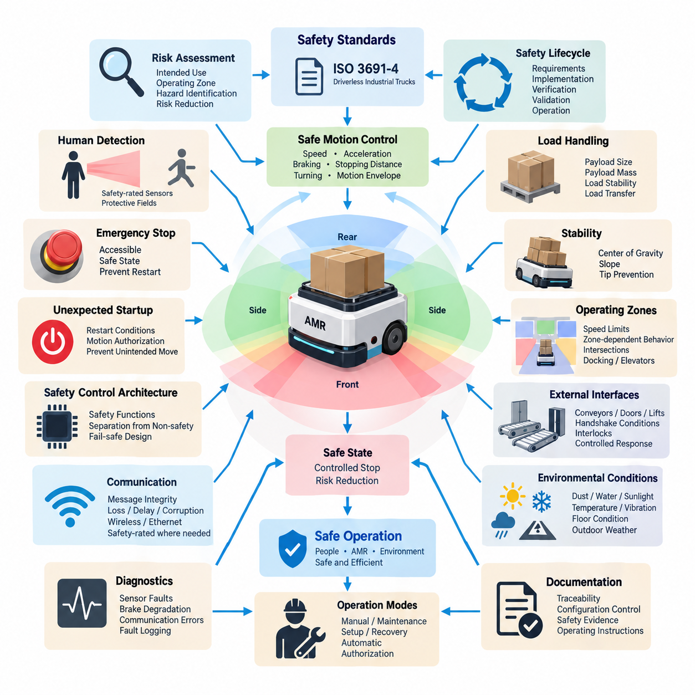
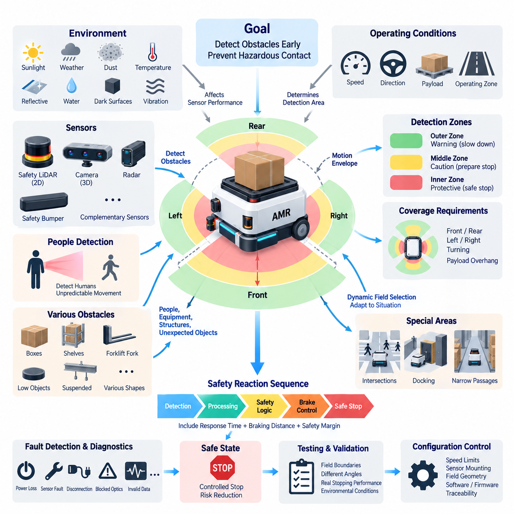
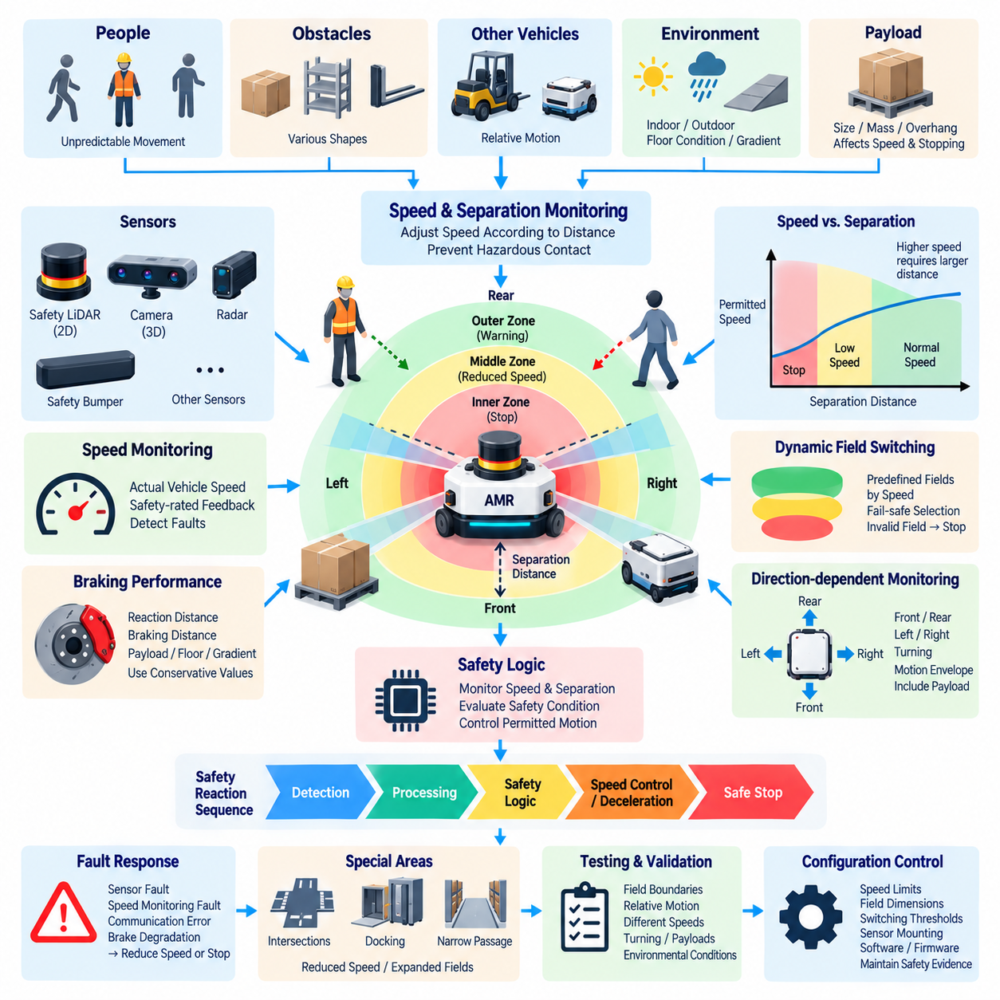
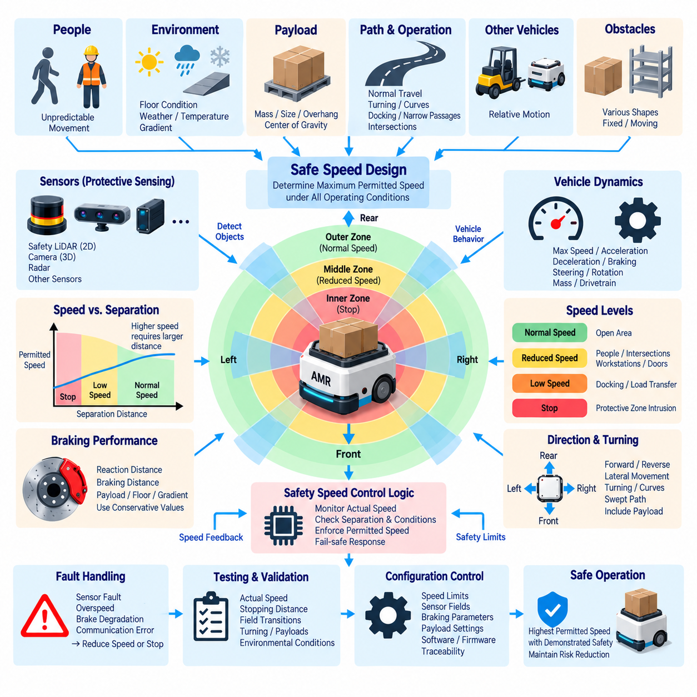
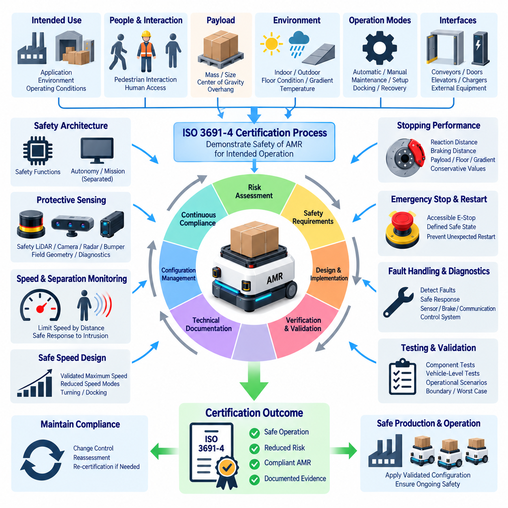

**Volume 12. Safety Architecture**


# Chapter 03. ISO 3691-4

##  

## 03.01. AMR Safety Requirements

{width="7.268055555555556in" height="7.268055555555556in"}

ISO 3691-4 establishes safety requirements for driverless industrial trucks and their systems, including automated guided vehicles and autonomous mobile robots operating in industrial environments. For an AMR, safety must be treated as a system-level property rather than as a single sensor or emergency-stop function. The vehicle, control system, protective devices, operating environment, payload, human interaction, and foreseeable misuse must therefore be considered together throughout the safety lifecycle.

The fundamental safety objective is to prevent unacceptable risk when an AMR moves, starts, stops, turns, docks, transfers loads, or performs other automated functions. Hazardous situations may arise from collision, crushing, trapping, shearing, unexpected motion, excessive speed, unstable loads, loss of control, or failure of sensing and braking functions. Safety requirements must consequently address both normal operation and reasonably foreseeable abnormal conditions.

Risk assessment begins by defining the intended use of the AMR, its operating zones, permitted speeds, payload range, environmental conditions, and expected interactions with people and other machines. Designers must identify hazardous events associated with each operating state and determine suitable risk-reduction measures. The resulting requirements should be traceable from identified hazards through safety functions, implementation, verification, and final validation of the complete vehicle.

AMR motion represents the primary source of kinetic hazard. Maximum travel speed, acceleration, deceleration, turning behavior, braking distance, vehicle mass, payload, and surface conditions influence the severity and probability of collision. Safety design therefore cannot define speed independently of sensing and braking capability. The allowable motion envelope must remain compatible with the distance required to detect a hazard, process the safety signal, initiate braking, and bring the vehicle to a safe state.

Personnel detection is essential where AMRs share space with workers. Safety-rated protective devices must detect persons or obstacles within defined protective fields and initiate the required safety response before hazardous contact occurs. The geometry of these fields depends on vehicle speed, direction of travel, stopping performance, sensor response time, control-system delay, and environmental uncertainty. Protective coverage must also consider turning, reverse travel, and vehicle overhang.

Stopping performance must be established under representative worst-case conditions rather than ideal laboratory conditions. The total stopping distance includes sensing delay, safety-controller processing time, communication delay, actuator response, brake engagement, and physical braking distance. Vehicle mass, payload, floor friction, slope, tire condition, and brake degradation can significantly change this distance. Validation should therefore demonstrate adequate stopping margins throughout the defined operating envelope.

An AMR must provide safety-related control functions that remain effective when ordinary navigation or mission-control functions fail. A failure in localization, route planning, artificial intelligence, fleet communication, or application software must not directly defeat the independent mechanisms responsible for preventing hazardous motion. Safety-related functions should be sufficiently separated from non-safety functions so that complex autonomy can fail without removing the vehicle\'s fundamental protective capability.

Emergency stopping provides an additional means for rapidly terminating hazardous movement when intervention is required. Emergency-stop devices must be accessible, clearly identifiable, and integrated into a safety-related control path appropriate to the risk. Activation should place the AMR in a defined safe condition and prevent automatic restart. Resetting the emergency-stop device should only permit subsequent restart; it should not itself command the vehicle to resume motion.

Unexpected startup must also be controlled. After power restoration, emergency-stop reset, protective-device recovery, communication restoration, or software restart, the AMR should not initiate hazardous movement without satisfying defined restart conditions. The control architecture must distinguish between recovery of system availability and authorization of motion. This prevents a person who entered the operating area during a stopped condition from being exposed to an unexpected vehicle restart.

Direction-dependent protection is important because an AMR may travel forward, backward, sideways, or along curved trajectories depending on its drivetrain. Protective fields should correspond to the actual direction and velocity of motion rather than remaining fixed around the chassis. For omnidirectional platforms, the safety concept becomes especially demanding because hazardous motion can develop along multiple axes. Safety coverage must therefore follow the commanded and physically possible movement envelope.

Load handling introduces additional hazards beyond vehicle movement. Payload dimensions can change the effective footprint, obstruct sensors, shift the center of gravity, or create crushing and collision points not present on the unloaded vehicle. Safety requirements should define allowable load mass, geometry, position, retention, and transfer conditions. Where load state affects sensing or stability, the AMR must adapt its permitted speed, protective field, or operating mode accordingly.

Stability must be maintained during acceleration, braking, turning, ramp travel, and payload transfer. A vehicle that remains collision-safe can still create severe hazards if it tips or loses its load. Mechanical dimensions, center-of-gravity limits, wheel arrangement, suspension behavior, payload position, and permissible gradients must therefore be incorporated into the safety analysis. Operational restrictions should prevent combinations of speed, load, and slope that exceed validated stability limits.

Operating zones can be used to adapt AMR behavior to environmental risk. A vehicle may require different speed limits or safety functions in pedestrian areas, restricted aisles, docking stations, intersections, elevators, automatic doors, or machine interfaces. Zone-dependent behavior must be implemented predictably and verified so that an incorrect localization or mission command cannot silently authorize unsafe motion. Safety-related zone information requires appropriate integrity where it influences risk reduction.

Interfaces with conveyors, doors, lifts, manipulators, charging systems, and production equipment create combined-system hazards. The AMR must not assume that another machine is safe merely because communication has been established. Handshake conditions should confirm that required states are satisfied before movement or load transfer begins. Loss of an interlock, invalid communication, or contradictory state information should lead to a controlled response rather than continued operation based on stale commands.

Safety-related communication must account for message corruption, repetition, loss, delay, incorrect sequence, and unintended addressing when communication contributes to a safety function. Ordinary Ethernet, wireless links, or fleet-management messages should not automatically be treated as safety-rated information. Where remote commands influence hazardous movement, the architecture must ensure that communication failures cannot bypass local protective functions or leave the AMR moving without valid safety supervision.

Environmental conditions directly affect safety performance. Dust, water, fog, sunlight, reflective surfaces, temperature, vibration, floor contamination, narrow passages, and outdoor weather can degrade sensors or braking behavior. The safety concept should define environmental limits and detect conditions that make continued autonomous operation unsafe. If required protective performance cannot be maintained, the vehicle should transition to a reduced-performance state or stop rather than relying on uncertain perception.

Diagnostics are required to detect faults that could compromise safety functions. Relevant failures include sensor obstruction, wiring faults, loss of power, controller malfunction, brake degradation, communication errors, invalid configuration, and disagreement between redundant signals. Diagnostic coverage should be designed according to the required safety performance, and detected faults should produce a defined reaction. Fault logging also supports maintenance, verification, incident investigation, and continued safety assurance.

Manual, maintenance, setup, recovery, and automatic modes require clearly defined behavior because different hazards exist in each state. Maintenance personnel may work closer to actuators and exposed mechanisms than normal operators, while recovery procedures may require limited movement after a fault. Mode selection should therefore prevent unintended transitions and restrict speed or functionality where necessary. Authorization may also be required for modes that reduce normal protective measures.

Verification confirms that individual safety requirements have been implemented correctly, while validation demonstrates that the integrated AMR achieves acceptable safety in its intended operating environment. Testing should include protective-field activation, stopping distance, emergency stopping, restart prevention, sensor faults, communication loss, payload variations, gradients, turning maneuvers, and representative environmental conditions. Worst-case combinations are particularly important because isolated component tests may underestimate system-level risk.

Safety documentation should preserve traceability among hazards, risk assessments, safety requirements, architecture, hardware and software implementation, test procedures, results, limitations, and operating instructions. Configuration control is equally important because changes to software, sensors, braking parameters, payloads, wheel dimensions, or operating speeds can invalidate previous safety evidence. Safety approval should therefore apply to a controlled configuration rather than to an abstract AMR platform.

For modern AMRs using AI-based perception and planning, the distinction between autonomous intelligence and safety enforcement is especially important. AI may improve object recognition, semantic understanding, trajectory planning, and operational efficiency, but safety-critical protective functions require predictable behavior and demonstrable integrity. A robust architecture allows advanced autonomy to propose motion while an independent safety layer supervises whether that motion remains inside an authorized safety envelope.

The practical objective of ISO 3691-4-oriented design is therefore not merely to make an AMR stop when an obstacle appears. It is to establish a coherent safety architecture in which hazardous motion is continuously constrained by validated sensing, safe speed, stopping capability, control integrity, diagnostics, operating rules, and human-accessible intervention. This system perspective provides the foundation for the subsequent design of obstacle detection, speed and separation monitoring, safe-speed functions, and certification activities defined within the ISO 3691-4 chapter structure.

ISO 3691-4는 산업 환경에서 운용되는 무인 산업용 트럭(Driverless Industrial Truck)과 그 시스템에 대한 안전 요구사항(Safety Requirements)을 규정하며, 여기에는 무인운반차(Automated Guided Vehicle, AGV)와 자율이동로봇(Autonomous Mobile Robot, AMR)이 포함된다. AMR에서 안전(Safety)은 단일 센서나 비상정지(Emergency Stop) 기능이 아니라 시스템 수준의 속성(System-Level Property)으로 다루어야 한다. 따라서 차량, 제어 시스템(Control System), 보호 장치(Protective Device), 운용 환경(Operating Environment), 적재물(Payload), 사람과의 상호작용(Human Interaction), 합리적으로 예측 가능한 오사용(Foreseeable Misuse)을 안전 수명주기(Safety Lifecycle) 전체에서 통합적으로 고려해야 한다.

기본적인 안전 목표(Safety Objective)는 AMR이 이동, 출발, 정지, 회전, 도킹(Docking), 적재물 이송(Load Transfer) 또는 기타 자동화 기능을 수행할 때 허용할 수 없는 위험(Unacceptable Risk)을 방지하는 것이다. 충돌(Collision), 압착(Crushing), 끼임(Trapping), 전단(Shearing), 예기치 않은 움직임(Unexpected Motion), 과도한 속도(Excessive Speed), 적재물 불안정, 제어 상실 또는 감지 및 제동 기능의 고장으로 위험 상황이 발생할 수 있다. 따라서 안전 요구사항은 정상 운전뿐 아니라 합리적으로 예측 가능한 비정상 상태까지 포함해야 한다.

위험 평가(Risk Assessment)는 AMR의 의도된 사용(Intended Use), 운용 구역(Operating Zone), 허용 속도, 적재물 범위(Payload Range), 환경 조건(Environmental Condition), 사람 및 다른 기계와 예상되는 상호작용을 정의하는 것에서 시작한다. 설계자는 각 운전 상태에서 발생할 수 있는 위험 사건(Hazardous Event)을 식별하고 적절한 위험 저감 조치(Risk-Reduction Measure)를 결정해야 한다. 도출된 요구사항은 식별된 위험에서 안전 기능(Safety Function), 구현, 검증(Verification), 그리고 완성 차량의 최종 유효성 확인(Validation)까지 추적 가능해야 한다.

AMR의 움직임은 운동 에너지에 의한 주요 위험원(Kinetic Hazard Source)이다. 최대 주행 속도, 가속도, 감속도, 회전 특성, 제동 거리(Braking Distance), 차량 질량, 적재물 및 노면 조건은 충돌의 심각도와 발생 가능성에 영향을 준다. 따라서 안전 설계에서는 감지 및 제동 능력과 독립적으로 속도를 결정해서는 안 된다. 허용 가능한 운동 영역(Motion Envelope)은 위험을 감지하고 안전 신호를 처리하며 제동을 시작한 후 차량을 안전 상태(Safe State)까지 정지시키는 데 필요한 거리와 항상 양립해야 한다.

작업자가 AMR과 동일한 공간을 공유하는 환경에서는 사람 감지(Personnel Detection)가 필수적이다. 안전 등급 보호 장치(Safety-Rated Protective Device)는 정의된 보호 영역(Protective Field) 내의 사람이나 장애물을 감지하고 위험한 접촉이 발생하기 전에 필요한 안전 반응(Safety Response)을 시작해야 한다. 이러한 영역의 형상은 차량 속도, 이동 방향, 정지 성능, 센서 응답 시간, 제어 시스템 지연 및 환경적 불확실성에 따라 결정된다. 보호 범위는 회전, 후진 및 차량 돌출부(Overhang)도 고려해야 한다.

정지 성능(Stopping Performance)은 이상적인 실험실 조건이 아니라 대표적인 최악 조건(Worst-Case Condition)에서 확립해야 한다. 총 정지 거리(Total Stopping Distance)는 감지 지연, 안전 제어기(Safety Controller)의 처리 시간, 통신 지연, 액추에이터(Actuator) 응답, 브레이크 작동 및 실제 물리적 제동 거리를 포함한다. 차량 질량, 적재물, 바닥 마찰, 경사, 타이어 상태 및 브레이크 열화는 이 거리를 크게 변화시킬 수 있다. 따라서 검증에서는 정의된 전체 운전 영역(Operating Envelope)에 걸쳐 충분한 정지 여유(Stopping Margin)가 확보됨을 입증해야 한다.

AMR은 일반적인 내비게이션(Navigation)이나 임무 제어(Mission Control) 기능이 고장 나더라도 유효성을 유지하는 안전 관련 제어 기능(Safety-Related Control Function)을 제공해야 한다. 위치추정(Localization), 경로 계획(Route Planning), 인공지능(Artificial Intelligence), 플릿 통신(Fleet Communication) 또는 응용 소프트웨어(Application Software)의 고장이 위험한 움직임을 방지하는 독립적인 보호 메커니즘을 직접 무력화해서는 안 된다. 복잡한 자율 기능이 실패하더라도 차량의 기본적인 보호 능력이 유지되도록 안전 관련 기능과 비안전 기능(Non-Safety Function)을 충분히 분리해야 한다.

비상정지(Emergency Stop)는 개입이 필요한 상황에서 위험한 움직임을 신속하게 종료하기 위한 추가적인 수단을 제공한다. 비상정지 장치는 접근하기 쉽고 명확하게 식별할 수 있어야 하며, 위험 수준에 적합한 안전 관련 제어 경로(Safety-Related Control Path)에 통합되어야 한다. 비상정지가 작동하면 AMR은 정의된 안전 상태로 전환되고 자동 재시작(Automatic Restart)이 방지되어야 한다. 비상정지 장치의 리셋(Reset)은 이후의 재시작을 허용하는 조건만 제공해야 하며, 리셋 자체가 차량의 움직임 재개를 명령해서는 안 된다.

예기치 않은 기동(Unexpected Startup) 역시 제어되어야 한다. 전원 복구, 비상정지 리셋, 보호 장치 복구, 통신 복원 또는 소프트웨어 재시작 이후 AMR은 정의된 재시작 조건(Restart Condition)이 충족되지 않은 상태에서 위험한 움직임을 시작해서는 안 된다. 제어 아키텍처(Control Architecture)는 시스템 가용성(System Availability)의 복구와 실제 움직임의 승인(Motion Authorization)을 구분해야 한다. 이를 통해 정지 상태에서 운용 영역에 진입한 사람이 차량의 갑작스러운 재시작에 노출되는 것을 방지할 수 있다.

AMR은 구동계(Drivetrain)에 따라 전진, 후진, 측방 또는 곡선 궤적으로 이동할 수 있으므로 방향 의존형 보호(Direction-Dependent Protection)가 중요하다. 보호 영역은 차체 주변에 고정된 형태가 아니라 실제 이동 방향과 속도에 대응해야 한다. 전방향 플랫폼(Omnidirectional Platform)의 경우 여러 축을 따라 위험한 움직임이 발생할 수 있기 때문에 안전 개념(Safety Concept)이 더욱 복잡해진다. 따라서 안전 보호 범위는 명령된 움직임뿐 아니라 물리적으로 가능한 전체 운동 영역을 따라야 한다.

적재물 취급(Load Handling)은 차량 움직임 이외의 추가적인 위험을 발생시킨다. 적재물 크기는 차량의 실질적인 외곽 영역(Effective Footprint)을 변경하고 센서를 가리거나 무게중심(Center of Gravity)을 이동시키며, 무부하 상태에는 존재하지 않는 압착 또는 충돌 지점을 만들 수 있다. 안전 요구사항에서는 허용되는 적재물 질량, 형상, 위치, 고정 상태 및 이송 조건을 정의해야 한다. 적재 상태가 감지 성능이나 안정성에 영향을 준다면 AMR은 허용 속도, 보호 영역 또는 운전 모드(Operating Mode)를 이에 맞게 조정해야 한다.

가속, 제동, 회전, 경사로 주행 및 적재물 이송 과정에서도 안정성(Stability)이 유지되어야 한다. 충돌 안전성이 확보된 차량이라도 전복(Tipping)되거나 적재물을 떨어뜨리면 심각한 위험을 발생시킬 수 있다. 따라서 기계적 치수, 무게중심 한계, 휠 배치, 서스펜션(Suspension) 특성, 적재물 위치 및 허용 경사를 안전 분석(Safety Analysis)에 포함해야 한다. 운용 제한(Operational Restriction)을 통해 검증된 안정성 한계를 초과하는 속도, 적재물 및 경사의 조합을 방지해야 한다.

운용 구역(Operating Zone)을 이용하면 환경 위험 수준에 따라 AMR의 동작을 조정할 수 있다. 보행자 구역, 제한된 통로, 도킹 스테이션(Docking Station), 교차로, 엘리베이터, 자동문 또는 기계 인터페이스에서는 서로 다른 속도 제한이나 안전 기능이 필요할 수 있다. 구역 의존형 동작(Zone-Dependent Behavior)은 예측 가능하게 구현되고 검증되어야 하며, 잘못된 위치추정이나 임무 명령으로 인해 위험한 움직임이 암묵적으로 허용되어서는 안 된다. 위험 저감에 영향을 미치는 안전 관련 구역 정보에는 적절한 무결성(Integrity)이 요구된다.

컨베이어(Conveyor), 도어, 리프트(Lift), 매니퓰레이터(Manipulator), 충전 시스템 및 생산 설비와의 인터페이스는 복합 시스템 위험(Combined-System Hazard)을 발생시킨다. AMR은 단순히 통신이 연결되었다는 이유만으로 상대 기계가 안전한 상태라고 가정해서는 안 된다. 핸드셰이크 조건(Handshake Condition)은 이동이나 적재물 이송을 시작하기 전에 필요한 상태가 충족되었는지를 확인해야 한다. 인터록(Interlock) 상실, 잘못된 통신 또는 상충하는 상태 정보가 발생하면 오래된 명령에 따라 계속 운전하는 대신 제어된 안전 반응을 수행해야 한다.

안전 관련 통신(Safety-Related Communication)이 안전 기능에 기여하는 경우 메시지 손상, 반복, 손실, 지연, 잘못된 순서 및 의도하지 않은 주소 지정 등을 고려해야 한다. 일반 이더넷(Ethernet), 무선 링크(Wireless Link) 또는 플릿 관리(Fleet Management) 메시지를 자동적으로 안전 등급 정보로 간주해서는 안 된다. 원격 명령이 위험한 움직임에 영향을 주는 경우 통신 고장이 로컬 보호 기능(Local Protective Function)을 우회하거나 유효한 안전 감시 없이 AMR이 계속 움직이는 상황을 만들지 않도록 아키텍처를 구성해야 한다.

환경 조건(Environmental Condition)은 안전 성능에 직접적인 영향을 준다. 먼지, 물, 안개, 햇빛, 반사 표면, 온도, 진동, 바닥 오염, 좁은 통로 및 실외 기상 조건은 센서나 제동 성능을 저하시킬 수 있다. 안전 개념은 환경적 한계를 정의하고 안전한 자율 운전을 지속할 수 없게 만드는 조건을 감지해야 한다. 요구되는 보호 성능을 유지할 수 없는 경우 불확실한 인지(Perception)에 의존하여 계속 운전하기보다는 차량을 성능 제한 상태(Reduced-Performance State)로 전환하거나 정지시켜야 한다.

진단(Diagnostics)은 안전 기능을 저해할 수 있는 고장을 감지하기 위해 필요하다. 관련 고장에는 센서 가림, 배선 고장, 전원 상실, 제어기 오작동, 브레이크 열화, 통신 오류, 잘못된 설정(Configuration), 중복 신호(Redundant Signal) 간 불일치 등이 포함된다. 진단 범위(Diagnostic Coverage)는 요구되는 안전 성능에 따라 설계되어야 하며, 감지된 고장은 정의된 반응을 발생시켜야 한다. 고장 기록(Fault Logging)은 유지보수, 검증, 사고 조사 및 지속적인 안전 보증(Safety Assurance)에도 활용된다.

수동(Manual), 유지보수(Maintenance), 설정(Setup), 복구(Recovery) 및 자동(Automatic) 모드에서는 각각 서로 다른 위험이 존재하므로 동작을 명확하게 정의해야 한다. 유지보수 작업자는 일반 작업자보다 액추에이터와 노출된 기계 구조에 더 가까이 접근할 수 있으며, 복구 절차에서는 고장 이후 제한된 움직임이 필요할 수도 있다. 따라서 모드 선택(Mode Selection)은 의도하지 않은 모드 전환을 방지하고 필요한 경우 속도나 기능을 제한해야 한다. 정상적인 보호 조치를 감소시키는 모드에는 별도의 권한 부여(Authorization)가 필요할 수도 있다.

검증(Verification)은 개별 안전 요구사항이 올바르게 구현되었는지를 확인하고, 유효성 확인(Validation)은 통합된 AMR이 의도된 운용 환경에서 허용 가능한 안전성을 달성하는지를 입증한다. 시험에는 보호 영역 작동, 정지 거리, 비상정지, 재시작 방지, 센서 고장, 통신 상실, 적재물 변화, 경사, 회전 기동 및 대표적인 환경 조건을 포함해야 한다. 개별 부품 시험만으로는 시스템 수준의 위험을 과소평가할 수 있으므로 최악 조건의 조합(Worst-Case Combination)에 대한 검증이 특히 중요하다.

안전 문서(Safety Documentation)는 위험, 위험 평가, 안전 요구사항, 아키텍처, 하드웨어 및 소프트웨어 구현, 시험 절차, 시험 결과, 제한사항 및 운용 지침 사이의 추적성(Traceability)을 유지해야 한다. 형상 관리(Configuration Control) 역시 중요하다. 소프트웨어, 센서, 제동 파라미터, 적재물, 휠 치수 또는 운전 속도가 변경되면 기존 안전 근거(Safety Evidence)가 무효화될 수 있기 때문이다. 따라서 안전 승인은 추상적인 AMR 플랫폼이 아니라 통제된 시스템 형상(Controlled Configuration)을 대상으로 이루어져야 한다.

인공지능 기반 인지(AI-Based Perception)와 경로 계획을 사용하는 현대 AMR에서는 자율 지능(Autonomous Intelligence)과 안전 집행(Safety Enforcement)의 구분이 특히 중요하다. AI는 객체 인식, 의미 이해(Semantic Understanding), 궤적 계획(Trajectory Planning) 및 운용 효율성을 향상시킬 수 있지만, 안전 필수 보호 기능(Safety-Critical Protective Function)은 예측 가능한 동작과 입증 가능한 무결성을 요구한다. 견고한 아키텍처에서는 고도화된 자율 지능이 움직임을 제안하고 독립적인 안전 계층(Safety Layer)이 그 움직임이 허용된 안전 영역(Safety Envelope) 내부에 있는지를 감독한다.

따라서 ISO 3691-4 지향 설계(ISO 3691-4-Oriented Design)의 실질적인 목표는 장애물이 나타났을 때 단순히 AMR을 정지시키는 것에 그치지 않는다. 검증된 감지(Validated Sensing), 안전 속도(Safe Speed), 정지 능력, 제어 무결성(Control Integrity), 진단, 운용 규칙 및 사람이 접근할 수 있는 개입 수단을 통해 위험한 움직임을 지속적으로 제한하는 일관된 안전 아키텍처(Safety Architecture)를 구축하는 것이 핵심이다. 이러한 시스템 관점은 이후 ISO 3691-4 장에서 다루는 장애물 감지(Obstacle Detection), 속도 및 분리 감시(Speed and Separation Monitoring), 안전 속도 기능(Safe-Speed Function), 그리고 인증(Certification) 설계의 기반을 제공한다.

##  

## 03.02. Obstacle Detection Requirements

{width="7.268055555555556in" height="7.268055555555556in"}

Obstacle detection for an autonomous mobile robot is a safety-related capability that prevents hazardous contact with people, equipment, structures, and unexpected objects within the vehicle's travel path. Under an ISO 3691-4-oriented safety architecture, detection must be coordinated with vehicle speed, direction, braking capability, operating mode, and environmental conditions. The objective is not merely to perceive an obstacle, but to initiate a sufficiently early and reliable safety response.

The required detection area must cover the space in which an obstacle could create a hazardous situation before the AMR can reach a safe state. This area depends on the vehicle footprint, direction of travel, maximum permitted speed, stopping distance, steering behavior, and possible overhang from carried loads. Protective coverage should therefore represent the actual motion envelope rather than a simple fixed region located only in front of the vehicle.

A protective field must provide sufficient distance for the complete safety reaction sequence. When an obstacle enters the relevant field, the system requires time for sensor detection, signal processing, safety communication, controller evaluation, actuator response, and mechanical braking. The AMR continues moving during these intervals. Protective distance must consequently include the distance traveled during total response time together with the physical braking distance and appropriate safety margins.

Detection requirements should distinguish between warning behavior and safety-related protective action. A warning field may cause the AMR to reduce speed, issue an audible or visual indication, or prepare for a controlled stop before an obstacle reaches the primary protective field. Entry into the protective field requires the defined safety response. This layered arrangement can improve operational efficiency while preserving the independent protection needed to prevent hazardous contact.

Vehicle speed and obstacle detection are directly coupled. A faster AMR requires a larger protective distance because both reaction distance and braking distance increase as speed rises. Conversely, reduced-speed operation can permit smaller protective fields where narrow passages or docking operations make large fields impractical. Dynamic field selection can therefore associate predefined safety-rated detection zones with validated speed ranges, provided transitions between fields remain controlled and fail-safe.

Direction of travel must be considered whenever protective fields are selected. Forward motion requires protection ahead of the vehicle, while reverse motion requires equivalent protection at the rear. Vehicles capable of lateral or omnidirectional movement require additional side coverage because hazardous motion may occur along multiple axes. During turning, the swept path of the chassis and payload can extend beyond the straight-line footprint, requiring protective areas that account for rotational movement.

Safety laser scanners and safety LiDAR systems are commonly suitable for detecting objects within defined two-dimensional protective fields around an AMR. Their configuration should consider scanning geometry, angular resolution, detection capability, response time, mounting height, field coverage, and diagnostic functions. Sensor placement must minimize blind regions caused by wheels, bumpers, structural components, payload mechanisms, or other equipment mounted on the vehicle.

A single sensing plane may not detect every relevant obstacle. Objects located above or below the scanner plane, suspended structures, protruding shelves, forklift forks, low-profile objects, or unusual payloads can remain outside the effective detection region. The safety assessment must therefore determine which obstacle geometries are reasonably foreseeable and whether additional scanners, bumpers, three-dimensional sensors, mechanical protection, or operational restrictions are required.

Detection of people requires particular attention because human movement is less predictable than fixed infrastructure. Workers may enter the AMR path from doorways, intersections, workstations, or between stored materials. Protective fields should provide sufficient coverage for foreseeable approach directions and should not depend solely on the autonomous navigation system's semantic classification. Safety protection should respond to occupancy or intrusion according to its validated detection principle.

Blind spots should be identified systematically during vehicle-level safety analysis. Sensor mounting positions that appear adequate in a CAD model may create hidden regions after bumpers, covers, payloads, manipulators, charging hardware, or accessories are installed. Blind regions can also change according to steering angle or load configuration. Verification should therefore evaluate the complete production configuration rather than considering each protective sensor independently.

Payload dimensions may significantly alter obstacle detection requirements. A pallet, container, manipulator, inspection module, or other payload can extend beyond the AMR base and become the first part of the system capable of contacting a person or object. Protective fields must account for this enlarged envelope. Where payload geometry changes between missions, the safety system may require validated field sets associated with known payload configurations.

Obstacle detection must remain effective during braking and turning, not only during steady straight-line travel. An AMR can continue rotating while decelerating, causing corners or payload edges to sweep into nearby space. The safety design should therefore evaluate the complete stopping trajectory. Protective coverage and stopping-distance validation should reflect the combined longitudinal, lateral, and rotational motion that can occur after a safety stop request has been generated.

Environmental conditions can influence sensor performance and must be included in detection requirements. Dust, water droplets, fog, direct sunlight, reflective materials, dark surfaces, contamination, vibration, temperature variation, and outdoor weather may affect different sensing technologies in different ways. The operating specification should define conditions under which required detection performance is maintained and the response when sensor reliability can no longer be assured.

Sensor contamination is particularly important for AMRs operating continuously in warehouses, factories, outdoor facilities, or mixed environments. Dirt, condensation, packaging material, or accidental obstruction can reduce the effective field of view. Safety-related sensors should provide diagnostic mechanisms where applicable, while the system should define appropriate reactions to detected degradation. Maintenance procedures should also specify inspection and cleaning intervals necessary to preserve validated performance.

Fault detection must prevent a failed protective sensor from being interpreted as a clear travel path. Relevant faults include loss of power, internal sensor failure, disconnected wiring, communication interruption, invalid configuration, blocked optics, and inconsistent safety outputs. The safety controller should supervise safety-related signals and transition the AMR to an appropriate safe condition when the required protective capability becomes unavailable.

Redundant or complementary sensing may be required when a single device cannot provide adequate coverage or integrity. Multiple scanners can protect different sides of the vehicle, while additional sensing technologies may address geometries that are difficult for a particular scanner arrangement. Redundancy should not simply duplicate sensors without analysis. Common mounting locations, shared power supplies, environmental influences, communication paths, and systematic configuration errors can create common-cause failures.

The autonomous perception system and the safety obstacle-detection system should have clearly defined responsibilities. Cameras, 3D LiDAR, radar, and AI perception may provide rich environmental understanding for navigation and trajectory planning, but their presence does not automatically make them safety-rated protective devices. A robust architecture allows advanced perception to optimize motion while independently validated safety functions constrain motion whenever required protective conditions are violated.

Intersections and areas with restricted visibility require special consideration because people or vehicles can enter the AMR path rapidly from directions not visible along the nominal travel corridor. The system may use reduced-speed zones, expanded protective fields, infrastructure interfaces, or other validated measures to maintain adequate separation. Detection design should consider the combined movement of the AMR and approaching objects rather than assuming that obstacles remain stationary.

Docking and load-transfer operations create a different obstacle-detection problem because the AMR intentionally approaches fixed equipment at very small distances. A normal protective field could prevent the vehicle from completing the maneuver. Safety design may therefore use validated reduced-speed modes, alternative protective fields, controlled muting concepts where applicable, or machine interlocks. Such functions must not create an unrestricted path that allows personnel to enter a hazardous area unnoticed.

Field switching must be deterministic and associated with verified operating conditions. Selection may depend on travel direction, speed range, steering state, operating zone, payload configuration, or docking mode. An incorrect field selection can be equivalent to losing the protective function entirely. The safety architecture should therefore supervise field-selection logic and ensure that uncertain, inconsistent, or invalid selection conditions result in a conservative protective state.

Obstacle detection also requires coordination with the braking system. Detecting an obstacle within the correct field provides little protection if braking torque is insufficient or delayed. Validation should measure actual stopping performance with representative payloads, speeds, floor surfaces, tire conditions, gradients, and system delays. Protective-field dimensions should then be established using verified vehicle-level stopping behavior rather than theoretical braking capability alone.

Testing should include objects positioned at field boundaries, different approach angles, representative object geometries, direction changes, maximum validated speeds, turning maneuvers, sensor faults, and relevant environmental conditions. Tests should confirm both detection and the resulting vehicle response. Particular attention should be given to transitions between warning fields, protective fields, reduced-speed operation, and complete stopping because errors frequently occur at boundaries between operating states.

Configuration management is essential because changes to speed limits, scanner mounting, protective-field geometry, braking parameters, wheel dimensions, payload configuration, control software, or sensor firmware can alter the validated detection performance. Safety-related parameters should therefore be controlled and traceable. Unauthorized or accidental configuration changes must not silently reduce protective coverage or permit operation beyond the conditions used during safety validation.

Effective obstacle detection ultimately forms a coordinated chain from environmental intrusion to safe vehicle response. The sensor detects a relevant object, the safety logic evaluates the condition, the control system requests the required reaction, and the braking system brings the AMR into an acceptable safe state before hazardous contact occurs. This chain provides the basis for the subsequent treatment of speed and separation monitoring, safe-speed design, and ISO 3691-4 certification within the safety architecture.

자율이동로봇(Autonomous Mobile Robot, AMR)의 장애물 감지(Obstacle Detection)는 차량의 이동 경로 내에 존재하는 사람, 장비, 구조물 및 예상하지 못한 물체와의 위험한 접촉을 방지하는 안전 관련 기능(Safety-Related Capability)이다. ISO 3691-4 지향 안전 아키텍처(Safety Architecture)에서는 감지 기능을 차량 속도, 이동 방향, 제동 능력, 운전 모드 및 환경 조건과 연계해야 한다. 목표는 단순히 장애물을 인지하는 것이 아니라 충분히 빠르고 신뢰할 수 있는 안전 반응(Safety Response)을 시작하는 것이다.

필요한 감지 영역(Detection Area)은 AMR이 안전 상태(Safe State)에 도달하기 전에 장애물이 위험 상황을 발생시킬 수 있는 공간을 포함해야 한다. 이 영역은 차량 외곽 영역(Vehicle Footprint), 이동 방향, 최대 허용 속도, 정지 거리(Stopping Distance), 조향 특성 및 적재물에 의해 발생할 수 있는 돌출부(Overhang)에 따라 달라진다. 따라서 보호 범위(Protective Coverage)는 차량 전방에만 배치된 단순한 고정 영역이 아니라 실제 운동 영역(Motion Envelope)을 반영해야 한다.

보호 영역(Protective Field)은 전체 안전 반응 과정(Safety Reaction Sequence)을 수행하기에 충분한 거리를 제공해야 한다. 장애물이 해당 영역에 진입하면 시스템은 센서 감지, 신호 처리, 안전 통신(Safety Communication), 제어기 판단, 액추에이터(Actuator) 응답 및 기계적 제동을 수행하는 데 시간이 필요하다. 이러한 시간 동안에도 AMR은 계속 이동하므로 보호 거리는 전체 응답 시간 동안의 이동 거리와 물리적 제동 거리, 그리고 적절한 안전 여유(Safety Margin)를 포함해야 한다.

감지 요구사항은 경고 동작(Warning Behavior)과 안전 관련 보호 동작(Safety-Related Protective Action)을 구분해야 한다. 경고 영역(Warning Field)은 장애물이 주 보호 영역에 도달하기 전에 AMR의 속도를 낮추거나 청각·시각 경고를 발생시키거나 제어 정지(Controlled Stop)를 준비하도록 할 수 있다. 보호 영역에 장애물이 진입하면 정의된 안전 반응을 수행해야 한다. 이러한 계층형 구성은 위험한 접촉을 방지하는 독립적인 보호 기능을 유지하면서 운용 효율성을 높일 수 있다.

차량 속도와 장애물 감지는 직접적으로 연계된다. 더 빠른 AMR은 반응 거리(Reaction Distance)와 제동 거리가 증가하기 때문에 더 큰 보호 거리가 필요하다. 반대로 좁은 통로나 도킹(Docking) 작업과 같이 큰 보호 영역을 적용하기 어려운 환경에서는 감속 운전을 통해 보호 영역을 축소할 수 있다. 동적 영역 선택(Dynamic Field Selection)은 전환 과정이 통제되고 고장 안전(Fail-Safe)이 보장되는 경우 검증된 속도 범위와 사전에 정의된 안전 등급 감지 영역을 연계할 수 있다.

보호 영역을 선택할 때는 이동 방향(Direction of Travel)을 고려해야 한다. 전진 시에는 차량 전방 보호가 필요하고 후진 시에는 후방에도 이에 상응하는 보호가 필요하다. 측방 또는 전방향 이동(Omnidirectional Movement)이 가능한 차량은 여러 축에서 위험한 움직임이 발생할 수 있으므로 추가적인 측면 보호가 요구된다. 회전할 때는 차체와 적재물의 스윕 경로(Swept Path)가 직선 주행 시의 외곽 영역을 벗어날 수 있으므로 회전 운동을 고려한 보호 영역이 필요하다.

안전 레이저 스캐너(Safety Laser Scanner)와 안전 라이다(Safety LiDAR)는 AMR 주변의 정의된 2차원 보호 영역 내에서 물체를 감지하는 데 일반적으로 적합하다. 이들의 구성에서는 스캔 형상, 각도 분해능(Angular Resolution), 감지 능력, 응답 시간, 장착 높이, 영역 커버리지(Field Coverage) 및 진단 기능(Diagnostic Function)을 고려해야 한다. 센서 배치는 휠, 범퍼, 구조물, 적재 메커니즘 또는 차량에 장착된 다른 장비로 인해 발생하는 사각 영역(Blind Region)을 최소화해야 한다.

단일 감지 평면(Sensing Plane)만으로 모든 관련 장애물을 감지하지 못할 수 있다. 스캐너 평면보다 높거나 낮은 물체, 매달린 구조물, 돌출된 선반, 지게차 포크(Forklift Fork), 높이가 낮은 물체 또는 비정형 적재물은 유효 감지 영역 밖에 존재할 수 있다. 따라서 안전 평가(Safety Assessment)에서는 합리적으로 예측 가능한 장애물 형상을 결정하고 추가 스캐너, 범퍼, 3차원 센서, 기계적 보호 장치 또는 운용 제한이 필요한지를 판단해야 한다.

사람의 움직임은 고정된 기반 시설보다 예측하기 어렵기 때문에 사람 감지(Person Detection)는 특별한 주의가 필요하다. 작업자는 출입문, 교차로, 작업장 또는 보관된 자재 사이에서 갑자기 AMR의 이동 경로로 진입할 수 있다. 보호 영역은 예측 가능한 접근 방향에 대해 충분한 범위를 제공해야 하며 자율주행 시스템의 의미론적 분류(Semantic Classification)에만 의존해서는 안 된다. 안전 보호 기능은 검증된 감지 원리에 따라 영역 점유 또는 침입에 반응해야 한다.

사각지대(Blind Spot)는 차량 수준 안전 분석(Vehicle-Level Safety Analysis) 과정에서 체계적으로 식별해야 한다. CAD 모델에서 적절해 보이는 센서 장착 위치라도 범퍼, 커버, 적재물, 매니퓰레이터(Manipulator), 충전 장치 또는 액세서리를 설치한 후에는 숨겨진 영역을 만들 수 있다. 또한 조향각이나 적재 구성에 따라 사각 영역이 달라질 수 있다. 따라서 검증(Verification)은 각 보호 센서를 개별적으로 평가하는 것이 아니라 완성된 양산 구성(Production Configuration)을 대상으로 수행해야 한다.

적재물 크기는 장애물 감지 요구사항을 크게 변화시킬 수 있다. 팔레트, 컨테이너, 매니퓰레이터, 검사 모듈 또는 기타 적재물이 AMR 베이스보다 돌출되어 사람이나 물체와 가장 먼저 접촉하는 부분이 될 수 있다. 보호 영역은 이렇게 확대된 외곽 영역(Enlarged Envelope)을 고려해야 한다. 임무에 따라 적재물 형상이 변경되는 경우 안전 시스템은 알려진 적재 구성과 연계된 검증된 보호 영역 세트(Validated Field Set)를 사용할 필요가 있다.

장애물 감지는 일정한 직선 주행 중에만 작동하는 것이 아니라 제동과 회전 중에도 유효해야 한다. AMR은 감속하면서 계속 회전할 수 있으며, 이 과정에서 차량 모서리나 적재물 끝부분이 주변 공간으로 스윕(Sweep)될 수 있다. 따라서 안전 설계에서는 전체 정지 궤적(Stopping Trajectory)을 평가해야 한다. 보호 범위와 정지 거리 검증은 안전 정지 요청(Safety Stop Request)이 발생한 이후 나타날 수 있는 종방향, 횡방향 및 회전 운동의 조합을 반영해야 한다.

환경 조건(Environmental Condition)은 센서 성능에 영향을 줄 수 있으므로 감지 요구사항에 포함해야 한다. 먼지, 물방울, 안개, 직사광선, 반사 재질, 어두운 표면, 오염, 진동, 온도 변화 및 실외 기상 조건은 감지 기술에 따라 서로 다른 영향을 미칠 수 있다. 운용 사양(Operating Specification)은 필요한 감지 성능이 유지되는 조건을 정의하고 센서 신뢰성을 더 이상 보장할 수 없는 경우 시스템이 취해야 하는 반응을 규정해야 한다.

센서 오염(Sensor Contamination)은 창고, 공장, 실외 시설 또는 복합 환경에서 지속적으로 운용되는 AMR에서 특히 중요하다. 먼지, 응결, 포장재 또는 우발적인 가림은 유효 시야(Field of View)를 감소시킬 수 있다. 안전 관련 센서는 가능한 경우 진단 메커니즘을 제공해야 하며, 시스템은 감지된 성능 저하에 대해 적절한 반응을 정의해야 한다. 유지보수 절차에는 검증된 성능을 유지하는 데 필요한 검사 및 청소 주기도 명시해야 한다.

고장 감지(Fault Detection)는 고장 난 보호 센서가 이동 경로에 장애물이 없는 것으로 잘못 해석되는 것을 방지해야 한다. 관련 고장에는 전원 상실, 센서 내부 고장, 배선 단선, 통신 중단, 잘못된 설정, 광학부 차단 및 안전 출력(Safety Output)의 불일치 등이 포함된다. 안전 제어기(Safety Controller)는 안전 관련 신호를 감시하고 필요한 보호 기능을 사용할 수 없게 되었을 때 AMR을 적절한 안전 상태로 전환해야 한다.

하나의 장치만으로 충분한 커버리지나 무결성(Integrity)을 제공할 수 없는 경우 중복 또는 상호 보완 감지(Redundant or Complementary Sensing)가 필요할 수 있다. 여러 스캐너를 이용해 차량의 서로 다른 측면을 보호할 수 있으며 특정 스캐너 배치로 감지하기 어려운 형상은 추가적인 감지 기술로 보완할 수 있다. 그러나 분석 없이 센서를 단순히 복제해서는 안 된다. 공통 장착 위치, 공유 전원, 환경 영향, 통신 경로 및 체계적인 설정 오류는 공통 원인 고장(Common-Cause Failure)을 발생시킬 수 있다.

자율 인지 시스템(Autonomous Perception System)과 안전 장애물 감지 시스템(Safety Obstacle-Detection System)의 책임은 명확하게 정의되어야 한다. 카메라, 3D 라이다(3D LiDAR), 레이더(Radar) 및 AI 인지는 내비게이션과 궤적 계획을 위한 풍부한 환경 정보를 제공할 수 있지만, 이러한 센서가 존재한다고 해서 자동적으로 안전 등급 보호 장치(Safety-Rated Protective Device)가 되는 것은 아니다. 견고한 아키텍처에서는 고급 인지가 움직임을 최적화하고 독립적으로 검증된 안전 기능이 필요한 보호 조건을 위반할 때 움직임을 제한한다.

교차로와 시야 제한 구역(Restricted-Visibility Area)은 사람이나 차량이 정상적인 이동 통로에서 보이지 않는 방향으로부터 빠르게 AMR의 경로에 진입할 수 있기 때문에 특별히 고려해야 한다. 시스템은 적절한 분리 거리(Separation Distance)를 유지하기 위해 감속 구역, 확대된 보호 영역, 기반 시설 인터페이스(Infrastructure Interface) 또는 기타 검증된 조치를 사용할 수 있다. 감지 설계에서는 장애물이 정지해 있다고 가정하지 않고 AMR과 접근하는 물체의 결합 운동(Combined Movement)을 고려해야 한다.

도킹 및 적재물 이송 작업은 AMR이 의도적으로 고정 설비에 매우 가까이 접근하기 때문에 일반적인 장애물 감지와 다른 문제를 발생시킨다. 일반적인 보호 영역을 그대로 적용하면 차량이 작업을 완료하지 못할 수 있다. 따라서 안전 설계에서는 검증된 저속 모드(Reduced-Speed Mode), 대체 보호 영역, 적용 가능한 경우 통제된 뮤팅 개념(Muting Concept) 또는 기계 인터록(Machine Interlock)을 사용할 수 있다. 이러한 기능으로 인해 사람이 위험 영역에 진입해도 감지되지 않는 무제한 통로가 형성되어서는 안 된다.

영역 전환(Field Switching)은 결정론적(Deterministic)으로 수행되어야 하며 검증된 운전 조건과 연계되어야 한다. 보호 영역 선택은 이동 방향, 속도 범위, 조향 상태, 운용 구역, 적재물 구성 또는 도킹 모드에 따라 달라질 수 있다. 잘못된 영역 선택은 보호 기능 자체를 상실하는 것과 같은 결과를 초래할 수 있다. 따라서 안전 아키텍처는 영역 선택 로직(Field-Selection Logic)을 감시하고 불확실하거나 일관되지 않거나 유효하지 않은 선택 조건에서는 보수적인 보호 상태(Conservative Protective State)로 전환해야 한다.

장애물 감지는 제동 시스템(Braking System)과도 조정되어야 한다. 올바른 보호 영역에서 장애물을 감지하더라도 제동 토크가 부족하거나 제동이 지연된다면 충분한 보호를 제공할 수 없다. 검증에서는 대표적인 적재물, 속도, 바닥 표면, 타이어 상태, 경사 및 시스템 지연을 적용하여 실제 정지 성능을 측정해야 한다. 이후 보호 영역의 크기는 이론적인 제동 능력이 아니라 검증된 차량 수준 정지 성능(Vehicle-Level Stopping Performance)을 기반으로 결정해야 한다.

시험(Testing)은 보호 영역 경계에 배치된 물체, 다양한 접근 각도, 대표적인 물체 형상, 이동 방향 변경, 최대 검증 속도, 회전 기동, 센서 고장 및 관련 환경 조건을 포함해야 한다. 시험에서는 감지 여부뿐 아니라 그에 따른 차량 반응도 확인해야 한다. 운전 상태 사이의 경계에서 오류가 자주 발생할 수 있으므로 경고 영역, 보호 영역, 감속 운전 및 완전 정지 사이의 전환을 특히 주의하여 검증해야 한다.

형상 관리(Configuration Management)는 속도 제한, 스캐너 장착 위치, 보호 영역 형상, 제동 파라미터, 휠 치수, 적재물 구성, 제어 소프트웨어 또는 센서 펌웨어의 변경이 검증된 감지 성능을 변화시킬 수 있기 때문에 필수적이다. 따라서 안전 관련 파라미터(Safety-Related Parameter)는 통제되고 추적 가능해야 한다. 승인되지 않았거나 우발적으로 발생한 설정 변경으로 보호 범위가 은밀하게 감소하거나 안전 검증 조건을 초과한 운전이 허용되어서는 안 된다.

효과적인 장애물 감지(Effective Obstacle Detection)는 궁극적으로 환경 침입(Environmental Intrusion)에서 차량의 안전 반응까지 이어지는 하나의 통합된 연쇄 과정으로 구성된다. 센서가 관련 물체를 감지하면 안전 로직(Safety Logic)이 상태를 평가하고, 제어 시스템이 필요한 반응을 요청하며, 제동 시스템이 위험한 접촉이 발생하기 전에 AMR을 허용 가능한 안전 상태로 전환한다. 이러한 연쇄 구조는 안전 아키텍처에서 이후 다루는 속도 및 분리 감시(Speed and Separation Monitoring), 안전 속도 설계(Safe-Speed Design), 그리고 ISO 3691-4 인증(Certification)의 기반을 제공한다.

##  

## 03.03. Speed and Separation Monitoring

{width="7.268055555555556in" height="7.268055555555556in"}

Speed and separation monitoring is a safety strategy that controls AMR motion according to the available distance between the vehicle and people, obstacles, or other hazardous objects. Within an ISO 3691-4-oriented architecture, separation distance is directly related to vehicle speed and stopping capability. As separation decreases, the permitted speed must be reduced so that the AMR can always reach an appropriate safe state before hazardous contact occurs.

The fundamental relationship is based on the distance traveled before the vehicle becomes stationary. This includes distance traveled during sensor response, safety logic processing, communication, controller reaction, actuator activation, and mechanical braking. Additional margins are required for measurement uncertainty and operating variation. A protective distance must therefore be established from the complete safety reaction chain rather than from braking distance alone.

Speed monitoring determines whether actual vehicle velocity remains within the limit permitted for the current safety condition. The monitored value should represent physical vehicle motion with sufficient integrity for the required safety function. Commanded velocity alone may be inadequate because wheel slip, controller faults, drivetrain behavior, gradients, or incorrect feedback can cause actual movement to differ from the requested motion.

Separation monitoring determines whether sufficient space remains between the AMR and a detected person or obstacle. Safety scanners or other suitable protective devices can establish monitored zones around the vehicle. When an object crosses defined boundaries, the safety system changes the permitted operating condition. The objective is to preserve enough distance for deceleration and stopping while avoiding unnecessary stops when adequate separation remains available.

A practical implementation commonly uses multiple distance zones. An outer zone can provide early awareness and initiate moderate speed reduction, while an intermediate zone can impose a lower safe speed. Entry into the innermost protective zone can require a safety stop. The exact number and geometry of zones depend on vehicle characteristics and risk assessment, but every transition must preserve sufficient stopping margin for the corresponding speed.

The relationship between speed and separation is dynamic rather than fixed. At higher speed, the AMR requires greater separation because reaction distance and braking distance increase. As speed decreases, the required protective distance can also decrease within validated limits. This relationship allows an AMR to travel efficiently in open areas while automatically adopting more conservative motion when approaching people, intersections, narrow passages, or workstations.

Protective separation must consider the relative motion of both the AMR and the approaching object. A person walking toward the vehicle can reduce available separation more quickly than a stationary obstacle. Similarly, another mobile robot or industrial vehicle may approach from an intersecting trajectory. Safety analysis should therefore consider reasonably foreseeable approach velocities and directions rather than treating every detected object as stationary.

Direction-dependent monitoring is necessary because the relevant protective distance changes with vehicle movement. Forward travel requires monitoring of the forward motion envelope, while reverse travel requires corresponding rear protection. Lateral and omnidirectional AMRs require side protection as well. During turning, the monitored region must account for the swept path of the chassis and any payload extending beyond the base vehicle.

Braking performance establishes an essential physical boundary for separation monitoring. Even a perfectly functioning sensor cannot prevent collision if the available distance is shorter than the distance required to stop. Actual stopping performance should therefore be characterized across representative vehicle masses, payloads, speeds, floor conditions, tire states, gradients, and braking-system tolerances. Conservative values should be used when defining safety-related separation thresholds.

Acceleration also requires supervision because rapid acceleration can invalidate a protective field that was selected for a lower speed. The safety architecture should prevent the AMR from accelerating beyond the speed supported by the currently active protective zone. When a larger protective field becomes available, acceleration may be permitted according to defined transition logic. This maintains consistency between actual kinetic behavior and available detection distance.

Dynamic protective-field switching can coordinate safety scanner geometry with vehicle velocity. Different predefined fields may be selected for low-, medium-, and high-speed operation, with larger fields associated with higher speeds. Field selection should be safety-related where it contributes to risk reduction. Invalid field selection, inconsistent speed information, or loss of the required field should cause a conservative response rather than continued operation.

The monitored speed should include relevant directional and rotational components. For a differential-drive AMR, turning can cause one side of the chassis to move faster than another. Omnidirectional platforms can combine longitudinal, lateral, and rotational movement simultaneously. Safety assessment should therefore consider the velocity of the portions of the vehicle that could contact a person, rather than relying only on the translational speed reported at the vehicle center.

Payload configuration can modify both separation requirements and permissible speed. A large pallet may extend the collision envelope, while a heavy payload may increase braking distance and alter vehicle stability. A tall or offset payload can also influence safe cornering speed. When payload conditions vary significantly, the safety system may require different validated speed limits, protective fields, or operating profiles associated with known load configurations.

Reduced-speed operation is particularly important in areas where full protective separation cannot be maintained. Narrow aisles, docking stations, transfer points, elevators, doors, and machine interfaces may require the AMR to approach fixed structures closely. In such areas, validated reduced-speed modes can decrease stopping distance and permit controlled operation while maintaining the safety measures required for foreseeable human access.

Intersections represent a demanding case because a person or vehicle can enter the AMR path laterally with little warning. The safety concept may require reduced approach speed, expanded protective fields, infrastructure-based information, or combinations of these measures. The selected strategy should ensure that sufficient separation remains available even when the approaching object was initially outside the direct travel corridor or partially obscured.

Human interaction requires conservative assumptions because people can stop, accelerate, reverse direction, or enter the vehicle path unexpectedly. The safety system should not depend on predictions that a person will continue along an expected trajectory. Advanced perception may support navigation decisions, but safety-related separation should remain based on validated protective principles and should transition toward reduced speed or stopping when required separation cannot be assured.

Safety-related speed information must be sufficiently reliable. Encoder signals, motor feedback, safety-rated motion monitoring, or other appropriate sources may be used depending on the architecture. Faults such as implausible speed values, disagreement between redundant channels, missing feedback, incorrect scaling, or communication loss should be detected. If actual speed cannot be confirmed, continued motion at an assumed safe velocity may not provide adequate protection.

Latency must be included explicitly in separation calculations. Sensor acquisition, internal filtering, network transmission, safety-controller execution, drive communication, brake command generation, and actuator response all consume time. Even small delays become significant as vehicle speed increases. The safety distance should therefore use verified worst-case or appropriately conservative timing values for the complete sensing-to-stop path rather than average processing latency.

Environmental conditions can affect both separation measurement and stopping behavior. Dust, water, sunlight, reflective surfaces, temperature, vibration, floor contamination, and gradients may degrade sensor performance or reduce tire-to-floor friction. A separation strategy validated on a clean, dry, level floor cannot automatically be assumed safe in every operating environment. Environmental limits and degraded operating modes should therefore be defined.

Fault responses must preserve the relationship between speed and available protection. Loss of a protective scanner, invalid field selection, brake degradation, speed-monitoring failure, or safety communication error can make the current operating speed unacceptable. The AMR should respond by reducing speed or transitioning to a safe stop according to the remaining verified capability. A fault must not silently leave high-speed motion operating with reduced protective coverage.

Restart behavior is also part of separation monitoring. After a protective stop, the AMR should not automatically accelerate simply because an obstacle leaves the innermost field. The system should verify that required protective zones are clear, relevant safety devices are operational, and the permitted speed corresponds to the available separation. Controlled restart logic prevents rapid transitions from a stopped condition directly into an inadequately protected high-speed state.

Verification should measure the complete relationship among detected distance, actual speed, system reaction time, deceleration, and final stopping position. Tests should cover maximum permitted speeds, representative payloads, direction changes, turning, field transitions, approaching objects, sensor faults, braking variations, and relevant environmental conditions. Boundary cases are especially important because unsafe behavior can occur when speed and protective-field states change nearly simultaneously.

Configuration control must protect safety-related speed limits, field dimensions, switching thresholds, braking parameters, sensor mounting data, wheel dimensions, and controller timing assumptions. Changes to any of these parameters can alter the validated separation distance. Software updates or mechanical modifications should therefore trigger assessment of whether existing safety evidence remains valid before the revised AMR configuration is released for operation.

An effective speed and separation monitoring architecture forms a closed safety relationship between perception, distance, motion, and braking. Protective sensing determines available separation, safety logic establishes the permitted motion state, speed monitoring verifies actual behavior, and the braking system provides the final physical risk reduction. Maintaining this relationship continuously allows the AMR to remain productive while ensuring that decreasing separation leads predictably from normal travel to reduced speed and, when necessary, a safe stop.

속도 및 분리 감시(Speed and Separation Monitoring)는 차량과 사람, 장애물 또는 기타 위험 물체 사이에 확보된 거리에 따라 자율이동로봇(Autonomous Mobile Robot, AMR)의 움직임을 제어하는 안전 전략(Safety Strategy)이다. ISO 3691-4 지향 아키텍처에서는 분리 거리(Separation Distance)가 차량 속도와 정지 능력(Stopping Capability)에 직접적으로 연계된다. 분리 거리가 감소할수록 허용 속도도 낮아져야 하며, 이를 통해 AMR은 위험한 접촉이 발생하기 전에 항상 적절한 안전 상태(Safe State)에 도달할 수 있어야 한다.

기본적인 관계는 차량이 완전히 정지하기 전까지 이동하는 거리를 기반으로 한다. 여기에는 센서 응답, 안전 로직(Safety Logic) 처리, 통신, 제어기 반응, 액추에이터(Actuator) 작동 및 기계적 제동 과정에서 이동하는 거리가 포함된다. 또한 측정 불확실성(Measurement Uncertainty)과 운전 조건의 변동을 고려한 추가 여유가 필요하다. 따라서 보호 거리(Protective Distance)는 제동 거리만이 아니라 전체 안전 반응 연쇄(Safety Reaction Chain)를 기반으로 설정해야 한다.

속도 감시(Speed Monitoring)는 실제 차량 속도가 현재의 안전 조건에서 허용되는 제한 범위 내에 유지되는지를 판단한다. 감시되는 값은 요구되는 안전 기능에 충분한 무결성(Integrity)을 갖고 실제 차량 움직임을 나타내야 한다. 명령 속도(Commanded Velocity)만으로는 충분하지 않을 수 있는데, 휠 슬립(Wheel Slip), 제어기 고장, 구동계 동작, 경사 또는 잘못된 피드백으로 인해 실제 움직임이 요청된 움직임과 달라질 수 있기 때문이다.

분리 감시(Separation Monitoring)는 AMR과 감지된 사람 또는 장애물 사이에 충분한 공간이 남아 있는지를 판단한다. 안전 스캐너(Safety Scanner) 또는 기타 적절한 보호 장치(Protective Device)를 이용하여 차량 주변에 감시 영역(Monitored Zone)을 설정할 수 있다. 물체가 정의된 경계를 통과하면 안전 시스템은 허용되는 운전 조건을 변경한다. 목표는 충분한 분리 거리가 유지될 때 불필요한 정지를 피하면서 감속과 정지를 위한 충분한 거리를 확보하는 것이다.

실제 구현에서는 일반적으로 여러 개의 거리 영역(Distance Zone)을 사용한다. 외곽 영역(Outer Zone)은 조기에 위험을 인식하고 적당한 감속을 시작할 수 있으며, 중간 영역(Intermediate Zone)은 더 낮은 안전 속도(Safe Speed)를 적용할 수 있다. 가장 안쪽의 보호 영역(Protective Zone)에 진입하면 안전 정지(Safety Stop)가 요구될 수 있다. 영역의 정확한 수와 형상은 차량 특성과 위험 평가(Risk Assessment)에 따라 달라지지만, 모든 전환 과정에서는 해당 속도에 필요한 충분한 정지 여유(Stopping Margin)가 유지되어야 한다.

속도와 분리 거리의 관계는 고정된 것이 아니라 동적(Dynamic)이다. 높은 속도에서는 반응 거리(Reaction Distance)와 제동 거리가 증가하기 때문에 AMR에 더 큰 분리 거리가 필요하다. 속도가 감소하면 검증된 한계 내에서 필요한 보호 거리 역시 감소할 수 있다. 이러한 관계를 이용하면 AMR은 개방된 구역에서는 효율적으로 주행하고 사람, 교차로, 좁은 통로 또는 작업장에 접근할 때 자동으로 더욱 보수적인 움직임을 적용할 수 있다.

보호 분리 거리(Protective Separation)는 AMR과 접근하는 물체 양쪽의 상대 운동(Relative Motion)을 고려해야 한다. 차량 방향으로 걸어오는 사람은 정지한 장애물보다 확보된 분리 거리를 더 빠르게 감소시킬 수 있다. 마찬가지로 다른 이동로봇이나 산업용 차량이 교차 궤적으로 접근할 수도 있다. 따라서 안전 분석(Safety Analysis)에서는 감지된 모든 물체가 정지해 있다고 가정하지 말고 합리적으로 예측 가능한 접근 속도와 방향을 고려해야 한다.

차량의 움직임에 따라 필요한 보호 거리가 달라지기 때문에 방향 의존형 감시(Direction-Dependent Monitoring)가 필요하다. 전진 주행에서는 전방 운동 영역(Motion Envelope)을 감시해야 하며, 후진 주행에서는 이에 상응하는 후방 보호가 필요하다. 측방 및 전방향 AMR(Omnidirectional AMR)에서는 측면 보호도 필요하다. 회전 중에는 차체와 베이스 차량 밖으로 돌출된 적재물의 스윕 경로(Swept Path)를 감시 영역에 포함해야 한다.

제동 성능(Braking Performance)은 분리 감시를 위한 핵심적인 물리적 한계를 결정한다. 센서가 완벽하게 작동하더라도 사용 가능한 거리가 정지에 필요한 거리보다 짧다면 충돌을 방지할 수 없다. 따라서 실제 정지 성능은 대표적인 차량 질량, 적재물, 속도, 바닥 상태, 타이어 상태, 경사 및 제동 시스템 허용오차(Braking-System Tolerance)에 걸쳐 특성화해야 한다. 안전 관련 분리 임계값(Separation Threshold)을 정의할 때는 보수적인 값을 사용해야 한다.

가속(Acceleration) 역시 감시가 필요하다. 급격한 가속은 낮은 속도를 기준으로 선택된 보호 영역을 무효화할 수 있기 때문이다. 안전 아키텍처(Safety Architecture)는 현재 활성화된 보호 영역이 지원하는 속도를 초과하여 AMR이 가속하지 못하도록 해야 한다. 더 큰 보호 영역을 사용할 수 있게 되면 정의된 전환 로직(Transition Logic)에 따라 가속을 허용할 수 있다. 이를 통해 실제 운동 특성과 사용 가능한 감지 거리 사이의 일관성을 유지할 수 있다.

동적 보호 영역 전환(Dynamic Protective-Field Switching)을 이용하면 안전 스캐너의 영역 형상을 차량 속도와 연계할 수 있다. 저속, 중속 및 고속 운전에 대해 서로 다른 사전 정의 영역을 선택할 수 있으며, 높은 속도에는 더 큰 보호 영역을 적용한다. 위험 저감에 기여하는 경우 영역 선택은 안전 관련 기능으로 구현되어야 한다. 잘못된 영역 선택, 일관되지 않은 속도 정보 또는 필요한 영역의 상실이 발생하면 운전을 계속하기보다 보수적인 반응(Conservative Response)을 수행해야 한다.

감시 속도(Monitored Speed)는 관련된 방향 및 회전 성분을 포함해야 한다. 차동 구동(Differential Drive) AMR에서는 회전할 때 차체 한쪽이 다른 쪽보다 빠르게 움직일 수 있다. 전방향 플랫폼(Omnidirectional Platform)은 종방향, 횡방향 및 회전 운동을 동시에 조합할 수 있다. 따라서 안전 평가에서는 단순히 차량 중심에서 보고되는 병진 속도(Translational Speed)에만 의존하지 말고 사람과 접촉할 수 있는 차량 부분의 속도를 고려해야 한다.

적재물 구성(Payload Configuration)은 필요한 분리 거리와 허용 속도를 모두 변화시킬 수 있다. 대형 팔레트는 충돌 영역(Collision Envelope)을 확장할 수 있고 무거운 적재물은 제동 거리를 증가시키며 차량 안정성에 영향을 줄 수 있다. 높거나 한쪽으로 치우친 적재물은 안전한 코너링 속도에도 영향을 미칠 수 있다. 적재 조건이 크게 달라지는 경우 안전 시스템은 알려진 적재 구성에 대응하는 서로 다른 검증된 속도 제한, 보호 영역 또는 운전 프로파일(Operating Profile)을 적용해야 할 수 있다.

감속 운전(Reduced-Speed Operation)은 완전한 보호 분리 거리를 확보할 수 없는 구역에서 특히 중요하다. 좁은 통로, 도킹 스테이션(Docking Station), 이송 지점, 엘리베이터, 출입문 및 기계 인터페이스에서는 AMR이 고정 구조물에 매우 가까이 접근해야 할 수 있다. 이러한 구역에서는 검증된 감속 모드(Reduced-Speed Mode)를 통해 정지 거리를 줄이고 예측 가능한 사람의 접근에 필요한 안전 조치를 유지하면서 통제된 운전을 수행할 수 있다.

교차로(Intersection)는 사람이나 차량이 측면에서 거의 경고 없이 AMR의 경로로 진입할 수 있기 때문에 까다로운 상황이다. 안전 개념(Safety Concept)은 접근 속도 감소, 확대된 보호 영역, 기반 시설 기반 정보(Infrastructure-Based Information) 또는 이러한 조치의 조합을 요구할 수 있다. 선택된 전략은 접근하는 물체가 처음에는 직접적인 주행 통로 밖에 있거나 부분적으로 가려져 있더라도 충분한 분리 거리가 유지되도록 해야 한다.

사람은 정지하거나 가속하고 방향을 바꾸거나 예상하지 못하게 차량 경로로 진입할 수 있으므로 사람과의 상호작용(Human Interaction)에서는 보수적인 가정이 필요하다. 안전 시스템은 사람이 예상된 궤적을 계속 따라갈 것이라는 예측에 의존해서는 안 된다. 고급 인지(Advanced Perception)는 내비게이션 의사결정을 지원할 수 있지만, 안전 관련 분리는 검증된 보호 원리(Validated Protective Principle)를 기반으로 유지되어야 하며 필요한 분리 거리를 보장할 수 없으면 감속 또는 정지 상태로 전환해야 한다.

안전 관련 속도 정보(Safety-Related Speed Information)는 충분한 신뢰성을 가져야 한다. 아키텍처에 따라 엔코더(Encoder) 신호, 모터 피드백, 안전 등급 모션 감시(Safety-Rated Motion Monitoring) 또는 기타 적절한 정보원을 사용할 수 있다. 비현실적인 속도 값, 중복 채널 간 불일치, 피드백 손실, 잘못된 스케일링 또는 통신 상실 등의 고장을 감지해야 한다. 실제 속도를 확인할 수 없다면 가정된 안전 속도로 계속 움직이는 것만으로는 충분한 보호를 제공하지 못할 수 있다.

지연 시간(Latency)은 분리 거리 계산에 명시적으로 포함해야 한다. 센서 데이터 획득, 내부 필터링, 네트워크 전송, 안전 제어기(Safety Controller) 실행, 드라이브 통신, 브레이크 명령 생성 및 액추에이터 응답에는 모두 시간이 필요하다. 차량 속도가 증가할수록 작은 지연도 중요해진다. 따라서 안전 거리는 평균 처리 지연이 아니라 전체 감지-정지 경로(Sensing-to-Stop Path)에 대해 검증된 최악 조건 또는 적절하게 보수적인 시간 값을 사용해야 한다.

환경 조건(Environmental Condition)은 분리 거리 측정과 정지 동작 모두에 영향을 미칠 수 있다. 먼지, 물, 햇빛, 반사 표면, 온도, 진동, 바닥 오염 및 경사는 센서 성능을 저하시키거나 타이어와 바닥 사이의 마찰력을 감소시킬 수 있다. 깨끗하고 건조하며 평탄한 바닥에서 검증된 분리 전략을 모든 운용 환경에서 자동으로 안전하다고 가정할 수 없다. 따라서 환경적 한계(Environmental Limit)와 성능 저하 운전 모드(Degraded Operating Mode)를 정의해야 한다.

고장 반응(Fault Response)은 속도와 사용 가능한 보호 기능 사이의 관계를 유지해야 한다. 보호 스캐너 상실, 잘못된 영역 선택, 브레이크 성능 저하, 속도 감시 고장 또는 안전 통신 오류는 현재 운전 속도를 허용할 수 없는 상태로 만들 수 있다. AMR은 남아 있는 검증된 기능에 따라 속도를 줄이거나 안전 정지 상태로 전환해야 한다. 고장으로 인해 보호 범위가 감소한 상태에서 고속 주행이 감지되지 않은 채 계속되어서는 안 된다.

재시작 동작(Restart Behavior) 역시 분리 감시의 일부이다. 보호 정지 이후 장애물이 가장 안쪽 영역에서 벗어났다는 이유만으로 AMR이 자동으로 가속해서는 안 된다. 시스템은 필요한 보호 영역이 비어 있는지, 관련 안전 장치가 정상적으로 작동하는지, 그리고 허용 속도가 현재 확보된 분리 거리에 적합한지를 확인해야 한다. 통제된 재시작 로직(Controlled Restart Logic)은 정지 상태에서 보호가 불충분한 고속 상태로 급격하게 전환되는 것을 방지한다.

검증(Verification)에서는 감지 거리, 실제 속도, 시스템 반응 시간, 감속 및 최종 정지 위치 사이의 전체 관계를 측정해야 한다. 시험은 최대 허용 속도, 대표적인 적재물, 방향 변경, 회전, 영역 전환, 접근하는 물체, 센서 고장, 제동 변화 및 관련 환경 조건을 포함해야 한다. 속도와 보호 영역 상태가 거의 동시에 변화할 때 위험한 동작이 발생할 수 있으므로 경계 조건(Boundary Case)에 대한 검증이 특히 중요하다.

형상 관리(Configuration Control)는 안전 관련 속도 제한, 영역 크기, 전환 임계값(Switching Threshold), 제동 파라미터, 센서 장착 정보, 휠 치수 및 제어기 타이밍 가정(Timing Assumption)을 보호해야 한다. 이러한 파라미터 중 하나라도 변경되면 검증된 분리 거리가 달라질 수 있다. 따라서 소프트웨어 업데이트나 기계적 변경 이후에는 수정된 AMR 구성을 운용에 투입하기 전에 기존 안전 근거(Safety Evidence)가 여전히 유효한지를 평가해야 한다.

효과적인 속도 및 분리 감시 아키텍처(Speed and Separation Monitoring Architecture)는 인지(Perception), 거리, 움직임 및 제동 사이에 폐루프 안전 관계(Closed Safety Relationship)를 형성한다. 보호 감지 기능은 사용 가능한 분리 거리를 결정하고, 안전 로직은 허용되는 운동 상태를 설정하며, 속도 감시는 실제 동작을 검증하고, 제동 시스템은 최종적인 물리적 위험 저감(Physical Risk Reduction)을 제공한다. 이러한 관계를 지속적으로 유지함으로써 AMR은 생산성을 확보하면서도 분리 거리가 감소할 때 정상 주행에서 감속 운전으로, 그리고 필요한 경우 안전 정지로 예측 가능하게 전환할 수 있다.

##  

## 03.04. Safe Speed Design

{width="7.268055555555556in" height="7.268055555555556in"}

Safe speed design for an autonomous mobile robot defines the maximum motion that can be permitted while maintaining an acceptable level of risk under specific operating conditions. Within an ISO 3691-4-oriented architecture, safe speed is not a single fixed vehicle parameter. It is a system-level limit determined by stopping capability, protective sensing, separation distance, payload, direction of travel, environmental conditions, and foreseeable interaction with people.

The central design principle is that the AMR must never travel faster than its protective system can safely supervise. At any permitted speed, obstacle detection, safety processing, actuator response, and braking must collectively provide enough time and distance to prevent hazardous contact. A speed value is therefore considered safe only when the complete sensing-to-stop chain has been validated for the corresponding operating condition.

Safe speed begins with characterization of actual vehicle dynamics. Maximum velocity, acceleration, deceleration, braking response, steering behavior, rotational velocity, vehicle mass, and drivetrain characteristics must be understood. The analysis should use physical vehicle behavior rather than commanded values alone. Variations caused by payload, tire condition, floor friction, gradient, component tolerance, and brake degradation must be included when establishing conservative speed limits.

Stopping distance provides one of the most important constraints on safe speed. Total stopping distance includes the distance traveled during sensing, processing, communication, control response, brake activation, and mechanical deceleration. Because these contributions increase the required protective distance, speed limits should be calculated using validated worst-case or appropriately conservative response values rather than nominal laboratory measurements.

Protective-field geometry and safe speed must be designed together. A larger detection field can support higher vehicle speed because hazards can be detected earlier, while a smaller field generally requires reduced speed. This relationship allows predefined combinations of speed limits and protective fields. Each combination should demonstrate that the AMR can transition to the required safe state before a person or obstacle can be reached.

Multiple operating speed levels can provide a practical balance between safety and productivity. Normal speed may be permitted in open areas with sufficient protective coverage, while reduced speed can be applied near people, intersections, workstations, doors, or restricted passages. A very low controlled speed may be required for docking or load transfer. A protective-zone intrusion can ultimately require complete stopping when continued motion cannot be safely permitted.

Transitions between speed levels are safety-relevant because acceleration can rapidly invalidate the protection available for a lower-speed state. The AMR should not increase speed until the protective field and other conditions required for the higher speed have been confirmed. Conversely, when available protection decreases, speed reduction must occur early enough to satisfy the new limit before the smaller separation distance becomes hazardous.

Actual speed should be monitored independently of the high-level motion command where required by the safety architecture. Wheel encoders, motor feedback, safety-rated motion monitoring, or other appropriate signals can provide information about physical movement. The safety function should detect excessive speed, implausible measurements, missing feedback, or disagreement between monitored channels and initiate a defined response when the permitted limit cannot be guaranteed.

Safe speed must consider direction as well as magnitude. Forward and reverse travel may have different sensing coverage or braking characteristics, producing different permissible limits. Omnidirectional AMRs additionally require consideration of lateral movement. During turning, rotational motion can cause corners of the chassis or payload to move faster than the vehicle reference point, so safe-speed assessment should consider the motion of the complete collision envelope.

Curved trajectories introduce additional constraints because centrifugal effects, tire friction, steering dynamics, and payload position influence stability. A speed that is acceptable during straight travel may be excessive during a tight turn. Safe speed design should therefore coordinate translational velocity with curvature or rotational rate where necessary, particularly for vehicles carrying tall, heavy, offset, or otherwise stability-sensitive payloads.

Payload mass directly affects kinetic energy and may increase the distance required for controlled stopping. Payload geometry can also enlarge the vehicle footprint, modify sensor visibility, or shift the center of gravity. Safe-speed limits should therefore be validated for defined payload ranges rather than assuming that unloaded vehicle performance represents every operating condition. Different payload classes may require different safety-related operating profiles.

Floor conditions are another important factor because braking capability depends on available tire-to-surface friction. Dry industrial flooring, wet surfaces, dust, oil contamination, ramps, uneven terrain, and outdoor surfaces can produce significantly different stopping behavior. If the AMR operates across multiple surface conditions, safe speed should reflect the lowest validated braking capability or the system should apply appropriately validated condition-dependent limits.

Gradient affects both stopping and stability. A descending AMR may require more distance to stop, while an ascending vehicle can experience different traction and drive loading. Cross-slopes can influence lateral stability, especially with elevated payloads. Safe-speed validation should therefore include the permitted gradient range and should restrict speed or operation when slope conditions exceed those represented by the established safety evidence.

Human interaction often requires lower speeds because people can move unpredictably and may enter the vehicle path with limited warning. Areas with frequent pedestrian traffic should use speed limits consistent with available detection and separation. Advanced perception can improve prediction and navigation, but safe-speed enforcement should not depend solely on assumptions about human intent. Loss of sufficient separation should cause predictable deceleration or stopping.

Intersections, blind corners, doorways, and narrow passages require special speed consideration because detection range may be restricted. An AMR approaching an occluded intersection at high speed may have insufficient distance to respond to a person entering laterally. Reduced approach speed, expanded sensing, infrastructure support, or combinations of these measures can be used to preserve an adequate safety margin in limited-visibility environments.

Docking operations typically require intentional approach toward fixed equipment and therefore benefit from a dedicated low-speed mode. The docking speed should be low enough to limit stopping distance and collision energy while supporting accurate positioning. Entry into docking mode should depend on validated conditions such as location, field selection, interface state, and docking authorization rather than being activated merely by a non-safety mission command.

Safety-related speed limits should remain independent of productivity demands. Fleet-management software, route optimization, AI planners, or mission controllers may request faster travel to improve throughput, but these systems should not override validated safety constraints. A layered architecture allows autonomy to select motion within an authorized envelope while a separate safety function limits or rejects commands that would exceed the permitted safe-speed state.

Communication delays must be considered when speed control depends on distributed controllers. Sensor data, safety messages, drive commands, and feedback may travel through networks before a reaction occurs. The worst relevant latency contributes to reaction distance and therefore affects the maximum safe speed. Loss, excessive delay, or corruption of safety-related communication should result in a defined conservative response rather than continued unrestricted motion.

Safe-speed supervision must also address faults in the braking and propulsion systems. Brake degradation, drive-controller failure, unintended torque, encoder faults, or incorrect velocity scaling can invalidate previously established limits. Diagnostics should detect relevant failures where required, and the AMR should reduce speed or stop when the remaining verified capability is insufficient to support the current operating state.

Environmental degradation can require automatic reduction of permitted speed. Dust, rain, fog, strong sunlight, contamination, vibration, temperature, or other conditions may reduce sensor performance or braking consistency. Where such degradation can be detected or operationally identified, a degraded mode may apply lower speed limits and larger safety margins. If required protective performance cannot be assured, continued autonomous motion should not be permitted.

Restart and recovery behavior must prevent immediate return to high speed after a protective stop or fault. Before acceleration, the system should confirm that protective sensing is available, required fields are clear, safety-related speed feedback is valid, braking capability is available, and the current operating mode authorizes movement. Speed should then increase through controlled transitions rather than bypassing intermediate protective conditions.

Verification of safe speed requires vehicle-level testing rather than software inspection alone. Tests should measure actual speed, reaction time, deceleration, stopping distance, field transitions, turning behavior, and final stopping position. Representative payloads, floor surfaces, gradients, travel directions, sensor conditions, and fault scenarios should be included. Boundary conditions near speed-transition thresholds require particular attention.

Safety margins should account for manufacturing variation, component aging, measurement error, timing uncertainty, and foreseeable deterioration over the service life. A speed limit that is safe only when every component performs at its nominal value is not sufficiently robust. Conservative assumptions and periodic maintenance verification help ensure that validated stopping and sensing performance remain available as the AMR accumulates operating time.

Configuration management is essential because changes to wheel diameter, gearing, motor control, braking parameters, sensor fields, payload limits, software timing, or maximum speed can alter the safety relationship. Safety-related parameters should be controlled, documented, and traceable. Modifications should trigger an assessment of affected safety evidence and, where necessary, renewed verification before the changed configuration enters operation.

Safe speed design ultimately establishes a continuously enforced relationship among vehicle motion, protective sensing, separation, braking, stability, environment, and operating context. The objective is not simply to make an AMR move slowly, but to permit the highest motion level that remains demonstrably safe under validated conditions. This provides the final technical foundation for integrating obstacle detection, speed and separation monitoring, safe motion control, and the subsequent ISO 3691-4 certification process.

자율이동로봇(Autonomous Mobile Robot, AMR)의 안전 속도 설계(Safe Speed Design)는 특정 운용 조건에서 허용 가능한 위험 수준(Acceptable Level of Risk)을 유지하면서 허용할 수 있는 최대 움직임을 정의한다. ISO 3691-4 지향 아키텍처에서 안전 속도(Safe Speed)는 하나의 고정된 차량 파라미터가 아니다. 이는 정지 능력(Stopping Capability), 보호 감지(Protective Sensing), 분리 거리(Separation Distance), 적재물(Payload), 이동 방향, 환경 조건 및 사람과의 예측 가능한 상호작용에 의해 결정되는 시스템 수준 한계(System-Level Limit)이다.

핵심 설계 원칙은 AMR이 보호 시스템(Protective System)이 안전하게 감시할 수 있는 수준보다 빠르게 주행해서는 안 된다는 것이다. 허용된 모든 속도에서 장애물 감지, 안전 처리(Safety Processing), 액추에이터(Actuator) 응답 및 제동이 결합되어 위험한 접촉을 방지할 수 있는 충분한 시간과 거리를 제공해야 한다. 따라서 특정 속도는 해당 운용 조건에 대해 전체 감지-정지 연쇄(Sensing-to-Stop Chain)가 검증된 경우에만 안전한 것으로 간주할 수 있다.

안전 속도 설계는 실제 차량 동역학(Vehicle Dynamics)의 특성을 파악하는 것에서 시작한다. 최대 속도, 가속도, 감속도, 제동 응답, 조향 특성, 회전 속도, 차량 질량 및 구동계(Drivetrain) 특성을 이해해야 한다. 분석에서는 명령값만이 아니라 실제 차량의 물리적 동작을 사용해야 한다. 보수적인 속도 제한을 설정할 때는 적재물, 타이어 상태, 바닥 마찰, 경사, 부품 허용오차(Component Tolerance) 및 브레이크 성능 저하에 따른 변동도 포함해야 한다.

정지 거리(Stopping Distance)는 안전 속도를 제한하는 가장 중요한 요소 중 하나이다. 총 정지 거리(Total Stopping Distance)는 감지, 처리, 통신, 제어 응답, 브레이크 작동 및 기계적 감속 과정에서 이동하는 거리를 포함한다. 이러한 요소들이 필요한 보호 거리를 증가시키므로 속도 제한은 명목상의 실험실 측정값이 아니라 검증된 최악 조건(Worst-Case) 또는 적절하게 보수적인 응답 값을 사용하여 계산해야 한다.

보호 영역 형상(Protective-Field Geometry)과 안전 속도는 함께 설계해야 한다. 더 큰 감지 영역은 위험을 더 일찍 감지할 수 있기 때문에 더 높은 차량 속도를 지원할 수 있으며, 작은 영역에서는 일반적으로 감속이 필요하다. 이러한 관계를 이용하여 속도 제한과 보호 영역의 사전 정의된 조합을 구성할 수 있다. 각 조합은 AMR이 사람이나 장애물에 도달하기 전에 요구되는 안전 상태(Safe State)로 전환할 수 있음을 입증해야 한다.

여러 단계의 운전 속도 수준(Operating Speed Level)을 사용하면 안전과 생산성 사이에서 실용적인 균형을 확보할 수 있다. 충분한 보호 범위가 확보된 개방 구역에서는 정상 속도(Normal Speed)를 허용하고, 사람, 교차로, 작업장, 출입문 또는 제한된 통로 주변에서는 감속(Reduced Speed)을 적용할 수 있다. 도킹(Docking)이나 적재물 이송에는 매우 낮은 제어 속도(Controlled Speed)가 필요할 수 있다. 보호 영역 침입이 발생하여 지속적인 움직임을 안전하게 허용할 수 없는 경우에는 최종적으로 완전 정지(Complete Stop)가 요구될 수 있다.

가속으로 인해 저속 상태를 위해 제공되던 보호 기능이 빠르게 무효화될 수 있으므로 속도 수준 사이의 전환(Transition)은 안전과 직접 관련된다. AMR은 더 높은 속도에 필요한 보호 영역과 기타 조건이 확인되기 전에는 속도를 증가시켜서는 안 된다. 반대로 사용 가능한 보호 수준이 감소하면 더 짧아진 분리 거리가 위험해지기 전에 새로운 제한 속도를 만족하도록 충분히 일찍 감속해야 한다.

안전 아키텍처(Safety Architecture)에서 필요한 경우 실제 속도는 상위 수준의 운동 명령(Motion Command)과 독립적으로 감시해야 한다. 휠 엔코더(Wheel Encoder), 모터 피드백(Motor Feedback), 안전 등급 모션 감시(Safety-Rated Motion Monitoring) 또는 기타 적절한 신호를 이용하여 실제 물리적 움직임에 대한 정보를 얻을 수 있다. 안전 기능은 과속, 비현실적인 측정값, 피드백 상실 또는 감시 채널 사이의 불일치를 감지하고 허용 한계를 보장할 수 없을 때 정의된 반응을 시작해야 한다.

안전 속도는 크기뿐 아니라 방향(Direction)도 고려해야 한다. 전진과 후진에서는 감지 범위나 제동 특성이 서로 다를 수 있으므로 서로 다른 허용 속도가 적용될 수 있다. 전방향 AMR(Omnidirectional AMR)은 추가적으로 횡방향 움직임을 고려해야 한다. 회전 중에는 차체 모서리나 적재물이 차량 기준점보다 빠르게 움직일 수 있으므로 안전 속도 평가에서는 전체 충돌 영역(Collision Envelope)의 움직임을 고려해야 한다.

곡선 궤적(Curved Trajectory)은 원심 효과, 타이어 마찰, 조향 동역학(Steering Dynamics) 및 적재물 위치가 안정성에 영향을 주기 때문에 추가적인 제약 조건을 발생시킨다. 직선 주행에서는 허용 가능한 속도라도 급격한 회전에서는 지나치게 높을 수 있다. 따라서 특히 높거나 무겁거나 한쪽으로 치우쳐 있거나 안정성에 민감한 적재물을 운반하는 차량에서는 필요에 따라 병진 속도(Translational Velocity)를 곡률 또는 회전 속도(Rotational Rate)와 연계하여 안전 속도를 설계해야 한다.

적재물 질량(Payload Mass)은 운동 에너지(Kinetic Energy)에 직접적인 영향을 주며 제어된 정지에 필요한 거리를 증가시킬 수 있다. 적재물 형상도 차량 외곽 영역을 확대하고 센서 시야를 변화시키거나 무게중심(Center of Gravity)을 이동시킬 수 있다. 따라서 안전 속도 제한은 무부하 차량 성능이 모든 운용 조건을 대표한다고 가정하지 말고 정의된 적재물 범위에 대해 검증해야 한다. 서로 다른 적재물 등급(Payload Class)에 따라 서로 다른 안전 관련 운전 프로파일(Operating Profile)이 필요할 수 있다.

제동 능력은 사용 가능한 타이어와 노면 사이의 마찰력에 따라 달라지므로 바닥 조건(Floor Condition)도 중요한 요소이다. 건조한 산업용 바닥, 젖은 표면, 먼지, 오일 오염, 경사로, 불규칙한 지형 및 실외 노면에서는 정지 특성이 크게 달라질 수 있다. AMR이 여러 종류의 노면에서 운용되는 경우 안전 속도는 검증된 가장 낮은 제동 능력을 반영하거나 시스템이 적절하게 검증된 조건 의존형 제한(Condition-Dependent Limit)을 적용해야 한다.

경사(Gradient)는 정지 성능과 안정성 모두에 영향을 준다. 내리막길을 주행하는 AMR은 정지에 더 긴 거리가 필요할 수 있으며 오르막에서는 견인력과 구동 부하가 달라질 수 있다. 횡경사(Cross-Slope)는 특히 높은 적재물을 운반할 때 측면 안정성에 영향을 줄 수 있다. 따라서 안전 속도 검증에서는 허용되는 경사 범위를 포함해야 하며, 경사 조건이 설정된 안전 근거(Safety Evidence)의 범위를 초과하는 경우 속도 또는 운전을 제한해야 한다.

사람은 예측하기 어렵게 움직이고 제한된 경고 시간 내에 차량 경로로 진입할 수 있기 때문에 사람과의 상호작용(Human Interaction)이 많은 환경에서는 일반적으로 더 낮은 속도가 요구된다. 보행자 통행이 빈번한 구역에서는 사용 가능한 감지 및 분리 거리와 일치하는 속도 제한을 사용해야 한다. 고급 인지(Advanced Perception)가 예측과 내비게이션을 개선할 수 있지만 안전 속도 집행(Safe-Speed Enforcement)은 사람의 의도에 대한 가정에만 의존해서는 안 된다. 충분한 분리 거리가 상실되면 예측 가능한 감속 또는 정지가 이루어져야 한다.

교차로, 사각 코너(Blind Corner), 출입문 및 좁은 통로에서는 감지 거리가 제한될 수 있으므로 특별한 속도 고려가 필요하다. 가려진 교차로에 고속으로 접근하는 AMR은 측면에서 진입하는 사람에게 반응할 충분한 거리를 확보하지 못할 수 있다. 제한된 시야 환경에서 적절한 안전 여유(Safety Margin)를 유지하기 위해 접근 속도 감소, 확대된 감지 범위, 기반 시설 지원(Infrastructure Support) 또는 이러한 조치의 조합을 사용할 수 있다.

도킹 작업(Docking Operation)은 일반적으로 고정 설비를 향해 의도적으로 접근해야 하므로 전용 저속 모드(Low-Speed Mode)를 적용하는 것이 적절하다. 도킹 속도는 정확한 위치 결정을 지원하면서 정지 거리와 충돌 에너지를 제한할 수 있을 만큼 낮아야 한다. 도킹 모드 진입은 단순한 비안전 임무 명령(Non-Safety Mission Command)만으로 활성화되는 것이 아니라 위치, 보호 영역 선택, 인터페이스 상태 및 도킹 승인(Docking Authorization)과 같은 검증된 조건에 따라 이루어져야 한다.

안전 관련 속도 제한(Safety-Related Speed Limit)은 생산성 요구와 독립적으로 유지되어야 한다. 플릿 관리 소프트웨어(Fleet-Management Software), 경로 최적화, AI 플래너(AI Planner) 또는 임무 제어기(Mission Controller)가 처리량을 높이기 위해 더 빠른 이동을 요청할 수 있지만 이러한 시스템이 검증된 안전 제약(Safety Constraint)을 무시해서는 안 된다. 계층형 아키텍처에서는 자율 시스템이 허용된 영역 내에서 움직임을 선택하고 별도의 안전 기능이 허용된 안전 속도 상태를 초과하는 명령을 제한하거나 거부한다.

속도 제어가 분산 제어기(Distributed Controller)에 의존하는 경우 통신 지연(Communication Delay)을 고려해야 한다. 센서 데이터, 안전 메시지, 드라이브 명령 및 피드백은 반응이 발생하기 전에 네트워크를 통과할 수 있다. 관련된 최악 조건의 지연 시간은 반응 거리(Reaction Distance)에 포함되므로 최대 안전 속도에 영향을 준다. 안전 관련 통신의 손실, 과도한 지연 또는 손상이 발생하면 제한 없는 움직임을 계속하기보다 정의된 보수적 반응(Conservative Response)을 수행해야 한다.

안전 속도 감시(Safe-Speed Supervision)는 제동 및 추진 시스템(Propulsion System)의 고장도 다루어야 한다. 브레이크 성능 저하, 드라이브 제어기 고장, 의도하지 않은 토크(Unintended Torque), 엔코더 고장 또는 잘못된 속도 스케일링은 이전에 설정된 제한을 무효화할 수 있다. 필요한 경우 진단(Diagnostics)을 통해 관련 고장을 감지해야 하며, 남아 있는 검증된 기능이 현재 운전 상태를 지원하기에 충분하지 않다면 AMR은 감속하거나 정지해야 한다.

환경 성능 저하(Environmental Degradation)는 허용 속도의 자동 감소를 요구할 수 있다. 먼지, 비, 안개, 강한 햇빛, 오염, 진동, 온도 또는 기타 조건은 센서 성능이나 제동의 일관성을 감소시킬 수 있다. 이러한 성능 저하를 감지하거나 운용적으로 식별할 수 있는 경우 성능 저하 모드(Degraded Mode)에서는 더 낮은 속도 제한과 더 큰 안전 여유를 적용할 수 있다. 필요한 보호 성능을 보장할 수 없다면 자율 움직임을 계속 허용해서는 안 된다.

재시작 및 복구 동작(Restart and Recovery Behavior)은 보호 정지나 고장 이후 즉시 고속 상태로 복귀하는 것을 방지해야 한다. 가속하기 전에 시스템은 보호 감지 기능이 사용 가능한지, 필요한 영역이 비어 있는지, 안전 관련 속도 피드백이 유효한지, 제동 능력을 사용할 수 있는지, 현재 운전 모드가 움직임을 허용하는지를 확인해야 한다. 이후 중간 보호 조건을 우회하지 않고 통제된 전환(Controlled Transition)을 통해 속도를 증가시켜야 한다.

안전 속도 검증(Verification)은 소프트웨어 검사만이 아니라 차량 수준 시험(Vehicle-Level Testing)을 필요로 한다. 시험에서는 실제 속도, 반응 시간, 감속, 정지 거리, 영역 전환, 회전 동작 및 최종 정지 위치를 측정해야 한다. 대표적인 적재물, 바닥 표면, 경사, 이동 방향, 센서 조건 및 고장 시나리오를 포함해야 한다. 특히 속도 전환 임계값(Speed-Transition Threshold) 주변의 경계 조건(Boundary Condition)을 주의 깊게 검증해야 한다.

안전 여유(Safety Margin)는 제조 편차, 부품 노화(Component Aging), 측정 오차, 타이밍 불확실성 및 사용 수명 동안 예측 가능한 성능 저하를 고려해야 한다. 모든 부품이 명목 성능(Nominal Performance)을 발휘할 때만 안전한 속도 제한은 충분히 견고하다고 할 수 없다. 보수적인 가정과 정기적인 유지보수 검증(Periodic Maintenance Verification)을 통해 AMR의 운용 시간이 증가하더라도 검증된 정지 및 감지 성능이 유지되도록 해야 한다.

형상 관리(Configuration Management)는 휠 직경, 기어비, 모터 제어, 제동 파라미터, 센서 영역, 적재물 제한, 소프트웨어 타이밍 또는 최대 속도의 변경이 안전 관계를 변화시킬 수 있기 때문에 필수적이다. 안전 관련 파라미터(Safety-Related Parameter)는 통제되고 문서화되며 추적 가능해야 한다. 변경이 발생하면 영향을 받는 안전 근거를 평가하고 필요한 경우 변경된 구성을 실제 운용에 적용하기 전에 다시 검증해야 한다.

안전 속도 설계(Safe Speed Design)는 궁극적으로 차량 움직임, 보호 감지, 분리 거리, 제동, 안정성, 환경 및 운용 상황 사이에 지속적으로 강제되는 관계를 구축한다. 목표는 단순히 AMR을 느리게 움직이게 하는 것이 아니라 검증된 조건에서 입증 가능한 안전성을 유지하면서 허용 가능한 가장 높은 수준의 움직임을 제공하는 것이다. 이는 장애물 감지(Obstacle Detection), 속도 및 분리 감시(Speed and Separation Monitoring), 안전 모션 제어(Safe Motion Control), 그리고 이후의 ISO 3691-4 인증(Certification) 절차를 통합하기 위한 최종적인 기술 기반을 제공한다.

##  

## 03.05. ISO 3691-4 Certification

{width="7.268055555555556in" height="7.268055555555556in"}

ISO 3691-4 certification provides a structured means of demonstrating that a driverless industrial truck or autonomous mobile robot satisfies applicable safety requirements for its intended operation. Certification is not achieved by testing a safety scanner or emergency-stop circuit alone. It requires evidence that the complete AMR, its safety functions, control architecture, braking behavior, operating modes, interfaces, and documentation form a coherent and validated safety system.

The certification process should begin by defining the product and its intended use. Vehicle type, maximum speed, payload range, operating environment, permitted gradients, travel directions, docking functions, human interaction, and interfaces with external equipment establish the boundaries of assessment. These assumptions become part of the safety basis, because certification evidence is valid only for the configuration and operating conditions that were actually evaluated.

Risk assessment establishes the connection between foreseeable hazards and the safety measures implemented by the AMR. Hazards associated with collision, crushing, trapping, unexpected motion, excessive speed, unstable loads, braking failure, and human access must be considered. The assessment should show how identified risks are reduced through protective sensing, speed limitation, stopping functions, mechanical design, operating restrictions, diagnostics, and other safety measures.

Safety requirements derived from the risk assessment should be documented and traceable to their implementation. Each relevant requirement should identify the condition being controlled, the required safety response, and the hardware or software responsible for achieving it. Traceability allows an assessor to follow the path from a hazardous situation to the corresponding safety function and then to the verification evidence demonstrating that the function performs as intended.

The safety architecture must clearly distinguish safety-related functions from ordinary autonomy and mission functions. Navigation, localization, route planning, fleet management, artificial intelligence, and application software may determine where and how the AMR should move, but failure of these functions must not remove essential protection against hazardous motion. Certification therefore evaluates whether independent safety mechanisms can constrain or stop motion when non-safety control behaves incorrectly.

Protective sensing represents a major part of ISO 3691-4-oriented assessment. Safety laser scanners, safety LiDAR, bumpers, or other protective devices must provide the coverage required by the vehicle motion envelope. Their mounting position, protective-field geometry, response time, diagnostic behavior, and interaction with vehicle speed should be documented. Blind areas and limitations must be identified and addressed through design measures or operating restrictions.

Obstacle-detection verification should demonstrate that relevant objects can be detected before hazardous contact occurs. Testing should include representative approach directions, field boundaries, turning trajectories, reverse travel, payload overhang, and foreseeable obstacle geometries. The assessment should consider the complete vehicle rather than an isolated sensor because chassis shape, accessories, payloads, and installation tolerances can alter effective protective coverage.

Speed and separation monitoring must be supported by evidence showing that permitted vehicle speed remains compatible with available protective distance. Where multiple protective fields or speed levels are used, the relationship among field selection, actual speed, separation distance, and safety response must be verified. Incorrect field selection, excessive speed, or loss of valid speed information should result in a defined conservative response rather than uncontrolled continued motion.

Safe-speed verification requires measurement of actual vehicle behavior. Commanded velocity alone does not demonstrate safe motion because drivetrain response, wheel slip, gradients, payload, and control faults can produce different physical movement. Tests should confirm maximum permitted speed, reduced-speed modes, acceleration transitions, turning behavior, and any low-speed operating modes used for docking, maintenance, recovery, or other special operations.

Stopping performance is fundamental to certification because protective distances depend on the AMR\'s ability to reach a safe state before contact. Total stopping behavior includes sensor response, processing delay, communication latency, controller reaction, brake activation, and mechanical deceleration. Tests should use representative or conservative combinations of vehicle mass, payload, speed, floor condition, tire state, gradient, and other factors that influence stopping distance.

Emergency-stop functions must be evaluated as part of the integrated vehicle safety system. Emergency-stop devices should be accessible and identifiable, and activation must produce the defined safe response. The assessment should confirm that resetting an emergency stop does not itself restart hazardous motion. Restart should require appropriate conditions to be satisfied so that personnel are not exposed to unexpected movement following an intervention.

Restart prevention should also be verified after protective stops, power interruptions, communication failures, controller resets, and recovery from detected faults. Restoration of a signal or safety device should not automatically authorize motion. Certification evidence should demonstrate that the control system distinguishes between restoration of system availability and permission to move, with predictable transition logic between stopped, reduced-speed, and normal operating states.

Operating modes require explicit assessment because automatic, manual, maintenance, setup, docking, and recovery modes may expose people to different hazards. Mode selection should be controlled, and reduced protective measures should be accompanied by appropriate restrictions such as limited speed or restricted functionality. Tests should verify that unintended mode transitions cannot bypass safety functions or enable hazardous motion without the required authorization.

Load handling and vehicle stability should be included where they affect the AMR safety concept. Payload mass, dimensions, retention, center of gravity, and overhang can influence braking distance, turning stability, sensor coverage, and collision geometry. Certification should therefore reflect the validated payload envelope. Operating limits should prevent combinations of load, speed, direction, and gradient that exceed demonstrated stability or stopping capability.

Interfaces with conveyors, doors, elevators, manipulators, charging stations, and other machinery require verification of their safety-related behavior. Handshake signals and interlocks should place the combined system into predictable states before movement or load transfer is permitted. Loss, contradiction, or delay of interface information should not create uncontrolled motion. Responsibility boundaries between the AMR and external equipment should be documented.

Communication used in safety-related functions must be assessed according to its safety role. Message loss, corruption, excessive delay, repetition, sequence errors, or loss of connection can affect the validity of safety decisions. The design should demonstrate that communication failures lead to appropriate responses. Ordinary wireless or Ethernet connectivity should not be assumed to provide safety integrity unless the safety architecture explicitly provides the necessary protective mechanisms.

Diagnostic functions provide evidence that faults capable of compromising safety are detected and managed. Relevant cases can include protective-sensor failure, wiring faults, invalid speed feedback, brake degradation, communication errors, incorrect configuration, or controller malfunction. Fault-injection and diagnostic testing can demonstrate that detected failures cause the specified reduced-speed condition, controlled stop, or other defined safe reaction.

Environmental validation should represent the conditions in which the certified AMR is intended to operate. Temperature, vibration, dust, water, illumination, reflective surfaces, floor contamination, gradients, and other relevant factors may influence sensing, braking, electronics, or mechanical behavior. Where operation outside validated conditions could reduce safety performance, environmental limitations should be clearly specified in technical and operating documentation.

Electrical and control-system evidence should demonstrate that safety-related components are correctly integrated and that power or signal faults do not create uncontrolled hazardous motion. Wiring, power distribution, protective devices, safety outputs, drive interfaces, and braking circuits should be examined according to their safety relevance. Design documentation should correspond to the actual production configuration used for verification and certification testing.

Software associated with safety-related behavior requires controlled development and configuration. Safety parameters such as speed limits, protective fields, braking thresholds, timing values, mode logic, and diagnostic responses should be identifiable and protected against unintended modification. Software versions used during testing must be recorded so that certification results remain traceable to the released vehicle configuration rather than to an undefined development state.

Verification planning should connect each safety requirement with an appropriate analysis, inspection, or test method. Component-level tests demonstrate individual behavior, while vehicle-level tests confirm that timing, sensing, control, and mechanics interact correctly. Certification evidence becomes stronger when requirements, test procedures, acceptance criteria, measured results, anomalies, and corrective actions are maintained as a consistent traceable set.

Validation should reproduce representative operational scenarios rather than relying entirely on controlled component tests. The AMR should be evaluated during normal travel, turning, reversing, obstacle encounters, pedestrian interaction, docking, load transfer, mode changes, protective stops, and fault conditions. Boundary and worst-case scenarios are particularly important because safety weaknesses often appear during transitions or combinations of conditions rather than during steady operation.

Technical documentation is a central certification deliverable. It should describe the AMR configuration, intended use, safety architecture, risk assessment, safety functions, protective devices, operating limits, test methods, verification results, maintenance requirements, residual risks, and user instructions. Drawings, software versions, safety parameters, and configuration records should allow the assessed system to be identified and reproduced.

Configuration management must continue after certification because modifications can invalidate previously established safety evidence. Changes to sensors, mounting positions, protective fields, maximum speed, braking parameters, wheel dimensions, payload limits, control software, firmware, or external interfaces should be assessed for safety impact. Significant changes may require additional verification or renewed certification activities before the modified AMR is released.

Certification should therefore be understood as evidence-based confirmation of an integrated safety architecture rather than a one-time product test. Risk assessment defines what must be protected, safety requirements define the necessary behavior, engineering implements the protective functions, and verification demonstrates their performance. Controlled documentation and configuration then preserve the validity of that evidence throughout production and operation.

For an AMR, successful ISO 3691-4 certification ultimately depends on maintaining a traceable chain from hazard identification to validated safe behavior. Obstacle detection establishes protective awareness, speed and separation monitoring controls available motion, safe-speed design constrains kinetic risk, and stopping functions bring the vehicle to a safe state when protection is required. Together, these elements complete the ISO 3691-4 chapter structure and provide the technical basis for demonstrating safe AMR operation.

ISO 3691-4 인증(ISO 3691-4 Certification)은 무인 산업용 트럭(Driverless Industrial Truck) 또는 자율이동로봇(Autonomous Mobile Robot, AMR)이 의도된 운용 환경에 적용되는 안전 요구사항(Safety Requirements)을 충족한다는 것을 체계적으로 입증하는 수단을 제공한다. 인증은 안전 스캐너(Safety Scanner)나 비상정지 회로(Emergency-Stop Circuit) 하나만 시험한다고 달성되는 것이 아니다. 전체 AMR과 안전 기능, 제어 아키텍처, 제동 동작, 운전 모드, 인터페이스 및 문서가 일관되고 검증된 안전 시스템을 구성한다는 근거가 필요하다.

인증 절차(Certification Process)는 제품과 의도된 사용(Intended Use)을 정의하는 것에서 시작해야 한다. 차량 유형, 최대 속도, 적재물 범위(Payload Range), 운용 환경, 허용 경사, 이동 방향, 도킹(Docking) 기능, 사람과의 상호작용 및 외부 장비와의 인터페이스가 평가 범위의 경계를 결정한다. 이러한 가정은 안전 기준(Safety Basis)의 일부가 되며, 인증 근거는 실제로 평가된 구성과 운용 조건에 대해서만 유효하기 때문이다.

위험 평가(Risk Assessment)는 예측 가능한 위험과 AMR에 구현된 안전 조치(Safety Measure) 사이의 연관성을 확립한다. 충돌, 압착, 끼임, 예기치 않은 움직임, 과도한 속도, 불안정한 적재물, 제동 고장 및 사람의 접근과 관련된 위험을 고려해야 한다. 평가에서는 보호 감지(Protective Sensing), 속도 제한, 정지 기능, 기계 설계, 운용 제한, 진단(Diagnostics) 및 기타 안전 조치를 통해 식별된 위험이 어떻게 감소되는지를 보여주어야 한다.

위험 평가에서 도출된 안전 요구사항은 구현 내용까지 추적 가능(Traceable)하도록 문서화해야 한다. 각각의 관련 요구사항은 제어 대상 조건, 요구되는 안전 반응(Safety Response), 그리고 이를 달성하는 하드웨어 또는 소프트웨어를 식별해야 한다. 추적성(Traceability)을 통해 평가자는 위험 상황에서 해당 안전 기능(Safety Function)으로, 다시 그 기능이 의도대로 동작함을 입증하는 검증 근거(Verification Evidence)까지의 경로를 확인할 수 있다.

안전 아키텍처(Safety Architecture)는 안전 관련 기능(Safety-Related Function)과 일반적인 자율 기능 및 임무 기능을 명확하게 구분해야 한다. 내비게이션(Navigation), 위치추정(Localization), 경로 계획, 플릿 관리(Fleet Management), 인공지능 및 응용 소프트웨어가 AMR의 이동 위치와 방법을 결정할 수 있지만 이러한 기능의 고장으로 위험한 움직임에 대한 필수 보호 기능이 제거되어서는 안 된다. 따라서 인증에서는 비안전 제어(Non-Safety Control)가 잘못 동작하더라도 독립적인 안전 메커니즘이 움직임을 제한하거나 정지시킬 수 있는지를 평가한다.

보호 감지(Protective Sensing)는 ISO 3691-4 지향 평가의 중요한 부분을 차지한다. 안전 레이저 스캐너(Safety Laser Scanner), 안전 라이다(Safety LiDAR), 범퍼 또는 기타 보호 장치는 차량의 운동 영역(Motion Envelope)에 필요한 범위를 제공해야 한다. 장착 위치, 보호 영역 형상(Protective-Field Geometry), 응답 시간, 진단 동작 및 차량 속도와의 상호작용을 문서화해야 한다. 사각 영역(Blind Area)과 한계를 식별하고 설계 조치 또는 운용 제한을 통해 대응해야 한다.

장애물 감지 검증(Obstacle-Detection Verification)은 위험한 접촉이 발생하기 전에 관련 물체를 감지할 수 있음을 입증해야 한다. 시험에는 대표적인 접근 방향, 영역 경계, 회전 궤적, 후진 주행, 적재물 돌출부(Payload Overhang) 및 예측 가능한 장애물 형상을 포함해야 한다. 차체 형상, 액세서리, 적재물 및 설치 허용오차가 실제 보호 범위를 변화시킬 수 있으므로 개별 센서가 아니라 완성된 차량 전체를 대상으로 평가해야 한다.

속도 및 분리 감시(Speed and Separation Monitoring)는 허용 차량 속도가 사용 가능한 보호 거리(Protective Distance)와 양립한다는 근거를 통해 입증되어야 한다. 여러 보호 영역 또는 속도 수준을 사용하는 경우 영역 선택, 실제 속도, 분리 거리(Separation Distance) 및 안전 반응 사이의 관계를 검증해야 한다. 잘못된 영역 선택, 과속 또는 유효한 속도 정보의 상실은 제어되지 않은 움직임의 지속이 아니라 정의된 보수적 반응(Conservative Response)을 발생시켜야 한다.

안전 속도 검증(Safe-Speed Verification)은 실제 차량 동작을 측정해야 한다. 명령 속도(Commanded Velocity)만으로는 안전한 움직임을 입증할 수 없는데, 구동계 응답, 휠 슬립(Wheel Slip), 경사, 적재물 및 제어 고장으로 인해 실제 물리적 움직임이 달라질 수 있기 때문이다. 시험에서는 최대 허용 속도, 감속 모드(Reduced-Speed Mode), 가속 전환, 회전 동작 및 도킹, 유지보수, 복구 또는 기타 특수 운전에 사용되는 저속 모드(Low-Speed Mode)를 확인해야 한다.

보호 거리는 AMR이 접촉 전에 안전 상태(Safe State)에 도달할 수 있는 능력에 의존하기 때문에 정지 성능(Stopping Performance)은 인증의 핵심 요소이다. 전체 정지 동작에는 센서 응답, 처리 지연, 통신 지연 시간(Communication Latency), 제어기 반응, 브레이크 작동 및 기계적 감속이 포함된다. 시험에서는 차량 질량, 적재물, 속도, 바닥 상태, 타이어 상태, 경사 및 정지 거리에 영향을 미치는 기타 요소의 대표적이거나 보수적인 조합을 사용해야 한다.

비상정지 기능(Emergency-Stop Function)은 통합된 차량 안전 시스템의 일부로 평가해야 한다. 비상정지 장치는 접근 가능하고 명확하게 식별할 수 있어야 하며, 작동 시 정의된 안전 반응을 발생시켜야 한다. 평가에서는 비상정지를 리셋(Reset)하는 행위 자체가 위험한 움직임을 다시 시작시키지 않는다는 것을 확인해야 한다. 개입 이후 작업자가 예상하지 못한 움직임에 노출되지 않도록 적절한 조건이 충족된 후에만 재시작(Restart)이 가능해야 한다.

재시작 방지(Restart Prevention)는 보호 정지, 전원 중단, 통신 고장, 제어기 리셋 및 감지된 고장으로부터의 복구 이후에도 검증해야 한다. 신호나 안전 장치가 복원되었다는 사실만으로 움직임이 자동 승인되어서는 안 된다. 인증 근거는 제어 시스템이 시스템 가용성(System Availability)의 복원과 이동 허가(Permission to Move)를 구분하고 정지, 감속 및 정상 운전 상태 사이에서 예측 가능한 전환 로직(Transition Logic)을 제공한다는 것을 입증해야 한다.

자동(Automatic), 수동(Manual), 유지보수(Maintenance), 설정(Setup), 도킹 및 복구(Recovery) 모드는 각각 사람을 서로 다른 위험에 노출시킬 수 있으므로 운전 모드(Operating Mode)를 명시적으로 평가해야 한다. 모드 선택은 통제되어야 하며 보호 조치가 감소하는 경우 제한 속도나 제한된 기능과 같은 적절한 제약이 함께 적용되어야 한다. 의도하지 않은 모드 전환으로 안전 기능을 우회하거나 필요한 승인 없이 위험한 움직임을 허용할 수 없는지를 시험을 통해 검증해야 한다.

적재물 취급(Load Handling)과 차량 안정성(Vehicle Stability)이 AMR의 안전 개념에 영향을 미치는 경우 이를 평가에 포함해야 한다. 적재물의 질량, 크기, 고정 상태, 무게중심(Center of Gravity) 및 돌출부는 제동 거리, 회전 안정성, 센서 범위 및 충돌 형상에 영향을 줄 수 있다. 따라서 인증은 검증된 적재물 영역(Payload Envelope)을 반영해야 한다. 입증된 안정성이나 정지 능력을 초과하는 적재물, 속도, 방향 및 경사의 조합을 운용 제한을 통해 방지해야 한다.

컨베이어(Conveyor), 도어, 엘리베이터, 매니퓰레이터(Manipulator), 충전 스테이션 및 기타 기계와의 인터페이스에서는 안전 관련 동작을 검증해야 한다. 핸드셰이크 신호(Handshake Signal)와 인터록(Interlock)은 움직임이나 적재물 이송이 허용되기 전에 결합 시스템을 예측 가능한 상태로 만들어야 한다. 인터페이스 정보의 손실, 모순 또는 지연으로 제어되지 않은 움직임이 발생해서는 안 된다. AMR과 외부 장비 사이의 책임 경계(Responsibility Boundary)도 문서화해야 한다.

안전 관련 기능에 사용되는 통신(Communication)은 해당 안전 역할에 따라 평가해야 한다. 메시지 손실, 손상, 과도한 지연, 반복, 순서 오류 또는 연결 상실은 안전 판단의 유효성에 영향을 미칠 수 있다. 설계에서는 통신 고장이 적절한 반응으로 이어진다는 것을 입증해야 한다. 일반 무선 통신이나 이더넷(Ethernet)은 안전 아키텍처가 필요한 보호 메커니즘을 명시적으로 제공하지 않는 한 안전 무결성(Safety Integrity)을 제공한다고 가정해서는 안 된다.

진단 기능(Diagnostic Function)은 안전을 저해할 수 있는 고장을 감지하고 관리한다는 근거를 제공한다. 관련 사례에는 보호 센서 고장, 배선 고장, 잘못된 속도 피드백, 브레이크 성능 저하, 통신 오류, 잘못된 설정(Configuration) 또는 제어기 오작동 등이 포함될 수 있다. 고장 주입 시험(Fault-Injection Testing)과 진단 시험을 통해 감지된 고장이 지정된 감속 상태, 제어 정지(Controlled Stop) 또는 기타 정의된 안전 반응을 발생시키는지를 입증할 수 있다.

환경 검증(Environmental Validation)은 인증 대상 AMR이 실제로 운용될 환경 조건을 대표해야 한다. 온도, 진동, 먼지, 물, 조명, 반사 표면, 바닥 오염, 경사 및 기타 관련 요소는 감지, 제동, 전자 장치 또는 기계적 동작에 영향을 줄 수 있다. 검증된 조건을 벗어난 운전으로 안전 성능이 저하될 수 있다면 환경적 제한(Environmental Limitation)을 기술 문서 및 운용 문서에 명확하게 규정해야 한다.

전기 및 제어 시스템 근거(Electrical and Control-System Evidence)는 안전 관련 구성요소가 올바르게 통합되어 있고 전원 또는 신호 고장이 제어되지 않은 위험한 움직임을 발생시키지 않는다는 것을 입증해야 한다. 배선, 전력 분배, 보호 장치, 안전 출력(Safety Output), 드라이브 인터페이스 및 제동 회로는 안전 관련성에 따라 검토해야 한다. 설계 문서는 검증 및 인증 시험에 사용된 실제 양산 구성(Production Configuration)과 일치해야 한다.

안전 관련 동작에 관계된 소프트웨어는 통제된 개발 및 형상 관리(Configuration Management)가 필요하다. 속도 제한, 보호 영역, 제동 임계값, 타이밍 값, 모드 로직 및 진단 반응과 같은 안전 파라미터(Safety Parameter)는 식별 가능해야 하며 의도하지 않은 변경으로부터 보호되어야 한다. 시험에 사용된 소프트웨어 버전을 기록하여 인증 결과가 정의되지 않은 개발 상태가 아니라 실제 출시된 차량 구성과 추적 가능하게 연결되도록 해야 한다.

검증 계획(Verification Planning)은 각각의 안전 요구사항을 적절한 분석, 검사 또는 시험 방법과 연결해야 한다. 구성요소 수준 시험(Component-Level Test)은 개별 동작을 입증하고 차량 수준 시험(Vehicle-Level Test)은 타이밍, 감지, 제어 및 기계 시스템이 올바르게 상호작용하는지를 확인한다. 요구사항, 시험 절차, 합격 기준(Acceptance Criteria), 측정 결과, 이상 현상 및 시정 조치(Corrective Action)를 일관된 추적 가능 집합으로 관리할수록 인증 근거는 더욱 강해진다.

유효성 확인(Validation)은 통제된 구성요소 시험에만 의존하지 않고 대표적인 실제 운용 시나리오를 재현해야 한다. AMR은 정상 주행, 회전, 후진, 장애물 조우, 보행자 상호작용, 도킹, 적재물 이송, 모드 변경, 보호 정지 및 고장 조건에서 평가되어야 한다. 안전상의 취약점은 정상 상태보다 조건 간 전환이나 여러 조건이 결합되는 상황에서 나타나는 경우가 많으므로 경계 조건(Boundary Condition)과 최악 조건(Worst-Case Scenario)이 특히 중요하다.

기술 문서(Technical Documentation)는 인증의 핵심 산출물이다. AMR 구성, 의도된 사용, 안전 아키텍처, 위험 평가, 안전 기능, 보호 장치, 운용 한계, 시험 방법, 검증 결과, 유지보수 요구사항, 잔여 위험(Residual Risk) 및 사용자 지침을 기술해야 한다. 도면, 소프트웨어 버전, 안전 파라미터 및 형상 기록(Configuration Record)을 통해 평가된 시스템을 명확하게 식별하고 재현할 수 있어야 한다.

인증 이후에도 변경으로 인해 기존에 확립된 안전 근거가 무효화될 수 있으므로 형상 관리는 계속되어야 한다. 센서, 장착 위치, 보호 영역, 최대 속도, 제동 파라미터, 휠 치수, 적재물 제한, 제어 소프트웨어, 펌웨어 또는 외부 인터페이스의 변경은 안전 영향을 평가해야 한다. 중요한 변경 사항이 발생하면 수정된 AMR을 운용에 투입하기 전에 추가 검증 또는 재인증(Renewed Certification) 활동이 필요할 수 있다.

따라서 인증은 일회성 제품 시험(One-Time Product Test)이 아니라 통합된 안전 아키텍처에 대한 근거 기반 확인(Evidence-Based Confirmation)으로 이해해야 한다. 위험 평가는 무엇을 보호해야 하는지를 정의하고, 안전 요구사항은 필요한 동작을 정의하며, 엔지니어링은 보호 기능을 구현하고, 검증은 그 성능을 입증한다. 이후 통제된 문서화와 형상 관리를 통해 생산 및 운용 전 과정에서 이러한 근거의 유효성을 유지한다.

AMR에서 성공적인 ISO 3691-4 인증은 궁극적으로 위험 식별(Hazard Identification)에서 검증된 안전 동작(Validated Safe Behavior)에 이르는 추적 가능한 연쇄(Traceable Chain)를 유지하는 데 달려 있다. 장애물 감지(Obstacle Detection)는 보호 인식(Protective Awareness)을 확립하고, 속도 및 분리 감시(Speed and Separation Monitoring)는 허용 가능한 움직임을 제어하며, 안전 속도 설계(Safe Speed Design)는 운동학적 위험(Kinetic Risk)을 제한하고, 정지 기능(Stopping Function)은 보호가 필요한 경우 차량을 안전 상태로 전환한다. 이러한 요소들은 함께 ISO 3691-4 장의 구조를 완성하고 안전한 AMR 운용을 입증하기 위한 기술적 기반을 제공한다.
