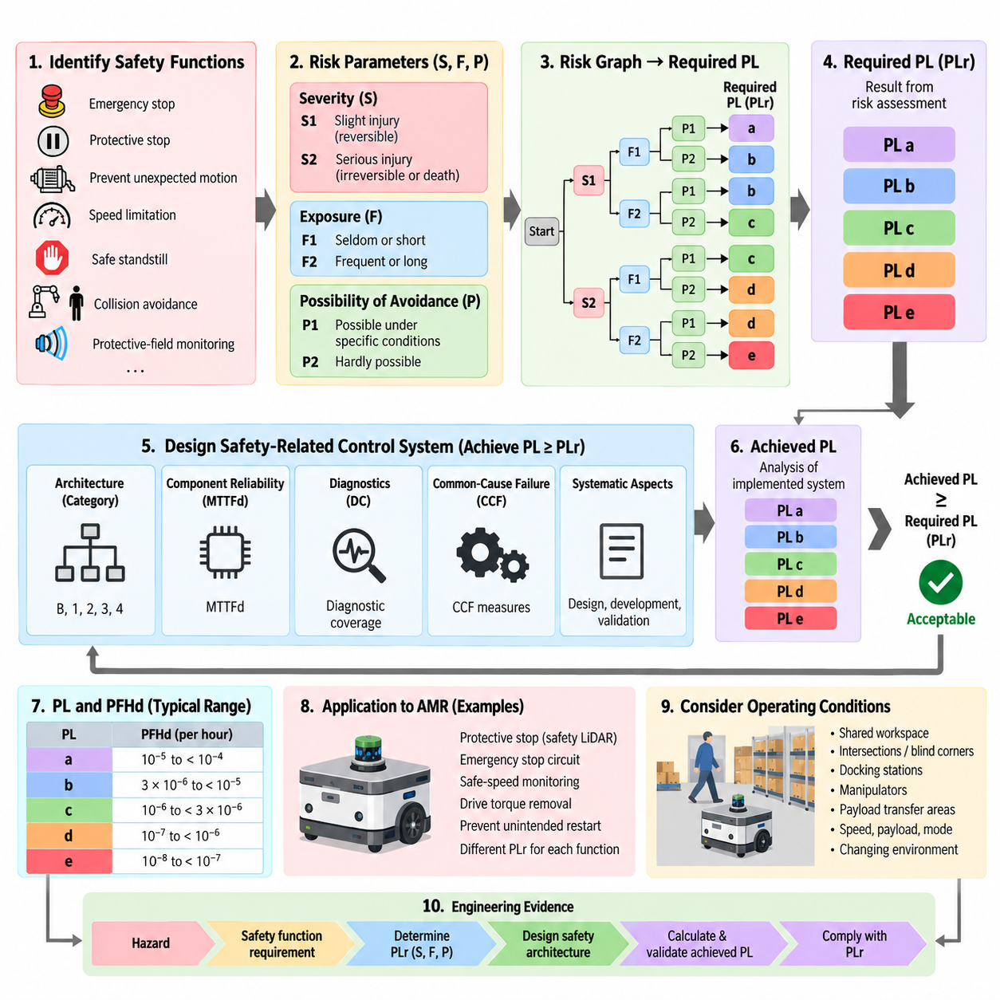
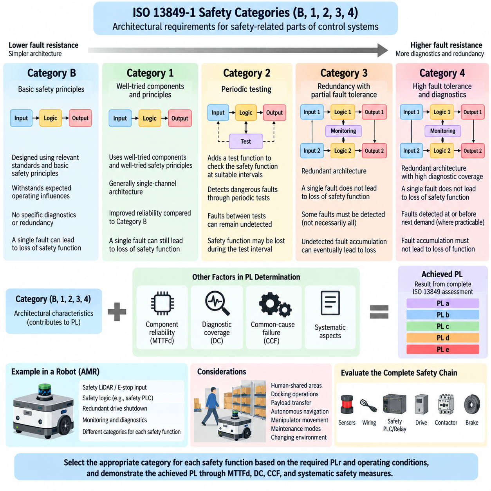
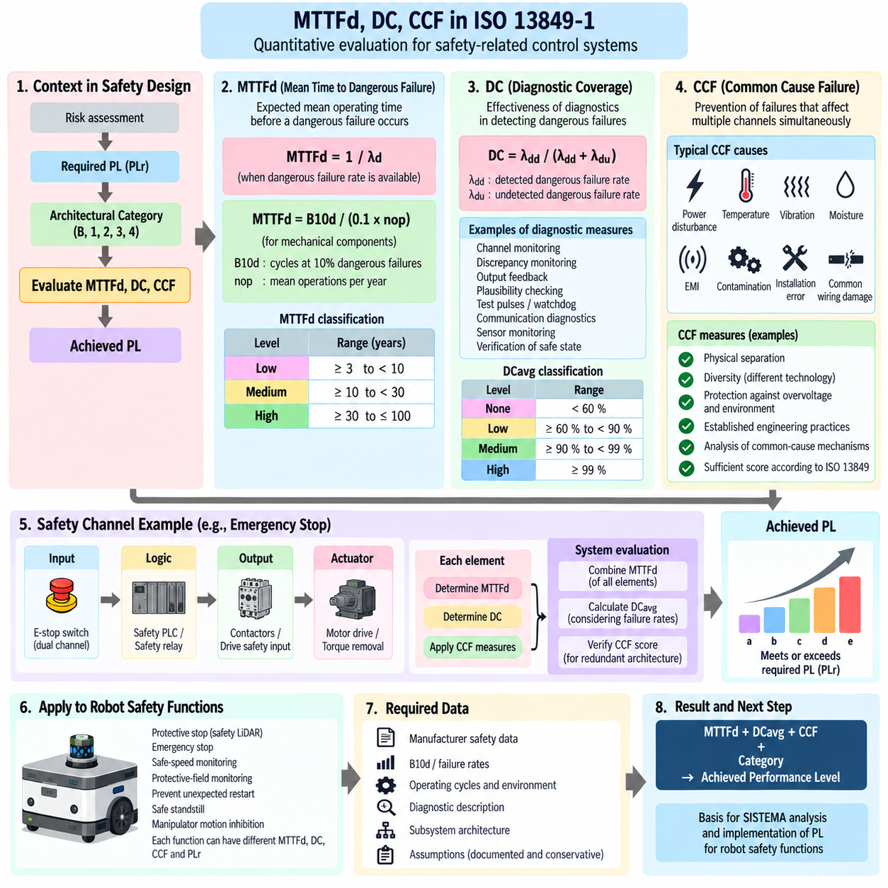
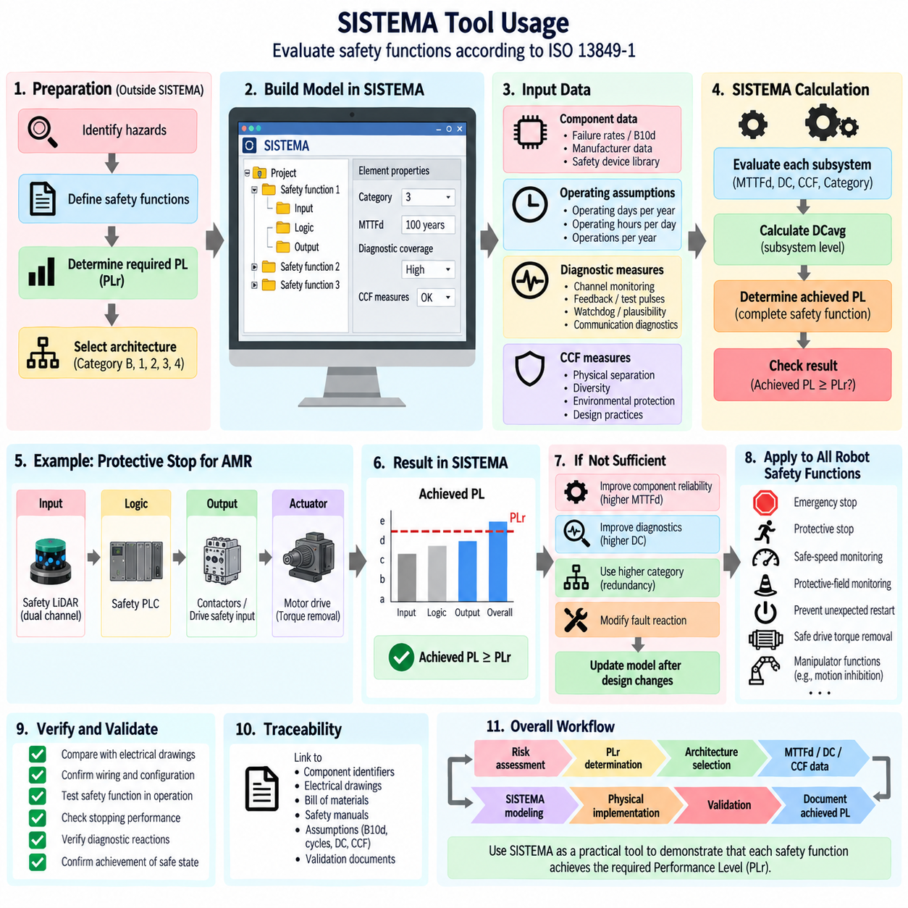
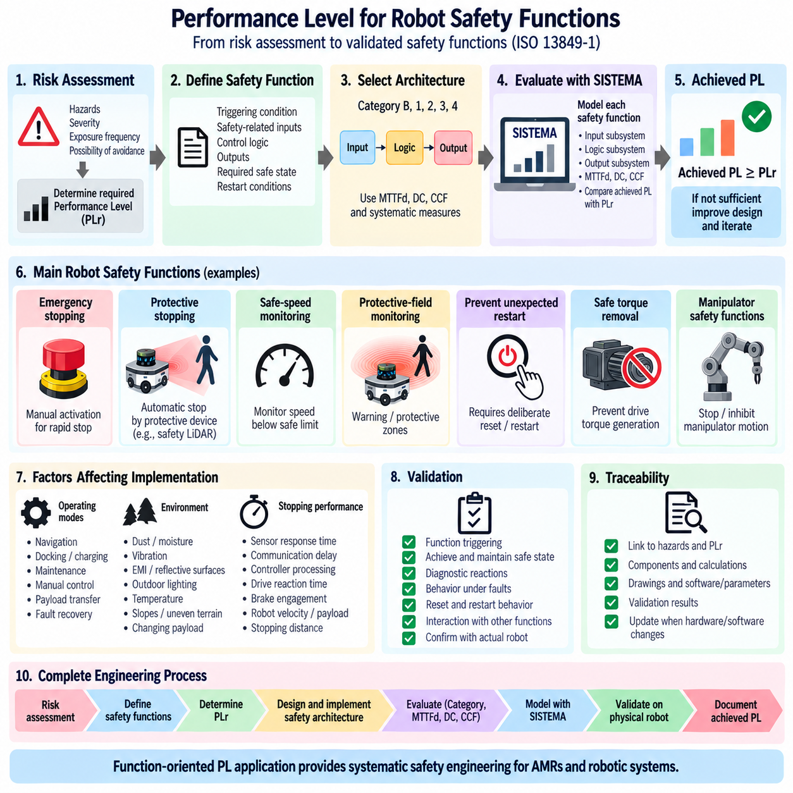

**Volume 12. Safety Architecture**


# Chapter 04. ISO 13849 (PL)

##  

## 04.01. PL a to e Determination

{width="7.268055555555556in" height="7.268055555555556in"}

Performance Level determination in ISO 13849-1 provides a structured method for defining the required reliability of safety-related parts of control systems used in machinery and robotic equipment. The Performance Level is expressed as PL a, b, c, d, or e, with PL a representing the lowest risk-reduction capability and PL e the highest. The determination process connects risk assessment directly to control-system design and verification.

The first step is to identify each safety function independently rather than assigning one Performance Level to the entire machine. Typical robot safety functions include emergency stopping, protective stopping, prevention of unexpected motion, speed limitation, safe standstill, collision avoidance, and protective-field monitoring. Each function is evaluated according to the hazardous event it is intended to prevent and the consequences that could occur if the function fails.

ISO 13849 commonly determines the required Performance Level, designated PLr, by evaluating three risk parameters: severity of injury, frequency or duration of exposure to the hazard, and possibility of avoiding or limiting the harm. Severity is classified as S1 for slight, normally reversible injury or S2 for serious, normally irreversible injury including death. This parameter establishes the fundamental consequence associated with failure of the safety function.

Exposure is represented by F1 or F2. F1 applies when exposure to the hazardous situation is seldom or relatively short, while F2 represents frequent or continuous exposure or comparatively long exposure periods. For mobile robots, exposure must reflect actual operating interaction rather than theoretical machine availability. A robot repeatedly traveling through areas occupied by workers may therefore require a higher exposure classification than an isolated automated machine.

The possibility of avoiding the hazard is represented by P1 and P2. P1 is applicable when avoidance or significant limitation of harm is possible under specific conditions, whereas P2 applies when avoidance is scarcely possible. Robot velocity, acceleration, available escape space, warning signals, operator awareness, visibility, and the speed at which the hazardous situation develops can influence this judgment. Conservative assessment is important where autonomous motion is difficult to predict.

Combining S, F, and P through the ISO 13849 risk graph produces the required Performance Level PLr. Lower-risk combinations can lead to PLr a or b, while increasing severity, exposure, and difficulty of avoidance progressively drives the requirement toward PLr c, d, or e. PLr is therefore a design requirement derived from risk assessment rather than a rating selected after hardware has already been chosen.

After PLr has been established, the safety-related control system must be designed to achieve a Performance Level equal to or greater than that requirement. The achieved PL depends on more than component reliability. ISO 13849 considers the control architecture or Category, mean time to dangerous failure of components, diagnostic coverage, common-cause failure measures, and systematic aspects of the design. These factors collectively determine whether the implemented safety function provides adequate risk reduction.

PL a generally represents relatively limited risk-reduction capability and is suitable only where the risk assessment supports a low required Performance Level. PL b provides increased reliability but still corresponds to comparatively modest safety integrity. These levels should not be interpreted simply as inexpensive implementation classes. Their acceptability depends on whether the complete safety function satisfies the PLr derived from the identified hazard and operating conditions.

PL c represents an intermediate level of safety performance and normally requires greater resistance to dangerous failures than PL a or PL b. Diagnostic measures and architectural characteristics become increasingly important as the required Performance Level rises. A designer must consider not only whether individual devices are reliable but also whether faults can remain undetected, whether a single failure can defeat the function, and how the system behaves until repair occurs.

PL d is widely relevant to machinery and robotic safety functions where serious injury is possible and substantial risk reduction is required. Achieving PL d commonly demands architectures with meaningful fault tolerance or diagnostic capability, together with appropriate component reliability and common-cause failure control. Safety sensors, logic devices, communication paths, motor drives, brakes, and output switching elements must be considered as parts of one complete safety function.

PL e provides the highest Performance Level defined by the PL framework and corresponds to the greatest risk-reduction capability. Functions requiring PL e demand highly robust architectures, high diagnostic effectiveness, strong resistance to dangerous failures, and rigorous treatment of common-cause and systematic faults. Merely duplicating components does not automatically achieve PL e because redundant channels can still fail together or contain undetected design weaknesses.

The quantitative interpretation of Performance Levels is associated with the average probability of a dangerous failure per hour, PFHd. PL a corresponds to a PFHd range from 10\^-5 to less than 10\^-4 per hour, PL b from 3×10\^-6 to less than 10\^-5, PL c from 10\^-6 to less than 3×10\^-6, PL d from 10\^-7 to less than 10\^-6, and PL e from 10\^-8 to less than 10\^-7. Lower PFHd therefore represents greater safety integrity.

The required PL and achieved PL must remain clearly distinguished throughout engineering documentation. PLr originates from risk assessment, while the achieved PL results from analysis of the implemented safety-related control system. A design is acceptable only when the achieved capability satisfies the required level and all applicable architectural, diagnostic, systematic, and validation requirements are fulfilled. Numerical reliability alone cannot substitute for correct safety-function behavior.

For an AMR, the determination should be performed at the safety-function level and coordinated with the broader mobile-robot safety architecture. A protective stop triggered by safety LiDAR, an emergency-stop circuit, safe-speed monitoring, drive torque removal, and prevention of unintended restart may have different PLr values because their hazardous situations differ. This creates a traceable link between hazard analysis, robot operating conditions, safety requirements, and implementation.

A practical AMR assessment must also consider changing environments. Human exposure can increase when the robot moves from restricted industrial corridors into shared workspaces, while avoidance may become more difficult near intersections, blind corners, docking stations, manipulators, or payload-transfer areas. Consequently, the same basic robot platform can require different safety measures depending on its application, operating mode, speed, payload, and human interaction conditions.

The PL determination ultimately establishes a chain of engineering evidence: a hazard creates a safety-function requirement, risk parameters determine PLr, the safety architecture is designed to satisfy that requirement, and calculation plus validation demonstrate the achieved PL. Within the supplied safety architecture, this topic forms the foundation for the following treatment of Categories B through 4, MTTFd, diagnostic coverage, common-cause failures, SISTEMA analysis, and robot safety-function implementation.

ISO 13849-1에서의 성능 수준(Performance Level) 결정은 기계 및 로봇 장비에 사용되는 제어 시스템의 안전 관련 부품(Safety-Related Parts of Control Systems)이 갖추어야 할 신뢰성을 정의하기 위한 체계적인 방법을 제공한다. 성능 수준(Performance Level)은 PL a, b, c, d, e로 표현되며, PL a는 가장 낮은 위험 저감 능력(Risk-Reduction Capability)을, PL e는 가장 높은 능력을 나타낸다. 결정 과정은 위험 평가(Risk Assessment)를 제어 시스템 설계 및 검증(Verification)과 직접 연결한다.

첫 번째 단계는 전체 기계에 하나의 성능 수준(Performance Level)을 부여하는 것이 아니라 각각의 안전 기능(Safety Function)을 독립적으로 식별하는 것이다. 일반적인 로봇 안전 기능에는 비상 정지(Emergency Stopping), 보호 정지(Protective Stopping), 예기치 않은 동작 방지(Prevention of Unexpected Motion), 속도 제한(Speed Limitation), 안전 정지 상태(Safe Standstill), 충돌 회피(Collision Avoidance), 보호 영역 감시(Protective-Field Monitoring) 등이 포함된다. 각 기능은 방지하려는 위험 사건(Hazardous Event)과 기능 실패 시 발생할 수 있는 결과를 기준으로 평가된다.

ISO 13849에서는 일반적으로 요구 성능 수준(Required Performance Level)인 PLr을 결정하기 위해 세 가지 위험 매개변수(Risk Parameter), 즉 부상 심각도(Severity of Injury), 위험에 대한 노출 빈도 또는 지속시간(Frequency or Duration of Exposure), 피해를 회피하거나 제한할 가능성(Possibility of Avoiding or Limiting Harm)을 평가한다. 심각도는 일반적으로 회복 가능한 경미한 부상을 의미하는 S1과 사망을 포함하여 일반적으로 회복 불가능한 중대한 부상을 의미하는 S2로 분류된다.

노출(Exposure)은 F1 또는 F2로 표현된다. F1은 위험 상황에 대한 노출이 드물거나 비교적 짧은 경우에 적용되며, F2는 빈번하거나 지속적인 노출 또는 비교적 긴 노출시간을 나타낸다. 자율이동로봇(AMR)의 경우 노출은 이론적인 기계 가동시간이 아니라 실제 운용 환경에서의 상호작용을 반영해야 한다. 따라서 작업자가 존재하는 구역을 반복적으로 주행하는 로봇은 격리된 자동화 기계보다 높은 노출 등급이 요구될 수 있다.

위험 회피 가능성(Possibility of Avoiding the Hazard)은 P1과 P2로 표현된다. P1은 특정 조건에서 위험을 회피하거나 피해를 상당히 제한할 수 있는 경우에 적용되며, P2는 위험 회피가 거의 불가능한 경우에 적용된다. 로봇의 속도, 가속도, 사용 가능한 대피 공간, 경고 신호, 작업자의 인지 상태, 가시성, 위험 상황이 전개되는 속도 등이 판단에 영향을 줄 수 있다. 자율 동작을 예측하기 어려운 환경에서는 보수적인 평가가 중요하다.

S, F, P를 ISO 13849 위험 그래프(Risk Graph)를 통해 조합하면 요구 성능 수준(Required Performance Level)인 PLr이 결정된다. 상대적으로 낮은 위험 조합은 PLr a 또는 b로 이어질 수 있으며, 심각도, 노출도, 회피의 어려움이 증가함에 따라 요구 수준은 PLr c, d 또는 e 방향으로 높아진다. 따라서 PLr은 하드웨어를 선택한 이후 부여하는 등급이 아니라 위험 평가로부터 도출되는 설계 요구사항(Design Requirement)이다.

PLr이 설정된 후에는 안전 관련 제어 시스템(Safety-Related Control System)이 해당 요구 수준과 같거나 더 높은 성능 수준을 달성하도록 설계되어야 한다. 달성 성능 수준(Achieved PL)은 단순히 부품 신뢰성만으로 결정되지 않는다. ISO 13849에서는 제어 아키텍처(Control Architecture) 또는 카테고리(Category), 위험 고장까지의 평균 시간(Mean Time to Dangerous Failure, MTTFd), 진단 범위(Diagnostic Coverage, DC), 공통 원인 고장(Common-Cause Failure, CCF) 대책 및 체계적 설계 요소(Systematic Aspects)를 함께 고려한다.

PL a는 일반적으로 비교적 제한적인 위험 저감 능력을 나타내며 위험 평가 결과 낮은 요구 성능 수준이 허용되는 경우에만 적합하다. PL b는 향상된 신뢰성을 제공하지만 여전히 비교적 낮은 안전 무결성(Safety Integrity)에 해당한다. 이러한 수준을 단순히 저비용 구현 등급으로 이해해서는 안 된다. 적용 가능 여부는 식별된 위험과 운용 조건으로부터 도출된 PLr을 전체 안전 기능이 충족하는지에 따라 결정되어야 한다.

PL c는 중간 수준의 안전 성능(Safety Performance)을 나타내며 일반적으로 PL a 또는 PL b보다 위험 고장(Dangerous Failure)에 대한 높은 저항성을 요구한다. 요구 성능 수준이 증가할수록 진단 수단(Diagnostic Measures)과 아키텍처 특성(Architectural Characteristics)이 더욱 중요해진다. 설계자는 개별 장치의 신뢰성뿐 아니라 고장이 감지되지 않은 상태로 유지될 가능성, 단일 고장이 안전 기능을 무력화할 가능성, 수리 전까지 시스템이 어떻게 동작하는지를 고려해야 한다.

PL d는 심각한 부상 가능성이 존재하고 상당한 위험 저감이 요구되는 기계 및 로봇 안전 기능에서 폭넓게 관련된다. PL d를 달성하기 위해서는 일반적으로 적절한 부품 신뢰성과 공통 원인 고장(Common-Cause Failure) 제어와 함께 의미 있는 고장 허용 능력(Fault Tolerance) 또는 진단 능력(Diagnostic Capability)을 갖는 아키텍처가 요구된다. 안전 센서(Safety Sensor), 논리 장치(Logic Device), 통신 경로(Communication Path), 모터 드라이브(Motor Drive), 브레이크(Brake), 출력 스위칭 요소(Output Switching Element)를 하나의 완전한 안전 기능으로 고려해야 한다.

PL e는 성능 수준(Performance Level) 체계에서 정의하는 가장 높은 수준이며 가장 큰 위험 저감 능력에 해당한다. PL e가 요구되는 기능에는 매우 견고한 아키텍처(Robust Architecture), 높은 진단 효과(Diagnostic Effectiveness), 위험 고장에 대한 강한 저항성, 공통 원인 고장과 체계적 고장(Systematic Failure)에 대한 엄격한 관리가 요구된다. 단순히 부품을 이중화(Redundancy)한다고 PL e가 자동으로 달성되는 것은 아니다. 이중화된 채널도 동시에 고장 나거나 발견되지 않은 설계 취약점을 포함할 수 있기 때문이다.

성능 수준의 정량적 해석은 시간당 평균 위험 고장 확률(Average Probability of a Dangerous Failure per Hour, PFHd)과 연계된다. PL a는 시간당 10\^-5 이상 10\^-4 미만, PL b는 3×10\^-6 이상 10\^-5 미만, PL c는 10\^-6 이상 3×10\^-6 미만, PL d는 10\^-7 이상 10\^-6 미만, PL e는 10\^-8 이상 10\^-7 미만의 PFHd 범위에 해당한다. 따라서 PFHd가 낮을수록 더 높은 안전 무결성(Safety Integrity)을 의미한다.

요구 성능 수준(Required PL)과 달성 성능 수준(Achieved PL)은 전체 엔지니어링 문서에서 명확하게 구분되어야 한다. PLr은 위험 평가(Risk Assessment)로부터 도출되는 반면, 달성 PL은 구현된 안전 관련 제어 시스템의 분석 결과로 결정된다. 달성된 능력이 요구 수준을 만족하고 관련 아키텍처, 진단, 체계적 안전 및 검증 요구사항이 모두 충족될 때만 설계가 적합한 것으로 판단할 수 있다. 정량적인 신뢰성 수치만으로 올바른 안전 기능 동작을 대체할 수는 없다.

자율이동로봇(AMR)의 경우 성능 수준 결정은 안전 기능 단위로 수행하고 보다 광범위한 이동로봇 안전 아키텍처(Mobile-Robot Safety Architecture)와 연계해야 한다. 안전 라이다(Safety LiDAR)에 의해 작동하는 보호 정지, 비상 정지 회로(Emergency-Stop Circuit), 안전 속도 감시(Safe-Speed Monitoring), 구동 토크 제거(Drive Torque Removal), 의도하지 않은 재시작 방지(Prevention of Unintended Restart)는 각각의 위험 상황이 다르기 때문에 서로 다른 PLr을 가질 수 있다.

실제 자율이동로봇(AMR) 평가에서는 변화하는 운용 환경도 고려해야 한다. 로봇이 제한된 산업용 통로에서 사람과 공유하는 작업공간으로 이동하면 사람의 위험 노출이 증가할 수 있으며, 교차로, 사각지대(Blind Corner), 도킹 스테이션(Docking Station), 매니퓰레이터(Manipulator), 페이로드 전달 구역(Payload-Transfer Area) 주변에서는 위험 회피가 더욱 어려워질 수 있다. 따라서 동일한 로봇 플랫폼이라도 적용 분야, 운용 모드, 속도, 페이로드, 사람과의 상호작용 조건에 따라 서로 다른 안전 대책이 요구될 수 있다.

성능 수준(Performance Level) 결정은 궁극적으로 일련의 엔지니어링 근거(Engineering Evidence)를 확립한다. 위험(Hazard)은 안전 기능 요구사항을 생성하고, 위험 매개변수는 PLr을 결정하며, 안전 아키텍처(Safety Architecture)는 해당 요구사항을 충족하도록 설계되고, 계산과 검증(Validation)을 통해 달성된 PL을 입증한다. 제공된 안전 아키텍처 구조에서 이 내용은 이후의 카테고리 B\~4(Category B through 4), MTTFd, 진단 범위(DC), 공통 원인 고장(CCF), SISTEMA 분석 및 로봇 안전 기능 구현을 이해하기 위한 기반을 형성한다.

##  

## 04.02. Category B/1/2/3/4

{width="7.268055555555556in" height="7.268055555555556in"}

Category B, 1, 2, 3, and 4 in ISO 13849-1 describe architectural requirements for safety-related parts of control systems. They define how a safety function should respond to component faults and how strongly the architecture must resist the loss of that function. Within the supplied safety architecture, this topic follows Performance Level determination and provides the architectural foundation for later evaluation of MTTFd, diagnostic coverage, and common-cause failures.

A Category is not itself equivalent to a Performance Level. Instead, it describes structural characteristics that contribute to the achieved PL together with component reliability, diagnostic coverage, common-cause failure measures, and systematic design considerations. Progressing from Category B toward Category 4 generally introduces stronger fault resistance, monitoring, redundancy, or fault tolerance, but the final PL must still be demonstrated through the complete ISO 13849 assessment.

Category B provides the basic architecture from which the other Categories develop. Safety-related parts of the control system must be designed, constructed, selected, assembled, and combined according to relevant standards and basic safety principles so that they can withstand expected operating influences. The emphasis is on correct engineering practice rather than diagnostics or fault tolerance, and a component failure can result in loss of the safety function.

In a Category B implementation, the safety function may use a straightforward input, logic, and output chain. For example, a safety-related input device may provide a signal to control logic that commands an actuator or removes hazardous motion. The architecture does not inherently require redundancy or continuous fault detection. Consequently, its achievable risk-reduction capability is limited by the reliability of the components and the possibility that a single dangerous failure can defeat the function.

Category 1 builds upon Category B by requiring the use of well-tried components and well-tried safety principles. The architecture can remain essentially single-channel, but reliability is improved through components and engineering practices with established suitability for the intended safety application. The objective is to reduce the probability of dangerous failure rather than to detect every failure after it occurs.

Because Category 1 generally remains dependent on a single functional channel, a dangerous failure can still cause loss of the safety function. Its advantage over Category B therefore comes mainly from improved resistance to failure rather than fault tolerance. Appropriate component selection, conservative electrical and mechanical design, environmental suitability, protective measures, and established safety principles become particularly important when Category 1 is used.

Category 2 introduces periodic testing of the safety function. In addition to the functional safety channel, a test function checks the safety-related system at suitable intervals. The architecture is intended to detect dangerous faults through these checks so that an appropriate response can be initiated. However, faults occurring between tests can remain undetected, and the safety function may be lost during the interval before the next effective test.

The effectiveness of Category 2 therefore depends strongly on the relationship between the testing frequency, demand on the safety function, diagnostic capability, and system response after a fault is detected. Testing must be sufficiently effective to provide meaningful risk reduction. In robotic equipment, startup tests, cyclic diagnostic checks, monitored outputs, or supervisory safety logic may contribute to this concept when implemented according to the applicable architectural requirements.

Category 3 introduces redundancy and partial fault tolerance. Safety-related functions are normally implemented so that a single fault in one part does not lead to loss of the safety function. Some, but not necessarily all, faults must be detected. This represents an important architectural transition because safety no longer depends entirely on one uninterrupted control path, and redundant channels can maintain the required function following certain failures.

A Category 3 system may therefore contain dual-channel inputs, safety logic with redundant processing paths, and redundant output elements controlling hazardous energy. Diagnostic mechanisms compare or monitor relevant behavior to detect faults. Nevertheless, accumulation of undetected faults can eventually lead to loss of the safety function. Category 3 design must therefore carefully evaluate diagnostic coverage, component reliability, fault combinations, and common-cause failure mechanisms.

For an AMR, a Category 3 concept could involve redundant safety-related paths between protective sensing and drive shutdown. A safety LiDAR or emergency-stop input may be processed through suitable safety logic and connected to independent means of removing drive torque. The engineering objective is not simply to duplicate devices but to ensure that a single fault does not eliminate the intended safety action and that sufficient diagnostic capability exists to reveal relevant failures.

Category 4 represents the strongest fault-tolerant architecture among Categories B, 1, 2, 3, and 4. The safety-related system must be designed so that a single fault does not cause loss of the safety function, and the fault should be detected at or before the next demand on the safety function whenever reasonably practicable. When immediate detection is not possible, an accumulation of faults must not result in loss of the safety function.

This requirement makes Category 4 fundamentally dependent on robust redundancy, high diagnostic effectiveness, appropriate fault reaction, and strong control of common-cause failures. Dual-channel architecture alone is insufficient if both channels can fail from the same power disturbance, environmental stress, wiring defect, software design error, or shared component. Independence, diversity where appropriate, diagnostics, separation, and systematic safety measures must therefore be considered together.

The progression from Category B through Category 4 can be understood as an increasing ability to manage faults. Category B relies primarily on basic safety principles, while Category 1 improves reliability through well-tried components and principles. Category 2 adds testing, Category 3 introduces fault tolerance with partial diagnostics, and Category 4 combines fault tolerance with high diagnostic capability and stronger protection against dangerous fault accumulation.

The Category selected for a safety function must be evaluated together with the required Performance Level, rather than selected solely because a higher Category appears safer. ISO 13849 combines architectural Category with the mean time to dangerous failure of each channel, diagnostic coverage, and common-cause failure measures to determine the achievable PL. Different combinations of these parameters can therefore produce different safety performance even when nominally similar architectures are used.

In robot safety engineering, this distinction is particularly important because one machine can contain several safety functions with different architectural requirements. Emergency stopping, protective stopping, safe-speed monitoring, prevention of unexpected restart, manipulator motion inhibition, and drive torque removal should be evaluated individually. Their architectures must correspond to the risk reduction required by their respective PLr and to the consequences of possible faults.

The architectural assessment should cover the complete safety chain rather than only the safety controller. Sensors, switches, safety LiDAR, wiring, communication interfaces, safety PLC or relay logic, motor drives, contactors, brakes, and energy-isolation elements can all contribute to the safety function. A nominally redundant controller cannot compensate for a single downstream element whose dangerous failure defeats both channels or prevents the required safe state.

For AMRs and mobile manipulators, Category selection also interacts with changing operational conditions. Human-shared areas, docking operations, payload transfer, autonomous navigation, manipulator movement, and maintenance modes can create different safety demands. The architecture must therefore be evaluated against actual operating modes and foreseeable faults, while ensuring that diagnostics and fault reactions remain effective throughout the intended machine lifecycle.

Category B, 1, 2, 3, and 4 consequently provide the structural framework for implementing the PLr established during risk assessment. The next engineering step is to quantify how component reliability and diagnostic capability support that architecture through MTTFd, DC, and CCF evaluation. These parameters allow the conceptual fault-resistance properties of each Category to be translated into an achieved Performance Level that can be calculated, documented, and validated.

ISO 13849-1의 카테고리(Category) B, 1, 2, 3, 4는 제어 시스템의 안전 관련 부품(Safety-Related Parts of Control Systems)에 대한 아키텍처 요구사항(Architectural Requirements)을 설명한다. 이들은 구성요소 고장(Component Fault)에 대해 안전 기능(Safety Function)이 어떻게 반응해야 하는지와 해당 아키텍처가 안전 기능 상실에 얼마나 강하게 대응할 수 있어야 하는지를 정의한다. 제공된 안전 아키텍처(Safety Architecture)에서 이 주제는 성능 수준(Performance Level) 결정 이후에 위치하며, 이후의 위험 고장까지의 평균 시간(MTTFd), 진단 범위(Diagnostic Coverage), 공통 원인 고장(Common-Cause Failure) 평가를 위한 아키텍처 기반을 제공한다.

카테고리(Category)는 그 자체로 성능 수준(Performance Level)과 동일한 개념이 아니다. 대신 구성요소 신뢰성(Component Reliability), 진단 범위(Diagnostic Coverage), 공통 원인 고장(Common-Cause Failure) 대책, 체계적 설계 고려사항(Systematic Design Considerations)과 함께 달성 성능 수준(Achieved PL)에 기여하는 구조적 특성을 나타낸다. 일반적으로 카테고리 B에서 카테고리 4로 진행할수록 더욱 강력한 고장 저항성(Fault Resistance), 감시(Monitoring), 이중화(Redundancy), 고장 허용 능력(Fault Tolerance)이 도입되지만, 최종 PL은 전체 ISO 13849 평가를 통해 입증되어야 한다.

카테고리 B(Category B)는 다른 카테고리들이 발전하는 기본 아키텍처(Basic Architecture)를 제공한다. 제어 시스템의 안전 관련 부품은 예상되는 운용 영향을 견딜 수 있도록 관련 표준과 기본 안전 원칙(Basic Safety Principles)에 따라 설계, 제작, 선정, 조립 및 결합되어야 한다. 여기에서는 진단(Diagnostics)이나 고장 허용 능력보다 올바른 엔지니어링 관행(Correct Engineering Practice)이 강조되며, 구성요소 하나의 고장으로도 안전 기능이 상실될 수 있다.

카테고리 B 구현에서는 안전 기능이 비교적 단순한 입력(Input), 논리(Logic), 출력(Output) 체인을 사용할 수 있다. 예를 들어 안전 관련 입력 장치(Safety-Related Input Device)가 제어 논리(Control Logic)에 신호를 제공하고, 제어 논리가 액추에이터(Actuator)에 명령을 전달하거나 위험 동작(Hazardous Motion)을 제거할 수 있다. 이 아키텍처는 본질적으로 이중화 또는 지속적인 고장 검출(Continuous Fault Detection)을 요구하지 않는다. 따라서 달성 가능한 위험 저감 능력(Risk-Reduction Capability)은 구성요소 신뢰성과 단일 위험 고장(Single Dangerous Failure)이 안전 기능을 무력화할 가능성에 의해 제한된다.

카테고리 1(Category 1)은 카테고리 B를 기반으로 하면서 검증된 구성요소(Well-Tried Components)와 검증된 안전 원칙(Well-Tried Safety Principles)의 사용을 요구한다. 아키텍처 자체는 기본적으로 단일 채널(Single-Channel) 구조를 유지할 수 있지만, 해당 안전 애플리케이션에 대한 적합성이 확립된 구성요소와 엔지니어링 방법을 사용함으로써 신뢰성이 향상된다. 목적은 모든 고장이 발생한 이후 이를 검출하는 것이 아니라 위험 고장이 발생할 확률 자체를 감소시키는 것이다.

카테고리 1은 일반적으로 하나의 기능 채널(Functional Channel)에 계속 의존하기 때문에 위험 고장이 발생하면 안전 기능이 상실될 수 있다. 따라서 카테고리 B에 비해 갖는 장점은 고장 허용 능력보다는 향상된 고장 저항성에서 주로 발생한다. 카테고리 1을 적용할 때에는 적절한 구성요소 선정(Component Selection), 보수적인 전기 및 기계 설계, 환경 적합성(Environmental Suitability), 보호 대책(Protective Measures), 검증된 안전 원칙이 특히 중요하다.

카테고리 2(Category 2)는 안전 기능에 대한 주기적인 시험(Periodic Testing)을 도입한다. 기능적인 안전 채널(Functional Safety Channel)에 추가하여 시험 기능(Test Function)이 적절한 주기로 안전 관련 시스템을 점검한다. 이러한 점검을 통해 위험 고장을 검출하고 적절한 대응을 시작할 수 있도록 아키텍처를 구성한다. 그러나 시험과 시험 사이에 발생한 고장은 검출되지 않은 상태로 남을 수 있으며, 다음의 유효한 시험이 수행되기 전까지 안전 기능이 상실될 가능성이 존재한다.

따라서 카테고리 2의 효과는 시험 빈도(Testing Frequency), 안전 기능 요구 빈도(Demand on the Safety Function), 진단 능력(Diagnostic Capability), 고장 검출 이후의 시스템 대응(System Response) 사이의 관계에 크게 좌우된다. 시험은 의미 있는 위험 저감 효과를 제공할 수 있을 만큼 충분히 효과적이어야 한다. 로봇 장비에서는 기동 시험(Startup Test), 주기적 진단 점검(Cyclic Diagnostic Check), 감시되는 출력(Monitored Output), 감독 안전 논리(Supervisory Safety Logic) 등이 관련 아키텍처 요구사항에 맞게 구현될 경우 이러한 개념에 기여할 수 있다.

카테고리 3(Category 3)은 이중화(Redundancy)와 부분적인 고장 허용 능력(Partial Fault Tolerance)을 도입한다. 안전 관련 기능은 일반적으로 한 부분에서 단일 고장(Single Fault)이 발생하더라도 안전 기능이 상실되지 않도록 구현된다. 일부 고장은 검출되어야 하지만 반드시 모든 고장이 검출되어야 하는 것은 아니다. 이는 안전이 더 이상 하나의 중단 없는 제어 경로에 전적으로 의존하지 않고, 특정 고장이 발생한 이후에도 이중화 채널(Redundant Channel)이 필요한 기능을 유지할 수 있다는 점에서 중요한 아키텍처적 전환을 의미한다.

따라서 카테고리 3 시스템은 이중 채널 입력(Dual-Channel Input), 이중화된 처리 경로를 갖는 안전 논리(Safety Logic), 위험 에너지를 제어하는 이중화 출력 요소(Redundant Output Element)를 포함할 수 있다. 진단 메커니즘(Diagnostic Mechanism)은 관련 동작을 비교하거나 감시하여 고장을 검출한다. 그러나 검출되지 않은 고장(Undetected Fault)이 누적되면 결국 안전 기능이 상실될 수 있다. 따라서 카테고리 3 설계에서는 진단 범위, 구성요소 신뢰성, 고장 조합(Fault Combination), 공통 원인 고장 메커니즘을 신중하게 평가해야 한다.

자율이동로봇(AMR)에서 카테고리 3 개념은 보호 감지(Protective Sensing)와 구동 차단(Drive Shutdown) 사이에 이중화된 안전 관련 경로를 구성하는 형태로 적용할 수 있다. 안전 라이다(Safety LiDAR) 또는 비상 정지 입력(Emergency-Stop Input)을 적절한 안전 논리를 통해 처리하고, 독립적인 구동 토크 제거(Drive Torque Removal) 수단에 연결할 수 있다. 엔지니어링의 목적은 단순히 장치를 복제하는 것이 아니라 단일 고장이 의도된 안전 동작을 제거하지 못하도록 하고 관련 고장을 확인할 수 있는 충분한 진단 능력을 확보하는 것이다.

카테고리 4(Category 4)는 카테고리 B, 1, 2, 3, 4 가운데 가장 강력한 고장 허용 아키텍처(Fault-Tolerant Architecture)를 나타낸다. 안전 관련 시스템은 단일 고장이 안전 기능의 상실을 초래하지 않도록 설계되어야 하며, 합리적으로 실행 가능한 경우 해당 고장은 안전 기능에 대한 다음 요구가 발생할 때 또는 그 이전에 검출되어야 한다. 즉각적인 검출이 불가능한 경우에도 고장의 누적(Accumulation of Faults)이 안전 기능의 상실로 이어져서는 안 된다.

이러한 요구사항으로 인해 카테고리 4는 견고한 이중화(Robust Redundancy), 높은 진단 효과(High Diagnostic Effectiveness), 적절한 고장 대응(Fault Reaction), 강력한 공통 원인 고장 제어에 근본적으로 의존한다. 두 개의 채널을 구성하는 것만으로는 두 채널이 동일한 전원 장애, 환경 스트레스, 배선 결함, 소프트웨어 설계 오류 또는 공유 구성요소에 의해 함께 고장날 수 있기 때문에 충분하지 않다. 따라서 독립성(Independence), 필요한 경우 다양성(Diversity), 진단, 분리(Separation), 체계적 안전 대책(Systematic Safety Measures)을 함께 고려해야 한다.

카테고리 B에서 카테고리 4까지의 발전 과정은 고장을 관리하는 능력이 점차 증가하는 과정으로 이해할 수 있다. 카테고리 B는 주로 기본 안전 원칙에 의존하고, 카테고리 1은 검증된 구성요소와 안전 원칙을 통해 신뢰성을 향상시킨다. 카테고리 2는 시험 기능을 추가하며, 카테고리 3은 부분적인 진단과 함께 고장 허용 능력을 도입하고, 카테고리 4는 고장 허용 능력과 높은 진단 능력을 결합하여 위험한 고장 누적에 대해 더욱 강력한 보호를 제공한다.

안전 기능에 적용되는 카테고리는 단순히 더 높은 카테고리가 더 안전해 보인다는 이유만으로 선택해서는 안 되며 요구 성능 수준(Required Performance Level)과 함께 평가해야 한다. ISO 13849에서는 아키텍처 카테고리와 각 채널의 위험 고장까지의 평균 시간(Mean Time to Dangerous Failure, MTTFd), 진단 범위(Diagnostic Coverage, DC), 공통 원인 고장(Common-Cause Failure, CCF) 대책을 결합하여 달성 가능한 PL을 결정한다. 따라서 명목상 유사한 아키텍처를 사용하더라도 이러한 매개변수의 조합에 따라 서로 다른 안전 성능이 나타날 수 있다.

로봇 안전 엔지니어링(Robot Safety Engineering)에서는 하나의 기계에 서로 다른 아키텍처 요구사항을 가진 여러 안전 기능이 포함될 수 있기 때문에 이러한 구분이 특히 중요하다. 비상 정지(Emergency Stopping), 보호 정지(Protective Stopping), 안전 속도 감시(Safe-Speed Monitoring), 예기치 않은 재시작 방지(Prevention of Unexpected Restart), 매니퓰레이터 동작 억제(Manipulator Motion Inhibition), 구동 토크 제거(Drive Torque Removal)는 각각 독립적으로 평가해야 한다. 각 아키텍처는 해당 PLr이 요구하는 위험 저감 수준과 발생 가능한 고장의 결과에 대응해야 한다.

아키텍처 평가는 안전 제어기(Safety Controller)만이 아니라 전체 안전 체인(Complete Safety Chain)을 대상으로 해야 한다. 센서, 스위치, 안전 라이다, 배선, 통신 인터페이스, 안전 PLC(Safety PLC) 또는 안전 릴레이 논리(Safety Relay Logic), 모터 드라이브, 접촉기(Contactor), 브레이크, 에너지 차단 요소(Energy-Isolation Element) 모두가 안전 기능에 기여할 수 있다. 명목상 이중화된 제어기라도 하류의 단일 요소 하나가 위험 고장으로 두 채널을 모두 무력화하거나 요구되는 안전 상태(Safe State)를 방해한다면 이를 보완할 수 없다.

자율이동로봇(AMR)과 이동형 매니퓰레이터(Mobile Manipulator)의 경우 카테고리 선택은 변화하는 운용 조건과도 상호작용한다. 사람과 공유하는 영역(Human-Shared Area), 도킹 작업(Docking Operation), 페이로드 전달(Payload Transfer), 자율 주행(Autonomous Navigation), 매니퓰레이터 동작(Manipulator Movement), 유지보수 모드(Maintenance Mode)는 서로 다른 안전 요구를 발생시킬 수 있다. 따라서 아키텍처는 실제 운용 모드와 합리적으로 예측 가능한 고장(Foreseeable Fault)을 기준으로 평가되어야 하며, 진단 및 고장 대응이 의도된 기계 수명주기(Machine Lifecycle) 전체에서 유효하도록 해야 한다.

결과적으로 카테고리 B, 1, 2, 3, 4는 위험 평가 과정에서 설정된 요구 성능 수준(PLr)을 구현하기 위한 구조적 프레임워크(Structural Framework)를 제공한다. 다음 엔지니어링 단계에서는 위험 고장까지의 평균 시간(MTTFd), 진단 범위(DC), 공통 원인 고장(CCF) 평가를 통해 구성요소 신뢰성과 진단 능력이 해당 아키텍처를 어떻게 뒷받침하는지를 정량화한다. 이러한 매개변수를 통해 각 카테고리가 갖는 개념적인 고장 저항 특성을 계산, 문서화 및 검증할 수 있는 달성 성능 수준(Achieved Performance Level)으로 변환할 수 있다.

##  

## 04.03. MTTFd/DC/CCF Calculation

{width="7.268055555555556in" height="7.268055555555556in"}

Mean Time to Dangerous Failure, or MTTFd, Diagnostic Coverage, or DC, and Common Cause Failure, or CCF, are central parameters used by ISO 13849-1 to evaluate the reliability of safety-related parts of control systems. After the required Performance Level and architectural Category have been established, these parameters quantify how reliably the safety function operates, how effectively dangerous faults are detected, and how well redundant channels are protected against simultaneous failure.

MTTFd represents the expected mean operating time before a dangerous failure occurs in a component or functional channel. It does not predict the actual lifetime of a particular device and should not be interpreted as a maintenance interval. Instead, it is a statistical reliability parameter used to estimate the contribution of hardware components to the probability that a safety-related control function will fail dangerously during operation.

For components with an available dangerous failure rate, MTTFd can fundamentally be expressed as the inverse of the dangerous failure rate, MTTFd = 1/λd. When manufacturers provide suitable reliability or safety data, those values should be used according to the applicable assumptions. For electromechanical components whose reliability depends strongly on operating cycles, parameters such as B10d and the number of operations per year are commonly used to derive an equivalent MTTFd.

B10d represents the number of operating cycles at which 10 percent of a population of components can be expected to fail dangerously. For such components, MTTFd can be estimated using the relationship MTTFd = B10d/(0.1 × nop), where nop represents the mean number of operations per year. Determining nop requires realistic information about operating days, operating hours, and the average time between successive operations of the component.

A safety channel usually contains several components rather than one device. Their dangerous failure contributions must therefore be combined when determining the MTTFd of the channel. Conceptually, the reciprocal values are accumulated, so components with relatively low MTTFd can dominate the result. This makes the reliability of switches, relays, contactors, sensors, output devices, and other elements throughout the safety chain important rather than focusing only on the safety controller.

ISO 13849 groups MTTFd into qualitative ranges for Performance Level evaluation. Low MTTFd corresponds to 3 years or more but less than 10 years, medium corresponds to 10 years or more but less than 30 years, and high corresponds to 30 years or more but not greater than 100 years for the purpose of the simplified evaluation. These classifications are used together with Category and DCavg when estimating the achievable Performance Level.

Diagnostic Coverage describes the effectiveness of diagnostics in detecting dangerous failures. In conceptual form, DC is the ratio between the detected dangerous failure rate and the total dangerous failure rate. A high diagnostic capability means that a greater proportion of potentially dangerous faults can be identified before they combine with other conditions or remain latent long enough to compromise the required safety function.

Diagnostic Coverage is not simply the number of diagnostic mechanisms included in a design. Each diagnostic mechanism must be related to the dangerous failure modes that it can actually detect. Examples can include cross-monitoring between redundant channels, discrepancy monitoring, output feedback, plausibility checking, test pulses, watchdogs, communication diagnostics, sensor monitoring, and verification that an actuator reached the commanded safe state.

When a safety-related system contains several components with different diagnostic coverage values, an average diagnostic coverage, DCavg, is determined using their dangerous failure contributions. Consequently, a component with a significant dangerous failure rate and poor diagnostics can reduce the overall diagnostic effectiveness of the subsystem. Diagnostic design should therefore consider the entire input, logic, and output path rather than assigning a diagnostic value only to the central safety PLC.

For simplified ISO 13849 evaluation, DCavg is commonly classified as none when it is below 60 percent, low from 60 percent to below 90 percent, medium from 90 percent to below 99 percent, and high at 99 percent or greater. These classifications interact directly with the selected Category. Category 3, for example, relies on redundancy with fault detection, while Category 4 requires stronger diagnostic behavior and resistance to dangerous fault accumulation.

Common Cause Failure addresses a different problem. Redundant channels can protect a safety function against individual random faults, but redundancy provides little benefit when the same cause disables both channels. CCF therefore evaluates whether sufficient measures have been implemented to prevent or control failures that simultaneously affect multiple safety-related channels and defeat the intended architectural independence.

Typical CCF mechanisms include shared power disturbances, excessive temperature, vibration, moisture, electromagnetic interference, contamination, common wiring damage, installation errors, and other environmental or design dependencies. Two redundant electrical channels routed through the same vulnerable connector, powered from an inadequately protected common source, or exposed to the same damaging condition may therefore possess less independence than their schematic representation suggests.

ISO 13849 uses a structured scoring approach for CCF measures in relevant redundant architectures. Measures address areas such as physical separation, diversity, protection against overvoltage and environmental influences, use of established engineering practices, and analysis of common-cause mechanisms. A sufficient score must be achieved where the CCF evaluation is applicable. The assessment therefore provides engineering evidence that redundancy has meaningful independence rather than merely duplicated components.

MTTFd, DCavg, and CCF should not be treated as three independent calculations performed only for documentation. They interact with the architectural Category to determine whether the safety-related control system can achieve the required PL. MTTFd represents resistance to dangerous random hardware failure, DCavg represents the ability to reveal dangerous faults, and CCF measures protect redundant channels from being defeated simultaneously by a shared cause.

For an AMR safety function, the calculation boundary should cover the complete path responsible for producing the safe reaction. A protective-stop function may include a safety LiDAR, safety communication or wiring, safety logic, drive safety inputs, power switching devices, and torque-removal mechanisms. Reliability and diagnostics should be assigned to the elements actually participating in that function so that the resulting Performance Level represents the complete safety chain.

Consider an emergency-stop function implemented with dual-channel contacts, safety logic, and redundant drive shutdown paths. The electromechanical devices contribute MTTFd according to their dangerous failure characteristics and operating frequency. Channel discrepancy and feedback monitoring contribute to diagnostic coverage, while separation of wiring, suitable power design, environmental protection, and other independence measures contribute to the CCF assessment.

The same calculation philosophy applies to safe-speed monitoring, protective-field monitoring, prevention of unexpected restart, safe standstill, and manipulator motion inhibition. However, each function can have a different component boundary, operating frequency, diagnostic mechanism, and required PLr. Reusing one calculated MTTFd or DCavg value for every robot safety function without checking the actual architecture can therefore produce an incorrect assessment.

Reliable calculation depends heavily on traceable engineering data. Manufacturer safety manuals, component reliability data, B10d values, operating-cycle assumptions, diagnostic descriptions, subsystem architecture, environmental conditions, and fault-reaction behavior should be documented consistently. Where assumptions are required, they should be explicit and conservative enough to support subsequent verification, validation, maintenance, and modification of the robot.

The completed MTTFd, DCavg, and CCF assessment provides the quantitative bridge between the Category architecture and the achieved Performance Level. Together with systematic safety requirements, it allows the designer to demonstrate whether the implemented safety function satisfies its required PLr. Within the supplied structure, these calculations also provide the direct engineering basis for the following SISTEMA analysis and subsequent application of Performance Levels to individual robot safety functions.

위험 고장까지의 평균 시간(Mean Time to Dangerous Failure, MTTFd), 진단 범위(Diagnostic Coverage, DC), 공통 원인 고장(Common Cause Failure, CCF)은 ISO 13849-1에서 제어 시스템의 안전 관련 부품(Safety-Related Parts of Control Systems)의 신뢰성을 평가하는 핵심 매개변수이다. 요구 성능 수준(Required Performance Level)과 아키텍처 카테고리(Architectural Category)가 설정된 이후, 이 매개변수들은 안전 기능이 얼마나 신뢰성 있게 동작하고, 위험 고장을 얼마나 효과적으로 검출하며, 이중화 채널이 동시 고장으로부터 얼마나 잘 보호되는지를 정량화한다.

위험 고장까지의 평균 시간(MTTFd)은 구성요소 또는 기능 채널(Functional Channel)에서 위험 고장이 발생하기 전까지 예상되는 평균 동작 시간을 나타낸다. 이는 특정 장치의 실제 수명을 예측하는 값이 아니며 유지보수 주기(Maintenance Interval)로 해석해서도 안 된다. 대신 안전 관련 제어 기능이 운용 중 위험하게 실패할 확률에 하드웨어 구성요소가 얼마나 기여하는지를 추정하기 위한 통계적 신뢰성 매개변수(Statistical Reliability Parameter)이다.

위험 고장률(Dangerous Failure Rate)이 제공되는 구성요소의 경우 MTTFd는 기본적으로 위험 고장률의 역수인 MTTFd = 1/λd로 표현할 수 있다. 제조업체가 적절한 신뢰성 또는 안전 데이터를 제공한다면 관련 가정에 따라 해당 값을 사용해야 한다. 신뢰성이 동작 횟수에 크게 의존하는 전기기계 구성요소(Electromechanical Component)의 경우 B10d와 연간 동작 횟수(Number of Operations per Year) 등의 매개변수를 사용하여 등가 MTTFd를 산출하는 것이 일반적이다.

B10d는 구성요소 모집단의 10%가 위험하게 고장날 것으로 예상되는 동작 횟수를 나타낸다. 이러한 구성요소의 경우 MTTFd = B10d/(0.1 × nop)의 관계를 사용하여 MTTFd를 추정할 수 있으며, 여기서 nop는 연평균 동작 횟수(Mean Number of Operations per Year)를 의미한다. nop를 결정하기 위해서는 연간 운용 일수, 일일 운용 시간, 구성요소의 연속 동작 사이의 평균 시간에 관한 현실적인 정보가 필요하다.

안전 채널(Safety Channel)은 일반적으로 하나의 장치가 아니라 여러 구성요소를 포함한다. 따라서 채널의 MTTFd를 결정할 때 각 구성요소의 위험 고장 기여도를 결합해야 한다. 개념적으로는 각 MTTFd의 역수를 누적하므로 상대적으로 낮은 MTTFd를 갖는 구성요소가 전체 결과를 지배할 수 있다. 따라서 안전 제어기만이 아니라 전체 안전 체인(Safety Chain)에 포함된 스위치, 릴레이, 접촉기(Contactor), 센서, 출력 장치 및 기타 요소의 신뢰성이 중요하다.

ISO 13849에서는 성능 수준(Performance Level) 평가를 위해 MTTFd를 정성적인 범위로 구분한다. 낮음(Low)은 3년 이상 10년 미만, 중간(Medium)은 10년 이상 30년 미만, 높음(High)은 30년 이상이며 단순화된 평가 목적에서는 100년을 초과하지 않는 범위에 해당한다. 이러한 분류는 달성 가능한 성능 수준을 추정할 때 카테고리(Category) 및 평균 진단 범위(DCavg)와 함께 사용된다.

진단 범위(Diagnostic Coverage, DC)는 위험 고장을 검출하는 진단 기능의 효과를 나타낸다. 개념적으로 DC는 검출된 위험 고장률(Detected Dangerous Failure Rate)과 전체 위험 고장률(Total Dangerous Failure Rate)의 비율이다. 높은 진단 능력은 잠재적으로 위험한 고장의 더 많은 부분을 다른 조건과 결합되기 전이나 요구되는 안전 기능을 손상시킬 정도로 오랫동안 잠재 상태로 유지되기 전에 식별할 수 있음을 의미한다.

진단 범위는 단순히 설계에 포함된 진단 메커니즘(Diagnostic Mechanism)의 개수를 의미하지 않는다. 각각의 진단 메커니즘은 실제로 검출할 수 있는 위험 고장 모드(Dangerous Failure Mode)와 연계되어야 한다. 이중화 채널 간 교차 감시(Cross-Monitoring), 불일치 감시(Discrepancy Monitoring), 출력 피드백(Output Feedback), 타당성 검사(Plausibility Checking), 테스트 펄스(Test Pulse), 워치독(Watchdog), 통신 진단(Communication Diagnostics), 액추에이터가 명령된 안전 상태에 도달했는지 확인하는 기능 등이 포함될 수 있다.

안전 관련 시스템에 서로 다른 진단 범위 값을 갖는 여러 구성요소가 포함되는 경우 각각의 위험 고장 기여도를 이용하여 평균 진단 범위(Average Diagnostic Coverage, DCavg)를 결정한다. 따라서 위험 고장률이 높으면서 진단 성능이 낮은 구성요소는 전체 서브시스템(Subsystem)의 진단 효과를 감소시킬 수 있다. 그러므로 진단 설계는 중앙 안전 PLC(Safety PLC)에만 진단 값을 부여하는 것이 아니라 전체 입력, 논리, 출력 경로를 고려해야 한다.

단순화된 ISO 13849 평가에서 DCavg는 일반적으로 60% 미만이면 없음(None), 60% 이상 90% 미만이면 낮음(Low), 90% 이상 99% 미만이면 중간(Medium), 99% 이상이면 높음(High)으로 분류된다. 이러한 분류는 선택된 카테고리와 직접적으로 상호작용한다. 예를 들어 카테고리 3(Category 3)은 고장 검출 기능을 갖는 이중화에 의존하며, 카테고리 4(Category 4)는 더욱 강력한 진단 동작과 위험한 고장 누적에 대한 저항성을 요구한다.

공통 원인 고장(Common Cause Failure, CCF)은 이와 다른 문제를 다룬다. 이중화 채널(Redundant Channel)은 개별적인 랜덤 고장(Random Fault)으로부터 안전 기능을 보호할 수 있지만 동일한 원인이 두 채널을 동시에 무력화한다면 이중화의 효과는 크게 감소한다. 따라서 CCF는 여러 안전 관련 채널에 동시에 영향을 주어 의도된 아키텍처 독립성(Architectural Independence)을 무력화하는 고장을 예방하거나 제어하기 위한 충분한 대책이 구현되었는지를 평가한다.

대표적인 CCF 메커니즘에는 공통 전원 장애(Shared Power Disturbance), 과도한 온도, 진동, 습기, 전자기 간섭(Electromagnetic Interference), 오염, 공통 배선 손상, 설치 오류 및 기타 환경적 또는 설계적 종속성이 포함된다. 두 개의 이중화 전기 채널이 동일한 취약한 커넥터를 통과하거나 적절히 보호되지 않은 공통 전원에서 공급되거나 동일한 손상 조건에 노출된다면 회로도상으로 보이는 것보다 실제 독립성이 낮을 수 있다.

ISO 13849에서는 관련 이중화 아키텍처(Redundant Architecture)에 대한 CCF 대책을 평가하기 위해 구조화된 점수 방식(Structured Scoring Approach)을 사용한다. 대책에는 물리적 분리(Physical Separation), 다양성(Diversity), 과전압 및 환경 영향에 대한 보호, 확립된 엔지니어링 관행의 적용, 공통 원인 메커니즘 분석 등이 포함된다. CCF 평가가 적용되는 경우 충분한 점수를 확보해야 하며, 이를 통해 이중화가 단순한 구성요소 복제가 아니라 실질적인 독립성을 갖는다는 엔지니어링 근거(Engineering Evidence)를 제공한다.

MTTFd, DCavg, CCF는 단순히 문서화를 위해 서로 독립적으로 수행되는 세 가지 계산으로 취급해서는 안 된다. 이들은 아키텍처 카테고리와 상호작용하여 안전 관련 제어 시스템이 요구되는 PL을 달성할 수 있는지를 결정한다. MTTFd는 위험한 랜덤 하드웨어 고장(Dangerous Random Hardware Failure)에 대한 저항성을, DCavg는 위험 고장을 발견하는 능력을, CCF 대책은 공유된 원인으로 인해 이중화 채널이 동시에 무력화되는 것을 방지하는 능력을 나타낸다.

자율이동로봇(AMR)의 안전 기능에서는 계산 경계(Calculation Boundary)가 안전 반응을 생성하는 전체 경로를 포함해야 한다. 보호 정지 기능(Protective-Stop Function)은 안전 라이다(Safety LiDAR), 안전 통신 또는 배선, 안전 논리(Safety Logic), 드라이브 안전 입력(Drive Safety Input), 전력 스위칭 장치(Power Switching Device), 토크 제거 메커니즘(Torque-Removal Mechanism)을 포함할 수 있다. 최종 성능 수준이 전체 안전 체인을 대표하도록 실제 기능에 참여하는 요소에 신뢰성과 진단 특성을 할당해야 한다.

이중 채널 접점(Dual-Channel Contact), 안전 논리, 이중화 구동 차단 경로(Redundant Drive Shutdown Path)로 구현된 비상 정지 기능(Emergency-Stop Function)을 생각할 수 있다. 전기기계 장치는 위험 고장 특성과 동작 빈도에 따라 MTTFd에 기여한다. 채널 불일치 감시(Channel Discrepancy Monitoring)와 피드백 감시는 진단 범위에 기여하며, 배선 분리, 적절한 전원 설계, 환경 보호 및 기타 독립성 대책은 CCF 평가에 기여한다.

동일한 계산 방법은 안전 속도 감시(Safe-Speed Monitoring), 보호 영역 감시(Protective-Field Monitoring), 예기치 않은 재시작 방지(Prevention of Unexpected Restart), 안전 정지 상태(Safe Standstill), 매니퓰레이터 동작 억제(Manipulator Motion Inhibition)에도 적용된다. 그러나 각각의 기능은 서로 다른 구성요소 경계, 동작 빈도, 진단 메커니즘, 요구 성능 수준(PLr)을 가질 수 있다. 따라서 실제 아키텍처를 확인하지 않고 하나의 계산된 MTTFd 또는 DCavg 값을 모든 로봇 안전 기능에 재사용하면 잘못된 평가가 발생할 수 있다.

신뢰할 수 있는 계산은 추적 가능한 엔지니어링 데이터(Traceable Engineering Data)에 크게 의존한다. 제조업체 안전 매뉴얼(Manufacturer Safety Manual), 구성요소 신뢰성 데이터, B10d 값, 동작 주기 가정(Operating-Cycle Assumption), 진단 설명, 서브시스템 아키텍처, 환경 조건, 고장 대응 동작(Fault-Reaction Behavior)을 일관되게 문서화해야 한다. 가정이 필요한 경우에는 이후의 검증, 유효성 확인(Validation), 유지보수 및 로봇 변경을 지원할 수 있도록 이를 명확하게 기록하고 충분히 보수적으로 설정해야 한다.

완료된 MTTFd, DCavg, CCF 평가는 카테고리 아키텍처(Category Architecture)와 달성 성능 수준(Achieved Performance Level) 사이를 연결하는 정량적 연결고리를 제공한다. 체계적 안전 요구사항(Systematic Safety Requirements)과 함께 이를 사용하면 구현된 안전 기능이 요구 성능 수준(PLr)을 만족하는지를 입증할 수 있다. 제공된 구조에서 이러한 계산은 이후의 SISTEMA 분석과 개별 로봇 안전 기능에 대한 성능 수준 적용을 위한 직접적인 엔지니어링 기반을 제공한다.

##  

## 04.04. SISTEMA Tool Usage

{width="7.268055555555556in" height="7.268055555555556in"}

SISTEMA is a software tool developed by the German Social Accident Insurance Institute for Occupational Safety and Health, IFA, to support evaluation of safety-related parts of control systems according to ISO 13849-1. It assists engineers in modeling safety functions, organizing subsystems, entering reliability parameters, and determining whether an implemented architecture can achieve the required Performance Level, PLr. It therefore converts safety design assumptions into a structured and traceable calculation model.

SISTEMA does not perform the initial machine risk assessment or automatically determine which safety functions are required. Before creating the model, engineers should identify hazards, define individual safety functions, determine the required Performance Level, and establish the intended control architecture. SISTEMA is then used to evaluate whether the safety-related parts implementing each function provide sufficient reliability and diagnostic performance to satisfy the defined PLr.

A SISTEMA project normally represents the safety-related control system as a hierarchy. At the upper level, the project contains one or more safety functions. Each safety function is decomposed into subsystems representing functional sections such as input, logic, and output. These subsystems are then described through channels, blocks, and individual elements as appropriate. This hierarchical structure makes the calculation correspond closely to the physical safety chain implemented in the machine or robot.

For an AMR protective-stop function, the model may begin with a safety LiDAR as the input subsystem, a safety PLC or certified safety controller as the logic subsystem, and drive safety inputs or torque-removal devices as the output subsystem. The complete chain must correspond to the actual implementation. Omitting a relevant contactor, relay, communication interface, or shutdown element can produce a calculated result that does not accurately represent the real safety function.

The required Performance Level, PLr, is assigned to the safety function based on the preceding risk assessment. Each subsystem is then configured according to its applicable Category, such as B, 1, 2, 3, or 4. SISTEMA uses this architectural information together with MTTFd, diagnostic coverage, and common-cause failure information to evaluate the contribution of each subsystem and calculate the achieved Performance Level of the complete safety function.

Component reliability data should preferably come from appropriate manufacturer documentation, safety manuals, validated libraries, or applicable reliability information. For electronic components, dangerous failure rates or manufacturer-provided safety parameters may be available. For electromechanical components such as switches, relays, and contactors, B10d data and operating frequency may be needed. SISTEMA can use these inputs to support calculation of MTTFd for the relevant channels and subsystems.

Operating assumptions must reflect the actual robot application. When B10d-based components are modeled, the expected number of operations depends on operating days per year, operating hours per day, and the average interval between operations. An emergency-stop contactor that is rarely activated and a brake or switching device operated repeatedly during normal robot missions can therefore produce very different reliability results even when their basic component data appear similar.

Diagnostic Coverage, DC, must also be entered according to the diagnostic mechanisms actually implemented. Cross-monitoring, discrepancy detection, feedback contacts, output monitoring, test pulses, watchdogs, plausibility checks, and actuator-state verification can contribute to dangerous-fault detection. The selected DC values should be supported by the architecture and diagnostic behavior rather than chosen merely to obtain a desired Performance Level in the calculation.

SISTEMA evaluates average diagnostic coverage, DCavg, at the subsystem level using the relevant component and failure information. This is particularly important for Category 2, 3, and 4 architectures, where fault detection contributes directly to achievable safety performance. A subsystem containing highly reliable logic but poorly monitored output elements may therefore be limited by the diagnostic characteristics of those output elements rather than by the safety controller itself.

Common Cause Failure, CCF, must be considered when redundant channels are used. SISTEMA provides a structured method for documenting applicable CCF measures and checking whether the required assessment criteria are satisfied. Physical separation, environmental protection, appropriate design practices, protection against electrical disturbances, diversity where applicable, and analysis of common influences help demonstrate that redundant channels are not vulnerable to the same failure mechanism.

Manufacturer component libraries can significantly reduce data-entry effort. Safety-device suppliers may provide SISTEMA-compatible libraries containing reliability parameters for safety relays, safety PLC modules, sensors, contactors, drives, and other products. However, importing a library entry does not prove that the application is correct. The engineer must still confirm that the selected device variant, operating conditions, architecture, diagnostic assumptions, and safety function correspond to the real system.

Subsystem boundaries should be selected carefully because they affect both calculation clarity and engineering traceability. A practical decomposition follows the functional path from hazard detection to achievement of the safe state. For example, an emergency-stop function can be divided into an E-stop input subsystem, safety logic subsystem, and drive shutdown subsystem. Each subsystem can then be traced directly to electrical schematics, device specifications, safety manuals, and validation tests.

SISTEMA continuously evaluates the modeled parameters and provides indications of the achieved PL and related subsystem characteristics. Engineers can therefore identify which part of a safety chain limits the overall result. If the achieved PL is below PLr, the model can reveal whether improvement is needed in component reliability, diagnostic coverage, architecture, or another safety-related parameter. The tool is consequently useful for design iteration as well as final assessment.

Design improvement should follow physical engineering changes rather than numerical manipulation of the model. If an output subsystem limits the achievable PL, possible engineering responses may include selecting components with better dangerous-failure characteristics, improving diagnostics, introducing an appropriate redundant architecture, or modifying the fault reaction. After the physical design changes, the SISTEMA model should be updated so that the calculation remains consistent with the implemented system.

For AMRs, separate SISTEMA safety functions should generally be created for functions such as emergency stopping, protective stopping, safe-speed monitoring, protective-field monitoring, prevention of unexpected restart, and safe drive torque removal. A mobile manipulator may additionally require functions related to manipulator stopping, motion inhibition, or safe interaction. Each function can have a different PLr, architecture, component set, diagnostic strategy, and achieved PL.

Traceability is one of the most important benefits of disciplined SISTEMA usage. Component identifiers in the model should correspond to electrical drawings, bills of materials, safety manuals, and validation documents. Assumptions regarding B10d, operating cycles, MTTFd, DC, CCF, and subsystem architecture should also be recorded. This allows later reviewers to understand why particular values were used and whether modifications to the robot require recalculation.

The calculated result from SISTEMA should not be treated as certification by itself. The software supports quantitative and architectural evaluation, but the actual safety function must still be implemented correctly and validated under representative operating and fault conditions. Wiring, software configuration, parameter settings, communication behavior, stopping performance, diagnostic reactions, reset behavior, and achievement of the defined safe state must correspond to the assumptions represented in the model.

A disciplined workflow therefore connects risk assessment, PLr determination, Category selection, MTTFd, DC and CCF data, SISTEMA modeling, physical implementation, and validation into one continuous engineering process. Within the supplied safety architecture, SISTEMA serves as the practical calculation bridge between the preceding reliability analysis and the following application of Performance Levels to robot safety functions, enabling the achieved PL to be documented in a repeatable and auditable form.

SISTEMA는 독일 사회재해보험 산업안전보건연구소(Institute for Occupational Safety and Health of the German Social Accident Insurance, IFA)가 ISO 13849-1에 따른 제어 시스템의 안전 관련 부품(Safety-Related Parts of Control Systems) 평가를 지원하기 위해 개발한 소프트웨어 도구(Software Tool)이다. 이 도구는 안전 기능(Safety Function)의 모델링, 서브시스템(Subsystem) 구성, 신뢰성 매개변수 입력, 구현된 아키텍처가 요구 성능 수준(Required Performance Level, PLr)을 달성할 수 있는지 판단하는 작업을 지원한다. 따라서 안전 설계의 가정을 구조적이고 추적 가능한 계산 모델(Calculation Model)로 변환한다.

SISTEMA는 초기 기계 위험 평가(Machine Risk Assessment)를 수행하거나 어떤 안전 기능이 필요한지를 자동으로 결정하지 않는다. 모델을 생성하기 전에 엔지니어는 위험(Hazard)을 식별하고, 개별 안전 기능을 정의하며, 요구 성능 수준(PLr)을 결정하고, 의도된 제어 아키텍처(Control Architecture)를 설정해야 한다. 이후 SISTEMA를 사용하여 각 기능을 구현하는 안전 관련 부품이 정의된 PLr을 만족하기에 충분한 신뢰성과 진단 성능(Diagnostic Performance)을 제공하는지 평가한다.

SISTEMA 프로젝트(Project)는 일반적으로 안전 관련 제어 시스템을 계층 구조(Hierarchy)로 표현한다. 상위 수준에서 프로젝트는 하나 이상의 안전 기능을 포함한다. 각각의 안전 기능은 입력(Input), 논리(Logic), 출력(Output)과 같은 기능 영역을 나타내는 서브시스템으로 분해된다. 이러한 서브시스템은 필요에 따라 채널(Channel), 블록(Block), 개별 요소(Element)를 통해 상세하게 표현된다. 이러한 계층 구조는 계산 모델이 기계 또는 로봇에 실제 구현된 물리적 안전 체인(Physical Safety Chain)과 밀접하게 대응하도록 한다.

자율이동로봇(AMR)의 보호 정지 기능(Protective-Stop Function)을 예로 들면, 모델은 입력 서브시스템으로 안전 라이다(Safety LiDAR), 논리 서브시스템으로 안전 PLC(Safety PLC) 또는 인증된 안전 제어기(Certified Safety Controller), 출력 서브시스템으로 드라이브 안전 입력(Drive Safety Input) 또는 토크 제거 장치(Torque-Removal Device)를 포함할 수 있다. 전체 체인은 실제 구현과 일치해야 한다. 관련 접촉기(Contactor), 릴레이, 통신 인터페이스 또는 차단 요소를 누락하면 실제 안전 기능을 정확하게 나타내지 못하는 계산 결과가 발생할 수 있다.

요구 성능 수준(PLr)은 앞서 수행된 위험 평가(Risk Assessment)를 기반으로 안전 기능에 할당된다. 이후 각 서브시스템은 B, 1, 2, 3, 4와 같은 해당 카테고리(Category)에 따라 구성된다. SISTEMA는 이러한 아키텍처 정보와 위험 고장까지의 평균 시간(Mean Time to Dangerous Failure, MTTFd), 진단 범위(Diagnostic Coverage, DC), 공통 원인 고장(Common Cause Failure, CCF) 정보를 함께 사용하여 각 서브시스템의 기여도를 평가하고 전체 안전 기능의 달성 성능 수준(Achieved Performance Level)을 계산한다.

구성요소 신뢰성 데이터(Component Reliability Data)는 가능한 경우 적절한 제조업체 문서, 안전 매뉴얼(Safety Manual), 검증된 라이브러리(Validated Library) 또는 적용 가능한 신뢰성 정보에서 가져와야 한다. 전자 구성요소의 경우 위험 고장률(Dangerous Failure Rate) 또는 제조업체가 제공하는 안전 매개변수를 사용할 수 있다. 스위치, 릴레이, 접촉기와 같은 전기기계 구성요소(Electromechanical Component)의 경우 B10d 데이터와 동작 빈도(Operating Frequency)가 필요할 수 있다. SISTEMA는 이러한 입력값을 이용하여 관련 채널과 서브시스템의 MTTFd 계산을 지원한다.

운용 가정(Operating Assumption)은 실제 로봇 애플리케이션을 반영해야 한다. B10d 기반 구성요소를 모델링하는 경우 예상 동작 횟수는 연간 운용 일수, 일일 운용 시간, 동작 사이의 평균 간격에 따라 달라진다. 따라서 거의 작동하지 않는 비상 정지 접촉기와 정상적인 로봇 임무 수행 과정에서 반복적으로 동작하는 브레이크 또는 스위칭 장치는 기본적인 구성요소 데이터가 유사해 보이더라도 매우 다른 신뢰성 결과를 나타낼 수 있다.

진단 범위(DC) 역시 실제로 구현된 진단 메커니즘(Diagnostic Mechanism)에 따라 입력해야 한다. 교차 감시(Cross-Monitoring), 불일치 검출(Discrepancy Detection), 피드백 접점(Feedback Contact), 출력 감시(Output Monitoring), 테스트 펄스(Test Pulse), 워치독(Watchdog), 타당성 검사(Plausibility Check), 액추에이터 상태 확인(Actuator-State Verification) 등이 위험 고장 검출에 기여할 수 있다. 선택된 DC 값은 원하는 성능 수준을 계산에서 얻기 위해 임의로 선택하는 것이 아니라 실제 아키텍처와 진단 동작에 의해 뒷받침되어야 한다.

SISTEMA는 관련 구성요소 및 고장 정보를 이용하여 서브시스템 수준에서 평균 진단 범위(Average Diagnostic Coverage, DCavg)를 평가한다. 이는 고장 검출이 달성 가능한 안전 성능에 직접 기여하는 카테고리 2, 3, 4 아키텍처에서 특히 중요하다. 따라서 높은 신뢰성을 갖는 논리 장치를 포함한 서브시스템이라도 출력 요소(Output Element)에 대한 감시가 충분하지 않다면 안전 제어기 자체가 아니라 해당 출력 요소의 진단 특성에 의해 전체 성능이 제한될 수 있다.

이중화 채널(Redundant Channel)을 사용하는 경우 공통 원인 고장(CCF)을 고려해야 한다. SISTEMA는 적용 가능한 CCF 대책을 문서화하고 요구되는 평가 기준의 충족 여부를 확인하기 위한 구조화된 방법을 제공한다. 물리적 분리(Physical Separation), 환경 보호(Environmental Protection), 적절한 설계 관행, 전기적 외란(Electrical Disturbance)에 대한 보호, 필요한 경우 다양성(Diversity), 공통 영향(Common Influence)에 대한 분석을 통해 이중화 채널이 동일한 고장 메커니즘에 취약하지 않다는 것을 입증할 수 있다.

제조업체 구성요소 라이브러리(Manufacturer Component Library)를 사용하면 데이터 입력 작업을 크게 줄일 수 있다. 안전 장치 공급업체는 안전 릴레이, 안전 PLC 모듈, 센서, 접촉기, 드라이브 및 기타 제품의 신뢰성 매개변수를 포함하는 SISTEMA 호환 라이브러리(SISTEMA-Compatible Library)를 제공할 수 있다. 그러나 라이브러리 항목을 가져오는 것만으로 해당 애플리케이션의 적합성이 입증되는 것은 아니다. 엔지니어는 선택된 장치의 사양, 운용 조건, 아키텍처, 진단 가정 및 안전 기능이 실제 시스템과 일치하는지를 확인해야 한다.

서브시스템 경계(Subsystem Boundary)는 계산의 명확성과 엔지니어링 추적성(Engineering Traceability)에 영향을 주기 때문에 신중하게 선정해야 한다. 실용적인 분해 방법은 위험 검출(Hazard Detection)에서 안전 상태(Safe State) 달성까지의 기능 경로를 따르는 것이다. 예를 들어 비상 정지 기능은 비상 정지 입력 서브시스템, 안전 논리 서브시스템, 구동 차단 서브시스템(Drive Shutdown Subsystem)으로 구분할 수 있다. 이후 각각의 서브시스템을 전기 회로도, 장치 사양, 안전 매뉴얼 및 검증 시험(Validation Test)과 직접 연계할 수 있다.

SISTEMA는 모델링된 매개변수를 지속적으로 평가하고 달성된 PL과 관련 서브시스템 특성을 나타내는 정보를 제공한다. 따라서 엔지니어는 안전 체인에서 전체 결과를 제한하는 부분이 어디인지 식별할 수 있다. 달성 PL이 PLr보다 낮은 경우 구성요소 신뢰성, 진단 범위, 아키텍처 또는 기타 안전 관련 매개변수 가운데 어떤 부분을 개선해야 하는지 모델을 통해 확인할 수 있다. 그러므로 SISTEMA는 최종 평가뿐 아니라 설계 반복(Design Iteration) 과정에서도 유용하다.

설계 개선(Design Improvement)은 모델의 수치를 임의로 조정하는 것이 아니라 실제 물리적 엔지니어링 변경(Physical Engineering Change)을 통해 이루어져야 한다. 출력 서브시스템이 달성 가능한 PL을 제한하는 경우 더 우수한 위험 고장 특성을 가진 구성요소를 선정하거나, 진단 기능을 개선하거나, 적절한 이중화 아키텍처를 도입하거나, 고장 대응(Fault Reaction)을 변경할 수 있다. 물리적 설계가 변경된 이후 SISTEMA 모델도 함께 갱신하여 계산과 실제 구현 시스템의 일관성을 유지해야 한다.

자율이동로봇(AMR)의 경우 일반적으로 비상 정지(Emergency Stopping), 보호 정지(Protective Stopping), 안전 속도 감시(Safe-Speed Monitoring), 보호 영역 감시(Protective-Field Monitoring), 예기치 않은 재시작 방지(Prevention of Unexpected Restart), 안전 구동 토크 제거(Safe Drive Torque Removal)와 같은 기능별로 별도의 SISTEMA 안전 기능을 생성해야 한다. 이동형 매니퓰레이터(Mobile Manipulator)는 추가적으로 매니퓰레이터 정지, 동작 억제(Motion Inhibition), 안전 상호작용(Safe Interaction) 관련 기능이 필요할 수 있다. 각 기능은 서로 다른 PLr, 아키텍처, 구성요소 집합, 진단 전략 및 달성 PL을 가질 수 있다.

추적성(Traceability)은 체계적인 SISTEMA 활용이 제공하는 가장 중요한 이점 중 하나이다. 모델의 구성요소 식별자(Component Identifier)는 전기 도면(Electrical Drawing), 자재 명세서(Bill of Materials), 안전 매뉴얼 및 검증 문서(Validation Document)와 대응해야 한다. B10d, 동작 횟수, MTTFd, DC, CCF 및 서브시스템 아키텍처에 대한 가정도 함께 기록해야 한다. 이를 통해 이후 검토자는 특정 값이 사용된 이유와 로봇 변경 시 재계산이 필요한지를 이해할 수 있다.

SISTEMA에서 계산된 결과 자체를 인증(Certification)으로 간주해서는 안 된다. 소프트웨어는 정량적 평가(Quantitative Evaluation)와 아키텍처 평가(Architectural Evaluation)를 지원하지만 실제 안전 기능은 올바르게 구현되어야 하며 대표적인 운용 및 고장 조건에서 검증(Validation)되어야 한다. 배선, 소프트웨어 구성, 매개변수 설정, 통신 동작, 정지 성능(Stopping Performance), 진단 대응, 리셋 동작(Reset Behavior), 정의된 안전 상태 달성 여부가 모델에서 사용한 가정과 일치해야 한다.

따라서 체계적인 작업 흐름(Workflow)은 위험 평가, PLr 결정, 카테고리 선정, MTTFd·DC·CCF 데이터, SISTEMA 모델링, 물리적 구현(Physical Implementation), 검증을 하나의 연속적인 엔지니어링 프로세스로 연결한다. 제공된 안전 아키텍처 구조에서 SISTEMA는 앞선 신뢰성 분석과 이후의 로봇 안전 기능에 대한 성능 수준 적용을 연결하는 실질적인 계산 도구 역할을 하며, 달성 PL을 반복 가능하고 감사 가능한 형태(Repeatable and Auditable Form)로 문서화할 수 있도록 한다.

##  

## 04.05. PL for Robot Safety Function

{width="7.268055555555556in" height="7.268055555555556in"}

Performance Level application to robot safety functions converts risk assessment into specific reliability requirements for the safety-related control system. Under ISO 13849-1, PL is not assigned to the robot as a single overall rating. Each safety function is evaluated independently because emergency stopping, protective stopping, safe-speed monitoring, motion inhibition, and torque removal can involve different hazards, architectures, operating conditions, and required levels of risk reduction.

The process begins by defining the safety function precisely. A useful definition identifies the triggering condition, safety-related inputs, control logic, outputs, required safe state, and conditions for restart. For example, a protective-stop function can begin when a person enters a monitored field and end when hazardous robot motion has been stopped and maintained in the defined safe state. Clear boundaries are essential for subsequent PL assessment.

The required Performance Level, PLr, is determined from the risk associated with failure of that individual safety function. Severity of possible injury, frequency or duration of exposure, and possibility of avoiding the hazard are considered according to the applicable ISO 13849 risk assessment method. Functions associated with severe injury, frequent human exposure, or limited opportunity for avoidance generally require stronger risk reduction than functions associated with less hazardous conditions.

Emergency stopping is a fundamental robot safety function intended to enable rapid intervention when a hazardous situation occurs. Its safety chain can include dual-channel emergency-stop devices, safety wiring or communication, safety logic, and drive or power-control elements that bring hazardous motion to the required state. The PL assessment must include the complete chain rather than considering the emergency-stop pushbutton or safety PLC in isolation.

Protective stopping differs from emergency stopping because it is normally initiated automatically by protective equipment rather than by deliberate human action. An AMR may use safety LiDAR protective fields to detect a person or obstacle and command a controlled or immediate safety-related stop. The sensing device, communication path, safety controller, drive safety interface, and final torque-removal mechanism can all contribute to the achieved PL of this function.

Safe-speed monitoring is particularly important when stopping all motion would unnecessarily restrict robot operation. The safety system monitors whether velocity remains below a defined safe limit and initiates an appropriate reaction when that limit is exceeded. Reliable speed information, safety-related evaluation, diagnostics, and the capability to enforce the safe response must be considered together when determining whether the function achieves its PLr.

Protective-field monitoring provides another important function for AMRs and mobile manipulators. Safety scanners can establish warning and protective zones that change according to robot speed, direction, or operating mode. Entering a protective field can trigger speed reduction or stopping. The safety assessment must consider not only the scanner certification but also field configuration, response time, communication, braking performance, and the complete path to the safe state.

Prevention of unexpected restart ensures that a robot does not automatically resume hazardous motion simply because an emergency-stop device is released or a protective field becomes clear. A deliberate reset or restart sequence may be required depending on the application. The reset function must not itself initiate hazardous movement, and the control architecture must ensure that stored commands, communication recovery, or controller reboot cannot bypass the intended safety behavior.

Safe torque removal is commonly implemented through safety functions in motor drives or through suitable external switching architectures. When activated, the function prevents the drive from producing torque capable of causing hazardous motion. The assessment must include the safety input paths, internal or external shutdown architecture, diagnostic mechanisms, and any additional mechanical effects such as gravity, stored energy, or movement that can continue after torque generation is disabled.

Mobile manipulators require coordinated safety functions because hazards can originate from both the mobile platform and the manipulator. Stopping the AMR base while allowing an arm to continue hazardous movement may not produce a safe state. Conversely, some operating modes may permit controlled manipulator motion while the platform remains stationary. Safety functions must therefore define which axes, actuators, and energy sources are controlled for each hazardous condition.

The selected architecture for each function is evaluated using Category B, 1, 2, 3, or 4 together with MTTFd, diagnostic coverage, and common-cause failure measures. A higher Category does not automatically guarantee that the required PL is achieved. Component reliability, fault detection, redundant-channel independence, systematic safety measures, and the behavior of the complete safety chain determine the final result.

SISTEMA can be used to model each robot safety function as a separate calculation structure. Input, logic, and output subsystems are created according to the actual implementation, and their Category, MTTFd, DC, and CCF characteristics are evaluated. The achieved PL is then compared with PLr. This creates a traceable connection from the original hazard and safety requirement through the physical architecture to the quantitative reliability assessment.

Stopping performance must be integrated with the PL assessment because reliable control logic alone cannot guarantee physical risk reduction. Sensor response time, safety communication delay, controller processing, drive reaction time, brake engagement, robot velocity, payload, floor conditions, and mechanical stopping distance influence whether the safe state is reached before a person can encounter the hazard. Safety reliability and physical performance must therefore be validated together.

An AMR can require different safety behavior according to operating mode. Normal autonomous navigation, docking, charging, maintenance, manual control, payload transfer, and recovery from faults can expose people to different hazards. A safety function should therefore specify the modes in which it is active, its parameters in each mode, and how transitions between modes are controlled so that a lower-integrity operating state is not entered unintentionally.

Environmental and application conditions also affect implementation. Dust, moisture, vibration, electromagnetic interference, reflective surfaces, outdoor lighting, temperature, slopes, uneven terrain, and changing payloads can influence sensors, wiring, braking, and actuators. Although PL evaluation focuses on safety-related control-system performance, the assumptions supporting the calculated PL must remain valid throughout the robot\'s intended operating environment and lifecycle.

Validation confirms that the implemented safety function behaves according to its specification and the assumptions used in the PL calculation. Testing should demonstrate triggering of the function, achievement and maintenance of the safe state, diagnostic reactions, behavior under representative faults, reset and restart behavior, and interaction with other safety functions. The physical robot configuration should correspond to the architecture represented in drawings and calculation models.

Traceability connects each safety function to its hazard, PLr, Category, components, calculations, software or parameter configuration, validation results, and achieved PL. This is particularly important when robot hardware or software is modified. Replacing a safety scanner, drive, contactor, brake, or control module can change reliability or diagnostic assumptions and may require the safety function and its Performance Level calculation to be reassessed.

Applying PL to robot safety functions therefore creates a complete engineering chain from hazard identification to validated risk reduction. Each function receives an appropriate PLr, is implemented through a suitable safety architecture, evaluated using Category, MTTFd, DC and CCF, modeled where appropriate with SISTEMA, and validated on the physical robot. This function-oriented approach provides the foundation for systematic ISO 13849 safety engineering of AMRs, mobile manipulators, and other robotic systems.

로봇 안전 기능(Robot Safety Function)에 대한 성능 수준(Performance Level, PL)의 적용은 위험 평가(Risk Assessment)를 안전 관련 제어 시스템(Safety-Related Control System)에 대한 구체적인 신뢰성 요구사항으로 변환한다. ISO 13849-1에서 PL은 로봇 전체에 하나의 종합 등급으로 부여되지 않는다. 비상 정지(Emergency Stopping), 보호 정지(Protective Stopping), 안전 속도 감시(Safe-Speed Monitoring), 동작 억제(Motion Inhibition), 토크 제거(Torque Removal)는 서로 다른 위험, 아키텍처, 운용 조건 및 요구 위험 저감 수준을 가질 수 있으므로 각각의 안전 기능을 독립적으로 평가한다.

이 과정은 안전 기능(Safety Function)을 명확하게 정의하는 것에서 시작한다. 적절한 정의에는 작동 조건(Triggering Condition), 안전 관련 입력(Safety-Related Input), 제어 논리(Control Logic), 출력(Output), 요구 안전 상태(Required Safe State), 재시작 조건(Restart Condition)이 포함된다. 예를 들어 보호 정지 기능은 사람이 감시 영역(Monitored Field)에 진입할 때 시작되고, 위험한 로봇 동작이 정지하여 정의된 안전 상태가 유지될 때 완료될 수 있다. 명확한 기능 경계는 이후 PL 평가에 필수적이다.

요구 성능 수준(Required Performance Level, PLr)은 해당 개별 안전 기능의 실패와 관련된 위험을 기반으로 결정된다. 발생 가능한 부상의 심각도(Severity), 위험에 대한 노출 빈도 또는 지속시간(Frequency or Duration of Exposure), 위험 회피 가능성(Possibility of Avoidance)을 ISO 13849의 적용 가능한 위험 평가 방법에 따라 고려한다. 심각한 부상, 빈번한 사람의 노출 또는 제한적인 위험 회피 가능성과 관련된 기능은 일반적으로 상대적으로 위험도가 낮은 조건의 기능보다 더 높은 위험 저감 능력을 요구한다.

비상 정지(Emergency Stopping)는 위험한 상황이 발생했을 때 신속한 개입을 가능하게 하기 위한 기본적인 로봇 안전 기능이다. 안전 체인(Safety Chain)은 이중 채널 비상 정지 장치(Dual-Channel Emergency-Stop Device), 안전 배선 또는 통신, 안전 논리(Safety Logic), 위험 동작을 요구 상태로 전환하는 드라이브 또는 전력 제어 요소를 포함할 수 있다. PL 평가에서는 비상 정지 버튼이나 안전 PLC(Safety PLC)만 개별적으로 고려하는 것이 아니라 전체 안전 체인을 포함해야 한다.

보호 정지(Protective Stopping)는 일반적으로 사람의 의도적인 조작이 아니라 보호 장비(Protective Equipment)에 의해 자동으로 시작된다는 점에서 비상 정지와 다르다. 자율이동로봇(AMR)은 안전 라이다(Safety LiDAR)의 보호 영역을 사용하여 사람이나 장애물을 감지하고 제어된 또는 즉각적인 안전 관련 정지를 명령할 수 있다. 감지 장치, 통신 경로, 안전 제어기, 드라이브 안전 인터페이스, 최종 토크 제거 메커니즘 모두가 해당 기능의 달성 PL에 기여할 수 있다.

안전 속도 감시(Safe-Speed Monitoring)는 모든 동작을 정지시키는 것이 로봇 운용을 불필요하게 제한하는 상황에서 특히 중요하다. 안전 시스템은 속도가 정의된 안전 한계(Safe Limit) 이하로 유지되는지를 감시하고, 해당 한계를 초과하면 적절한 안전 대응을 시작한다. 기능이 PLr을 달성하는지를 판단할 때 신뢰할 수 있는 속도 정보, 안전 관련 평가(Safety-Related Evaluation), 진단(Diagnostics), 안전 대응을 강제할 수 있는 능력을 함께 고려해야 한다.

보호 영역 감시(Protective-Field Monitoring)는 자율이동로봇과 이동형 매니퓰레이터(Mobile Manipulator)를 위한 또 다른 중요한 기능이다. 안전 스캐너(Safety Scanner)는 로봇의 속도, 이동 방향 또는 운용 모드에 따라 변경되는 경고 영역(Warning Zone)과 보호 영역(Protective Zone)을 설정할 수 있다. 보호 영역 진입은 감속 또는 정지를 유발할 수 있다. 안전 평가는 스캐너의 인증뿐 아니라 영역 설정, 응답 시간, 통신, 제동 성능(Braking Performance), 안전 상태까지의 전체 경로를 고려해야 한다.

예기치 않은 재시작 방지(Prevention of Unexpected Restart)는 비상 정지 장치가 해제되거나 보호 영역이 다시 비워졌다는 이유만으로 로봇이 위험한 동작을 자동으로 재개하지 않도록 보장한다. 애플리케이션에 따라 의도적인 리셋 또는 재시작 절차(Reset or Restart Sequence)가 요구될 수 있다. 리셋 기능 자체가 위험한 동작을 시작해서는 안 되며, 저장된 명령, 통신 복구 또는 제어기 재부팅이 의도된 안전 동작을 우회하지 못하도록 제어 아키텍처를 구성해야 한다.

안전 토크 제거(Safe Torque Removal)는 일반적으로 모터 드라이브의 안전 기능 또는 적절한 외부 스위칭 아키텍처(External Switching Architecture)를 통해 구현된다. 기능이 활성화되면 드라이브가 위험한 동작을 발생시킬 수 있는 토크를 생성하지 못하도록 한다. 평가에서는 안전 입력 경로, 내부 또는 외부 차단 아키텍처, 진단 메커니즘을 포함해야 하며, 중력(Gravity), 저장 에너지(Stored Energy), 토크 발생이 차단된 이후에도 계속될 수 있는 움직임과 같은 추가적인 기계적 영향도 고려해야 한다.

이동형 매니퓰레이터는 이동 플랫폼(Mobile Platform)과 매니퓰레이터 모두에서 위험이 발생할 수 있기 때문에 서로 연계된 안전 기능(Coordinated Safety Functions)이 필요하다. AMR 베이스를 정지시키더라도 로봇 팔이 위험한 동작을 계속한다면 안전 상태가 달성되지 않을 수 있다. 반대로 일부 운용 모드에서는 플랫폼이 정지된 상태에서 제어된 매니퓰레이터 동작을 허용할 수 있다. 따라서 각 위험 조건에 대해 어떤 축(Axis), 액추에이터(Actuator), 에너지원(Energy Source)을 제어할 것인지 안전 기능에서 정의해야 한다.

각 기능에 대해 선택된 아키텍처는 카테고리(Category) B, 1, 2, 3 또는 4와 위험 고장까지의 평균 시간(Mean Time to Dangerous Failure, MTTFd), 진단 범위(Diagnostic Coverage, DC), 공통 원인 고장(Common Cause Failure, CCF) 대책을 함께 사용하여 평가한다. 높은 카테고리를 선택했다고 해서 요구 PL이 자동으로 달성되는 것은 아니다. 구성요소 신뢰성, 고장 검출, 이중화 채널 독립성(Redundant-Channel Independence), 체계적 안전 대책(Systematic Safety Measures), 전체 안전 체인의 동작이 최종 결과를 결정한다.

SISTEMA는 각각의 로봇 안전 기능을 별도의 계산 구조(Calculation Structure)로 모델링하는 데 사용할 수 있다. 실제 구현에 따라 입력, 논리, 출력 서브시스템(Subsystem)을 생성하고 각각의 카테고리, MTTFd, DC, CCF 특성을 평가한다. 이후 달성 성능 수준(Achieved PL)을 PLr과 비교한다. 이를 통해 최초 위험 및 안전 요구사항에서 물리적 아키텍처를 거쳐 정량적인 신뢰성 평가까지 추적 가능한 연결 관계(Traceable Connection)를 형성할 수 있다.

신뢰성 있는 제어 논리만으로 물리적인 위험 저감을 보장할 수 없으므로 정지 성능(Stopping Performance)은 PL 평가와 통합되어야 한다. 센서 응답 시간, 안전 통신 지연(Safety Communication Delay), 제어기 처리 시간, 드라이브 반응 시간, 브레이크 작동, 로봇 속도, 페이로드(Payload), 바닥 조건, 기계적 정지 거리(Mechanical Stopping Distance)는 사람이 위험에 노출되기 전에 안전 상태가 달성되는지에 영향을 미친다. 따라서 안전 신뢰성과 물리적 성능을 함께 검증해야 한다.

자율이동로봇은 운용 모드(Operating Mode)에 따라 서로 다른 안전 동작을 요구할 수 있다. 정상 자율 주행(Normal Autonomous Navigation), 도킹(Docking), 충전(Charging), 유지보수(Maintenance), 수동 제어(Manual Control), 페이로드 전달(Payload Transfer), 고장 복구(Fault Recovery)는 사람을 서로 다른 위험에 노출시킬 수 있다. 따라서 안전 기능은 어떤 모드에서 활성화되는지, 각 모드에서 어떤 매개변수를 사용하는지, 낮은 안전 무결성 상태로 의도하지 않게 전환되지 않도록 모드 전환을 어떻게 제어하는지를 명확하게 정의해야 한다.

환경 및 애플리케이션 조건(Application Conditions)도 구현에 영향을 준다. 먼지, 습기, 진동, 전자기 간섭(Electromagnetic Interference), 반사 표면, 실외 조명, 온도, 경사로, 불규칙한 지면, 변화하는 페이로드는 센서, 배선, 제동 및 액추에이터에 영향을 줄 수 있다. PL 평가는 안전 관련 제어 시스템의 성능에 초점을 두지만, 계산된 PL을 뒷받침하는 가정은 로봇이 의도된 운용 환경과 수명주기(Lifecycle) 전체에서 유효하게 유지되어야 한다.

검증(Validation)은 구현된 안전 기능이 해당 사양과 PL 계산에서 사용된 가정에 따라 동작하는지를 확인한다. 시험에서는 기능의 작동, 안전 상태의 달성과 유지, 진단 대응(Diagnostic Reaction), 대표적인 고장 조건에서의 동작, 리셋 및 재시작 동작, 다른 안전 기능과의 상호작용을 입증해야 한다. 실제 로봇 구성은 도면과 계산 모델에 표현된 아키텍처와 일치해야 한다.

추적성(Traceability)은 각각의 안전 기능을 해당 위험, PLr, 카테고리, 구성요소, 계산, 소프트웨어 또는 매개변수 설정, 검증 결과, 달성 PL과 연결한다. 이는 로봇 하드웨어 또는 소프트웨어가 변경될 때 특히 중요하다. 안전 스캐너, 드라이브, 접촉기(Contactor), 브레이크 또는 제어 모듈을 교체하면 신뢰성 또는 진단 가정이 변경될 수 있으므로 안전 기능과 해당 성능 수준 계산을 다시 평가해야 할 수 있다.

따라서 로봇 안전 기능에 PL을 적용하는 것은 위험 식별(Hazard Identification)에서 검증된 위험 저감(Validated Risk Reduction)까지 이어지는 완전한 엔지니어링 체인을 구축하는 과정이다. 각각의 기능에는 적절한 PLr이 부여되고, 적합한 안전 아키텍처를 통해 구현되며, 카테고리, MTTFd, DC, CCF를 사용하여 평가하고, 필요한 경우 SISTEMA로 모델링한 후 실제 로봇에서 검증한다. 이러한 기능 중심 접근법(Function-Oriented Approach)은 자율이동로봇, 이동형 매니퓰레이터 및 기타 로봇 시스템에 ISO 13849 기반의 체계적인 안전 엔지니어링을 적용하기 위한 기반을 제공한다.
