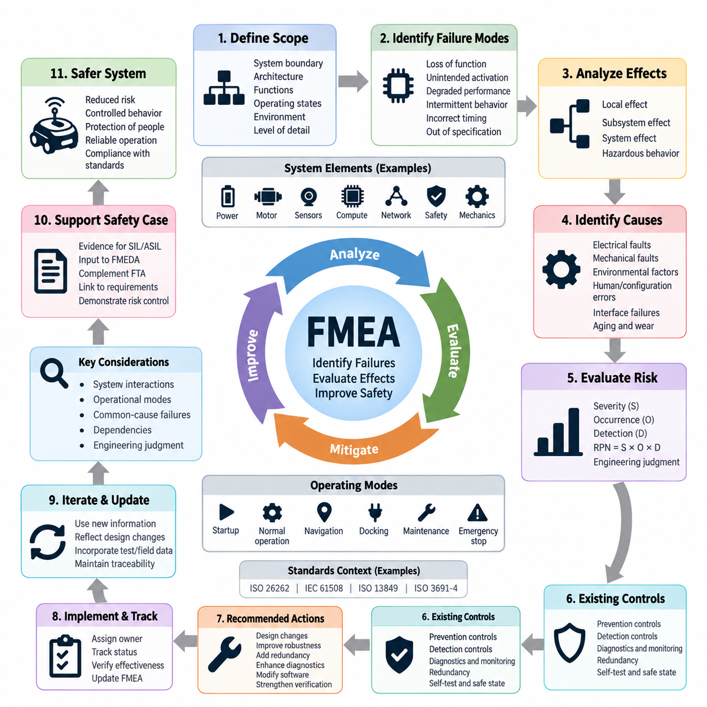
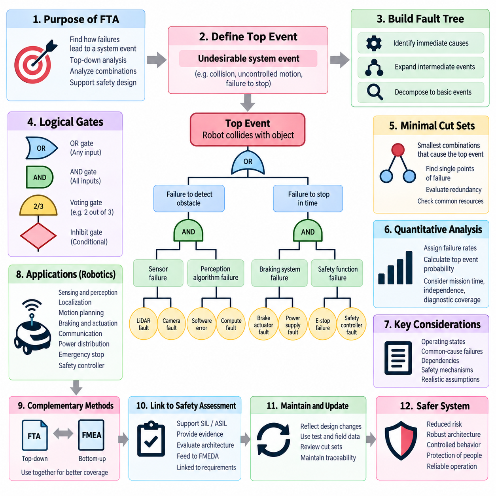
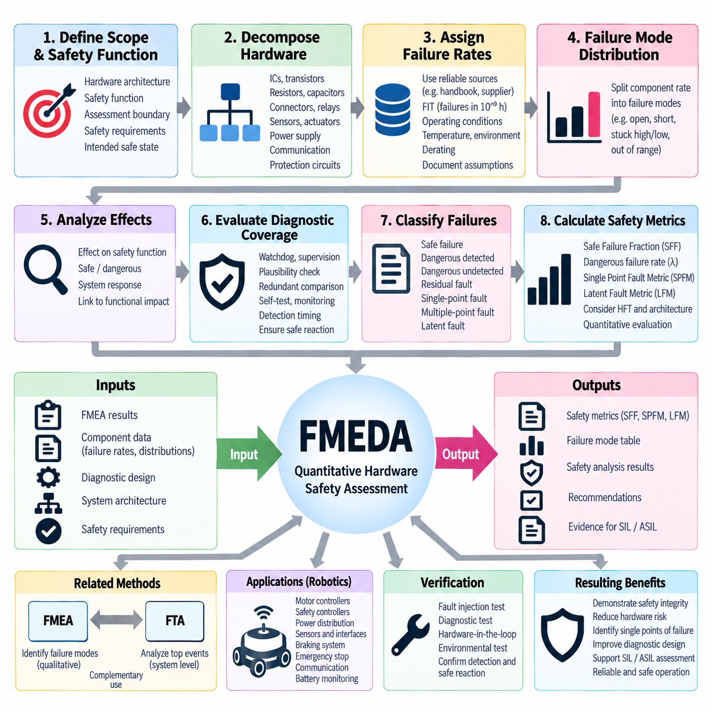
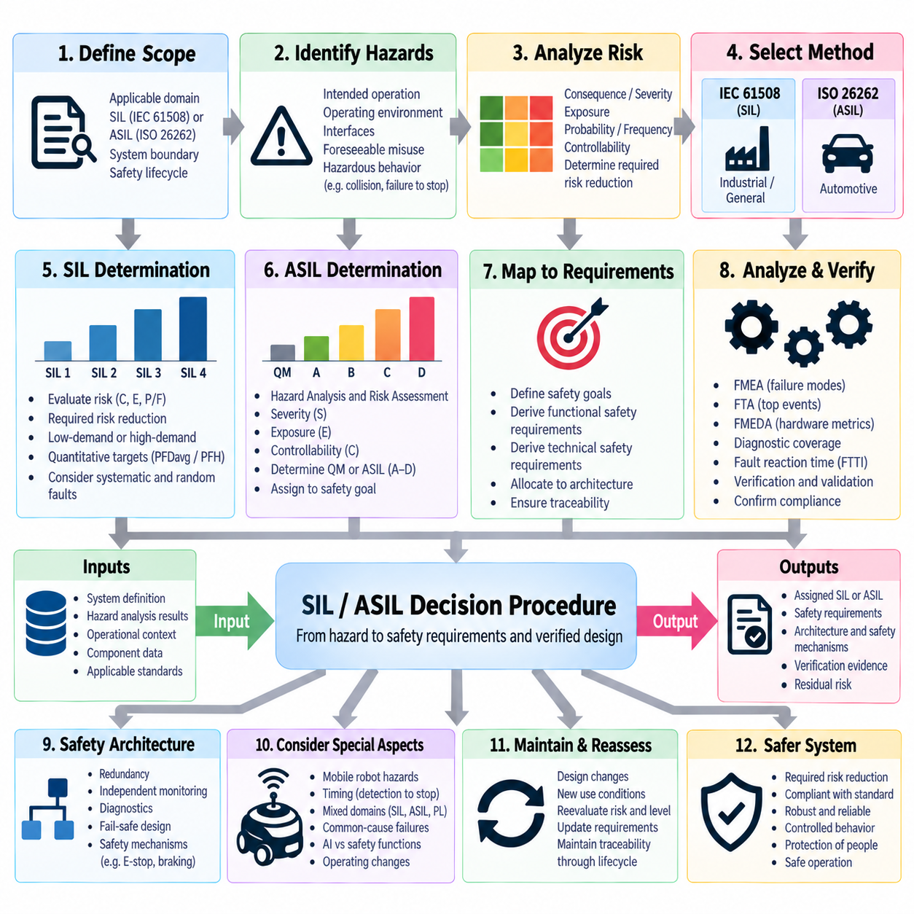
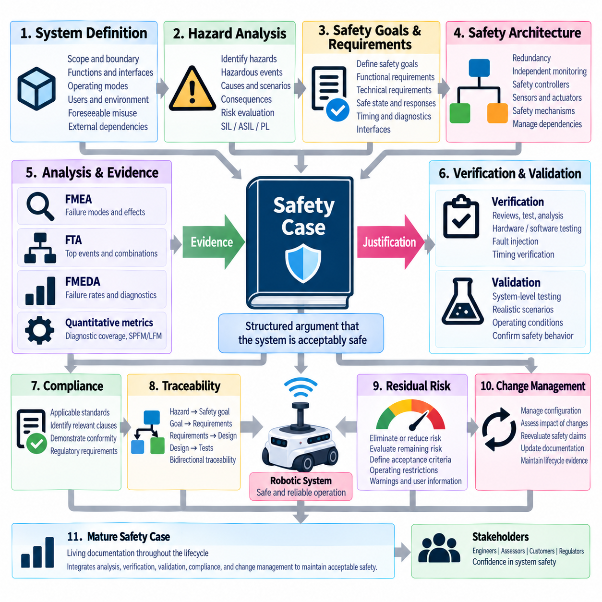

**Volume 12. Safety Architecture**


# Chapter 05. SIL/ASIL Assessment

##  

## 05.01. FMEA Method

{width="7.268055555555556in" height="7.268055555555556in"}

Failure Mode and Effects Analysis (FMEA) is a systematic engineering method used to identify how components, functions, interfaces, or processes may fail and to evaluate the consequences of those failures before they occur in operation. Within safety engineering, FMEA provides a structured bottom-up approach that begins with individual failure modes and traces their effects toward subsystem, system, and ultimately hazardous behavior.

The fundamental principle of FMEA is to examine each element of a system and ask what functions it performs, how those functions can fail, why the failure might occur, and what happens when the failure is present. A failure mode may include loss of function, unintended activation, degraded performance, intermittent behavior, incorrect timing, or operation outside specified limits. This functional perspective allows FMEA to address hardware, software-related interfaces, sensors, actuators, and communication paths.

An FMEA normally begins by defining the analysis boundary and describing the system architecture at an appropriate level of decomposition. Engineers identify functions, components, interfaces, operating states, environmental conditions, and dependencies that belong within the analysis. The selected level of detail is important because an analysis that is too coarse may conceal critical mechanisms, while excessive decomposition can produce a large document without improving safety decisions.

For every analyzed item, potential failure modes are identified from its intended function and expected behavior. A motor controller, for example, may fail by producing no torque, excessive torque, unintended torque, incorrect rotational direction, or delayed torque response. A safety sensor may provide no detection, false detection, delayed detection, or incorrect distance information. Defining failure modes functionally helps connect component faults to observable system behavior.

After a failure mode is identified, its local effect and higher-level effects are evaluated. The local effect describes what happens directly to the affected component or function, while subsequent effects describe propagation through the subsystem and complete machine. In an autonomous mobile robot, loss of obstacle detection may first affect perception, then prevent timely protective action, and ultimately create a potential collision with a person, vehicle, or fixed structure.

Failure causes are then investigated to determine the physical, electrical, logical, environmental, or integration mechanisms capable of producing each failure mode. Typical causes include open circuits, short circuits, connector degradation, sensor contamination, power loss, communication interruption, overheating, component aging, configuration errors, and interface faults. Distinguishing a failure mode from its underlying cause is essential because different causes may require different prevention or diagnostic measures.

Traditional FMEA commonly evaluates risk through severity, occurrence, and detection criteria. Severity represents the seriousness of the resulting effect, occurrence estimates how likely the failure cause is to arise, and detection reflects the ability of existing controls to identify the problem before unacceptable consequences develop. These rankings support prioritization, although their scales and interpretation must be explicitly defined for the organization and application being analyzed.

The Risk Priority Number, commonly expressed as RPN = Severity × Occurrence × Detection, has historically been used to rank FMEA findings. RPN can provide a convenient screening indicator, but it should not be treated as an absolute measure of safety integrity. Different combinations of severity, occurrence, and detection can produce identical numerical values while representing substantially different safety concerns. High-severity failures therefore require explicit engineering attention regardless of RPN alone.

Modern FMEA practice consequently emphasizes engineering judgment and action prioritization rather than relying exclusively on a single calculated score. Safety-related failures should be evaluated according to their consequences, controllability, exposure, diagnostic capability, architectural protection, and applicable safety requirements. The purpose of ranking is not merely to create a numerical table but to identify where design changes, monitoring, redundancy, testing, or additional safety mechanisms are necessary.

Existing prevention and detection controls are documented for each relevant failure cause. Prevention controls reduce the probability that the failure will occur, whereas detection controls identify the fault or its effects after occurrence. Examples include electrical protection, thermal derating, watchdog supervision, plausibility checking, redundant sensing, communication timeout monitoring, diagnostic feedback, self-tests, and safe-state transitions. Their effectiveness should be supported by design evidence and verification.

Recommended actions are defined when the residual risk or engineering concern is unacceptable. Actions may involve changing the architecture, increasing component robustness, introducing redundancy, improving diagnostic coverage, modifying software monitoring, adding independent safety channels, strengthening environmental protection, or improving verification procedures. Each action should have a responsible owner and completion status so that the FMEA operates as an engineering control process rather than a static document.

FMEA is particularly valuable during early design because weaknesses can be discovered before hardware and software architectures become difficult to modify. Preliminary functional FMEA can be performed from requirements and block-level architecture, followed by increasingly detailed analyses as components and interfaces are defined. Repeating the analysis throughout development allows new information from prototypes, testing, field experience, supplier data, and design changes to refine the understanding of failure behavior.

For robotics, FMEA must consider interactions among power electronics, computing, sensing, communication, actuation, and mechanical motion. A single electrical fault may propagate across several domains. Loss of a power rail can disable perception and communication simultaneously, while corrupted timing information may affect sensor fusion and motion control without causing an obvious component shutdown. Analysis therefore needs to capture dependencies and common resources rather than treating every component as independent.

Autonomous systems also require careful consideration of operational modes. A failure that is harmless while a robot is stationary may become hazardous during navigation, docking, manipulation, charging, or high-speed travel. FMEA should therefore associate failure effects with relevant operating states and transitions. Startup, shutdown, maintenance, degraded operation, emergency stopping, and recovery states deserve explicit consideration because safety behavior can differ substantially between these conditions.

Common-cause and dependent failures require additional attention when redundancy is used as a safety mechanism. Two redundant sensors do not provide meaningful independence if both depend on the same power supply, communication switch, clock source, environmental condition, or software function. FMEA can expose these dependencies, although dedicated common-cause analysis or other complementary methods may be required when the architecture contains complex shared resources and correlated failure mechanisms.

FMEA is a bottom-up method and therefore complements rather than replaces top-down safety techniques. Fault Tree Analysis begins with an undesirable system-level event and investigates combinations of causes that could produce it, whereas FMEA begins with individual failures and examines their consequences. Using both approaches improves coverage because one reveals propagation from component faults while the other tests whether important hazardous system outcomes have been adequately explained by the identified fault mechanisms.

Within SIL and ASIL assessment activities, FMEA provides engineering evidence about failure behavior, diagnostic mechanisms, fault propagation, and the effectiveness of architectural controls. Its results can support more quantitative hardware analyses such as FMEDA, where failure rates and diagnostic coverage are considered explicitly. FMEA itself should therefore be understood as a foundation for systematic safety reasoning rather than as a direct mechanism for assigning SIL or ASIL classifications.

The quality of an FMEA depends strongly on traceability. Failure modes should be connected to functions and components, effects should relate to system behavior, safety-relevant findings should connect to requirements, and recommended actions should lead to implementation and verification evidence. When requirements, architecture, hardware, software, or operating assumptions change, the corresponding FMEA entries must be reviewed so that the analysis continues to represent the actual system configuration.

For an AMR or other Physical AI platform, a practical FMEA may examine battery and power distribution, motor drives, braking, steering, emergency-stop circuits, safety LiDAR, cameras, localization sensors, compute modules, communication networks, and safety controllers. The analysis should also consider whether a detected fault results in controlled degradation, restricted operation, protective stopping, emergency stopping, or another defined safe response appropriate to the hazard and operating context.

A mature FMEA ultimately functions as a living engineering model of how the system can fail and how the design responds. Its value comes not from the number of rows in a worksheet but from the disciplined connection between failure mechanisms, system consequences, safety requirements, mitigation measures, and verification evidence. When maintained throughout the lifecycle, FMEA becomes an important bridge between system architecture, detailed design, safety assessment, validation, and the final safety case.

고장 형태 및 영향 분석(Failure Mode and Effects Analysis, FMEA)은 구성요소(Component), 기능(Function), 인터페이스(Interface) 또는 프로세스(Process)가 어떤 방식으로 고장날 수 있는지를 식별하고, 실제 운용 중 고장이 발생하기 전에 그 결과를 평가하기 위한 체계적인 엔지니어링 방법(Systematic Engineering Method)이다. 안전 엔지니어링(Safety Engineering)에서 FMEA는 개별 고장 형태(Failure Mode)에서 출발하여 서브시스템(Subsystem), 시스템(System), 궁극적으로 위험한 거동(Hazardous Behavior)에 미치는 영향을 추적하는 상향식 접근법(Bottom-up Approach)을 제공한다.

FMEA의 기본 원칙(Fundamental Principle)은 시스템의 각 요소(Element)를 검토하면서 해당 요소가 어떤 기능을 수행하는지, 그 기능이 어떻게 실패할 수 있는지, 고장이 왜 발생할 수 있는지, 그리고 고장이 존재할 때 어떤 결과가 발생하는지를 분석하는 것이다. 고장 형태(Failure Mode)에는 기능 상실(Loss of Function), 의도하지 않은 작동(Unintended Activation), 성능 저하(Degraded Performance), 간헐적 동작(Intermittent Behavior), 잘못된 타이밍(Incorrect Timing), 규정된 한계를 벗어난 동작 등이 포함될 수 있다. 이러한 기능 중심 관점(Functional Perspective)을 통해 하드웨어(Hardware), 소프트웨어 관련 인터페이스(Software-related Interface), 센서(Sensor), 액추에이터(Actuator), 통신 경로(Communication Path)를 함께 분석할 수 있다.

FMEA는 일반적으로 분석 경계(Analysis Boundary)를 정의하고 적절한 분해 수준(Level of Decomposition)에서 시스템 아키텍처(System Architecture)를 설명하는 것으로 시작한다. 엔지니어는 분석 범위에 포함되는 기능(Function), 구성요소(Component), 인터페이스(Interface), 운용 상태(Operating State), 환경 조건(Environmental Condition), 종속 관계(Dependency)를 식별한다. 분석 수준이 지나치게 거칠면 중요한 고장 메커니즘(Failure Mechanism)을 놓칠 수 있고, 반대로 과도하게 세분화하면 안전 의사결정(Safety Decision)을 개선하지 못하면서 문서만 방대해질 수 있으므로 적절한 상세 수준을 선정하는 것이 중요하다.

분석 대상의 각 항목(Item)에 대해서는 의도된 기능(Intended Function)과 예상 동작(Expected Behavior)을 기준으로 잠재적 고장 형태(Potential Failure Mode)를 식별한다. 예를 들어 모터 제어기(Motor Controller)는 토크 미발생(No Torque), 과도한 토크(Excessive Torque), 의도하지 않은 토크(Unintended Torque), 잘못된 회전 방향(Incorrect Rotational Direction), 지연된 토크 응답(Delayed Torque Response) 등의 형태로 고장날 수 있다. 안전 센서(Safety Sensor)는 미검출(No Detection), 오검출(False Detection), 지연 검출(Delayed Detection), 잘못된 거리 정보(Incorrect Distance Information)를 제공할 수 있다. 고장 형태를 기능적으로 정의하면 구성요소의 결함(Component Fault)을 관찰 가능한 시스템 거동(System Behavior)과 연결하기 쉬워진다.

고장 형태(Failure Mode)가 식별되면 국부 영향(Local Effect)과 상위 수준 영향(Higher-level Effect)을 평가한다. 국부 영향은 해당 구성요소 또는 기능에서 직접 발생하는 결과를 나타내며, 이후의 영향은 서브시스템(Subsystem)과 전체 기계(Complete Machine)를 통해 고장이 어떻게 전파되는지를 나타낸다. 자율이동로봇(Autonomous Mobile Robot, AMR)에서 장애물 감지 기능(Obstacle Detection)의 상실은 먼저 인지 기능(Perception)에 영향을 주고, 이후 적절한 보호 동작(Protective Action)을 방해하며, 궁극적으로 사람, 차량 또는 고정 구조물과의 잠재적 충돌(Potential Collision)을 발생시킬 수 있다.

그다음 각 고장 형태를 발생시킬 수 있는 물리적(Physical), 전기적(Electrical), 논리적(Logical), 환경적(Environmental), 통합 관련(Integration-related) 메커니즘을 파악하기 위해 고장 원인(Failure Cause)을 조사한다. 대표적인 원인에는 단선(Open Circuit), 단락(Short Circuit), 커넥터 열화(Connector Degradation), 센서 오염(Sensor Contamination), 전원 상실(Power Loss), 통신 중단(Communication Interruption), 과열(Overheating), 구성요소 노화(Component Aging), 설정 오류(Configuration Error), 인터페이스 결함(Interface Fault) 등이 있다. 하나의 고장 형태와 그 근본 원인(Underlying Cause)을 구분하는 것은 서로 다른 원인에 따라 서로 다른 예방 또는 진단 대책이 필요하기 때문에 중요하다.

전통적인 FMEA는 일반적으로 심각도(Severity), 발생도(Occurrence), 검출도(Detection)를 이용하여 위험(Risk)을 평가한다. 심각도는 발생 결과의 중대성을 나타내고, 발생도는 고장 원인이 발생할 가능성을 추정하며, 검출도는 허용할 수 없는 결과가 발생하기 전에 기존 제어 수단(Existing Control)이 문제를 발견할 수 있는 능력을 나타낸다. 이러한 평가는 우선순위 결정(Prioritization)을 지원하지만, 평가 척도와 해석 기준은 분석 대상 조직과 적용 시스템에 맞게 명확하게 정의되어야 한다.

위험 우선순위 수(Risk Priority Number, RPN)는 전통적으로 RPN = 심각도(Severity) × 발생도(Occurrence) × 검출도(Detection)로 표현되며 FMEA 결과의 우선순위를 정하는 데 사용되어 왔다. RPN은 편리한 선별 지표(Screening Indicator)가 될 수 있지만 절대적인 안전 무결성(Safety Integrity)의 척도로 취급해서는 안 된다. 서로 다른 심각도, 발생도, 검출도의 조합이 동일한 RPN을 만들면서도 실제 안전 중요성은 크게 다를 수 있다. 따라서 심각도가 높은 고장(High-severity Failure)은 RPN 값만으로 판단하지 않고 별도의 엔지니어링 검토가 필요하다.

현대적인 FMEA 실무(Modern FMEA Practice)는 하나의 계산된 점수에만 의존하기보다 엔지니어링 판단(Engineering Judgment)과 조치 우선순위(Action Prioritization)를 강조한다. 안전 관련 고장(Safety-related Failure)은 결과의 심각성, 제어 가능성(Controllability), 노출도(Exposure), 진단 능력(Diagnostic Capability), 아키텍처 보호 기능(Architectural Protection), 적용 가능한 안전 요구사항(Safety Requirement)을 종합적으로 고려하여 평가해야 한다. 위험 순위의 목적은 단순한 숫자표를 만드는 것이 아니라 설계 변경, 모니터링, 중복성(Redundancy), 시험 또는 추가적인 안전 메커니즘(Safety Mechanism)이 필요한 부분을 식별하는 것이다.

각각의 중요한 고장 원인에 대해서는 기존의 예방 제어(Prevention Control)와 검출 제어(Detection Control)를 문서화한다. 예방 제어는 고장이 발생할 가능성을 감소시키고, 검출 제어는 고장이 발생한 이후 해당 결함이나 영향을 식별한다. 대표적인 예로 전기 보호(Electrical Protection), 열 디레이팅(Thermal Derating), 워치독 감시(Watchdog Supervision), 타당성 검사(Plausibility Checking), 중복 센싱(Redundant Sensing), 통신 타임아웃 감시(Communication Timeout Monitoring), 진단 피드백(Diagnostic Feedback), 자기진단(Self-test), 안전 상태 전환(Safe-state Transition)이 있다. 이러한 제어 수단의 효과는 설계 근거(Design Evidence)와 검증(Verification)을 통해 뒷받침되어야 한다.

잔여 위험(Residual Risk) 또는 엔지니어링 우려 사항이 허용할 수 없는 수준인 경우 권고 조치(Recommended Action)를 정의한다. 이러한 조치에는 아키텍처 변경(Architecture Change), 구성요소 강건성(Component Robustness) 향상, 중복성(Redundancy) 도입, 진단 범위(Diagnostic Coverage) 개선, 소프트웨어 모니터링(Software Monitoring) 수정, 독립적인 안전 채널(Independent Safety Channel) 추가, 환경 보호(Environmental Protection) 강화 또는 검증 절차(Verification Procedure) 개선 등이 포함될 수 있다. FMEA가 정적인 문서가 아니라 엔지니어링 제어 프로세스(Engineering Control Process)로 작동하려면 각 조치에 담당자(Responsible Owner)와 완료 상태(Completion Status)를 연결해야 한다.

FMEA는 하드웨어 및 소프트웨어 아키텍처(Hardware and Software Architecture)를 변경하기 어려워지기 전에 설계 취약점(Design Weakness)을 발견할 수 있기 때문에 초기 설계 단계(Early Design Stage)에서 특히 높은 가치를 가진다. 요구사항(Requirement)과 블록 수준 아키텍처(Block-level Architecture)를 기반으로 예비 기능 FMEA(Preliminary Functional FMEA)를 수행하고, 구성요소와 인터페이스가 구체화됨에 따라 더욱 상세한 분석으로 발전시킬 수 있다. 개발 과정 전체에서 분석을 반복하면 프로토타입(Prototype), 시험(Test), 현장 경험(Field Experience), 공급업체 데이터(Supplier Data), 설계 변경(Design Change)에서 얻은 새로운 정보를 반영하여 고장 거동에 대한 이해를 지속적으로 개선할 수 있다.

로보틱스(Robotics)의 FMEA에서는 전력전자(Power Electronics), 컴퓨팅(Computing), 센싱(Sensing), 통신(Communication), 구동(Actuation), 기계적 운동(Mechanical Motion) 사이의 상호작용을 고려해야 한다. 하나의 전기적 결함(Electrical Fault)이 여러 영역으로 전파될 수 있기 때문이다. 예를 들어 하나의 전원 레일(Power Rail) 상실이 인지와 통신 기능을 동시에 비활성화할 수 있으며, 손상된 시간 정보(Corrupted Timing Information)는 명확한 구성요소 정지 없이 센서 융합(Sensor Fusion)과 운동 제어(Motion Control)에 영향을 줄 수 있다. 따라서 분석에서는 각각의 구성요소를 독립적으로만 취급하지 않고 종속 관계와 공통 자원(Common Resource)을 함께 다루어야 한다.

자율 시스템(Autonomous System)은 운용 모드(Operational Mode)에 대한 세심한 고려도 필요하다. 로봇이 정지해 있을 때는 무해한 고장이 주행(Navigation), 도킹(Docking), 조작(Manipulation), 충전(Charging), 고속 이동(High-speed Travel) 중에는 위험해질 수 있다. 따라서 FMEA에서는 고장 영향을 관련 운용 상태(Operating State) 및 상태 전이(State Transition)와 연결해야 한다. 기동(Startup), 종료(Shutdown), 유지보수(Maintenance), 성능 저하 운전(Degraded Operation), 비상 정지(Emergency Stopping), 복구 상태(Recovery State)는 상태에 따라 안전 거동이 크게 달라질 수 있으므로 명시적으로 검토할 필요가 있다.

중복성(Redundancy)을 안전 메커니즘으로 사용하는 경우 공통 원인 고장(Common-cause Failure)과 종속 고장(Dependent Failure)에 추가적인 주의가 필요하다. 두 개의 중복 센서가 동일한 전원 공급장치(Power Supply), 통신 스위치(Communication Switch), 클록 소스(Clock Source), 환경 조건(Environmental Condition) 또는 소프트웨어 기능(Software Function)에 의존한다면 실질적인 독립성(Independence)을 제공하지 못할 수 있다. FMEA는 이러한 종속 관계를 드러낼 수 있지만, 복잡한 공유 자원과 상관된 고장 메커니즘이 존재하는 아키텍처에서는 별도의 공통 원인 분석(Common-cause Analysis)이나 보완적 분석 방법(Complementary Method)이 필요할 수 있다.

FMEA는 상향식 방법(Bottom-up Method)이므로 하향식 안전 분석 기법(Top-down Safety Technique)을 대체하는 것이 아니라 상호 보완한다. 결함 트리 분석(Fault Tree Analysis, FTA)은 바람직하지 않은 시스템 수준 사건(System-level Event)에서 시작하여 이를 발생시킬 수 있는 원인의 조합을 조사하는 반면, FMEA는 개별 고장에서 시작하여 그 결과를 분석한다. 두 방법을 함께 사용하면 구성요소 결함에서 시작되는 고장 전파를 파악하는 동시에 중요한 위험 시스템 결과(Hazardous System Outcome)가 식별된 고장 메커니즘으로 충분히 설명되는지를 검토할 수 있어 분석 범위를 향상시킬 수 있다.

안전 무결성 수준(Safety Integrity Level, SIL)과 자동차 안전 무결성 수준(Automotive Safety Integrity Level, ASIL)의 평가 과정에서 FMEA는 고장 거동(Failure Behavior), 진단 메커니즘(Diagnostic Mechanism), 결함 전파(Fault Propagation), 아키텍처 제어 수단의 효과성(Effectiveness of Architectural Controls)에 관한 엔지니어링 근거를 제공한다. FMEA 결과는 고장률(Failure Rate)과 진단 범위(Diagnostic Coverage)를 명시적으로 고려하는 고장 형태·영향 및 진단 분석(Failure Modes, Effects and Diagnostic Analysis, FMEDA)과 같은 보다 정량적인 하드웨어 분석(Quantitative Hardware Analysis)의 기반으로 활용될 수 있다. 따라서 FMEA 자체는 SIL 또는 ASIL을 직접 할당하는 방법이 아니라 체계적인 안전 논리(Systematic Safety Reasoning)를 구축하기 위한 기반으로 이해해야 한다.

FMEA의 품질은 추적성(Traceability)에 크게 좌우된다. 고장 형태(Failure Mode)는 기능과 구성요소에 연결되어야 하고, 고장 영향(Failure Effect)은 시스템 거동과 연계되어야 하며, 안전 관련 분석 결과는 안전 요구사항(Safety Requirement)으로 이어져야 한다. 또한 권고 조치(Recommended Action)는 실제 구현(Implementation)과 검증 근거(Verification Evidence)로 연결되어야 한다. 요구사항, 아키텍처, 하드웨어, 소프트웨어 또는 운용 가정(Operating Assumption)이 변경될 경우 관련 FMEA 항목도 함께 검토하여 분석 내용이 실제 시스템 구성(System Configuration)을 지속적으로 반영하도록 해야 한다.

자율이동로봇(Autonomous Mobile Robot, AMR) 또는 기타 피지컬 AI(Physical AI) 플랫폼에서 실무적인 FMEA는 배터리 및 전력 분배(Battery and Power Distribution), 모터 드라이브(Motor Drive), 제동(Braking), 조향(Steering), 비상 정지 회로(Emergency-stop Circuit), 안전 라이다(Safety LiDAR), 카메라(Camera), 위치 추정 센서(Localization Sensor), 컴퓨팅 모듈(Compute Module), 통신 네트워크(Communication Network), 안전 제어기(Safety Controller)를 분석할 수 있다. 또한 검출된 결함이 제어된 성능 저하(Controlled Degradation), 제한 운전(Restricted Operation), 보호 정지(Protective Stopping), 비상 정지(Emergency Stopping) 또는 해당 위험과 운용 상황에 적합하게 정의된 다른 안전 대응(Safe Response)으로 이어지는지를 검토해야 한다.

성숙한 FMEA(Mature FMEA)는 궁극적으로 시스템이 어떻게 고장날 수 있으며 설계가 그 고장에 어떻게 대응하는지를 표현하는 살아 있는 엔지니어링 모델(Living Engineering Model)로 기능한다. FMEA의 가치는 워크시트(Worksheet)에 포함된 행의 개수에 있는 것이 아니라 고장 메커니즘(Failure Mechanism), 시스템 결과(System Consequence), 안전 요구사항(Safety Requirement), 완화 대책(Mitigation Measure), 검증 근거(Verification Evidence)를 체계적으로 연결하는 데 있다. 시스템 수명주기(System Lifecycle) 전체에서 지속적으로 유지될 때 FMEA는 시스템 아키텍처, 상세 설계, 안전 평가(Safety Assessment), 검증 및 유효성 확인(Verification and Validation), 최종 안전 사례(Safety Case)를 연결하는 중요한 기반이 된다.

##  

## 05.02. FTA (Fault Tree Analysis)

{width="7.268055555555556in" height="7.268055555555556in"}

Fault Tree Analysis (FTA) is a systematic, deductive safety analysis method used to determine how combinations of faults, failures, and abnormal conditions can lead to a defined undesirable system event. Unlike bottom-up methods such as FMEA, FTA begins with a system-level consequence called the top event and works downward through progressively more detailed causal relationships until basic events or other sufficiently understood causes are identified.

The analysis begins by defining the top event precisely. A useful top event describes a specific loss of safety function or hazardous system behavior rather than a vague condition such as "system failure." Examples include unintended robot motion, failure to stop within the required distance, loss of braking capability, collision due to failed obstacle detection, or uncontrolled actuator output. Clear definition establishes the boundary and prevents unrelated failure mechanisms from entering the analysis.

Once the top event is established, analysts identify the immediate events that could cause it and connect them through logical gates. An OR gate indicates that any one of its input events can produce the output event, whereas an AND gate indicates that all specified input events must occur together. These Boolean relationships allow complex system behavior to be represented as a logical structure and make dependencies between hardware, software, communication, sensing, and control functions visible.

The tree is expanded recursively by asking how each intermediate event could occur. Intermediate events may represent subsystem failures, loss of required functions, incorrect commands, unavailable diagnostics, or combinations of faults. Expansion continues until the analysis reaches basic events that do not require further decomposition for the intended purpose. These may include component failures, wiring faults, sensor faults, power interruptions, communication failures, or other defined root-level events.

Basic events form the lowest practical causal level of a fault tree. Their definition should be sufficiently specific to support qualitative or quantitative evaluation. For example, "braking failure" may be too broad, while "brake actuator power supply open circuit" provides a more useful engineering event. The appropriate depth depends on the system architecture, available reliability information, safety objectives, and the decisions that the analysis is expected to support.

FTA can incorporate additional gate types when simple AND and OR relationships are insufficient. Depending on the analysis method, voting gates may represent architectures such as two-out-of-three redundancy, while inhibit or conditional relationships may express failures that become relevant only under particular operating conditions. Dynamic or sequence-dependent behavior may require specialized extensions because conventional static fault trees do not naturally represent every temporal dependency.

Qualitative FTA focuses on identifying the combinations of basic events capable of producing the top event. One of its most important outputs is the minimal cut set, which is the smallest combination of basic events whose simultaneous occurrence is sufficient to cause the top event. A single-event minimal cut set can reveal a critical single point of failure, while multi-event cut sets help evaluate whether redundancy actually prevents individual faults from becoming hazardous.

Minimal cut sets also provide a practical way to examine architectural robustness. If a supposedly redundant safety function contains a cut set consisting of only one shared power supply, communication path, clock source, controller, or software service, the architecture may still contain a hidden single point of failure. FTA therefore helps engineers evaluate whether redundancy provides genuine independence or merely duplicates components that remain dependent on common resources.

Quantitative FTA extends the logical model by assigning probability or failure-rate information to appropriate basic events. Boolean relationships and probability calculations can then be used to estimate the likelihood of the top event under defined assumptions. Such calculations require careful treatment of mission time, failure distributions, repair assumptions, independence, diagnostic coverage, and operating conditions because unrealistic assumptions can produce numerically precise but misleading results.

Independence assumptions are especially important when calculating fault-tree probabilities. Two events cannot automatically be treated as statistically independent simply because they occur in different components. Common power supplies, environmental stresses, manufacturing defects, shared communication infrastructure, software dependencies, thermal conditions, and maintenance errors can create correlated failures. Common-cause failure analysis is therefore often necessary when evaluating redundant safety architectures.

For robotics, the top event may result from interaction among sensing, computation, communication, actuation, and mechanical behavior. An AMR collision, for example, could originate from failure to detect an obstacle, incorrect localization, unsafe trajectory generation, loss of communication with a safety device, excessive braking distance, or failure of the stopping actuator. FTA organizes these heterogeneous mechanisms according to their logical contribution to the same hazardous outcome.

Operating states should be explicitly considered because the logical conditions leading to a hazard may change with robot behavior. Navigation, docking, charging, manipulation, maintenance, startup, degraded operation, and emergency stopping can expose different fault combinations. A sensor failure that is tolerable during stationary maintenance may become safety-critical during autonomous motion, while a communication loss may have different consequences depending on whether local safety functions remain available.

Safety mechanisms are represented within the fault-tree logic according to how their failure contributes to the hazardous event. A hazard may require both a primary functional failure and failure of the mechanism intended to detect or mitigate it. This relationship can demonstrate the benefit of diagnostics, monitoring, redundancy, independent shutdown paths, watchdogs, safety relays, or protective stopping functions when those mechanisms are correctly represented in the causal structure.

FTA is particularly effective for analyzing single-point failures and combinations of multiple failures that may not be obvious from component-level examination. It can expose situations where two individually tolerable faults become hazardous when they occur together. This characteristic is important in systems designed to achieve higher levels of safety integrity, where the architecture must remain safe or transition to a safe state despite specified combinations of faults.

FTA and Failure Mode and Effects Analysis (FMEA) provide complementary views of system safety. FMEA begins with individual component or functional failures and traces their effects upward, while FTA begins with an undesirable system event and searches downward for causal combinations. Cross-checking the two analyses can reveal missing failure modes, overlooked propagation paths, inconsistent assumptions, and safety mechanisms that have not been adequately addressed by either method alone.

Fault Tree Analysis can also support subsequent quantitative hardware assessment. Basic events and cut sets provide information that may be linked with failure-rate data, diagnostic assumptions, FMEDA results, or reliability models. However, numerical evaluation should be performed only when the underlying data and modeling assumptions are sufficiently credible. The logical fault-tree structure remains valuable even when precise quantitative failure information is unavailable.

Within SIL and ASIL-oriented safety engineering, FTA provides evidence that hazardous system outcomes have been systematically traced to credible causal mechanisms. The analysis can support evaluation of architectural vulnerabilities, independence, fault combinations, diagnostic measures, and safety requirements. It does not independently determine SIL or ASIL classification; instead, it contributes structured evidence to the broader safety lifecycle and safety assessment process.

Traceability is essential for maintaining a useful fault tree. The top event should relate to identified hazards or safety goals, intermediate events should correspond to system functions and architecture, and basic events should connect to actual hardware, software, interfaces, or environmental assumptions. Safety mechanisms introduced by the analysis should lead to requirements, implementation, and verification evidence so that the logical model remains connected to the engineered system.

Fault trees should therefore evolve with the design rather than remain fixed after an early safety review. Architecture changes, new interfaces, supplier components, diagnostic functions, field failures, verification results, and modified operating assumptions can alter the causal structure. Reviewing affected branches after significant changes ensures that previously identified cut sets remain valid and that new single points of failure or dependent-failure paths have not been introduced.

For an AMR or Physical AI platform, FTA can connect hazardous motion to failures across safety LiDAR, cameras, localization, compute modules, networks, motor controllers, braking systems, power distribution, emergency-stop circuits, and safety controllers. This system-level perspective is especially valuable when intelligent functions interact with deterministic safety mechanisms because the analysis can clarify which combinations must be prevented, detected, tolerated, or forced into a defined safe state.

A mature FTA ultimately provides a logical explanation of how a hazardous system event can occur and what architectural barriers prevent it. Its value lies not merely in drawing a tree, but in exposing causal combinations, single points of failure, hidden dependencies, common resources, and weaknesses in safety mechanisms. When integrated with FMEA, FMEDA, requirements, verification evidence, and safety-case documentation, FTA becomes a central tool for demonstrating systematic control of system-level risk.

결함 트리 분석(Fault Tree Analysis, FTA)은 결함(Fault), 고장(Failure), 비정상 조건(Abnormal Condition)의 조합이 어떻게 정의된 바람직하지 않은 시스템 사건(Undesirable System Event)으로 이어질 수 있는지를 판단하기 위한 체계적이고 연역적인 안전 분석 방법(Systematic Deductive Safety Analysis Method)이다. 고장 형태 및 영향 분석(Failure Mode and Effects Analysis, FMEA)과 같은 상향식 방법(Bottom-up Method)과 달리, FTA는 최상위 사건(Top Event)이라 불리는 시스템 수준 결과에서 시작하여 기본 사건(Basic Event) 또는 충분히 이해된 원인이 식별될 때까지 점차 세부적인 인과관계를 하향식(Top-down)으로 분석한다.

분석은 최상위 사건(Top Event)을 명확하게 정의하는 것에서 시작한다. 유용한 최상위 사건은 단순히 "시스템 고장(System Failure)"과 같은 모호한 상태가 아니라 특정한 안전 기능 상실(Loss of Safety Function)이나 위험한 시스템 거동(Hazardous System Behavior)을 표현해야 한다. 예를 들어 의도하지 않은 로봇 움직임(Unintended Robot Motion), 요구된 거리 내 정지 실패(Failure to Stop within Required Distance), 제동 능력 상실(Loss of Braking Capability), 장애물 감지 실패로 인한 충돌(Collision due to Failed Obstacle Detection), 제어되지 않은 액추에이터 출력(Uncontrolled Actuator Output) 등이 있다. 명확한 정의는 분석 경계를 설정하고 관련 없는 고장 메커니즘이 분석에 포함되는 것을 방지한다.

최상위 사건이 설정되면 분석자는 이를 발생시킬 수 있는 직접적인 사건(Immediate Event)을 식별하고 논리 게이트(Logical Gate)를 통해 연결한다. OR 게이트(OR Gate)는 입력 사건 중 하나라도 발생하면 출력 사건이 발생할 수 있음을 의미하며, AND 게이트(AND Gate)는 지정된 모든 입력 사건이 함께 발생해야 출력 사건이 발생함을 의미한다. 이러한 불리언 논리 관계(Boolean Relationship)를 통해 복잡한 시스템 거동을 논리 구조(Logical Structure)로 표현하고 하드웨어, 소프트웨어, 통신, 센싱, 제어 기능 사이의 종속 관계를 가시화할 수 있다.

트리는 각각의 중간 사건(Intermediate Event)이 어떻게 발생할 수 있는지를 반복적으로 질문하면서 확장된다. 중간 사건은 서브시스템 고장(Subsystem Failure), 필수 기능 상실(Loss of Required Function), 잘못된 명령(Incorrect Command), 진단 기능 사용 불가(Unavailable Diagnostics), 또는 여러 결함의 조합을 나타낼 수 있다. 분석 목적상 더 이상 분해할 필요가 없는 기본 사건(Basic Event)에 도달할 때까지 확장을 계속하며, 여기에는 구성요소 고장(Component Failure), 배선 결함(Wiring Fault), 센서 결함(Sensor Fault), 전원 중단(Power Interruption), 통신 고장(Communication Failure) 등이 포함될 수 있다.

기본 사건(Basic Event)은 결함 트리에서 실질적으로 가장 낮은 인과 수준(Causal Level)을 형성한다. 기본 사건은 정성적 또는 정량적 평가(Qualitative or Quantitative Evaluation)를 지원할 수 있을 정도로 구체적으로 정의해야 한다. 예를 들어 "제동 고장(Braking Failure)"은 지나치게 광범위할 수 있지만, "브레이크 액추에이터 전원 공급 단선(Brake Actuator Power Supply Open Circuit)"은 보다 유용한 엔지니어링 사건이 된다. 적절한 분석 깊이는 시스템 아키텍처(System Architecture), 사용 가능한 신뢰성 정보(Reliability Information), 안전 목표(Safety Objective), 분석을 통해 지원하려는 의사결정에 따라 결정된다.

단순한 AND 및 OR 관계만으로 충분하지 않은 경우 FTA는 추가적인 게이트 유형(Gate Type)을 포함할 수 있다. 분석 방법에 따라 보팅 게이트(Voting Gate)는 3중 2 선택(2-out-of-3)과 같은 중복 아키텍처(Redundant Architecture)를 표현할 수 있으며, 억제 게이트(Inhibit Gate) 또는 조건부 관계(Conditional Relationship)는 특정 운용 조건에서만 관련되는 고장을 나타낼 수 있다. 동적 또는 순서 의존적 거동(Sequence-dependent Behavior)은 기존의 정적 결함 트리(Static Fault Tree)만으로 모든 시간적 종속 관계(Temporal Dependency)를 표현하기 어렵기 때문에 특수한 확장 기법이 필요할 수 있다.

정성적 결함 트리 분석(Qualitative FTA)은 최상위 사건을 발생시킬 수 있는 기본 사건의 조합을 식별하는 데 중점을 둔다. 가장 중요한 결과 중 하나는 최소 컷 세트(Minimal Cut Set)로, 최상위 사건을 발생시키기에 충분한 가장 작은 기본 사건의 조합을 의미한다. 단일 사건으로 구성된 최소 컷 세트는 중요한 단일 고장점(Single Point of Failure)을 나타낼 수 있으며, 다중 사건 컷 세트(Multi-event Cut Set)는 중복성이 실제로 개별 결함이 위험으로 발전하는 것을 방지하는지 평가하는 데 도움이 된다.

최소 컷 세트(Minimal Cut Set)는 아키텍처 강건성(Architectural Robustness)을 검토하는 실질적인 방법도 제공한다. 중복 안전 기능(Redundant Safety Function)에 하나의 공유 전원 공급장치(Shared Power Supply), 통신 경로(Communication Path), 클록 소스(Clock Source), 제어기(Controller), 소프트웨어 서비스(Software Service)만으로 구성된 컷 세트가 존재한다면 해당 아키텍처에는 여전히 숨겨진 단일 고장점(Hidden Single Point of Failure)이 존재할 수 있다. 따라서 FTA는 중복성이 진정한 독립성(Independence)을 제공하는지 또는 공통 자원에 의존하는 구성요소를 단순히 복제한 것인지를 평가하는 데 도움을 준다.

정량적 결함 트리 분석(Quantitative FTA)은 적절한 기본 사건에 확률(Probability) 또는 고장률(Failure Rate) 정보를 할당함으로써 논리 모델을 확장한다. 이후 불리언 관계와 확률 계산(Probability Calculation)을 사용하여 정의된 가정 아래에서 최상위 사건의 발생 가능성을 추정할 수 있다. 이러한 계산에서는 임무 시간(Mission Time), 고장 분포(Failure Distribution), 수리 가정(Repair Assumption), 독립성(Independence), 진단 범위(Diagnostic Coverage), 운용 조건(Operating Condition)을 신중하게 고려해야 한다. 비현실적인 가정은 수치적으로는 정밀해 보이지만 실제로는 잘못된 결과를 만들 수 있기 때문이다.

결함 트리의 확률을 계산할 때 독립성 가정(Independence Assumption)은 특히 중요하다. 두 사건이 서로 다른 구성요소에서 발생한다는 이유만으로 자동적으로 통계적 독립(Statistical Independence)으로 간주해서는 안 된다. 공통 전원 공급장치(Common Power Supply), 환경 스트레스(Environmental Stress), 제조 결함(Manufacturing Defect), 공유 통신 인프라(Shared Communication Infrastructure), 소프트웨어 종속성(Software Dependency), 열적 조건(Thermal Condition), 유지보수 오류(Maintenance Error)는 상관된 고장(Correlated Failure)을 발생시킬 수 있다. 따라서 중복 안전 아키텍처를 평가할 때에는 공통 원인 고장 분석(Common-cause Failure Analysis)이 필요한 경우가 많다.

로보틱스(Robotics)에서는 최상위 사건이 센싱(Sensing), 컴퓨팅(Computation), 통신(Communication), 구동(Actuation), 기계적 거동(Mechanical Behavior)의 상호작용으로 발생할 수 있다. 예를 들어 자율이동로봇(Autonomous Mobile Robot, AMR)의 충돌은 장애물 감지 실패(Failure to Detect an Obstacle), 잘못된 위치 추정(Incorrect Localization), 안전하지 않은 경로 생성(Unsafe Trajectory Generation), 안전 장치와의 통신 상실(Loss of Communication with Safety Device), 과도한 제동 거리(Excessive Braking Distance), 정지 액추에이터 고장(Stopping Actuator Failure) 등에서 발생할 수 있다. FTA는 이러한 서로 다른 메커니즘을 동일한 위험 결과에 대한 논리적 기여 관계에 따라 체계적으로 구성한다.

운용 상태(Operating State)에 따라 위험을 발생시키는 논리적 조건이 달라질 수 있으므로 이를 명시적으로 고려해야 한다. 주행(Navigation), 도킹(Docking), 충전(Charging), 조작(Manipulation), 유지보수(Maintenance), 기동(Startup), 성능 저하 운전(Degraded Operation), 비상 정지(Emergency Stopping)는 서로 다른 고장 조합을 발생시킬 수 있다. 정지 상태의 유지보수 중에는 허용 가능한 센서 고장이 자율 주행 중에는 안전에 치명적일 수 있으며, 통신 상실도 로컬 안전 기능(Local Safety Function)이 유지되는지에 따라 서로 다른 결과를 가져올 수 있다.

안전 메커니즘(Safety Mechanism)은 그 실패가 위험 사건에 어떻게 기여하는지에 따라 결함 트리 논리 안에 표현된다. 하나의 위험이 발생하기 위해 주 기능 고장(Primary Functional Failure)과 이를 검출하거나 완화하도록 설계된 안전 메커니즘의 고장이 동시에 필요할 수 있다. 이러한 관계는 진단(Diagnostics), 모니터링(Monitoring), 중복성(Redundancy), 독립 종료 경로(Independent Shutdown Path), 워치독(Watchdog), 안전 릴레이(Safety Relay), 보호 정지 기능(Protective Stopping Function)이 인과 구조에 적절히 반영되었을 때 그 효과를 보여줄 수 있다.

FTA는 구성요소 수준 분석(Component-level Analysis)만으로는 명확하게 발견하기 어려운 단일 고장점(Single-point Failure)과 다중 고장 조합(Multiple Failure Combination)을 분석하는 데 특히 효과적이다. 개별적으로는 허용 가능한 두 개의 결함이 동시에 발생할 경우 위험한 상태를 만드는 상황을 찾아낼 수 있다. 이러한 특성은 지정된 결함 조합이 발생하더라도 시스템이 안전한 상태를 유지하거나 안전 상태(Safe State)로 전환되어야 하는 높은 수준의 안전 무결성(Safety Integrity)을 목표로 하는 시스템에서 중요하다.

결함 트리 분석(Fault Tree Analysis, FTA)과 고장 형태 및 영향 분석(Failure Mode and Effects Analysis, FMEA)은 시스템 안전(System Safety)을 서로 보완적인 관점에서 분석한다. FMEA는 개별 구성요소 또는 기능 고장에서 시작하여 그 영향을 상향식으로 추적하는 반면, FTA는 바람직하지 않은 시스템 사건에서 시작하여 원인이 되는 조합을 하향식으로 탐색한다. 두 분석을 교차 검토하면 누락된 고장 형태, 간과된 전파 경로(Propagation Path), 일관되지 않은 가정(Inconsistent Assumption), 어느 한 분석에서 충분히 다루지 못한 안전 메커니즘을 발견할 수 있다.

결함 트리 분석은 이후의 정량적 하드웨어 평가(Quantitative Hardware Assessment)도 지원할 수 있다. 기본 사건과 컷 세트(Cut Set)는 고장률 데이터(Failure-rate Data), 진단 가정(Diagnostic Assumption), 고장 형태·영향 및 진단 분석(Failure Modes, Effects and Diagnostic Analysis, FMEDA) 결과 또는 신뢰성 모델(Reliability Model)과 연결할 수 있는 정보를 제공한다. 그러나 정량적 평가는 기반 데이터와 모델링 가정(Modeling Assumption)이 충분한 신뢰성을 가질 때 수행해야 하며, 정확한 정량적 고장 정보가 없는 경우에도 결함 트리의 논리 구조 자체는 중요한 가치를 가진다.

안전 무결성 수준(Safety Integrity Level, SIL)과 자동차 안전 무결성 수준(Automotive Safety Integrity Level, ASIL)을 중심으로 하는 안전 엔지니어링에서 FTA는 위험한 시스템 결과가 신뢰할 수 있는 인과 메커니즘(Causal Mechanism)까지 체계적으로 추적되었다는 근거를 제공한다. 분석 결과는 아키텍처 취약성(Architectural Vulnerability), 독립성, 결함 조합, 진단 수단(Diagnostic Measure), 안전 요구사항(Safety Requirement)의 평가를 지원한다. FTA 자체가 SIL 또는 ASIL 등급을 직접 결정하는 것은 아니며, 전체 안전 수명주기(Safety Lifecycle)와 안전 평가 프로세스(Safety Assessment Process)를 구성하는 체계적인 근거를 제공한다.

유용한 결함 트리를 유지하기 위해서는 추적성(Traceability)이 필수적이다. 최상위 사건은 식별된 위험(Hazard) 또는 안전 목표(Safety Goal)와 연결되어야 하고, 중간 사건은 시스템 기능과 아키텍처에 대응해야 하며, 기본 사건은 실제 하드웨어, 소프트웨어, 인터페이스 또는 환경적 가정(Environmental Assumption)과 연결되어야 한다. 분석을 통해 도입된 안전 메커니즘은 요구사항, 구현(Implementation), 검증 근거(Verification Evidence)로 이어져야 하며, 이를 통해 논리 모델과 실제 엔지니어링 시스템 사이의 연계성을 유지할 수 있다.

따라서 결함 트리는 초기 안전 검토(Early Safety Review) 이후 고정된 상태로 유지되는 것이 아니라 설계와 함께 지속적으로 발전해야 한다. 아키텍처 변경(Architecture Change), 새로운 인터페이스, 공급업체 구성요소(Supplier Component), 진단 기능, 현장 고장(Field Failure), 검증 결과, 변경된 운용 가정은 인과 구조를 변화시킬 수 있다. 중요한 변경 이후 영향을 받는 트리의 가지(Branch)를 재검토하면 기존에 식별된 컷 세트가 여전히 유효한지 확인하고 새로운 단일 고장점이나 종속 고장 경로(Dependent-failure Path)가 도입되지 않았는지를 확인할 수 있다.

자율이동로봇(Autonomous Mobile Robot, AMR) 또는 피지컬 AI(Physical AI) 플랫폼에서 FTA는 위험한 움직임(Hazardous Motion)을 안전 라이다(Safety LiDAR), 카메라(Camera), 위치 추정(Localization), 컴퓨팅 모듈(Compute Module), 네트워크(Network), 모터 제어기(Motor Controller), 제동 시스템(Braking System), 전력 분배(Power Distribution), 비상 정지 회로(Emergency-stop Circuit), 안전 제어기(Safety Controller)의 고장과 연결할 수 있다. 이러한 시스템 수준 관점(System-level Perspective)은 지능형 기능(Intelligent Function)과 결정론적 안전 메커니즘(Deterministic Safety Mechanism)이 상호작용하는 시스템에서 특히 중요하며, 어떤 고장 조합을 예방, 검출, 허용하거나 정의된 안전 상태로 강제 전환해야 하는지를 명확하게 할 수 있다.

성숙한 결함 트리 분석(Mature FTA)은 궁극적으로 위험한 시스템 사건이 어떻게 발생할 수 있으며 어떤 아키텍처 장벽(Architectural Barrier)이 이를 방지하는지를 논리적으로 설명한다. 그 가치는 단순히 트리(Tree)를 작성하는 데 있는 것이 아니라 인과 조합(Causal Combination), 단일 고장점, 숨겨진 종속성(Hidden Dependency), 공통 자원(Common Resource), 안전 메커니즘의 취약점을 드러내는 데 있다. FTA가 FMEA, FMEDA, 안전 요구사항, 검증 근거, 안전 사례 문서화(Safety-case Documentation)와 통합될 때 시스템 수준 위험(System-level Risk)을 체계적으로 통제하고 있음을 입증하는 핵심적인 안전 분석 도구가 된다.

##  

## 05.03. FMEDA Hardware Assessment

{width="7.268055555555556in" height="7.268055555555556in"}

Failure Modes, Effects and Diagnostic Analysis (FMEDA) is a quantitative hardware safety assessment method that extends conventional FMEA by incorporating component failure rates, failure-mode distributions, safety effects, and diagnostic coverage. It is widely used to determine how random hardware failures influence the safety integrity of electronic systems and provides evidence for SIL- and ASIL-oriented assessments, particularly where quantitative hardware metrics must be demonstrated.

FMEDA begins with a clearly defined hardware architecture and safety function. The assessment boundary should identify power supplies, processors, memories, sensors, communication interfaces, drivers, protection circuits, actuators, and supporting components that contribute to the function being evaluated. Safety requirements and the intended safe state must also be understood because the classification of a hardware failure depends on whether that failure can violate the defined safety function.

The hardware architecture is decomposed into components or component groups at a level suitable for reliability analysis. Typical elements include integrated circuits, transistors, resistors, capacitors, inductors, connectors, relays, oscillators, voltage regulators, communication transceivers, and discrete protection devices. Excessive decomposition can create unnecessary analytical complexity, while insufficient decomposition may conceal important failure mechanisms or diagnostic relationships.

Each hardware element is assigned an appropriate failure rate, commonly expressed using FIT, where one FIT represents one failure per billion device-hours. Failure-rate information may originate from recognized reliability handbooks, semiconductor safety manuals, supplier reliability data, field experience, or other justified sources. The selected data source, operating conditions, temperature assumptions, environmental factors, and applicable derating conditions should be documented to maintain analytical credibility and traceability.

The total component failure rate is then distributed among relevant failure modes. A resistor, for example, may fail open, short, or outside its specified resistance range, while a semiconductor output may become stuck high, stuck low, open, shorted, or otherwise behave incorrectly. Failure-mode distributions convert a component-level reliability value into specific fault behaviors that can be evaluated according to their effects on the safety function.

Each failure mode is analyzed to determine whether it affects the safety-related function and how the system responds. Some failures have no safety relevance, some directly violate the safety function, and others are controlled by diagnostic or architectural mechanisms. The analysis therefore connects physical hardware faults to functional consequences and establishes the basis for classifying failures according to their contribution to hazardous behavior.

A central feature of FMEDA is the evaluation of diagnostic coverage. Diagnostic coverage represents the fraction of relevant dangerous failures that can be detected by implemented safety mechanisms. Examples include watchdog monitoring, voltage supervision, current monitoring, memory protection, communication diagnostics, sensor plausibility checks, redundant comparisons, output feedback, periodic self-tests, and independent monitoring circuits. Detection must lead to an appropriate safety reaction to provide meaningful safety benefit.

Diagnostic effectiveness should not be assumed simply because a diagnostic function exists. The analysis must determine which specific failure modes the diagnostic mechanism can detect, under what conditions detection occurs, and whether detection is sufficiently timely. A diagnostic that identifies a fault only after the fault has already produced an unacceptable hazardous effect may provide little safety value for that particular safety function.

FMEDA commonly distinguishes failures according to their safety significance and diagnostic status. Depending on the applicable standard and assessment framework, failures may be categorized as safe, dangerous detected, dangerous undetected, residual, single-point, multiple-point, latent, or otherwise safety-related. Correct classification is essential because these categories contribute differently to the quantitative hardware metrics used to demonstrate safety integrity.

A single-point fault is particularly important because it can directly violate a safety goal without an independent safety mechanism preventing or controlling the resulting hazard. Such faults often indicate architectural weakness and may require redundancy, additional monitoring, fail-safe circuitry, or a redesigned safety concept. FMEDA helps expose these weaknesses quantitatively by showing which portions of the hardware failure rate remain capable of directly compromising safety.

Latent and multiple-point failures are also significant in redundant architectures. One fault may initially remain hidden because another channel continues to perform the required safety function, but a later independent fault can then remove the remaining protection. Periodic diagnostics, proof testing, startup tests, continuous monitoring, and maintenance intervals are therefore important for limiting the time during which hidden faults can accumulate.

For IEC 61508-oriented analysis, FMEDA results can contribute to hardware safety integrity metrics such as Safe Failure Fraction and dangerous failure rates. The assessment may distinguish safe failures, dangerous detected failures, and dangerous undetected failures to evaluate whether the hardware architecture satisfies the required safety integrity constraints. Hardware Fault Tolerance and architectural requirements must also be considered rather than relying on diagnostic coverage alone.

Within ISO 26262-oriented hardware assessment, FMEDA can provide important input to metrics such as the Single Point Fault Metric and Latent Fault Metric. The analysis helps determine how effectively the architecture prevents single-point and residual faults from violating safety goals and how well latent multiple-point faults are controlled. These metrics complement probabilistic hardware evaluation and broader safety lifecycle evidence used for ASIL-related justification.

FMEDA is closely related to FMEA but adds quantitative reliability and diagnostic information. FMEA primarily identifies potential failure modes, causes, effects, and mitigation actions, whereas FMEDA associates hardware failure rates with those modes and evaluates how safety mechanisms detect or control them. A well-developed FMEA can therefore provide an important foundation for FMEDA, while FMEDA adds numerical evidence needed for hardware safety integrity assessment.

Fault Tree Analysis can complement FMEDA from the opposite analytical direction. FMEDA evaluates hardware failure behavior largely from the component or function level upward, while FTA begins with a hazardous top event and identifies combinations of faults that can produce it. FMEDA failure rates and classifications may provide inputs to quantitative fault-tree models, allowing component-level reliability evidence to support system-level probability assessment.

Common-cause and dependent failures require special consideration because simple FMEDA calculations can overestimate the benefit of redundancy if channels are assumed to be independent. Redundant controllers may share a power source, clock, communication bus, connector, environmental exposure, or software-controlled interface. These dependencies should be identified and addressed through architectural analysis, common-cause assessment, or complementary safety methods.

In robotic systems, FMEDA can be applied to motor controllers, safety controllers, power distribution units, braking electronics, sensor interfaces, emergency-stop circuits, communication gateways, battery monitoring circuits, and other safety-related hardware. For an AMR, failures that prevent obstacle detection, safe torque removal, controlled braking, or emergency stopping can be traced to physical components and evaluated against implemented diagnostic mechanisms.

The time relationship between fault occurrence, detection, and safety reaction is particularly important for moving robots. A diagnostic mechanism may have high theoretical coverage but still be inadequate if detection and reaction exceed the available fault-tolerant time interval. Hardware diagnostics must therefore be evaluated together with system timing, stopping distance, communication latency, actuator response, and the defined safe-state transition.

FMEDA results should remain traceable to the actual design configuration. Component identifiers, failure-rate sources, failure-mode distributions, diagnostic mechanisms, safety classifications, assumptions, and calculated metrics should be documented so that the analysis can be reviewed and reproduced. Changes to components, circuit topology, diagnostics, suppliers, operating conditions, or safety requirements should trigger assessment of the affected FMEDA entries.

Verification evidence is necessary to demonstrate that the diagnostic mechanisms assumed by the FMEDA actually achieve their claimed behavior. Fault-injection testing, circuit analysis, diagnostic tests, hardware-in-the-loop evaluation, environmental testing, and targeted verification can be used to confirm detection capability and safety reactions. Without such evidence, calculated diagnostic coverage may represent an analytical assumption rather than demonstrated system performance.

A mature FMEDA ultimately provides a quantitative connection between physical hardware reliability and system safety integrity. By combining failure rates, failure modes, safety effects, diagnostic coverage, architectural protection, and verification evidence, it identifies where dangerous hardware failures remain insufficiently controlled. Integrated with FMEA, FTA, SIL or ASIL assessment, safety requirements, and validation evidence, FMEDA becomes a key foundation for demonstrating that safety-related robotic hardware achieves its intended level of functional safety.

고장 형태, 영향 및 진단 분석(Failure Modes, Effects and Diagnostic Analysis, FMEDA)은 기존의 고장 형태 및 영향 분석(Failure Mode and Effects Analysis, FMEA)에 구성요소 고장률(Component Failure Rate), 고장 형태 분포(Failure-mode Distribution), 안전 영향(Safety Effect), 진단 범위(Diagnostic Coverage)를 추가한 정량적 하드웨어 안전 평가 방법(Quantitative Hardware Safety Assessment Method)이다. FMEDA는 랜덤 하드웨어 고장(Random Hardware Failure)이 전자 시스템의 안전 무결성(Safety Integrity)에 미치는 영향을 평가하며, 특히 정량적 하드웨어 지표의 입증이 필요한 SIL 및 ASIL 기반 평가에 중요한 근거를 제공한다.

FMEDA는 명확하게 정의된 하드웨어 아키텍처(Hardware Architecture)와 안전 기능(Safety Function)에서 시작한다. 평가 경계(Assessment Boundary)에는 평가 대상 기능에 기여하는 전원 공급장치(Power Supply), 프로세서(Processor), 메모리(Memory), 센서(Sensor), 통신 인터페이스(Communication Interface), 드라이버(Driver), 보호 회로(Protection Circuit), 액추에이터(Actuator), 지원 구성요소(Supporting Component)를 포함해야 한다. 또한 하드웨어 고장의 분류는 정의된 안전 기능의 위반 가능성에 따라 달라지므로 안전 요구사항(Safety Requirement)과 의도된 안전 상태(Safe State)를 명확하게 이해해야 한다.

하드웨어 아키텍처는 신뢰성 분석(Reliability Analysis)에 적합한 수준으로 구성요소 또는 구성요소 그룹(Component Group)으로 분해한다. 일반적인 분석 대상에는 집적회로(Integrated Circuit), 트랜지스터(Transistor), 저항(Resistor), 커패시터(Capacitor), 인덕터(Inductor), 커넥터(Connector), 릴레이(Relay), 발진기(Oscillator), 전압 조정기(Voltage Regulator), 통신 트랜시버(Communication Transceiver), 개별 보호 소자(Discrete Protection Device) 등이 포함된다. 지나친 분해는 불필요한 분석 복잡성을 만들 수 있지만, 분해가 충분하지 않으면 중요한 고장 메커니즘이나 진단 관계를 놓칠 수 있다.

각 하드웨어 요소에는 적절한 고장률(Failure Rate)을 할당하며, 일반적으로 FIT(Failures In Time)를 사용하여 표현한다. 1 FIT는 10억 장치 시간(Billion Device-hours)당 한 번의 고장을 의미한다. 고장률 정보는 공인된 신뢰성 핸드북(Reliability Handbook), 반도체 안전 매뉴얼(Semiconductor Safety Manual), 공급업체 신뢰성 데이터(Supplier Reliability Data), 현장 경험(Field Experience) 또는 기타 정당화된 출처에서 얻을 수 있다. 분석의 신뢰성과 추적성을 유지하기 위해 데이터 출처, 운용 조건, 온도 가정, 환경 요소, 적용된 디레이팅 조건(Derating Condition)을 문서화해야 한다.

전체 구성요소 고장률(Total Component Failure Rate)은 이후 관련 고장 형태(Failure Mode)에 분배된다. 예를 들어 저항은 단선(Open), 단락(Short), 또는 규정된 저항 범위를 벗어나는 형태로 고장날 수 있으며, 반도체 출력(Semiconductor Output)은 고정 High(Stuck High), 고정 Low(Stuck Low), 단선, 단락 또는 기타 잘못된 동작 상태가 될 수 있다. 고장 형태 분포(Failure-mode Distribution)는 구성요소 수준의 신뢰성 값을 구체적인 결함 거동(Fault Behavior)으로 변환하여 안전 기능에 미치는 영향을 평가할 수 있도록 한다.

각 고장 형태는 안전 관련 기능(Safety-related Function)에 영향을 미치는지와 시스템이 이에 어떻게 대응하는지를 판단하기 위해 분석된다. 일부 고장은 안전과 관련이 없을 수 있고, 일부는 안전 기능을 직접적으로 위반하며, 다른 고장은 진단 또는 아키텍처 안전 메커니즘(Architectural Safety Mechanism)에 의해 제어될 수 있다. 따라서 분석은 물리적인 하드웨어 결함(Physical Hardware Fault)을 기능적 결과(Functional Consequence)와 연결하고, 위험 거동(Hazardous Behavior)에 대한 기여 정도에 따라 고장을 분류하는 기반을 마련한다.

FMEDA의 핵심적인 특징은 진단 범위(Diagnostic Coverage)의 평가이다. 진단 범위는 관련된 위험 고장(Dangerous Failure) 가운데 구현된 안전 메커니즘(Safety Mechanism)에 의해 검출할 수 있는 비율을 의미한다. 대표적인 예에는 워치독 모니터링(Watchdog Monitoring), 전압 감시(Voltage Supervision), 전류 모니터링(Current Monitoring), 메모리 보호(Memory Protection), 통신 진단(Communication Diagnostics), 센서 타당성 검사(Sensor Plausibility Check), 중복 비교(Redundant Comparison), 출력 피드백(Output Feedback), 주기적 자기진단(Periodic Self-test), 독립 모니터링 회로(Independent Monitoring Circuit) 등이 있다. 검출이 실질적인 안전 효과를 제공하려면 적절한 안전 반응(Safety Reaction)으로 이어져야 한다.

진단 기능이 존재한다는 이유만으로 진단 효과(Diagnostic Effectiveness)를 가정해서는 안 된다. 분석에서는 진단 메커니즘이 구체적으로 어떤 고장 형태를 검출할 수 있는지, 어떤 조건에서 검출되는지, 그리고 충분히 신속하게 검출되는지를 판단해야 한다. 결함이 이미 허용할 수 없는 위험 영향을 발생시킨 이후에야 이를 식별하는 진단 기능은 해당 안전 기능에 대해 실질적인 안전 효과가 거의 없을 수 있다.

FMEDA는 일반적으로 고장의 안전 중요도(Safety Significance)와 진단 상태(Diagnostic Status)에 따라 고장을 구분한다. 적용되는 표준과 평가 프레임워크에 따라 고장은 안전 고장(Safe Failure), 검출된 위험 고장(Dangerous Detected Failure), 검출되지 않은 위험 고장(Dangerous Undetected Failure), 잔여 고장(Residual Fault), 단일점 고장(Single-point Fault), 다중점 고장(Multiple-point Fault), 잠재 고장(Latent Fault) 또는 기타 안전 관련 고장으로 분류될 수 있다. 이러한 분류는 안전 무결성을 입증하는 정량적 하드웨어 지표에 서로 다르게 반영되므로 정확한 분류가 중요하다.

단일점 고장(Single-point Fault)은 독립적인 안전 메커니즘이 결과적인 위험을 방지하거나 제어하지 못하는 상태에서 하나의 고장만으로 안전 목표(Safety Goal)를 직접적으로 위반할 수 있기 때문에 특히 중요하다. 이러한 고장은 아키텍처 취약성(Architectural Weakness)을 나타내는 경우가 많으며 중복성(Redundancy), 추가 모니터링(Additional Monitoring), 고장 안전 회로(Fail-safe Circuitry) 또는 안전 개념(Safety Concept)의 재설계가 필요할 수 있다. FMEDA는 하드웨어 고장률 중 어느 부분이 직접적으로 안전을 손상시킬 수 있는지를 정량적으로 보여줌으로써 이러한 취약점을 식별한다.

잠재 고장(Latent Failure)과 다중점 고장(Multiple-point Failure) 역시 중복 아키텍처(Redundant Architecture)에서 중요하다. 하나의 고장이 처음에는 숨겨진 상태로 남아 있더라도 다른 채널이 필요한 안전 기능을 계속 수행할 수 있지만, 이후 독립적인 추가 고장이 발생하면 남아 있던 보호 기능까지 상실될 수 있다. 따라서 주기적 진단(Periodic Diagnostics), 검증 시험(Proof Testing), 기동 시험(Startup Test), 연속 모니터링(Continuous Monitoring), 유지보수 주기(Maintenance Interval)는 숨겨진 고장이 축적될 수 있는 시간을 제한하는 데 중요하다.

IEC 61508 기반 분석에서 FMEDA 결과는 안전 고장 비율(Safe Failure Fraction, SFF)과 위험 고장률(Dangerous Failure Rate) 같은 하드웨어 안전 무결성 지표(Hardware Safety Integrity Metric)의 평가에 기여할 수 있다. 평가에서는 안전 고장, 검출된 위험 고장, 검출되지 않은 위험 고장을 구분하여 하드웨어 아키텍처가 요구되는 안전 무결성 제약조건을 만족하는지를 판단할 수 있다. 또한 진단 범위에만 의존하지 않고 하드웨어 결함 허용도(Hardware Fault Tolerance, HFT)와 아키텍처 요구사항(Architectural Requirement)을 함께 고려해야 한다.

ISO 26262 기반 하드웨어 평가에서 FMEDA는 단일점 결함 지표(Single Point Fault Metric, SPFM)와 잠재 결함 지표(Latent Fault Metric, LFM) 같은 지표에 중요한 입력을 제공할 수 있다. 분석은 아키텍처가 단일점 고장과 잔여 고장이 안전 목표를 위반하는 것을 얼마나 효과적으로 방지하는지, 그리고 잠재적인 다중점 고장이 얼마나 효과적으로 제어되는지를 판단하는 데 도움을 준다. 이러한 지표는 확률적 하드웨어 평가(Probabilistic Hardware Evaluation) 및 ASIL 관련 정당화에 사용되는 보다 광범위한 안전 수명주기 근거를 보완한다.

FMEDA는 고장 형태 및 영향 분석(Failure Mode and Effects Analysis, FMEA)과 밀접하게 관련되어 있지만 정량적 신뢰성 정보(Quantitative Reliability Information)와 진단 정보를 추가한다. FMEA가 주로 잠재적인 고장 형태, 원인, 영향, 완화 조치(Mitigation Action)를 식별한다면, FMEDA는 이러한 고장 형태에 하드웨어 고장률을 연결하고 안전 메커니즘이 이를 어떻게 검출하거나 제어하는지를 평가한다. 따라서 잘 구성된 FMEA는 FMEDA의 중요한 기반이 될 수 있으며, FMEDA는 하드웨어 안전 무결성 평가에 필요한 수치적 근거를 추가한다.

결함 트리 분석(Fault Tree Analysis, FTA)은 반대 방향의 분석 관점에서 FMEDA를 보완할 수 있다. FMEDA는 주로 구성요소 또는 기능 수준에서 상향식으로 하드웨어 고장 거동을 평가하는 반면, FTA는 위험한 최상위 사건(Hazardous Top Event)에서 시작하여 이를 발생시킬 수 있는 결함 조합을 식별한다. FMEDA의 고장률과 고장 분류 결과는 정량적 결함 트리 모델(Quantitative Fault-tree Model)의 입력으로 사용될 수 있으며, 이를 통해 구성요소 수준의 신뢰성 근거를 시스템 수준 확률 평가(System-level Probability Assessment)와 연결할 수 있다.

공통 원인 고장(Common-cause Failure)과 종속 고장(Dependent Failure)은 특별히 고려해야 한다. 단순한 FMEDA 계산에서 여러 채널을 독립적인 것으로 가정하면 중복성의 효과를 과대평가할 수 있기 때문이다. 중복 제어기(Redundant Controller)는 동일한 전원, 클록(Clock), 통신 버스(Communication Bus), 커넥터, 환경 조건 또는 소프트웨어 제어 인터페이스를 공유할 수 있다. 이러한 종속성은 아키텍처 분석(Architectural Analysis), 공통 원인 평가(Common-cause Assessment) 또는 보완적인 안전 분석 방법을 통해 식별하고 다루어야 한다.

로봇 시스템(Robotic System)에서 FMEDA는 모터 제어기(Motor Controller), 안전 제어기(Safety Controller), 전력 분배 장치(Power Distribution Unit, PDU), 제동 전자장치(Braking Electronics), 센서 인터페이스(Sensor Interface), 비상 정지 회로(Emergency-stop Circuit), 통신 게이트웨이(Communication Gateway), 배터리 모니터링 회로(Battery Monitoring Circuit) 및 기타 안전 관련 하드웨어에 적용할 수 있다. 자율이동로봇(Autonomous Mobile Robot, AMR)에서는 장애물 감지, 안전 토크 제거(Safe Torque Removal), 제어된 제동(Controlled Braking), 비상 정지를 방해하는 고장을 실제 물리적 구성요소까지 추적하고 구현된 진단 메커니즘을 기준으로 평가할 수 있다.

움직이는 로봇에서는 결함 발생(Fault Occurrence), 검출(Detection), 안전 반응(Safety Reaction) 사이의 시간 관계가 특히 중요하다. 진단 메커니즘이 이론적으로 높은 진단 범위를 제공하더라도 검출과 반응 시간이 허용 가능한 결함 허용 시간 간격(Fault-tolerant Time Interval, FTTI)을 초과한다면 충분하지 않을 수 있다. 따라서 하드웨어 진단은 시스템 타이밍(System Timing), 정지 거리(Stopping Distance), 통신 지연(Communication Latency), 액추에이터 응답(Actuator Response), 정의된 안전 상태 전환(Safe-state Transition)과 함께 평가해야 한다.

FMEDA 결과는 실제 설계 구성(Design Configuration)과 지속적으로 추적 가능해야 한다. 구성요소 식별자(Component Identifier), 고장률 출처(Failure-rate Source), 고장 형태 분포, 진단 메커니즘, 안전 분류(Safety Classification), 분석 가정(Assumption), 계산된 지표를 문서화하여 분석 결과를 검토하고 재현할 수 있도록 해야 한다. 구성요소, 회로 토폴로지(Circuit Topology), 진단 기능, 공급업체, 운용 조건 또는 안전 요구사항이 변경되면 영향을 받는 FMEDA 항목을 다시 평가해야 한다.

FMEDA에서 가정한 진단 메커니즘이 실제로 주장된 동작을 달성하는지를 입증하기 위해서는 검증 근거(Verification Evidence)가 필요하다. 결함 주입 시험(Fault-injection Testing), 회로 분석(Circuit Analysis), 진단 시험(Diagnostic Test), 하드웨어 인 더 루프 평가(Hardware-in-the-loop Evaluation), 환경 시험(Environmental Testing), 목표 지향 검증(Targeted Verification)을 통해 검출 능력과 안전 반응을 확인할 수 있다. 이러한 근거가 없다면 계산된 진단 범위는 입증된 시스템 성능이 아니라 분석상의 가정에 머물 수 있다.

성숙한 고장 형태, 영향 및 진단 분석(Mature FMEDA)은 궁극적으로 물리적 하드웨어 신뢰성(Physical Hardware Reliability)과 시스템 안전 무결성(System Safety Integrity)을 정량적으로 연결한다. 고장률, 고장 형태, 안전 영향, 진단 범위, 아키텍처 보호(Architectural Protection), 검증 근거를 결합함으로써 위험한 하드웨어 고장이 충분히 제어되지 않는 부분을 식별할 수 있다. FMEA, FTA, SIL 또는 ASIL 평가, 안전 요구사항, 검증 및 유효성 확인 근거(Validation Evidence)와 통합될 때 FMEDA는 안전 관련 로봇 하드웨어가 의도된 기능 안전 수준(Functional Safety Level)을 달성한다는 것을 입증하는 핵심 기반이 된다.

##  

## 05.04. SIL/ASIL Decision Procedure

{width="7.268055555555556in" height="7.268055555555556in"}

Safety Integrity Level (SIL) and Automotive Safety Integrity Level (ASIL) are classification concepts used to determine the rigor required for safety-related engineering, but they originate from different safety frameworks. SIL is associated primarily with IEC 61508 and related functional-safety standards, while ASIL is defined by ISO 26262 for road vehicles. A decision procedure must therefore begin by identifying the applicable domain, governing standard, system boundary, and safety lifecycle before selecting an integrity classification approach.

The first decision concerns whether the function being assessed is safety-related. Engineers define the system, intended operation, operating environment, interfaces, foreseeable misuse, and potential hazardous behavior. Hazards are identified from situations such as unintended motion, failure to stop, excessive speed, loss of steering or braking, incorrect actuator commands, electrical faults, or loss of protective sensing. Only after the hazardous consequences are understood can the required integrity level be meaningfully evaluated.

For an IEC 61508-oriented system, the process evaluates the risk associated with a hazardous event and determines how much risk reduction must be provided by safety-related functions. The analysis considers the consequence of the hazardous event together with factors representing exposure, probability, or frequency under the selected risk-assessment method. The required SIL expresses the level of risk reduction and safety integrity expected from the safety function rather than simply describing the severity of the hazard.

IEC 61508 defines SIL 1 through SIL 4, with SIL 4 representing the highest safety integrity requirement. Increasing SIL requires progressively stronger control of random hardware failures and systematic failures, together with more rigorous lifecycle processes, verification, independence, architecture, and evidence. The assigned SIL should therefore influence the complete development approach rather than being treated merely as a numerical label attached to a component or subsystem.

The quantitative interpretation of SIL depends on how the safety function operates. Low-demand functions are commonly evaluated using the average probability of dangerous failure on demand, while high-demand or continuous functions are evaluated using the probability or frequency of dangerous failure per hour. The appropriate metric must match the operational mode of the safety function, because applying a numerical SIL target without considering demand characteristics can lead to an incorrect safety argument.

For ISO 26262, ASIL determination begins with Hazard Analysis and Risk Assessment (HARA). Hazardous events are created by considering a hazard in combination with an operational situation, and each hazardous event is evaluated using Severity, Exposure, and Controllability. These three dimensions establish the risk classification that leads to QM or ASIL A, B, C, or D, where ASIL D represents the most demanding automotive safety integrity classification.

Severity describes the potential degree of harm associated with a hazardous event rather than the probability that the failure itself will occur. Exposure represents how frequently or for how long the relevant operational situation is expected to occur. Controllability evaluates the ability of affected persons to avoid or limit the harm once the hazardous situation develops. The combination must be evaluated consistently using the definitions and classification scheme established by ISO 26262.

An event that does not require an ASIL safety classification may be managed under Quality Management (QM), while increasing combinations of Severity, Exposure, and Controllability can result in ASIL A through ASIL D. The resulting ASIL is assigned to the corresponding safety goal and subsequently propagated through functional and technical safety requirements. ASIL therefore establishes the development rigor and safety assurance expectations associated with controlling the identified automotive hazard.

SIL and ASIL should not be converted directly through a simple equivalence table. SIL 3, for example, cannot automatically be declared equivalent to ASIL D because the standards use different risk models, metrics, lifecycle concepts, architectural requirements, and application assumptions. When technologies from automotive, industrial, and robotic domains are integrated, engineers should preserve the original classification logic of each applicable standard and establish explicit interfaces between the resulting safety requirements.

The decision process must also distinguish hazard classification from hardware assessment. SIL or ASIL determination establishes the required safety integrity or development rigor, while analyses such as FMEA, FTA, and FMEDA evaluate whether the proposed architecture can satisfy those requirements. FMEA identifies failure modes and effects, FTA examines combinations leading to hazardous top events, and FMEDA quantifies hardware failure behavior and diagnostic coverage. These analyses provide evidence rather than replacing the classification process.

Once an integrity target is established, the architecture is assessed against that target. Safety mechanisms may include redundant sensing, independent monitoring, watchdogs, communication diagnostics, emergency-stop circuits, safe torque control, braking supervision, power monitoring, and fail-safe outputs. The required effectiveness depends on the safety target, fault model, system architecture, and applicable standard. Higher integrity requirements generally demand stronger independence, diagnostic capability, verification, and fault tolerance.

Random hardware failures and systematic failures require different forms of control. Random failures are associated with physical hardware degradation and can often be analyzed using failure rates, diagnostic coverage, architectural metrics, and probabilistic methods. Systematic failures originate from specification, design, implementation, integration, configuration, or lifecycle weaknesses and cannot be addressed simply by adding numerical failure rates. Process rigor and verification therefore remain essential at higher integrity levels.

Diagnostic coverage must also be considered together with fault reaction time. Detecting a dangerous fault is useful only when the system can respond before the fault develops into an unacceptable hazardous condition. The available Fault Tolerant Time Interval should therefore be compared with sensing latency, diagnostic execution time, communication delay, controller response, actuator dynamics, and stopping behavior. This timing relationship is particularly important for mobile robots and other moving physical systems.

For an AMR, the classification process may begin with hazardous events involving collision, crushing, unintended acceleration, failure to stop, unexpected restart, or loss of steering control. Safety functions can then be defined for obstacle detection, speed limitation, protective stopping, emergency stopping, braking, and motion inhibition. Where industrial machinery or driverless industrial truck requirements apply, the resulting safety concept must also remain consistent with the relevant machinery and AMR safety standards.

A robotic platform may contain subsystems originating from different regulatory traditions. An industrial safety controller may be developed according to IEC 61508 principles, automotive-derived electronics may provide ISO 26262 safety evidence, and machine safety functions may be expressed through Performance Level concepts. These classifications should not be casually merged. The system integrator must instead determine applicable requirements and demonstrate how subsystem safety evidence supports the complete robot-level safety function.

The decision procedure should therefore maintain traceability from hazard to classification and from classification to implementation. Each hazardous event should connect to its risk evaluation, safety goal or safety function, assigned SIL or ASIL where applicable, derived safety requirements, architecture, safety mechanisms, verification activities, and residual-risk argument. This chain prevents integrity classifications from becoming isolated labels without engineering consequences.

Changes in system operation can require reassessment. Increased vehicle speed, payload, operating area, human interaction, autonomy, actuator capability, or environmental complexity may alter the severity, exposure, controllability, or required risk reduction. Similarly, architectural changes may introduce new dependencies or reduce diagnostic effectiveness. SIL and ASIL decisions should therefore be maintained throughout the safety lifecycle rather than considered permanent results of an initial assessment.

Verification must demonstrate that the implemented design satisfies requirements derived from the assigned integrity level. Evidence can include requirements reviews, architectural analysis, FMEA, FTA, FMEDA, hardware testing, software verification, fault injection, integration testing, timing validation, and safety-function testing. The required depth and independence of these activities depend on the applicable standard, integrity target, development process, and specific safety argument.

For Physical AI systems, intelligent perception and planning may contribute to operational capability while deterministic safety mechanisms provide independent protection against unacceptable motion. The integrity decision should clearly define which functions participate in the safety path and which remain performance-oriented functions. This separation helps prevent uncertain AI behavior from being implicitly credited with safety integrity unless appropriate requirements, evidence, and validation justify such credit.

A mature SIL/ASIL decision procedure is therefore not a single lookup table but a traceable engineering process connecting hazards, risk evaluation, integrity targets, safety requirements, architecture, failure analysis, diagnostics, verification, and safety evidence. Applied correctly, it establishes how much safety assurance is required and provides the foundation for demonstrating that the implemented system achieves the intended level of risk reduction throughout its operational lifecycle.

안전 무결성 수준(Safety Integrity Level, SIL)과 자동차 안전 무결성 수준(Automotive Safety Integrity Level, ASIL)은 안전 관련 엔지니어링(Safety-related Engineering)에 요구되는 엄격성 수준을 결정하기 위한 분류 개념이지만, 서로 다른 안전 프레임워크(Safety Framework)에서 유래한다. SIL은 주로 IEC 61508 및 관련 기능 안전 표준(Functional Safety Standard)과 연관되며, ASIL은 도로 차량(Road Vehicle)을 위한 ISO 26262에서 정의된다. 따라서 결정 절차(Decision Procedure)는 무결성 분류 방법을 선택하기 전에 적용 분야, 적용 표준, 시스템 경계(System Boundary), 안전 수명주기(Safety Lifecycle)를 식별하는 것에서 시작해야 한다.

첫 번째 결정은 평가 대상 기능이 안전 관련 기능(Safety-related Function)인지 판단하는 것이다. 엔지니어는 시스템, 의도된 운용(Intended Operation), 운용 환경(Operating Environment), 인터페이스(Interface), 합리적으로 예측 가능한 오사용(Foreseeable Misuse), 잠재적인 위험 거동(Hazardous Behavior)을 정의한다. 의도하지 않은 움직임(Unintended Motion), 정지 실패(Failure to Stop), 과속(Excessive Speed), 조향 또는 제동 상실, 잘못된 액추에이터 명령, 전기적 결함, 보호 센싱(Protective Sensing) 상실 등의 상황에서 위험(Hazard)을 식별한다. 위험 결과를 이해한 이후에야 필요한 무결성 수준(Integrity Level)을 의미 있게 평가할 수 있다.

IEC 61508 기반 시스템의 경우, 위험 사건(Hazardous Event)과 관련된 위험도(Risk)를 평가하고 안전 관련 기능이 어느 정도의 위험 감소(Risk Reduction)를 제공해야 하는지를 결정한다. 분석에서는 선택된 위험 평가 방법(Risk-assessment Method)에 따라 위험 사건의 결과(Consequence)와 함께 노출(Exposure), 확률(Probability) 또는 빈도(Frequency)를 나타내는 요소를 고려한다. 요구 SIL(Required SIL)은 단순히 위험의 심각성을 나타내는 것이 아니라 안전 기능에 요구되는 위험 감소 수준과 안전 무결성을 표현한다.

IEC 61508은 SIL 1부터 SIL 4까지 정의하며 SIL 4가 가장 높은 안전 무결성 요구사항(Safety Integrity Requirement)을 나타낸다. SIL이 높아질수록 랜덤 하드웨어 고장(Random Hardware Failure)과 체계적 고장(Systematic Failure)에 대한 더욱 강력한 통제가 요구되며, 수명주기 프로세스(Lifecycle Process), 검증(Verification), 독립성(Independence), 아키텍처(Architecture), 입증 근거(Evidence)에도 더욱 높은 엄격성이 요구된다. 따라서 할당된 SIL은 구성요소나 서브시스템에 부여되는 단순한 숫자 등급이 아니라 전체 개발 접근방식에 영향을 주어야 한다.

SIL의 정량적 해석(Quantitative Interpretation)은 안전 기능이 어떻게 동작하는지에 따라 달라진다. 저요구 모드 기능(Low-demand Function)은 일반적으로 요구 시 위험 고장 평균 확률(Average Probability of Dangerous Failure on Demand)을 이용하여 평가하며, 고요구 또는 연속 모드 기능(High-demand or Continuous Function)은 시간당 위험 고장의 확률 또는 빈도를 이용하여 평가한다. 안전 기능의 운용 모드(Operational Mode)를 고려하지 않고 수치적인 SIL 목표를 적용하면 잘못된 안전 논증(Safety Argument)으로 이어질 수 있으므로 적절한 지표를 안전 기능의 요구 특성과 일치시켜야 한다.

ISO 26262에서 ASIL 결정은 위험 분석 및 위험 평가(Hazard Analysis and Risk Assessment, HARA)에서 시작한다. 위험(Hazard)과 운용 상황(Operational Situation)을 결합하여 위험 사건(Hazardous Event)을 정의하고, 각 위험 사건을 심각도(Severity), 노출도(Exposure), 제어 가능성(Controllability)을 사용하여 평가한다. 이 세 가지 차원을 통해 품질 관리(Quality Management, QM) 또는 ASIL A, B, C, D의 위험 분류를 결정하며, ASIL D는 가장 높은 수준의 자동차 안전 무결성 분류를 나타낸다.

심각도(Severity)는 고장 자체가 발생할 확률이 아니라 위험 사건과 관련하여 발생할 수 있는 피해(Harm)의 정도를 나타낸다. 노출도(Exposure)는 관련 운용 상황이 얼마나 자주 또는 얼마나 오랫동안 발생할 것으로 예상되는지를 나타낸다. 제어 가능성(Controllability)은 위험 상황이 발생한 이후 영향을 받는 사람이 피해를 회피하거나 제한할 수 있는 능력을 평가한다. 이 세 요소의 조합은 ISO 26262에서 정의한 분류 체계와 정의에 따라 일관성 있게 평가해야 한다.

ASIL 안전 분류가 요구되지 않는 사건은 품질 관리(Quality Management, QM)를 통해 관리할 수 있으며, 심각도, 노출도, 제어 가능성의 조합이 증가함에 따라 ASIL A에서 ASIL D까지의 등급이 결정될 수 있다. 결정된 ASIL은 해당 안전 목표(Safety Goal)에 할당되고 이후 기능 안전 요구사항(Functional Safety Requirement)과 기술 안전 요구사항(Technical Safety Requirement)을 통해 하위 수준으로 전개된다. 따라서 ASIL은 식별된 자동차 위험을 제어하는 데 요구되는 개발 엄격성(Development Rigor)과 안전 보증(Safety Assurance)의 수준을 설정한다.

SIL과 ASIL을 단순한 등가표(Equivalence Table)를 통해 직접 변환해서는 안 된다. 예를 들어 SIL 3을 자동으로 ASIL D와 동등하다고 선언할 수 없는데, 두 표준은 서로 다른 위험 모델(Risk Model), 지표(Metric), 수명주기 개념(Lifecycle Concept), 아키텍처 요구사항(Architectural Requirement), 적용 가정(Application Assumption)을 사용하기 때문이다. 자동차, 산업, 로보틱스 기술이 통합되는 경우 각 적용 표준의 원래 분류 논리를 유지하고 결과적으로 도출되는 안전 요구사항 사이에 명시적인 인터페이스를 설정해야 한다.

결정 절차에서는 위험 분류(Hazard Classification)와 하드웨어 평가(Hardware Assessment)도 구분해야 한다. SIL 또는 ASIL 결정은 필요한 안전 무결성이나 개발 엄격성을 설정하는 반면, 고장 형태 및 영향 분석(Failure Mode and Effects Analysis, FMEA), 결함 트리 분석(Fault Tree Analysis, FTA), 고장 형태·영향 및 진단 분석(Failure Modes, Effects and Diagnostic Analysis, FMEDA)은 제안된 아키텍처가 이러한 요구사항을 충족할 수 있는지를 평가한다. FMEA는 고장 형태와 영향을 식별하고, FTA는 위험한 최상위 사건으로 이어지는 고장 조합을 분석하며, FMEDA는 하드웨어 고장 거동과 진단 범위를 정량화한다. 이러한 분석은 분류 절차를 대체하는 것이 아니라 이를 뒷받침하는 근거를 제공한다.

무결성 목표(Integrity Target)가 설정되면 해당 목표에 대해 아키텍처를 평가한다. 안전 메커니즘(Safety Mechanism)에는 중복 센싱(Redundant Sensing), 독립 모니터링(Independent Monitoring), 워치독(Watchdog), 통신 진단(Communication Diagnostics), 비상 정지 회로(Emergency-stop Circuit), 안전 토크 제어(Safe Torque Control), 제동 감시(Braking Supervision), 전력 모니터링(Power Monitoring), 고장 안전 출력(Fail-safe Output) 등이 포함될 수 있다. 요구되는 효과성은 안전 목표, 결함 모델(Fault Model), 시스템 아키텍처, 적용 표준에 따라 달라지며, 높은 무결성 요구사항일수록 일반적으로 더욱 강력한 독립성, 진단 능력, 검증, 결함 허용성(Fault Tolerance)을 요구한다.

랜덤 하드웨어 고장(Random Hardware Failure)과 체계적 고장(Systematic Failure)은 서로 다른 형태의 제어가 필요하다. 랜덤 고장은 물리적 하드웨어 열화(Physical Hardware Degradation)와 관련되며 고장률(Failure Rate), 진단 범위(Diagnostic Coverage), 아키텍처 지표(Architectural Metric), 확률적 방법(Probabilistic Method)을 통해 분석할 수 있다. 체계적 고장은 사양, 설계, 구현, 통합, 설정 또는 수명주기상의 취약점에서 발생하며 단순히 수치적인 고장률을 추가하는 방식으로 해결할 수 없다. 따라서 높은 무결성 수준에서는 프로세스의 엄격성과 검증이 필수적이다.

진단 범위(Diagnostic Coverage)는 결함 반응 시간(Fault Reaction Time)과 함께 고려해야 한다. 위험한 결함을 검출하더라도 해당 결함이 허용할 수 없는 위험 상태로 발전하기 전에 시스템이 대응할 수 있어야만 실질적인 의미가 있다. 따라서 사용 가능한 결함 허용 시간 간격(Fault Tolerant Time Interval, FTTI)을 센싱 지연(Sensing Latency), 진단 실행 시간(Diagnostic Execution Time), 통신 지연(Communication Delay), 제어기 응답(Controller Response), 액추에이터 동특성(Actuator Dynamics), 정지 거동(Stopping Behavior)과 비교해야 한다. 이러한 시간 관계는 이동 로봇(Mobile Robot)과 기타 움직이는 물리 시스템에서 특히 중요하다.

자율이동로봇(Autonomous Mobile Robot, AMR)의 경우 분류 절차는 충돌(Collision), 압착(Crushing), 의도하지 않은 가속(Unintended Acceleration), 정지 실패, 예상하지 못한 재기동(Unexpected Restart), 조향 제어 상실(Loss of Steering Control)과 관련된 위험 사건에서 시작할 수 있다. 이후 장애물 감지(Obstacle Detection), 속도 제한(Speed Limitation), 보호 정지(Protective Stopping), 비상 정지(Emergency Stopping), 제동(Braking), 움직임 억제(Motion Inhibition)를 위한 안전 기능을 정의할 수 있다. 산업용 기계 또는 무인 산업용 트럭(Driverless Industrial Truck) 요구사항이 적용되는 경우 전체 안전 개념은 관련 기계 및 AMR 안전 표준과도 일관성을 유지해야 한다.

로봇 플랫폼(Robotic Platform)은 서로 다른 규제 및 표준 체계에서 개발된 서브시스템을 포함할 수 있다. 산업용 안전 제어기(Industrial Safety Controller)는 IEC 61508 원칙에 따라 개발될 수 있고, 자동차 기반 전자장치는 ISO 26262 안전 근거를 제공할 수 있으며, 기계 안전 기능(Machine Safety Function)은 성능 수준(Performance Level, PL) 개념으로 표현될 수 있다. 이러한 분류를 임의로 통합해서는 안 된다. 대신 시스템 통합자(System Integrator)가 적용 요구사항을 결정하고 각각의 서브시스템 안전 근거가 전체 로봇 수준 안전 기능을 어떻게 지원하는지를 입증해야 한다.

따라서 결정 절차는 위험에서 분류까지, 그리고 분류에서 구현까지의 추적성(Traceability)을 유지해야 한다. 각각의 위험 사건은 위험 평가(Risk Evaluation), 안전 목표 또는 안전 기능, 적용 가능한 경우 할당된 SIL 또는 ASIL, 파생된 안전 요구사항(Derived Safety Requirement), 아키텍처, 안전 메커니즘, 검증 활동(Verification Activity), 잔여 위험 논증(Residual-risk Argument)과 연결되어야 한다. 이러한 연결 구조는 무결성 분류가 실질적인 엔지니어링 결과 없이 고립된 등급으로 남는 것을 방지한다.

시스템 운용의 변경은 재평가(Reassessment)를 요구할 수 있다. 차량 속도, 페이로드(Payload), 운용 영역(Operating Area), 인간과의 상호작용(Human Interaction), 자율성(Autonomy), 액추에이터 성능(Actuator Capability), 환경 복잡성(Environmental Complexity)이 증가하면 심각도, 노출도, 제어 가능성 또는 요구되는 위험 감소 수준이 달라질 수 있다. 마찬가지로 아키텍처 변경은 새로운 종속성을 발생시키거나 진단 효과를 감소시킬 수 있다. 따라서 SIL과 ASIL 결정은 초기 평가의 영구적인 결과가 아니라 전체 안전 수명주기 동안 지속적으로 관리되어야 한다.

검증(Verification)은 구현된 설계가 할당된 무결성 수준에서 파생된 요구사항을 만족한다는 것을 입증해야 한다. 근거에는 요구사항 검토(Requirements Review), 아키텍처 분석(Architectural Analysis), FMEA, FTA, FMEDA, 하드웨어 시험(Hardware Testing), 소프트웨어 검증(Software Verification), 결함 주입(Fault Injection), 통합 시험(Integration Testing), 타이밍 검증(Timing Validation), 안전 기능 시험(Safety-function Testing)이 포함될 수 있다. 이러한 활동에 필요한 깊이와 독립성은 적용 표준, 무결성 목표, 개발 프로세스, 구체적인 안전 논증에 따라 결정된다.

피지컬 AI(Physical AI) 시스템에서는 지능형 인지(Intelligent Perception)와 계획(Planning)이 운용 능력(Operational Capability)에 기여하는 한편, 결정론적 안전 메커니즘(Deterministic Safety Mechanism)이 허용할 수 없는 움직임에 대해 독립적인 보호를 제공할 수 있다. 무결성 결정 과정에서는 어떤 기능이 안전 경로(Safety Path)에 참여하고 어떤 기능이 성능 중심 기능(Performance-oriented Function)으로 유지되는지를 명확하게 정의해야 한다. 이를 통해 적절한 요구사항, 근거, 검증 및 유효성 확인(Validation)이 확보되지 않은 불확실한 AI 거동에 안전 무결성을 암묵적으로 부여하는 것을 방지할 수 있다.

성숙한 SIL/ASIL 결정 절차(Mature SIL/ASIL Decision Procedure)는 단순한 하나의 조회표(Lookup Table)가 아니라 위험, 위험 평가, 무결성 목표, 안전 요구사항, 아키텍처, 고장 분석(Failure Analysis), 진단(Diagnostics), 검증, 안전 근거(Safety Evidence)를 연결하는 추적 가능한 엔지니어링 프로세스이다. 이를 올바르게 적용하면 시스템에 어느 정도의 안전 보증이 필요한지를 설정하고, 구현된 시스템이 전체 운용 수명주기(Operational Lifecycle)에 걸쳐 의도된 위험 감소 수준을 달성한다는 것을 입증하기 위한 기반을 제공한다.

##  

## 05.05. Safety Case Documentation

{width="7.268055555555556in" height="7.268055555555556in"}

Safety case documentation is the structured body of arguments and evidence used to demonstrate that a system is acceptably safe for a defined application, environment, and operating context. Rather than being a single test report or certification document, a safety case connects identified hazards, safety objectives, engineering requirements, implemented safety mechanisms, analyses, verification results, and residual-risk decisions into a coherent justification of system safety.

The safety case begins with a precise definition of the system and its intended use. The documentation should establish system boundaries, functions, interfaces, operating modes, users, environmental conditions, foreseeable misuse, maintenance assumptions, and external dependencies. For robotic systems, this context may include navigation areas, human interaction, payload, maximum speed, sensing conditions, charging, docking, communication infrastructure, and emergency operating scenarios.

A clear system description provides the reference configuration against which every safety claim is made. Hardware architecture, software architecture, power distribution, communication networks, sensors, actuators, safety controllers, and mechanical interfaces should be represented consistently with the actual product configuration. Configuration identifiers and version information are important because safety evidence generated for one architecture cannot automatically justify a substantially modified system.

Hazard analysis forms one of the primary foundations of the safety case. Identified hazards and hazardous events should be documented together with their causes, operational situations, potential consequences, and risk evaluations. Depending on the applicable framework, the analysis may support SIL, ASIL, Performance Level, or other safety classifications. The resulting risk decisions establish why particular safety functions and engineering controls are necessary.

Safety goals and safety requirements translate identified hazards into explicit engineering obligations. High-level goals describe the safety outcomes that must be maintained, while functional and technical requirements define how those outcomes are achieved by the architecture. Requirements should specify conditions, responses, timing constraints, safe states, diagnostic expectations, fault reactions, and interfaces sufficiently clearly that implementation and verification can be objectively demonstrated.

Traceability provides the logical backbone of safety case documentation. A reviewer should be able to move from a hazard to its risk assessment, from the assessment to a safety goal, from the goal to derived requirements, and from those requirements to architecture, implementation, analysis, tests, and verification results. Bidirectional traceability also allows engineers to determine which safety claims must be reconsidered when a requirement, component, interface, or operating assumption changes.

Safety arguments explain why the collected evidence supports the claim that the system is acceptably safe. A claim may state that unintended hazardous motion is adequately controlled, while supporting arguments describe independent obstacle detection, speed supervision, braking capability, emergency stopping, fault detection, and safe-state transitions. Evidence then demonstrates that these mechanisms have been correctly designed, implemented, integrated, and verified.

Failure analysis provides important evidence within this argument structure. FMEA can demonstrate systematic identification of component and functional failure modes, while FTA can show how combinations of faults may lead to hazardous top events. FMEDA adds quantitative hardware failure rates, diagnostic coverage, and architectural metrics. Together, these methods connect potential physical and functional failures with the safety mechanisms intended to prevent or control their consequences.

Safety architecture documentation should identify which mechanisms provide prevention, detection, tolerance, mitigation, or transition to a safe state. Examples include redundant sensing, independent monitoring, watchdogs, communication diagnostics, power supervision, safety relays, emergency-stop circuits, braking supervision, and safe torque functions. Dependencies and common resources must also be documented because apparent redundancy may provide insufficient protection when channels share critical infrastructure.

Verification evidence demonstrates that safety requirements have been implemented correctly. Evidence may include requirements reviews, design reviews, static analysis, circuit analysis, software verification, unit testing, integration testing, hardware testing, communication testing, and safety-function testing. Each verification activity should identify the requirement being verified, the method used, acceptance criteria, test configuration, results, anomalies, and final disposition.

Validation provides a complementary system-level perspective by determining whether the integrated product achieves the intended safety behavior in representative operating conditions. For an AMR, validation may include obstacle encounters, human approach scenarios, speed transitions, braking tests, emergency stops, sensor degradation, communication interruption, localization failures, power faults, and recovery behavior. The selected scenarios should reflect the operational context defined by the safety analysis.

Fault-injection testing can provide particularly valuable evidence where safety arguments depend on diagnostics and fault reactions. Hardware faults, sensor errors, communication loss, corrupted data, power abnormalities, or controller failures can be introduced under controlled conditions to verify that detection and reaction occur as expected. The measured detection and response times can also confirm whether the implemented mechanism satisfies the available Fault Tolerant Time Interval.

Timing evidence is essential for safety functions whose effectiveness depends on rapid reaction. The safety case should connect sensing latency, diagnostic execution, network transmission, controller processing, actuator response, and physical stopping behavior. Demonstrating only that a fault is eventually detected is insufficient when hazardous motion can develop earlier. The complete fault-to-safe-state timing chain should therefore be justified against the relevant safety requirement.

Quantitative hardware evidence may be incorporated where required by the applicable integrity framework. FMEDA results, component failure-rate assumptions, diagnostic coverage, single-point or latent-fault metrics, dangerous failure rates, and related calculations can support hardware safety claims. The documentation should preserve assumptions, data sources, calculation methods, environmental conditions, and architectural dependencies so that quantitative results can be independently reviewed.

Compliance evidence connects the safety case with applicable standards and regulatory requirements. A robotics platform may need to consider functional safety, machinery safety, industrial vehicle safety, electrical safety, communication safety, or application-specific requirements. Rather than merely listing standards, the documentation should identify applicable clauses or requirements, describe how they are addressed, and reference the engineering evidence demonstrating conformity.

Deviations, assumptions, limitations, and unresolved issues should be explicitly documented. Safety documentation becomes unreliable when uncertainties are hidden behind apparently complete compliance statements. Known limitations may include environmental restrictions, sensor performance boundaries, prohibited operating conditions, required maintenance intervals, dependencies on external infrastructure, or temporary safety measures. These conditions should be incorporated into operating instructions and residual-risk decisions.

Residual risk is evaluated after implemented safety measures have been considered. The safety case should explain which hazards have been eliminated, which have been reduced through engineering controls, and which risks remain under specified operating assumptions. Acceptance of residual risk should be based on defined criteria and authorized decision processes rather than informal judgment, and necessary operational restrictions or warnings should remain traceable to the corresponding hazards.

Configuration and change management are essential because safety evidence applies to a particular system baseline. Changes to hardware components, software versions, diagnostic algorithms, communication architecture, sensors, actuators, operating speed, payload, or environmental assumptions can invalidate previous evidence. The safety case should therefore identify affected analyses and verification activities whenever a safety-relevant change is introduced and record the resulting reassessment.

Supplier evidence must also be controlled when safety-related subsystems originate from external manufacturers. Safety manuals, certificates, failure-rate information, diagnostic assumptions, interface requirements, environmental limits, and usage restrictions should be reviewed against the actual integration. A certified component does not automatically make the complete robot safe; the system integrator must demonstrate that the component is used within its documented assumptions and safety constraints.

For Physical AI systems, the safety case should clearly distinguish performance-oriented intelligence from functions credited with safety integrity. AI perception, world models, planning, or learned policies may improve operational capability, while independent deterministic mechanisms can provide protective stopping, speed limitation, emergency stopping, or motion inhibition. Any AI function receiving explicit safety credit requires corresponding requirements, evidence, validation, and clearly defined operating assumptions.

The completed documentation should provide a reviewable chain from system definition through hazard identification, risk classification, requirements, architecture, failure analysis, implementation, verification, validation, and residual-risk acceptance. Supporting artifacts may evolve throughout development, but their relationships must remain controlled. This allows internal reviewers, independent assessors, customers, and certification organizations to understand not only what safety measures exist, but why the evidence supports their effectiveness.

A mature safety case is therefore a living engineering justification rather than a document assembled only at the end of development. As operating conditions, architecture, software, hardware, field experience, or safety requirements change, claims and supporting evidence must be reassessed. Integrated with FMEA, FTA, FMEDA, SIL or ASIL decisions, verification, validation, and configuration control, safety case documentation provides the final structured argument that the robotic system achieves and maintains acceptable safety throughout its lifecycle.

안전 사례 문서화(Safety Case Documentation)는 정의된 적용 분야(Application), 환경(Environment), 운용 상황(Operating Context)에서 시스템이 허용 가능한 수준으로 안전하다는 것을 입증하기 위해 사용되는 체계적인 논증(Argument)과 근거(Evidence)의 집합이다. 안전 사례(Safety Case)는 하나의 시험 보고서나 인증 문서가 아니라 식별된 위험(Hazard), 안전 목표(Safety Objective), 엔지니어링 요구사항(Engineering Requirement), 구현된 안전 메커니즘(Safety Mechanism), 분석, 검증 결과, 잔여 위험 결정(Residual-risk Decision)을 연결하여 시스템 안전성을 일관성 있게 정당화한다.

안전 사례는 시스템과 의도된 사용(Intended Use)을 정확하게 정의하는 것에서 시작한다. 문서에서는 시스템 경계(System Boundary), 기능(Function), 인터페이스(Interface), 운용 모드(Operating Mode), 사용자(User), 환경 조건(Environmental Condition), 합리적으로 예측 가능한 오사용(Foreseeable Misuse), 유지보수 가정(Maintenance Assumption), 외부 종속성(External Dependency)을 명확히 해야 한다. 로봇 시스템에서는 주행 영역, 사람과의 상호작용, 페이로드(Payload), 최대 속도, 센싱 조건, 충전, 도킹(Docking), 통신 인프라, 비상 운용 시나리오 등이 이러한 상황에 포함될 수 있다.

명확한 시스템 설명(System Description)은 모든 안전 주장(Safety Claim)이 적용되는 기준 구성(Reference Configuration)을 제공한다. 하드웨어 아키텍처(Hardware Architecture), 소프트웨어 아키텍처(Software Architecture), 전력 분배(Power Distribution), 통신 네트워크(Communication Network), 센서(Sensor), 액추에이터(Actuator), 안전 제어기(Safety Controller), 기계적 인터페이스(Mechanical Interface)는 실제 제품 구성과 일관되게 표현되어야 한다. 하나의 아키텍처에서 생성된 안전 근거를 크게 변경된 시스템에 자동으로 적용할 수 없으므로 구성 식별자(Configuration Identifier)와 버전 정보(Version Information)가 중요하다.

위험 분석(Hazard Analysis)은 안전 사례의 주요 기반 중 하나를 형성한다. 식별된 위험과 위험 사건(Hazardous Event)은 그 원인, 운용 상황(Operational Situation), 잠재적 결과(Potential Consequence), 위험 평가(Risk Evaluation)와 함께 문서화해야 한다. 적용되는 프레임워크에 따라 분석은 안전 무결성 수준(Safety Integrity Level, SIL), 자동차 안전 무결성 수준(Automotive Safety Integrity Level, ASIL), 성능 수준(Performance Level, PL) 또는 기타 안전 분류를 지원할 수 있다. 그 결과로 도출된 위험 결정은 특정 안전 기능과 엔지니어링 제어가 필요한 이유를 확립한다.

안전 목표(Safety Goal)와 안전 요구사항(Safety Requirement)은 식별된 위험을 명시적인 엔지니어링 의무(Engineering Obligation)로 변환한다. 상위 수준 목표는 유지되어야 하는 안전 결과(Safety Outcome)를 설명하며, 기능 및 기술 요구사항은 이러한 결과가 아키텍처를 통해 어떻게 달성되는지를 정의한다. 요구사항은 구현과 검증을 객관적으로 입증할 수 있도록 조건, 반응, 타이밍 제약(Timing Constraint), 안전 상태(Safe State), 진단 요구(Diagnostic Expectation), 결함 반응(Fault Reaction), 인터페이스를 충분히 명확하게 규정해야 한다.

추적성(Traceability)은 안전 사례 문서화의 논리적 골격(Logical Backbone)을 제공한다. 검토자는 위험에서 위험 평가로, 위험 평가에서 안전 목표로, 안전 목표에서 파생 요구사항(Derived Requirement)으로, 다시 해당 요구사항에서 아키텍처, 구현(Implementation), 분석, 시험, 검증 결과로 이동할 수 있어야 한다. 양방향 추적성(Bidirectional Traceability)을 유지하면 요구사항, 구성요소, 인터페이스 또는 운용 가정이 변경되었을 때 어떤 안전 주장을 다시 검토해야 하는지도 판단할 수 있다.

안전 논증(Safety Argument)은 수집된 근거가 시스템이 허용 가능한 수준으로 안전하다는 주장을 왜 뒷받침하는지를 설명한다. 예를 들어 하나의 주장은 의도하지 않은 위험한 움직임(Unintended Hazardous Motion)이 적절히 제어된다는 것일 수 있으며, 이를 뒷받침하는 논증은 독립적인 장애물 감지, 속도 감시(Speed Supervision), 제동 능력, 비상 정지(Emergency Stopping), 결함 검출(Fault Detection), 안전 상태 전환(Safe-state Transition)을 설명할 수 있다. 이후 근거는 이러한 메커니즘이 올바르게 설계, 구현, 통합 및 검증되었음을 입증한다.

고장 분석(Failure Analysis)은 이러한 논증 구조에서 중요한 근거를 제공한다. 고장 형태 및 영향 분석(Failure Mode and Effects Analysis, FMEA)은 구성요소와 기능의 고장 형태를 체계적으로 식별했음을 보여주며, 결함 트리 분석(Fault Tree Analysis, FTA)은 여러 결함의 조합이 위험한 최상위 사건(Hazardous Top Event)으로 어떻게 이어질 수 있는지를 보여준다. 고장 형태·영향 및 진단 분석(Failure Modes, Effects and Diagnostic Analysis, FMEDA)은 정량적 하드웨어 고장률, 진단 범위(Diagnostic Coverage), 아키텍처 지표(Architectural Metric)를 추가한다. 이러한 방법들은 잠재적인 물리적·기능적 고장을 그 결과를 예방하거나 제어하기 위한 안전 메커니즘과 연결한다.

안전 아키텍처 문서(Safety Architecture Documentation)는 어떤 메커니즘이 예방(Prevention), 검출(Detection), 결함 허용(Fault Tolerance), 완화(Mitigation), 안전 상태로의 전환을 제공하는지를 식별해야 한다. 대표적으로 중복 센싱(Redundant Sensing), 독립 모니터링(Independent Monitoring), 워치독(Watchdog), 통신 진단(Communication Diagnostics), 전원 감시(Power Supervision), 안전 릴레이(Safety Relay), 비상 정지 회로(Emergency-stop Circuit), 제동 감시(Braking Supervision), 안전 토크 기능(Safe Torque Function)이 있다. 여러 채널이 중요 인프라를 공유하면 외형적인 중복성이 충분한 보호를 제공하지 못할 수 있으므로 종속성과 공통 자원(Common Resource)도 문서화해야 한다.

검증 근거(Verification Evidence)는 안전 요구사항이 올바르게 구현되었음을 입증한다. 근거에는 요구사항 검토(Requirements Review), 설계 검토(Design Review), 정적 분석(Static Analysis), 회로 분석(Circuit Analysis), 소프트웨어 검증(Software Verification), 단위 시험(Unit Testing), 통합 시험(Integration Testing), 하드웨어 시험(Hardware Testing), 통신 시험(Communication Testing), 안전 기능 시험(Safety-function Testing) 등이 포함될 수 있다. 각 검증 활동은 검증 대상 요구사항, 사용 방법, 합격 기준(Acceptance Criteria), 시험 구성(Test Configuration), 결과, 이상 사항(Anomaly), 최종 처리 결과를 식별해야 한다.

유효성 확인(Validation)은 통합된 제품이 대표적인 운용 조건에서 의도된 안전 거동을 달성하는지를 판단함으로써 보완적인 시스템 수준 관점(System-level Perspective)을 제공한다. 자율이동로봇(Autonomous Mobile Robot, AMR)의 경우 장애물 조우, 사람 접근 시나리오, 속도 전환, 제동 시험, 비상 정지, 센서 성능 저하(Sensor Degradation), 통신 중단, 위치 추정 실패(Localization Failure), 전원 결함, 복구 거동(Recovery Behavior) 등을 포함할 수 있다. 선정된 시나리오는 안전 분석에서 정의된 운용 상황을 반영해야 한다.

결함 주입 시험(Fault-injection Testing)은 안전 논증이 진단과 결함 반응에 의존하는 경우 특히 중요한 근거를 제공할 수 있다. 하드웨어 결함, 센서 오류, 통신 상실, 손상된 데이터(Corrupted Data), 전원 이상(Power Abnormality), 제어기 고장을 통제된 조건에서 인위적으로 발생시켜 검출과 반응이 예상대로 수행되는지를 확인할 수 있다. 측정된 검출 및 반응 시간은 구현된 메커니즘이 사용 가능한 결함 허용 시간 간격(Fault Tolerant Time Interval, FTTI)을 만족하는지도 확인할 수 있다.

신속한 반응에 따라 효과가 결정되는 안전 기능에서는 타이밍 근거(Timing Evidence)가 필수적이다. 안전 사례는 센싱 지연(Sensing Latency), 진단 실행(Diagnostic Execution), 네트워크 전송(Network Transmission), 제어기 처리(Controller Processing), 액추에이터 응답(Actuator Response), 물리적 정지 거동(Physical Stopping Behavior)을 연결해야 한다. 위험한 움직임이 더 먼저 발생할 수 있는 상황에서는 결함이 결국 검출된다는 사실만으로 충분하지 않다. 따라서 결함 발생부터 안전 상태 도달까지의 전체 타이밍 체인(Fault-to-safe-state Timing Chain)을 관련 안전 요구사항에 대해 정당화해야 한다.

적용되는 무결성 프레임워크(Integrity Framework)에서 요구하는 경우 정량적 하드웨어 근거(Quantitative Hardware Evidence)를 포함할 수 있다. FMEDA 결과, 구성요소 고장률 가정(Component Failure-rate Assumption), 진단 범위, 단일점 또는 잠재 결함 지표(Single-point or Latent-fault Metric), 위험 고장률(Dangerous Failure Rate), 관련 계산 결과를 통해 하드웨어 안전 주장을 지원할 수 있다. 정량적 결과를 독립적으로 검토할 수 있도록 가정, 데이터 출처, 계산 방법, 환경 조건, 아키텍처 종속성을 보존해야 한다.

준수 근거(Compliance Evidence)는 안전 사례를 적용 가능한 표준 및 규제 요구사항(Regulatory Requirement)과 연결한다. 로봇 플랫폼에서는 기능 안전(Functional Safety), 기계 안전(Machinery Safety), 산업용 차량 안전(Industrial Vehicle Safety), 전기 안전(Electrical Safety), 통신 안전(Communication Safety), 적용 분야별 요구사항 등을 고려해야 할 수 있다. 단순히 표준 목록을 작성하는 데 그치지 않고 적용 가능한 조항 또는 요구사항을 식별하고, 이를 어떻게 충족했는지 설명하며, 적합성(Conformity)을 입증하는 엔지니어링 근거를 참조해야 한다.

편차(Deviation), 가정(Assumption), 제한사항(Limitation), 미해결 문제(Unresolved Issue)는 명시적으로 문서화해야 한다. 불확실성을 겉보기에 완전한 준수 선언 뒤에 숨기면 안전 문서의 신뢰성이 떨어진다. 알려진 제한사항에는 환경적 제한, 센서 성능 경계(Sensor Performance Boundary), 금지된 운용 조건(Prohibited Operating Condition), 필수 유지보수 주기, 외부 인프라 의존성, 임시 안전 조치(Temporary Safety Measure) 등이 포함될 수 있다. 이러한 조건은 운용 지침(Operating Instruction)과 잔여 위험 결정에 반영되어야 한다.

잔여 위험(Residual Risk)은 구현된 안전 조치를 고려한 이후 평가한다. 안전 사례에서는 어떤 위험이 제거되었는지, 어떤 위험이 엔지니어링 제어를 통해 감소되었는지, 그리고 지정된 운용 가정에서 어떤 위험이 여전히 남아 있는지를 설명해야 한다. 잔여 위험의 수용(Acceptance)은 비공식적인 판단이 아니라 정의된 기준과 승인된 의사결정 프로세스(Authorized Decision Process)를 기반으로 해야 하며, 필요한 운용 제한이나 경고는 해당 위험과 추적 가능하게 연결되어야 한다.

구성 및 변경 관리(Configuration and Change Management)는 안전 근거가 특정 시스템 기준선(System Baseline)에 적용되기 때문에 필수적이다. 하드웨어 구성요소, 소프트웨어 버전, 진단 알고리즘, 통신 아키텍처, 센서, 액추에이터, 운용 속도, 페이로드 또는 환경 가정의 변경은 기존 안전 근거를 무효화할 수 있다. 따라서 안전 관련 변경이 도입될 때마다 영향을 받는 분석과 검증 활동을 식별하고 그에 따른 재평가(Reassessment)를 기록해야 한다.

안전 관련 서브시스템이 외부 제조업체에서 제공되는 경우 공급업체 근거(Supplier Evidence)도 관리해야 한다. 안전 매뉴얼(Safety Manual), 인증서(Certificate), 고장률 정보, 진단 가정, 인터페이스 요구사항, 환경 한계(Environmental Limit), 사용 제한(Usage Restriction)을 실제 통합 조건과 비교하여 검토해야 한다. 인증된 구성요소를 사용한다는 사실만으로 전체 로봇이 자동으로 안전해지는 것은 아니며, 시스템 통합자(System Integrator)는 해당 구성요소가 문서화된 가정과 안전 제약조건 내에서 사용되고 있음을 입증해야 한다.

피지컬 AI(Physical AI) 시스템에서 안전 사례는 성능 중심 지능(Performance-oriented Intelligence)과 안전 무결성이 부여되는 기능을 명확하게 구분해야 한다. AI 인지(AI Perception), 월드 모델(World Model), 계획(Planning), 학습 정책(Learned Policy)은 운용 능력을 향상시킬 수 있으며, 독립적인 결정론적 메커니즘(Independent Deterministic Mechanism)은 보호 정지(Protective Stopping), 속도 제한(Speed Limitation), 비상 정지, 움직임 억제(Motion Inhibition)를 제공할 수 있다. 명시적인 안전 역할을 부여받는 AI 기능에는 이에 상응하는 요구사항, 근거, 유효성 확인, 명확하게 정의된 운용 가정이 필요하다.

완성된 문서는 시스템 정의(System Definition)에서 위험 식별, 위험 분류(Risk Classification), 요구사항, 아키텍처, 고장 분석, 구현, 검증, 유효성 확인, 잔여 위험 수용(Residual-risk Acceptance)에 이르는 검토 가능한 연결 구조를 제공해야 한다. 개발 과정에서 지원 산출물(Supporting Artifact)은 지속적으로 변화할 수 있지만 이들 사이의 관계는 통제된 상태로 유지되어야 한다. 이를 통해 내부 검토자, 독립 평가자(Independent Assessor), 고객, 인증 기관(Certification Organization)은 어떤 안전 조치가 존재하는지만이 아니라 해당 조치의 효과성을 근거가 왜 뒷받침하는지도 이해할 수 있다.

성숙한 안전 사례(Mature Safety Case)는 개발 종료 시점에만 작성되는 문서가 아니라 지속적으로 유지되는 엔지니어링 정당화(Living Engineering Justification)이다. 운용 조건, 아키텍처, 소프트웨어, 하드웨어, 현장 경험(Field Experience), 안전 요구사항이 변경되면 안전 주장과 이를 뒷받침하는 근거를 다시 평가해야 한다. FMEA, FTA, FMEDA, SIL 또는 ASIL 결정, 검증, 유효성 확인, 구성 관리(Configuration Control)와 통합된 안전 사례 문서화는 로봇 시스템이 전체 수명주기 동안 허용 가능한 안전 수준을 달성하고 유지한다는 것을 입증하는 최종적인 구조화된 논증(Structured Argument)을 제공한다.
