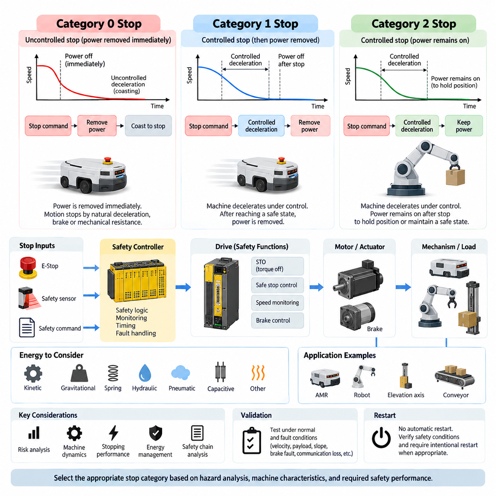
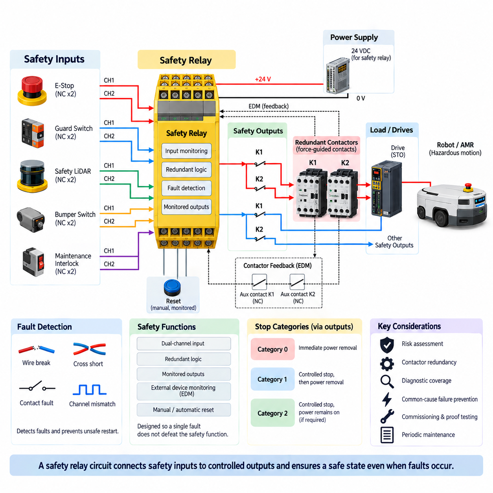
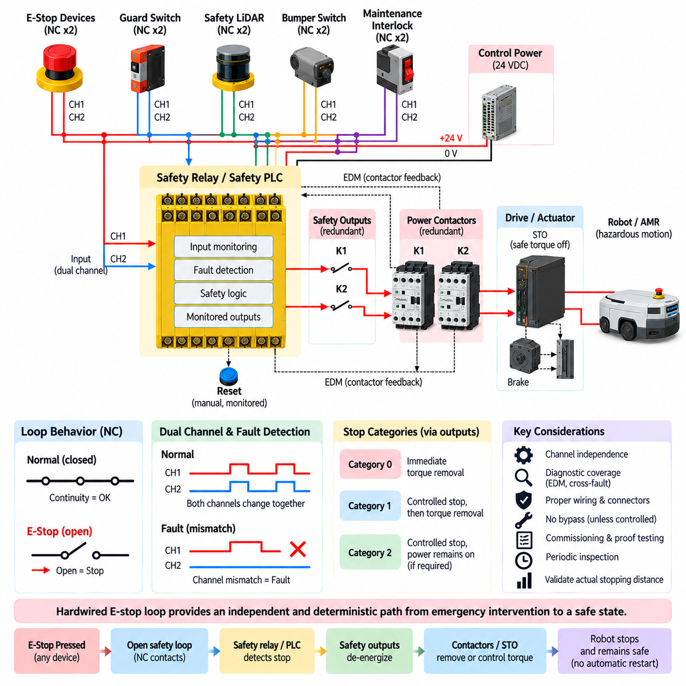
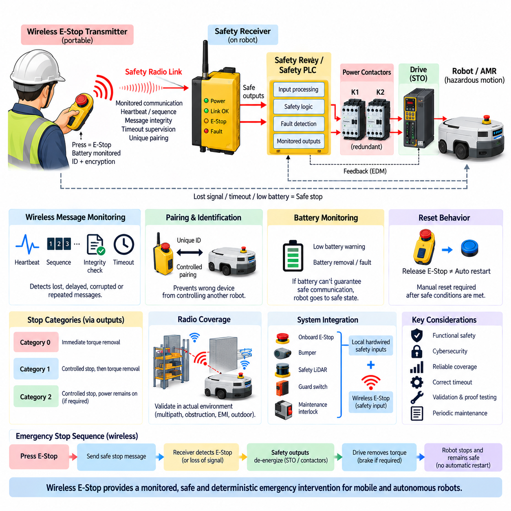
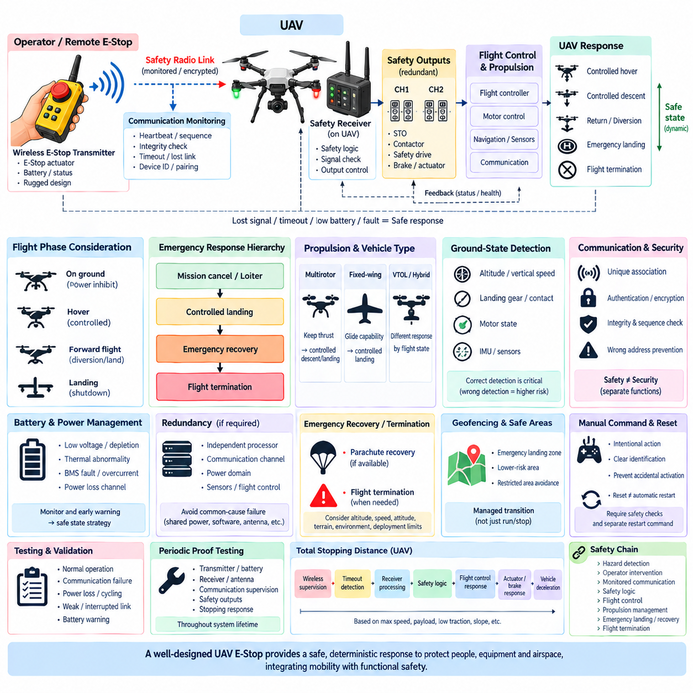
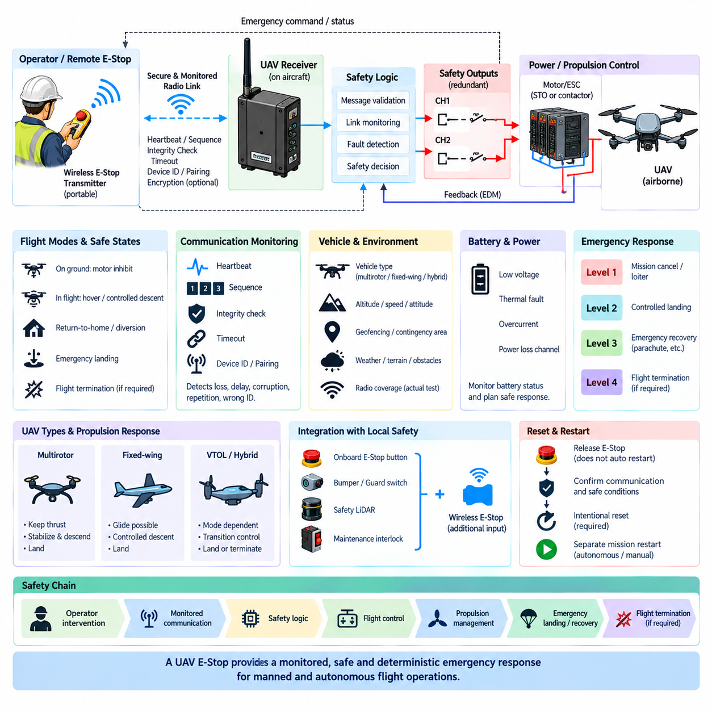

**Volume 12. Safety Architecture**

# Chapter 06. E-Stop Design

## 06.01. Category 0/1/2 Stop

{width="7.268055555555556in" height="7.268055555555556in"}

Stop functions in machinery and robotic systems are classified according to how energy is removed, how motion is brought to rest, and whether power remains available after the stopping sequence. Category 0, Category 1, and Category 2 stops provide different relationships between control, braking, and energy isolation. Selecting the correct category is therefore a safety architecture decision rather than simply choosing how quickly a motor should stop.

A Category 0 stop is an uncontrolled stop achieved by immediately removing power from the machine actuators. The term uncontrolled does not mean that the resulting motion is unpredictable; it means that the stopping process is not actively controlled by the normal drive system after the stop command. Motors may coast, mechanical brakes may engage, and stored kinetic energy dissipates according to the physical characteristics of the mechanism.

Category 0 is appropriate when immediate removal of actuator power provides the safest response to a hazardous condition. A typical implementation may interrupt motor torque through contactors, safety relays, or a certified drive safety function. However, removing electrical power does not guarantee instantaneous mechanical stopping. A moving AMR, rotating joint, elevated load, or high-inertia mechanism can continue moving after torque generation has been disabled.

The stopping distance of a Category 0 system must therefore be evaluated using the actual mechanical dynamics of the machine. Vehicle mass, payload, wheel friction, slope, drivetrain resistance, brake response, actuator inertia, and environmental conditions can significantly affect the final stopping distance. Safety validation must consider worst-case conditions because simply demonstrating that electrical power has been disconnected does not demonstrate that hazardous motion has ended.

A Category 1 stop uses a controlled stopping process before actuator power is removed. The control system first commands the machine to decelerate using the available drive or braking functions. After the controlled motion reaches a defined safe state, power capable of producing hazardous motion is removed. This approach can provide shorter, smoother, and more predictable stopping behavior for systems whose drives can actively manage deceleration.

The transition between controlled deceleration and final power removal is critical in Category 1 architecture. The safety system must ensure that power removal occurs after the intended stopping sequence or when a defined timeout is exceeded. If the normal deceleration process fails, the architecture must still move toward a safe condition. Consequently, Category 1 implementation often combines drive control, safety monitoring, timing supervision, and independent torque-removal mechanisms.

For an AMR, Category 1 stopping can be advantageous because abrupt torque removal may allow the vehicle to coast farther than an actively controlled braking command. The drive can reduce velocity according to a validated deceleration profile and subsequently disable torque production. Nevertheless, the controlled portion of the stop cannot be treated as inherently safe merely because software commands zero velocity. The complete safety chain and its failure behavior must be analyzed.

A Category 2 stop differs fundamentally because the machine performs a controlled stop while power remains available to the actuators after stopping. The drive may maintain torque to hold position, preserve a controlled state, or support a process that cannot safely release actuator energy immediately. This capability can be useful for certain robotic mechanisms, but maintaining actuator power means that additional measures are required to prevent unintended or unexpected motion.

Category 2 can be particularly relevant to mechanisms in which removal of actuator torque could itself create a hazard. A vertically loaded axis, articulated manipulator, balancing platform, or mechanically unstable mechanism may require active torque to maintain its position. In such cases, the designer must distinguish between energy that is necessary to maintain a safe state and energy that could initiate hazardous motion if a control or hardware failure occurs.

The three categories should therefore not be interpreted as progressively higher safety levels. Category 0 is not automatically safer than Category 1, and Category 2 is not inherently inferior because power remains available. Each category describes a stopping behavior and an energy-state strategy. The appropriate choice depends on the hazard analysis, machine dynamics, actuator characteristics, required stopping performance, and consequences of both continued motion and sudden energy removal.

Emergency stopping and operational stopping must also be distinguished. A robot may perform ordinary production stops thousands of times using normal motion control, while an emergency stop is intended to respond to an abnormal hazardous situation. The emergency-stop architecture must not depend solely on ordinary application software if a software fault could defeat the required safety response. Safety-related control functions therefore require appropriately designed and validated hardware and software paths.

Modern servo drives provide safety functions that can support these architectures. Safe Torque Off can prevent the drive from generating motor torque, while controlled safety functions can supervise speed or stopping behavior before torque is disabled. These functions do not eliminate the need for system-level analysis. The designer must evaluate the complete path from the initiating device through safety logic, communication, drive electronics, motor, brake, transmission, and mechanical load.

Stored energy is another important consideration. Removing electrical torque does not necessarily eliminate gravitational, pneumatic, hydraulic, spring, capacitive, or kinetic energy. A robot arm can fall after torque removal, a mobile platform can roll on a slope, and a rotating assembly can continue spinning. Stop-category selection must consequently be coordinated with mechanical brakes, holding devices, energy isolation, discharge mechanisms, and other measures required to reach a genuinely safe state.

For mobile robots, the stopping concept should also account for perception and navigation behavior. A protective sensor may first trigger controlled deceleration when an obstacle enters a warning region and request a safety stop when the protective boundary is violated. The resulting response can involve different stopping mechanisms depending on risk. Safety distance calculations must use the complete reaction and braking time rather than considering only the sensor or controller response.

The electrical architecture should define exactly which energy paths remain active for each stop condition. Traction drives, steering actuators, manipulators, brakes, safety controllers, sensors, communication devices, and computing systems do not necessarily need to lose power simultaneously. Maintaining diagnostic and safety-control power can be desirable even when hazardous actuator torque is removed, because the system may need to identify the cause of the stop and supervise the safe state.

Restart behavior is as important as the stop itself. Restoration of power or release of an emergency-stop device should not automatically cause hazardous motion. The system should verify relevant safety conditions and require an intentional restart procedure where appropriate. For autonomous robots, this distinction is especially important because mission software may otherwise interpret restored actuator availability as permission to resume a previously interrupted trajectory or task.

Validation should demonstrate the complete Category 0, 1, or 2 behavior under normal conditions and credible fault conditions. Testing should include maximum payload, maximum permitted velocity, minimum available traction, slopes where applicable, communication interruption, drive faults, brake faults, sensor-triggered stops, and loss of control commands. Measured reaction time and stopping distance should be compared with the assumptions used during safety design.

A robust robot safety architecture ultimately treats Category 0, Category 1, and Category 2 as system-level stop strategies connecting functional safety with real mechanical behavior. The objective is not merely to issue a stop command, but to guarantee that hazardous motion transitions to a defined safe condition within the required time and distance. Correct selection integrates risk assessment, drive safety, energy management, braking physics, diagnostics, restart control, and validation into one coherent stopping concept.

## 06.02. Safety Relay Circuit

{width="7.268055555555556in" height="7.268055555555556in"}

A safety relay circuit is a dedicated safety-related control arrangement used to detect hazardous conditions and force machinery or robotic equipment toward a defined safe state. Unlike an ordinary control relay, a safety relay is designed around fault detection, redundancy, monitored switching, and predictable failure behavior. It commonly interfaces emergency-stop devices, guard switches, safety sensors, contactors, drives, and other elements forming the machine safety chain.

The fundamental purpose of the circuit is to ensure that a single foreseeable electrical fault does not silently prevent the required safety function. An emergency-stop pushbutton, for example, may use two normally closed channels connected independently to the safety relay. The relay compares the states of these channels and detects discrepancies that can indicate broken wiring, contact faults, cross-circuits, or other abnormal conditions depending on the implemented architecture.

Dual-channel input architecture is widely used because two independent signal paths provide greater diagnostic capability than a single control line. When both channels change state correctly, the safety relay recognizes a valid request. If only one channel changes or the channels behave inconsistently, the circuit can enter a fault state rather than assuming normal operation. The actual diagnostic capability depends on the relay, wiring topology, connected devices, and safety design requirements.

Inside the safety relay, redundant processing and switching paths are typically arranged so that failure of one internal element does not necessarily eliminate the safety response. Force-guided or positively guided relay contacts can support monitoring because normally open and normally closed contacts are mechanically linked in a defined manner. Modern electronic safety relays may perform equivalent safety logic using redundant semiconductor processing while retaining monitored safety outputs.

The safety outputs normally control the energy path associated with hazardous motion rather than merely sending a software stop request. They may operate redundant contactors, enable safe drive inputs, control Safe Torque Off interfaces, or activate another safety-rated subsystem. This separation is important because the ordinary robot controller, industrial PC, navigation computer, or application software may itself be one of the possible sources of failure during a hazardous event.

External Device Monitoring, commonly abbreviated EDM, allows the safety relay to verify that downstream switching devices have actually returned to their expected safe condition. Auxiliary feedback contacts from contactors can be connected to the monitoring loop. If a contactor welds closed or fails to release, the feedback state remains incorrect and the safety relay prevents reset or restart, thereby exposing a dangerous failure that might otherwise remain latent.

Contactor redundancy is frequently combined with safety relays when electrical power must be disconnected from motors or other hazardous loads. Two series-connected contactors can provide independent interruption paths so that one welded power contact does not necessarily prevent isolation. Their auxiliary contacts should be monitored according to the intended architecture. Merely installing two contactors without appropriate feedback and fault detection does not automatically create a robust redundant safety function.

Reset circuitry is another essential part of safety relay design. A manual reset normally requires an intentional action after the initiating safety condition has been cleared. The reset signal should not itself initiate hazardous motion, and holding the reset device continuously active should not defeat the intended restart behavior. Monitored reset functions can detect certain abnormal conditions and require a valid transition before the safety outputs are re-enabled.

Automatic reset may be acceptable for particular safety functions when risk assessment and applicable requirements permit it, but it requires careful consideration. Restoring a guard switch, clearing a safety sensor, or releasing an emergency-stop device should not unexpectedly restart dangerous motion. In robotic systems, safety permission and operational motion commands should therefore remain conceptually separated so that restoration of the safety circuit does not automatically resume an interrupted autonomous mission.

Emergency-stop integration commonly uses normally closed contacts so that opening the circuit represents the stop condition. This approach supports detection of some wiring failures because a broken conductor can produce the same safe-direction response as operation of the emergency-stop device. However, normally closed wiring alone does not guarantee complete fault detection. Shorts between channels, shorts to supply, common-cause failures, and incorrect wiring must also be considered during circuit design.

Cross-fault detection becomes particularly important in dual-channel circuits routed through the same cable or installation environment. If the two channels become electrically connected, both signals may appear healthy despite a fault unless the safety device can identify the condition. Safety relays may use separate test pulses or dynamically monitored inputs to detect particular short-circuit conditions. Wiring practices must preserve the diagnostic assumptions on which the safety function depends.

The output side must also be coordinated with actuator behavior. Removing contactor power may implement an immediate Category 0 stop, while controlled drive deceleration followed by torque removal can support a Category 1 strategy. A safety relay therefore should not be viewed independently from the stopping concept. Its outputs, drive functions, mechanical brakes, stored energy, and machine dynamics must collectively achieve the safe state required by the hazard analysis.

For an AMR, a safety relay circuit can connect emergency-stop buttons, safety LiDAR outputs, bumper switches, maintenance interlocks, and drive safety interfaces into a safety-related control path. When a protective condition occurs, traction torque can be removed or a safety-rated stopping sequence initiated independently of the navigation computer. This prevents the safety response from relying entirely on ROS, autonomous navigation software, AI perception, or ordinary motion-control commands.

Mobile robots introduce additional architectural considerations because propulsion, steering, brakes, sensors, computing equipment, and communication systems may require different power states during a safety stop. It is often unnecessary and undesirable to remove all electrical power from the robot. Safety logic and diagnostic systems can remain energized while hazardous actuator torque is disabled, allowing the robot to supervise the stopped condition and preserve information required for troubleshooting.

Power-supply design is therefore part of the safety relay circuit rather than an unrelated electrical detail. The designer must consider undervoltage, loss of control power, supply transients, grounding faults, fuse coordination, and the behavior of safety outputs during power interruption and restoration. The circuit should transition predictably when its operating voltage leaves the permitted range and should not generate an uncontrolled restart when normal voltage returns.

Safety relay selection must be coordinated with the required safety performance established by risk assessment and the safety-related control system architecture. The number of channels alone does not determine the achieved Performance Level or Safety Integrity Level. Diagnostic coverage, component reliability, architecture, common-cause failure measures, downstream devices, wiring, environmental conditions, and systematic design practices all contribute to the integrity of the complete safety function.

Common-cause failures deserve particular attention because redundancy provides limited benefit when both channels can fail for the same reason. Shared connectors, damaged cable bundles, contamination, excessive temperature, incorrect supply voltage, electromagnetic interference, mechanical damage, or systematic wiring errors can affect multiple channels simultaneously. Physical separation, appropriate component selection, protected routing, EMC design, verification, and disciplined installation practices help preserve independence between redundant paths.

Commissioning must verify more than whether pressing the emergency-stop button makes the machine stop. Each input channel should be exercised, feedback monitoring should be checked, reset behavior should be verified, and representative faults should be introduced where safely practicable. Tests should confirm that welded or non-switching contactors, interrupted conductors, channel discrepancies, power cycling, and other relevant conditions produce the intended response and inhibit unsafe restart.

Periodic proof testing and maintenance are equally important because safety circuits contain mechanical contacts, connectors, wiring, pushbuttons, and switching devices that can degrade over time. Diagnostic functions detect many failures but cannot necessarily detect every dangerous condition continuously. Inspection and functional testing should therefore verify emergency-stop devices, contactor feedback, cable integrity, safety sensor interfaces, reset functions, and actual actuator response throughout the operational life of the robot.

A properly engineered safety relay circuit ultimately forms a deterministic bridge between hazard detection and physical risk reduction. Its effectiveness comes not from the relay module alone but from the complete chain of input devices, redundant wiring, diagnostic logic, monitored outputs, contactors or safe drive interfaces, actuator behavior, reset control, and validation. When these elements are designed coherently, hazardous motion can be interrupted even when ordinary control software or automation functions fail.

## 06.03. Hardwired E-Stop Loop

{width="7.268055555555556in" height="7.268055555555556in"}

A hardwired emergency-stop loop is a dedicated electrical safety path that connects emergency-stop devices directly to safety-rated control components without depending on ordinary application software, operating systems, navigation computers, or network services. Its purpose is to provide a deterministic path from human activation of an E-stop device to suppression of hazardous machine motion, even when the normal robot control system is unavailable or malfunctioning.

The term hardwired emphasizes that the essential stop request is transmitted through physical electrical conductors and safety-related contacts rather than through a conventional software message. In a typical robot, normally closed contacts in emergency-stop pushbuttons are wired to a safety relay, safety PLC input, or certified drive safety interface. Opening the loop causes the safety system to recognize the stop request and initiate the predefined safe-state transition.

Normally closed contacts are commonly selected because the energized healthy state requires electrical continuity through the loop. Pressing an E-stop opens the contacts, but a broken conductor, disconnected connector, or loss of certain control signals can also remove continuity and drive the system toward the safe direction. This principle provides useful fail-safe behavior, although additional diagnostics are necessary to detect faults such as cross-channel shorts or bypassed contacts.

A dual-channel hardwired loop improves fault tolerance and diagnostic capability by providing two independently monitored electrical paths. An emergency-stop device can contain two positively opening normally closed contacts, each assigned to a separate channel. The safety controller evaluates both channels and expects them to change state consistently. A disagreement can indicate a contact failure, conductor fault, wiring error, or other abnormal condition requiring fault handling.

Channel independence is important because two wires routed together do not automatically constitute meaningful redundancy. A common connector failure, crushed cable, conductive contamination, incorrect terminal connection, or short circuit can affect both channels simultaneously. Safety design must therefore consider physical routing, connector architecture, cable protection, test pulses, input monitoring, and common-cause failure measures so that the intended diagnostic capability is preserved throughout the installation.

Multiple emergency-stop devices may be distributed around a robot, machine, production cell, charging station, or maintenance area. Their safety contacts can be incorporated into the overall hardwired stopping architecture so that operation of any required device causes the hazardous function to stop. The topology must still support the required diagnostics, because simply placing many contacts in one long series circuit can make certain faults difficult to identify and troubleshoot.

The hardwired E-stop loop normally terminates at safety-rated logic rather than directly switching the full motor current through the emergency-stop pushbutton. A safety relay or safety PLC interprets the input state and operates appropriately rated safety outputs. These outputs can control redundant power contactors, Safe Torque Off inputs, drive enable circuits, mechanical brake interfaces, or other safety-related elements responsible for eliminating or controlling hazardous actuator energy.

Safe Torque Off, commonly abbreviated STO, is particularly useful in modern robot drive systems because it prevents the drive from producing motor-generating torque without necessarily disconnecting all electrical power from the drive electronics. A hardwired E-stop loop can command STO through certified safety outputs, allowing communication, diagnostics, and low-risk electronics to remain powered while hazardous propulsion or joint torque is suppressed according to the intended safety architecture.

The relationship between the E-stop loop and the selected stopping category must be explicitly defined. An immediate transition to torque removal can support a Category 0 stop, while systems requiring controlled deceleration may first perform a safety-rated controlled stop and then remove torque as part of a Category 1 strategy. The hardwired loop therefore represents the safety command path, but actual stopping performance depends on drives, brakes, mechanical dynamics, and stored energy.

For an AMR, immediately removing traction torque does not necessarily produce the shortest stopping distance. Vehicle mass, payload, wheel-ground friction, drivetrain characteristics, slope, velocity, and mechanical braking determine how far the platform continues moving. Consequently, the E-stop architecture must be validated against actual robot dynamics. Electrical interruption time alone is insufficient for demonstrating that the robot reaches a safe state within the required distance.

Mechanical brakes require similar consideration. A spring-applied, electrically released brake may automatically engage when its control power is removed, providing a useful fail-safe mechanism for selected applications. However, brake engagement delay, stopping torque, wear, thermal condition, payload, and failure modes must be considered. On vertical axes or manipulators, brake behavior is particularly important because uncontrolled load movement can occur when actuator torque disappears.

Feedback monitoring allows the safety system to confirm that downstream devices actually reached their commanded state. When redundant contactors are used, normally closed auxiliary contacts can return status information through an External Device Monitoring loop. If a contactor becomes welded or fails to release, the feedback does not return correctly, allowing the safety logic to block reset and expose the failure before another operating cycle begins.

Reset is intentionally separated from releasing the emergency-stop actuator. Twisting or pulling an E-stop button back to its normal position should restore the input condition but should not automatically initiate hazardous movement. A monitored manual reset can require a deliberate action after the safety system confirms that the input channels, output devices, and relevant feedback paths are in acceptable states. Motion restart remains a separate operational command.

This distinction is particularly important for autonomous robots because mission software may retain the route or task that existed before the emergency stop. Once the E-stop loop is restored, the robot should not automatically continue that trajectory merely because drive torque becomes available again. Safety permission, operational enable, and autonomous mission resume should be treated as distinct states so that restarting motion requires an intentional and validated transition.

A hardwired E-stop architecture does not imply that every component of the robot must lose power. Safety controllers, diagnostic processors, safety sensors, communication devices, and logging systems may remain energized while hazardous actuator energy is removed. Maintaining these functions can improve fault diagnosis and safe-state supervision. The architecture should therefore distinguish hazardous energy isolation from complete system power shutdown and define each power domain explicitly.

Cable and connector engineering are central to the reliability of a distributed E-stop loop. Mobile robots are exposed to vibration, repeated flexing, connector movement, abrasion, contamination, and maintenance activity. Conductors should be selected and routed to withstand the expected environment, while connectors should prevent accidental interchange or disconnection where practical. Diagnostic assumptions made during safety analysis must remain valid after installation and throughout service life.

Bypassing the E-stop loop for maintenance, debugging, or commissioning creates a particularly significant hazard. Temporary jumpers or undocumented wiring changes can defeat the safety function while leaving the machine apparently operational. Any authorized bypass mechanism must therefore be strictly controlled, clearly indicated, limited to defined operating conditions, and incorporated into the risk assessment. Informal bypassing should never become a normal method of keeping equipment operational.

For AMRs and other mobile systems, the boundary between hardwired and networked safety requires careful architecture. Local E-stop buttons can remain directly connected to onboard safety logic, while fleet systems or remote stations may request additional safety actions through safety-rated communication where appropriate. Ordinary Wi-Fi, ROS messages, MQTT commands, or fleet-management commands should not silently replace the independent local safety path when that path is required for the safety function.

Commissioning should test every emergency-stop device individually and verify both input channels, safety outputs, contactor or STO behavior, brake response, feedback monitoring, and reset logic. Representative faults such as a disconnected conductor, channel mismatch, welded contactor feedback, power interruption, or connector fault should be evaluated where safely practicable. Testing must confirm not only that motion stops, but also that detected faults prevent an unsafe restart.

Periodic inspection is required because hardwired circuits are physical systems subject to aging and damage. Emergency-stop contacts can wear, cables can break internally, terminals can loosen, connectors can corrode, and maintenance modifications can alter the original topology. Functional proof testing and visual inspection should therefore be integrated into the maintenance plan, with detected changes documented and evaluated against the original safety assumptions and required safety performance.

A properly engineered hardwired E-stop loop ultimately provides an independent and deterministic connection between emergency intervention and physical hazard reduction. Its effectiveness depends on more than the red pushbutton itself: dual-channel wiring, safety logic, fault detection, monitored outputs, STO or contactors, braking behavior, reset control, cable integrity, and validation must operate as one safety chain. This enables hazardous robot motion to be suppressed even when ordinary control or autonomous software fails.

## 06.04. Wireless E-Stop Design

{width="7.268055555555556in" height="7.268055555555556in"}

A wireless emergency-stop system extends the emergency intervention function beyond a fixed hardwired pushbutton by transmitting a safety-related stop request over a radio communication link. It is particularly useful for mobile robots, AMRs, outdoor autonomous vehicles, large machines, and distributed work areas where an operator cannot remain beside a stationary E-stop. The wireless link must nevertheless be engineered as part of the safety function rather than treated as an ordinary remote-control connection.

The fundamental design objective is to ensure that loss, corruption, delay, duplication, or unintended acceptance of a wireless message cannot silently defeat the required emergency-stop response. A conventional radio packet indicating "stop" is insufficient by itself. The transmitter, communication protocol, receiver, safety logic, output devices, drives, brakes, and actuators must collectively provide predictable behavior under normal operation and credible communication or hardware faults.

A typical architecture contains a portable emergency-stop transmitter and a safety-rated receiver installed on the robot or machine. Pressing the E-stop actuator changes the transmitter into a defined emergency state, which is communicated to the receiver using a monitored safety protocol. The receiver then changes its safety outputs, allowing a safety relay, safety PLC, STO interface, or equivalent safety subsystem to initiate the required stopping sequence independently of ordinary robot application software.

The radio link must be continuously supervised because absence of communication is itself safety-relevant information. The receiver should not simply wait indefinitely for an explicit stop packet. Periodic safety telegrams, heartbeat monitoring, sequence supervision, or equivalent mechanisms can demonstrate that the transmitter and receiver remain connected. If valid communication disappears beyond a defined timeout, the receiver can transition its outputs toward the predetermined safe state.

Timeout selection requires careful engineering. A very long timeout can increase the time between loss of the wireless safety link and initiation of the stop, while an unnecessarily short timeout can create frequent nuisance stops because of temporary radio disturbances. The selected value must therefore be incorporated into the complete safety reaction time together with transmitter processing, radio transmission, receiver processing, safety logic, drive response, braking, and mechanical stopping time.

Message integrity is another central requirement. Safety-related communication should detect corrupted, repeated, out-of-sequence, delayed, or incorrectly addressed messages according to the implemented safety protocol. Sequence counters, identifiers, time expectations, integrity checks, and other defensive mechanisms can help prevent a corrupted communication event from being interpreted as a valid healthy state. The safety concept must consider communication failures rather than assuming the radio channel is reliable.

The receiver must also distinguish the intended transmitter from unrelated wireless devices. Unique association, controlled pairing, device identification, and authenticated configuration can reduce the possibility that another transmitter accidentally controls the wrong robot. In environments containing many AMRs or machines, the relationship between each wireless E-stop device and its controlled safety zone must be obvious to operators and deterministically maintained by the system architecture.

Safety-related communication integrity and cybersecurity should be treated as related but distinct concerns. Safety mechanisms protect the system against communication errors and dangerous failures, while security mechanisms address unauthorized access, malicious commands, impersonation, or configuration changes. Encryption and authentication can support protection of the wireless channel, but cybersecurity features alone do not establish the functional safety integrity required for an emergency-stop function.

Radio coverage must be validated in the actual operating environment. Factory structures, metal racks, machinery, walls, vehicles, people, electromagnetic interference, multipath propagation, and changing robot positions can alter signal quality. Outdoor systems may encounter terrain, buildings, weather exposure, long distances, and moving obstructions. A wireless E-stop design should therefore be validated across the complete authorized operating area rather than relying solely on nominal radio range specifications.

The system must define what happens when the transmitter moves outside its permitted range. Loss of range should normally be treated as a detected communication condition rather than leaving the robot indefinitely enabled without emergency intervention capability. Depending on the risk assessment and operational concept, communication loss can initiate a safety stop or prevent continued hazardous operation. The behavior must be deterministic, documented, and included in stopping-time analysis.

Portable transmitters introduce additional failure modes associated with batteries. Low battery voltage, complete battery depletion, battery removal, charging faults, and unexpected transmitter shutdown must not create an undetected loss of the safety function. Battery condition should therefore be supervised, with sufficiently early indication to the operator. If the transmitter can no longer guarantee reliable safety communication, the system should transition according to the defined safe-state strategy.

The physical emergency-stop actuator on the wireless transmitter should retain the recognizable characteristics expected of an emergency control. Its operating state should be clear, intentional activation should be straightforward, and accidental operation should be minimized without making emergency access difficult. The transmitter enclosure, controls, battery retention, antenna, and mechanical construction should also withstand the drops, vibration, contamination, moisture, and handling expected in the intended environment.

Reset behavior requires particular attention because radio communication makes remote state transitions possible. Releasing the wireless E-stop actuator should not automatically restart hazardous motion. Restoration of the communication link should likewise not be interpreted as permission to resume operation. The safety system should first establish valid communication and acceptable safety conditions, after which an intentional reset and a separate operational restart command can be required according to the machine risk assessment.

For autonomous mobile robots, safety permission and mission execution should remain separate. An AMR may preserve its navigation path, destination, payload task, or fleet assignment while stopped. When the wireless E-stop is released, the navigation computer should not automatically continue simply because traction becomes available. Safety reset, drive enable, localization confirmation, environmental verification, and mission resume can be managed as distinct transitions within the overall robot architecture.

The wireless receiver can be integrated with the local hardwired E-stop architecture rather than replacing it. Onboard emergency-stop buttons, bumpers, safety LiDAR, guard switches, and maintenance interlocks can continue to use direct safety-rated wiring, while the wireless system contributes an additional monitored safety input. This layered arrangement preserves local emergency intervention even if the wireless transmitter is unavailable, damaged, discharged, or outside its intended operating area.

The output side of the wireless E-stop system should use the same disciplined safety principles applied to hardwired circuits. Redundant safety outputs can command STO inputs, monitored contactors, safety drives, or controlled stopping functions. Feedback monitoring can verify that downstream devices reached the expected state. The radio link therefore changes how the emergency request reaches the safety controller, but it does not remove the need for safe actuator-energy control.

Stopping category selection remains a system-level decision. A received wireless emergency command may initiate immediate torque removal corresponding to a Category 0 strategy, or it may trigger safety-rated controlled deceleration followed by torque removal as part of Category 1. The correct behavior depends on robot dynamics, braking capability, payload, slope, actuator characteristics, stored energy, and the hazards associated with both continued motion and abrupt power removal.

For an AMR, total stopping distance includes more than mechanical braking distance. Wireless transmission supervision, timeout detection, receiver processing, safety-controller response, drive reaction, brake engagement, and vehicle deceleration all contribute to the distance traveled after an emergency condition occurs. Validation must therefore measure the complete end-to-end response under maximum permitted velocity, representative payload, low-traction conditions, slopes where applicable, and relevant communication disturbances.

A wireless E-stop should not normally depend on ordinary Wi-Fi application messages, ROS topics, MQTT commands, REST requests, or fleet-management traffic unless the complete communication path has been specifically engineered and validated for the required safety function. An operator command sent through an ordinary network can provide a useful operational stop, but operational connectivity should not automatically be assumed equivalent to a safety-rated emergency-stop communication channel.

Commissioning should test both successful operation and communication failures. Tests should include E-stop activation at representative locations, transmitter power loss, receiver power cycling, weak or interrupted radio coverage, battery warnings, communication timeout, incorrect transmitter association, safety-output operation, feedback monitoring, reset behavior, and prevention of automatic restart. The objective is to verify the complete safety response rather than merely demonstrate that a remote button can stop the robot.

Periodic proof testing is especially important because the wireless safety function combines electronic, radio, mechanical, and battery-dependent elements. Transmitters may be dropped, batteries degrade, antennas become damaged, operating environments change, and additional wireless equipment may alter radio conditions. Maintenance should therefore verify the actuator, transmitter, battery, receiver, communication supervision, safety outputs, stopping response, and authorized operating coverage throughout the system life.

A robust wireless E-stop architecture ultimately combines mobility with the deterministic principles expected from functional safety. The wireless channel is only one part of a larger safety chain extending from the operator through monitored communication, safety logic, safety outputs, drives, brakes, and mechanical motion. When communication loss, hardware faults, energy control, reset behavior, stopping distance, and local backup functions are considered together, wireless emergency intervention can be integrated safely into mobile and autonomous robotic systems.

## 06.05. E-Stop for UAV

{width="7.268055555555556in" height="7.268055555555556in"}

{width="7.268055555555556in" height="7.268055555555556in"}

An emergency-stop concept for an unmanned aerial vehicle differs fundamentally from the E-stop architecture of a stationary machine or ground robot. Removing propulsion power from an AMR can bring the vehicle toward a safe state, whereas immediate thrust removal from an airborne UAV may create a more severe hazard by causing uncontrolled descent. UAV E-stop design must therefore define a safe emergency response according to flight phase, altitude, vehicle condition, surrounding environment, and remaining control authority.

The meaning of a safe state is consequently dynamic rather than fixed. While the UAV is on the ground, propulsion inhibition and motor torque removal may represent an appropriate safe condition. During flight, however, the preferred response may involve controlled hover, controlled descent, return-to-home, diversion to a predefined landing zone, emergency landing, or another flight-termination strategy. The selected response must reduce overall risk rather than simply remove electrical energy as quickly as possible.

A UAV emergency architecture should separate ordinary mission control from safety-related intervention. Navigation software, autonomous planning, AI perception, payload management, and communication services may continue performing normal functions, but a critical safety request should have an independent path capable of overriding mission commands. This prevents a failure in high-level autonomy from blocking an emergency transition when the aircraft must leave its normal operational state.

The emergency response can be organized as a hierarchy of progressively stronger actions. A recoverable anomaly may first trigger mission cancellation or controlled loitering, while a more serious navigation or propulsion problem may require an immediate controlled landing. If continued controlled flight is no longer possible, the architecture may transition toward an emergency recovery or flight termination function. The hierarchy should be determined by hazard analysis rather than by one universal stop command.

Propulsion control is particularly important because multirotor, fixed-wing, and hybrid UAVs react differently to loss of thrust. A multirotor normally requires continuous propulsion to remain airborne, while a fixed-wing aircraft may retain gliding capability after propulsion loss. A VTOL or hybrid aircraft may have different safe responses depending on whether it is hovering, transitioning, or flying forward. E-stop logic must therefore be coordinated with the physical flight architecture.

For multirotor UAVs, immediate motor shutdown during flight is generally unsuitable as a routine emergency response because the vehicle loses the thrust required for controlled flight. A safer response may command attitude stabilization followed by controlled descent or landing while propulsion remains available. Complete motor inhibition becomes more appropriate after touchdown, when continued rotor rotation itself may present the dominant hazard to personnel, equipment, or the aircraft.

Ground-state detection is therefore a critical part of propulsion shutdown logic. The flight controller can evaluate altitude, vertical velocity, landing gear or contact information, motor state, inertial measurements, and other available signals to determine whether the aircraft has landed. Once a valid landed condition is established, propulsion can be inhibited according to the safety concept. Incorrect ground detection must be considered because premature shutdown could transform a recoverable event into an uncontrolled fall.

Remote emergency intervention introduces communication considerations similar to wireless E-stop systems but with additional consequences for flight safety. A ground control station may transmit an emergency command through a monitored command-and-control link, but communication loss itself must have predefined behavior. The aircraft cannot depend indefinitely on receiving a future operator command. Lost-link logic should autonomously select an appropriate response such as hold, return, diversion, or landing according to the operational concept.

Communication monitoring should detect missing, delayed, repeated, corrupted, or incorrectly associated commands. Heartbeats, sequence supervision, message integrity checks, vehicle identifiers, and timeout mechanisms can support deterministic fault detection. In fleets containing multiple UAVs, an emergency command must be associated with the intended aircraft or safety group. Incorrect addressing could either fail to stop the hazardous UAV or unnecessarily disrupt another aircraft.

The timeout strategy must be compatible with aircraft dynamics. A timeout that is acceptable for a slowly moving ground robot may be excessive for a high-speed UAV. Total emergency response time includes fault detection, communication supervision, safety logic, flight-controller reaction, actuator response, vehicle dynamics, and the time required to reach the intended safe condition. Safety analysis should therefore evaluate the complete end-to-end response rather than communication latency alone.

Redundancy can be applied to critical emergency paths where required by the safety objectives. Independent processors, communication channels, power domains, sensors, or flight-control functions may reduce dependence on a single failure point. However, redundant channels provide limited protection when they share the same vulnerable power supply, software defect, connector, antenna location, environmental exposure, or configuration error. Common-cause failure analysis remains essential.

Power architecture has a special role in UAV emergency design because disconnecting the main battery can simultaneously eliminate propulsion, flight control, navigation, communication, and recovery functions. A safety strategy should therefore distinguish hazardous-energy isolation from complete electrical shutdown. Flight computers, essential sensors, command links, and recovery controllers may require continued power while propulsion is controlled, degraded, or selectively inhibited during an emergency response.

Battery emergencies require their own response logic. Severe undervoltage, thermal abnormality, battery-management faults, excessive current, or loss of one power channel can reduce the remaining flight time and control capability. Instead of treating every electrical fault as a command for immediate power isolation, the UAV may need to prioritize rapid controlled landing. The response should balance the hazard of continuing powered flight against the hazard created by sudden loss of airborne control.

Motor and propulsion faults must similarly be interpreted according to vehicle configuration. A multirotor with sufficient propulsion redundancy may continue controlled flight after losing one motor, allowing diversion or emergency landing. A vehicle without sufficient thrust margin may need an immediate descent strategy. The safety architecture should identify which failures remain controllable, which require degraded flight, and which cross the threshold into emergency recovery or termination.

Emergency recovery systems can provide an additional safety layer when conventional controlled flight becomes impossible. Depending on the UAV architecture, this may include a parachute recovery system or another means of reducing impact energy. Such a recovery function must be coordinated with altitude, airspeed, vehicle attitude, rotor condition, deployment constraints, and the surrounding environment. Deployment itself should be treated as a safety-critical transition rather than an ordinary actuator command.

Flight termination represents a different concept from normal emergency landing. Its objective is to prevent continued uncontrolled or unauthorized flight when maintaining the current trajectory presents an unacceptable hazard. A termination function may inhibit propulsion or otherwise constrain further flight according to the vehicle architecture, but the resulting ground risk must be considered. Terminating flight over people or critical infrastructure can create a hazard even when it removes the original airborne threat.

Geofencing and predefined contingency areas can support emergency decision-making. When a serious fault occurs, the aircraft can evaluate whether controlled flight remains possible and direct itself toward an emergency landing zone or lower-risk area. This converts the E-stop concept from a binary run/stop decision into a managed transition between flight states. The architecture should nevertheless ensure that ordinary mission planning cannot override a higher-priority safety response.

Manual emergency commands should also be protected against accidental activation. An operator interface can require deliberate control actions, clear aircraft identification, and unambiguous indication of the requested emergency state. At the same time, excessive confirmation steps can delay intervention during a rapidly developing hazard. Human-machine interface design must balance prevention of inadvertent commands with the need for fast and understandable emergency action.

Reset and restart behavior must account for the aircraft state. Clearing an emergency command should not automatically re-enable propulsion or resume the interrupted mission. After landing, the system may require inspection, fault acknowledgement, safety verification, and intentional re-arming before motors can operate again. For autonomous UAVs, mission data may remain stored, but restoration of safety permission should remain separate from authorization to resume autonomous flight.

Validation should examine emergency behavior across representative flight phases and fault conditions. Ground operation, takeoff, hover, forward flight, transition, approach, and landing can produce different consequences from the same command. Testing and simulation should evaluate communication loss, propulsion faults, sensor faults, battery abnormalities, controller failures, emergency landing logic, recovery functions, and restart inhibition while considering the operational envelope of the aircraft.

A robust UAV E-stop architecture therefore replaces the simplistic concept of "remove power to stop" with a state-dependent emergency management strategy. The safety chain extends from hazard detection and operator intervention through communication supervision, independent safety logic, flight control, propulsion management, emergency landing, recovery, and possible flight termination. The objective is always to transition the aircraft toward the lowest-risk achievable state while preserving sufficient control authority to prevent the emergency action itself from creating a greater hazard.
