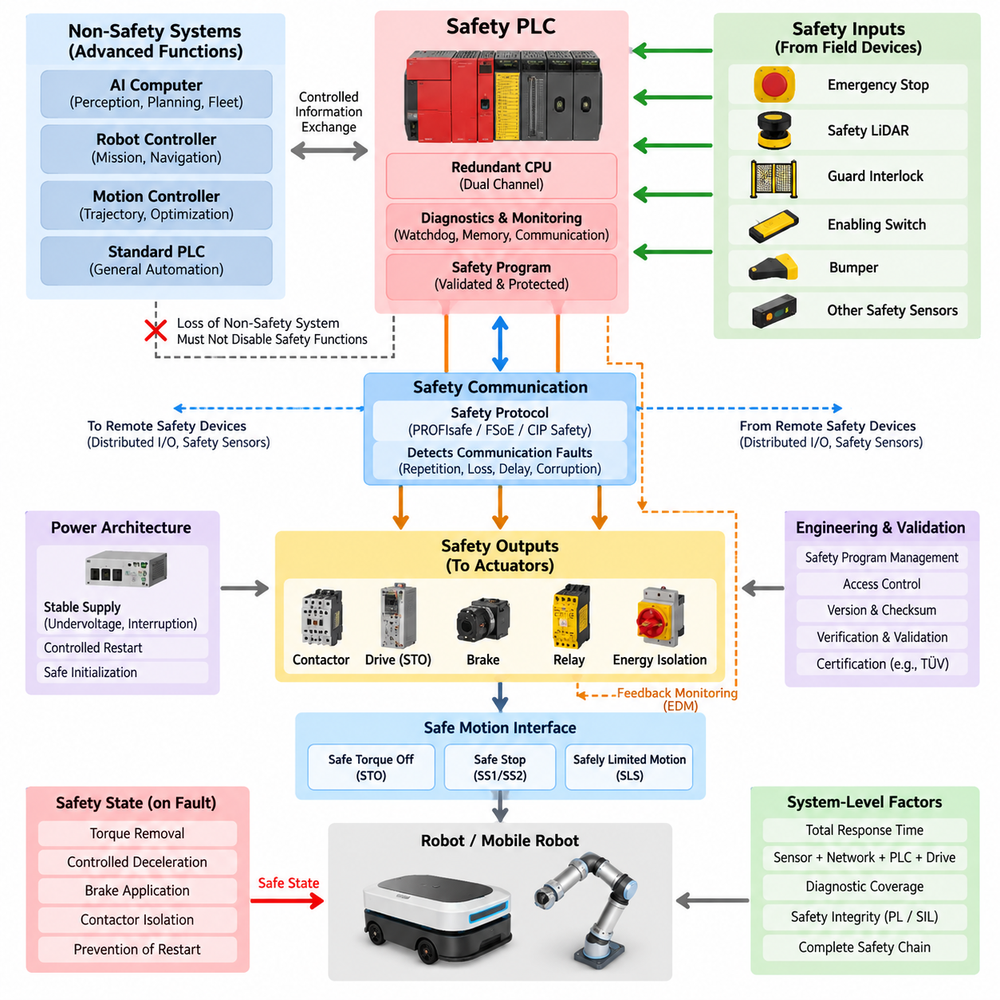
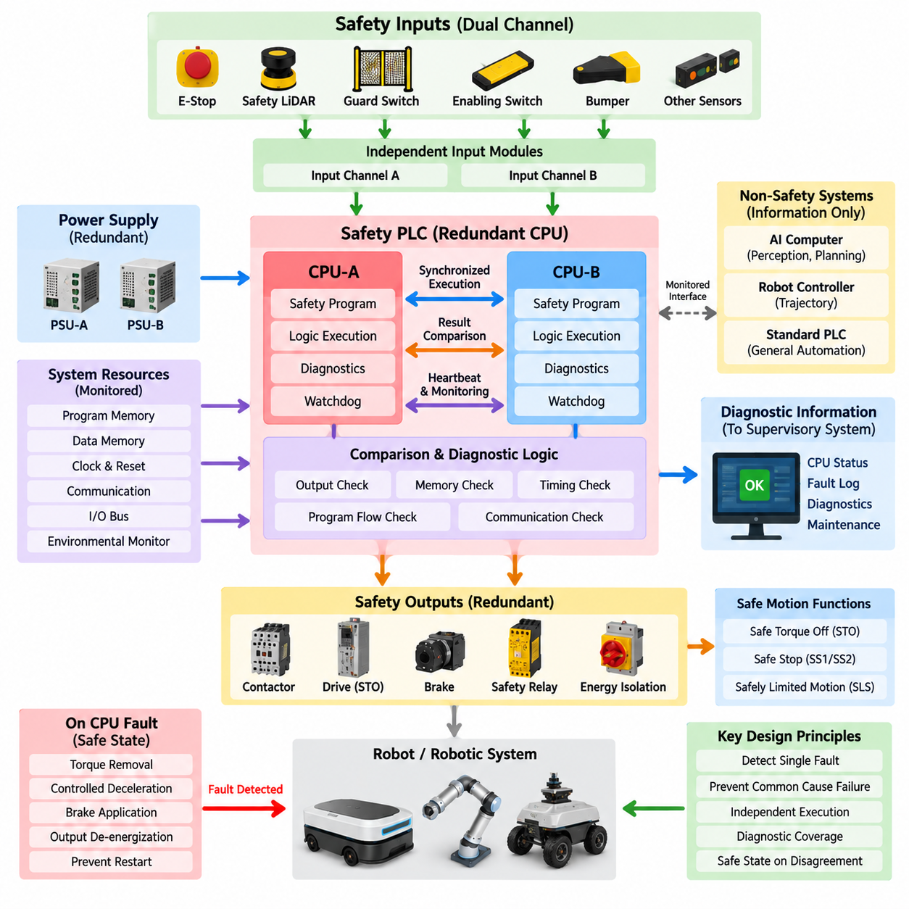
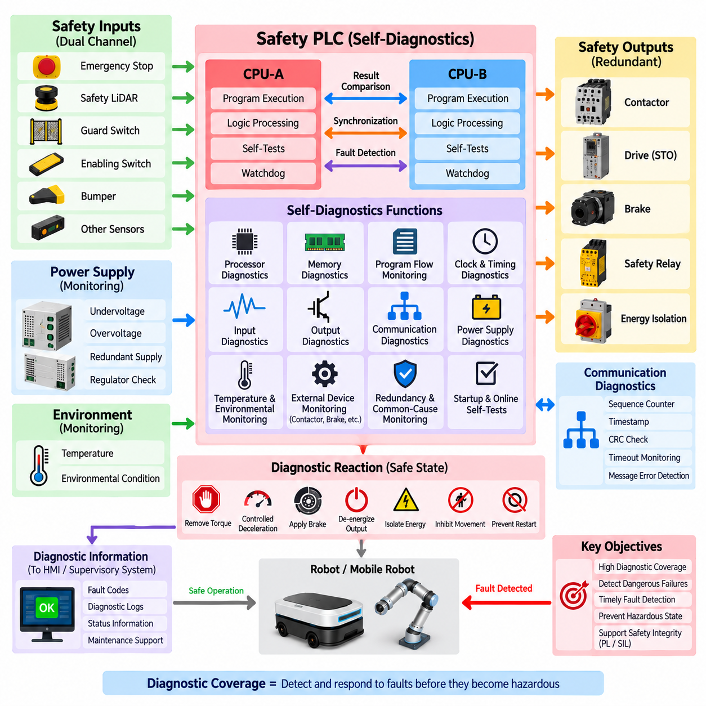
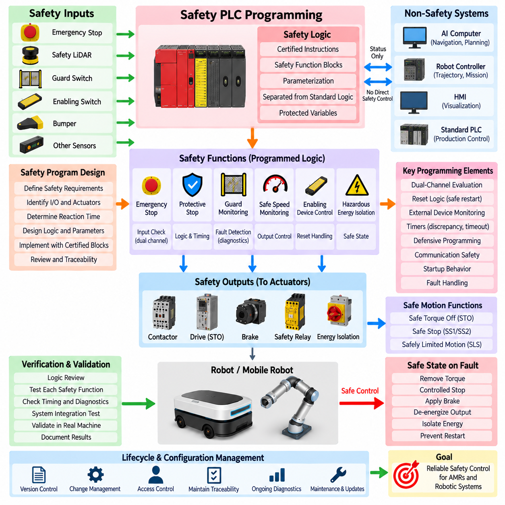
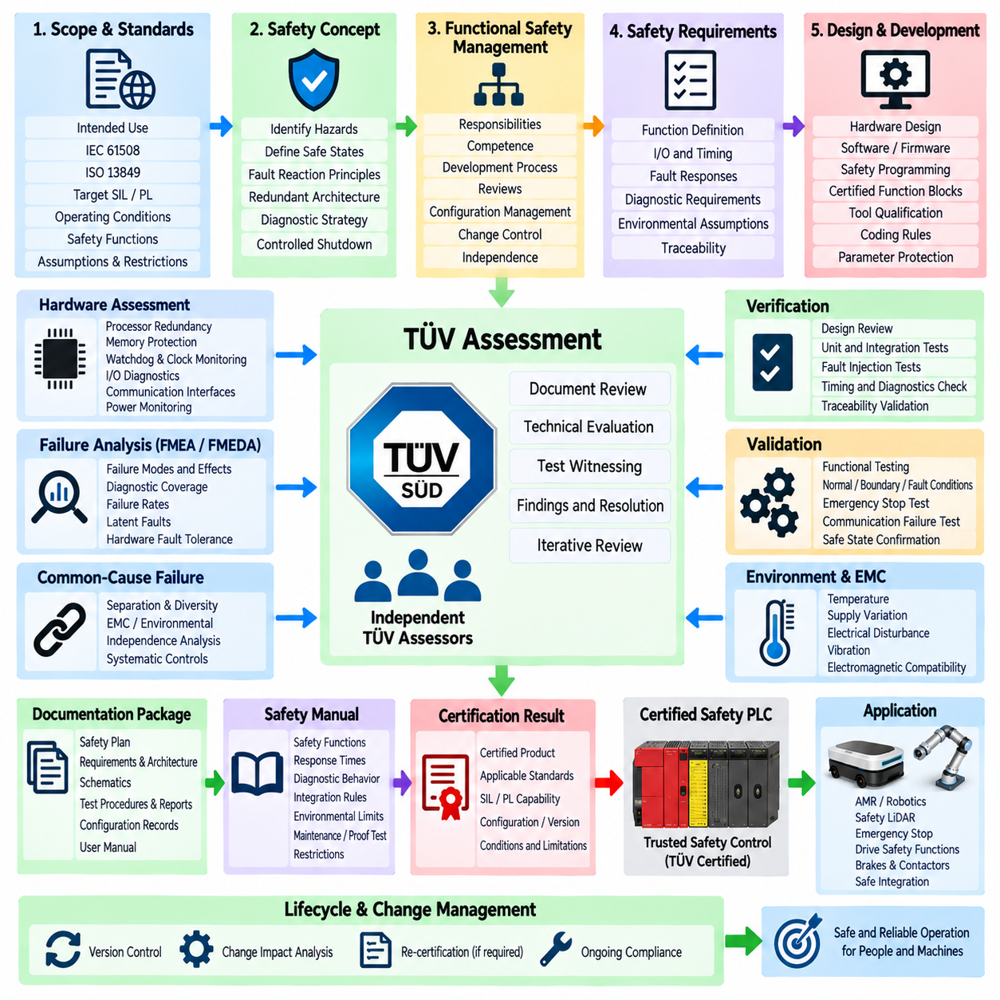

**Volume 12. Safety Architecture**

# Chapter 07. Safety PLC

## 07.01. Safety PLC Architecture

{width="7.268055555555556in" height="7.268055555555556in"}

A safety PLC is a programmable control system designed to execute safety-related functions with a defined level of integrity even when internal hardware, software, communication, or field-device faults occur. Unlike a conventional PLC, its architecture treats fault detection, deterministic response, diagnostic coverage, and controlled transition to a safe state as fundamental design requirements rather than supplementary features.

The basic architecture separates safety-related control from ordinary automation functions while allowing carefully controlled information exchange between them. Safety inputs collect signals from emergency-stop devices, safety LiDARs, interlocks, enabling switches, bumpers, and other protective devices. A certified safety CPU evaluates these inputs and commands safety outputs that control contactors, drives, brakes, or energy-isolation devices.

A typical safety PLC uses redundant or diverse internal processing paths so that a single computational failure does not silently produce an unsafe command. Input data may be processed independently by two execution channels, with intermediate and final results continuously compared. Disagreement, timing deviation, memory corruption, or execution anomalies are detected by internal diagnostics and normally cause the affected safety function to enter its predefined safe state.

Safety input modules provide more than simple digital signal acquisition. They can detect short circuits, cross faults, open circuits, discrepancy between redundant contacts, and unexpected signal sequences by using dual-channel inputs, test pulses, and diagnostic logic. This allows the PLC to distinguish a legitimate safety demand from many electrical failures and prevents a hidden wiring fault from defeating the intended protective function.

Safety output modules similarly incorporate mechanisms for detecting dangerous output failures. Semiconductor outputs may contain redundant switching elements, readback monitoring, test pulses, and internal comparison logic. When external contactors or relays are used, feedback contacts can be monitored through an external device monitoring function so that welded contacts or failure to return to the de-energized condition are detected before operation is permitted again.

The safety CPU is therefore not merely a faster or more reliable conventional controller. Its processor architecture, memory handling, watchdogs, clock supervision, execution monitoring, communication checking, and diagnostic mechanisms form part of an integrated safety concept. Safety-relevant variables and program execution must remain protected against corruption, unintended modification, and failures capable of generating an incorrect safety output.

A practical architecture also establishes clear boundaries among the safety PLC, standard PLC, robot controller, motion controller, and high-performance AI computer. Navigation, perception, optimization, mission planning, and fleet coordination may operate on non-safety computers, while functions such as emergency stopping, protective-field evaluation, safe motion permission, and hazardous-energy removal remain under independently validated safety control.

This separation is particularly important in autonomous mobile robots because sophisticated perception cannot automatically be treated as a certified safety function. Cameras, AI inference, localization, and world-model outputs may improve operational awareness, but the safety PLC should make safety decisions using signals and interfaces whose integrity is compatible with the required safety level. Loss of the non-safety computing system must therefore not disable essential protective functions.

Communication between distributed safety devices can be implemented through dedicated wiring or functional-safety communication protocols. The safety architecture must detect communication faults such as repetition, loss, insertion, incorrect sequence, corruption, delay, and addressing errors. This principle allows safety messages to pass through ordinary communication infrastructure while the safety layer independently verifies whether received information remains trustworthy.

The safety PLC architecture should be derived from the safety functions rather than selected only from controller specifications. Each safety function has an input device, logic-processing path, output element, required reaction time, diagnostic concept, and safe state. Emergency stop, protective stop, safe-speed supervision, guard monitoring, and drive-energy isolation may therefore share the same safety PLC while retaining separately traceable safety requirements.

Response time is a system-level architectural parameter because the PLC is only one element in the complete safety chain. Sensor detection time, safety-network transmission, input processing, logic execution, output switching, drive reaction, contactor opening, brake engagement, and mechanical stopping behavior all contribute to the final protective response. The architecture must ensure that the total reaction remains within the time assumed by the hazard analysis.

Power architecture must also support predictable behavior during undervoltage, power interruption, restart, and controller reset. A safety PLC should not automatically restore hazardous motion merely because electrical power returns. Restart interlocks, reset conditions, feedback verification, and controlled initialization are normally used so that restoration of power establishes a known safety state before motion or hazardous energy can again be enabled.

For mobile robots, the safety PLC can operate as an independent supervisory layer between protective sensors and propulsion hardware. Safety LiDAR protective fields, emergency-stop loops, bumper signals, drive status, and contactor feedback can enter the safety controller, which then determines whether propulsion torque is permitted. The autonomous computer may request movement, but the safety architecture retains independent authority to inhibit or remove that movement.

Safe motion interfaces can extend this architecture beyond simple power removal. Depending on the drive system and required safety function, the safety PLC may command functions such as Safe Torque Off, Safe Stop, or safely limited motion through certified hardwired or network interfaces. This enables hazardous motion to be controlled without requiring every safety event to produce complete electrical shutdown of the robot.

Diagnostics are continuously integrated into normal operation rather than being restricted to maintenance periods. Processor tests, memory checks, watchdog monitoring, I/O diagnostics, communication supervision, contactor feedback, discrepancy timers, and cyclic testing collectively reveal faults before they can accumulate into a dangerous condition. Diagnostic coverage therefore directly influences the safety integrity that the complete control architecture can achieve.

Fault handling must be designed around explicit safe-state definitions. A communication timeout, inconsistent redundant input, internal CPU mismatch, failed output test, or invalid feedback signal should generate a deterministic response appropriate to the associated hazard. The safe state may involve torque removal, controlled deceleration, brake application, contactor isolation, or prevention of restart rather than an identical shutdown response for every failure.

Safety PLC architecture also depends on controlled engineering and configuration practices. Safety programs, device parameters, network addresses, checksums, access permissions, and validated versions must be managed so that unauthorized or accidental changes cannot invalidate the safety function. Modification of a safety program therefore requires controlled verification and validation rather than the informal software-update process sometimes acceptable for ordinary automation logic.

The architecture must ultimately be evaluated as a complete safety-related control system rather than as a collection of individually certified components. A certified PLC cannot by itself guarantee the required Performance Level or Safety Integrity Level if sensors, wiring, communications, output devices, response times, diagnostics, or application logic are incorrectly designed. System integration determines whether the intended safety integrity is actually achieved.

Within the broader robotics safety architecture, the safety PLC consequently serves as the deterministic bridge between hazard detection and physical risk reduction. Its value comes from combining fail-safe processing, redundant supervision, diagnostic coverage, protected programming, safety communication, and controlled outputs into one independently verifiable layer. This provides a stable safety foundation beneath increasingly complex autonomous and Physical AI functions.

## 07.02. Redundant CPU Design

{width="7.268055555555556in" height="7.268055555555556in"}

A redundant CPU design in a safety PLC uses two or more processing channels to ensure that a single processor fault cannot silently produce an unsafe control decision. Each channel executes safety-related logic using the same safety inputs or independently acquired representations of those inputs, while comparison mechanisms verify that calculated states, timing behavior, and output decisions remain consistent before safety commands are released.

The fundamental objective of redundancy is not simply to improve system availability. In functional safety, redundant processing is primarily used to detect dangerous failures and force the system toward a defined safe state when trustworthy execution can no longer be demonstrated. A controller may therefore intentionally stop equipment after detecting disagreement between processors even though one CPU appears to remain operational.

A common architecture employs dual processing channels operating in parallel. CPU-A and CPU-B independently evaluate emergency-stop signals, safety sensor states, interlocks, motion permissions, and diagnostic information. Their intermediate or final results are compared through dedicated internal mechanisms. If both channels agree within permitted timing and logical constraints, the safety output can be authorized; disagreement generates a diagnostic response.

Redundant channels may use identical processors or diverse hardware implementations depending on the safety concept. Identical processors simplify synchronization, validation, and deterministic execution, but they may remain vulnerable to common systematic weaknesses. Diverse processing can reduce susceptibility to common-cause faults by using different processor architectures, instruction mechanisms, compilers, execution patterns, or independently implemented checking functions.

Lockstep processing is one method used to achieve tightly coupled redundancy. Two processing elements execute equivalent instructions in synchronized cycles, and hardware comparators continuously check their results. A mismatch can be detected rapidly before an incorrect result propagates to a safety output. Lockstep architectures are particularly effective for detecting transient processor faults, arithmetic errors, register corruption, and abnormal instruction execution.

Other architectures use loosely synchronized redundant CPUs rather than cycle-by-cycle lockstep operation. Each processor executes its own safety program and exchanges calculated states or checkpoints at defined intervals. This approach provides greater architectural independence but requires carefully designed synchronization, communication supervision, sequence checking, timeout detection, and comparison criteria to prevent timing differences from being incorrectly interpreted as valid behavior.

Redundancy must extend beyond the arithmetic processing core because a CPU can produce correct calculations while surrounding resources fail. Safety controllers therefore supervise program memory, data memory, buses, clocks, power supplies, communication interfaces, watchdogs, and I/O access paths. Error-correcting codes, memory tests, cyclic redundancy checks, clock monitors, and independent watchdog circuits can detect faults that processor duplication alone would not reveal.

The comparison mechanism is itself safety critical. If two CPUs produce different results but the comparator fails to detect the disagreement, redundancy may provide little protection against a dangerous output. For this reason, comparison logic is normally designed with diagnostic mechanisms and predictable failure behavior. Comparison can include output values, program-flow signatures, memory signatures, timing checkpoints, sequence counters, and internal diagnostic states.

Synchronization must be tightly controlled because valid redundant calculations can otherwise appear inconsistent. Both channels need a defined relationship among input sampling, program execution, communication cycles, and output updates. Excessive execution skew, missed synchronization events, unexpected clock deviation, or inconsistent input images should be recognized as diagnostic conditions rather than being allowed to propagate unpredictably through the safety application.

Input architecture also influences CPU redundancy. Dual-channel emergency-stop contacts, guard switches, safety LiDAR outputs, or other protective devices can be evaluated through independent input paths so that both processing channels receive safety information with sufficient integrity. Cross-checking input states enables detection of discrepancies caused by wiring faults, failed contacts, input-module faults, or unexpected transitions before a motion permission is generated.

Output control must prevent a single CPU from independently energizing a hazardous actuator. Redundant processing channels can therefore participate in separate authorization paths controlling redundant switching elements or safety output circuits. Only when the required internal conditions are valid can the final output remain enabled. A detected processor disagreement can remove authorization and command contactors, drive safety functions, brakes, or isolation devices toward their safe condition.

For motor-driven robotic systems, redundant CPUs frequently supervise safety functions rather than directly performing ordinary trajectory control. The robot controller or AI computer may calculate navigation, trajectory, perception, and mission behavior, while the safety PLC independently determines whether motion is permitted. This separation ensures that failure of advanced autonomy does not bypass the redundant safety-processing path responsible for protective intervention.

Safe Torque Off, Safe Stop, and safely limited motion functions can be connected to redundant safety processing through certified drive interfaces. The CPUs evaluate safety demands and determine whether the required safety conditions remain satisfied. If processor agreement is lost, the architecture can withdraw the motion authorization and activate the corresponding safe motion response according to the hazard analysis and required stopping behavior.

Watchdog architecture provides another layer of independence. Each processing channel can supervise execution time, program sequence, and communication activity, while an independent hardware watchdog verifies that the CPUs continue operating within predefined temporal boundaries. A stalled processor, endless loop, corrupted execution sequence, or excessive calculation delay can therefore be detected even when no explicit logical disagreement has yet appeared between redundant channels.

Common-cause failure must be considered because two redundant CPUs do not provide meaningful independence if the same event disables both simultaneously. Shared power faults, excessive temperature, electromagnetic interference, clock failure, corrupted common data, design defects, or software errors can affect multiple channels. Physical separation, electrical independence, diversity, environmental protection, and systematic development controls are therefore important complements to CPU duplication.

Software architecture must preserve the assumptions of hardware redundancy. Safety logic should execute deterministically, use controlled data paths, restrict unintended interaction with standard applications, and protect safety parameters against unauthorized modification. Program-flow monitoring, range checking, defensive programming, validated libraries, and controlled configuration help ensure that both processors do not consistently execute the same erroneous command because of a systematic software defect.

Fault detection must lead to an explicitly defined reaction. Depending on the safety function, CPU mismatch may trigger immediate torque removal, controlled deceleration, protective stopping, brake application, output de-energization, or prevention of automatic restart. The selected response must consider the hazard and fault-tolerant time interval rather than assuming that instantaneous power removal is always the safest behavior for every robotic mechanism.

Restart after a redundant CPU fault requires controlled recovery. Simply resetting both processors and immediately restoring outputs could recreate an unsafe condition before the original fault is understood. The controller should complete initialization diagnostics, memory checks, channel synchronization, I/O verification, communication validation, and relevant external-device feedback checks before safety outputs become available again. Manual reset may also be required for specific safety functions.

Diagnostic information from redundant CPUs is valuable for maintenance, but diagnostic communication must not compromise safety execution. Fault codes, channel mismatch records, watchdog events, memory errors, and synchronization failures can be transmitted to supervisory systems for analysis while the safety controller independently maintains the required safe state. Diagnostic visibility improves troubleshooting without transferring safety authority to a non-safety computer.

The effectiveness of redundant CPU design is ultimately evaluated at system level rather than by counting processors. Diagnostic coverage, independence, common-cause failure resistance, reaction time, hardware fault metrics, software integrity, I/O architecture, communication behavior, and output control all contribute to the achievable safety integrity. Two CPUs without appropriate comparison and diagnostics are fundamentally different from a validated redundant safety-processing architecture.

Within a safety PLC, redundant CPU design therefore creates a continuously supervised decision layer between safety inputs and physical actuators. Independent execution, result comparison, temporal supervision, memory protection, watchdog monitoring, fault diagnostics, and controlled safe-state transitions work together so that computational faults are detected before they become hazardous commands. This architecture forms a critical foundation for dependable safety control in AMRs, industrial robots, mobile manipulators, and other autonomous physical systems.

## 07.03. Self Diagnostics Coverage

{width="7.268055555555556in" height="7.268055555555556in"}

Self-diagnostic coverage in a safety PLC describes the ability of the controller to detect internal and external faults that could prevent a required safety function from operating correctly. Diagnostics are executed continuously or periodically during normal operation so that dangerous failures do not remain hidden for long periods. The objective is to detect faults early enough to initiate a controlled response before they can contribute to a hazardous system state.

Diagnostic coverage is closely related to the effectiveness of fault detection rather than simply the number of diagnostic functions implemented. A safety controller may contain many tests, but their value depends on which dangerous failure modes they can actually reveal. Safety analysis therefore considers the proportion of dangerous failures detected by diagnostic mechanisms and how quickly those failures are identified relative to the required safety response.

Processor diagnostics form a central part of self-monitoring because the CPU executes the safety application logic. Redundant processors, lockstep execution, instruction monitoring, register tests, arithmetic checks, program-flow supervision, and result comparison can reveal computational errors. If CPU channels produce inconsistent results or execution deviates from the expected sequence, the controller can prevent potentially incorrect commands from reaching safety outputs.

Memory diagnostics protect both program and runtime information. Flash memory containing safety software can be checked using checksums or cyclic redundancy checks, while RAM can be tested for stuck bits, coupling faults, addressing errors, and unintended corruption. Error-detecting or error-correcting codes may provide continuous protection during operation, allowing the controller to identify memory faults before corrupted data influences a safety decision.

Program-flow monitoring verifies that safety software executes in the intended sequence. Signatures, checkpoints, sequence counters, execution-time supervision, and independent watchdogs can detect skipped instructions, unintended branches, endless loops, or stalled execution. These mechanisms are important because a processor can remain electrically operational while executing an incorrect program path that would otherwise appear as normal controller activity.

Clock and timing diagnostics supervise the temporal behavior of the safety controller. Independent clock monitors can identify frequencies outside acceptable limits, while watchdog timers verify that critical program cycles complete within predefined time boundaries. Excessive execution delay, missing cyclic activity, synchronization loss between redundant processors, or abnormal communication timing can therefore be treated as faults rather than allowed to degrade safety response unpredictably.

Input diagnostics verify that safety signals entering the PLC remain credible. Dual-channel emergency-stop circuits, guard switches, enabling devices, bumpers, and other sensors can be monitored for channel discrepancy, short circuits, open circuits, cross faults, and implausible transitions. Test pulses and dynamic signal patterns can help distinguish a valid safety demand from electrical faults that might otherwise remain hidden in static input wiring.

Output diagnostics are required because a correct safety decision has little value if the physical output cannot execute it. Safety output modules can use redundant switching elements, output readback, test pulses, current monitoring, and internal comparison to detect failed semiconductor devices. External device monitoring can additionally verify contactors, relays, or brakes so that welded contacts or failed actuators are detected before hazardous operation is permitted.

Communication diagnostics protect safety information exchanged between distributed devices. Safety protocols can use sequence counters, timestamps, watchdogs, source and destination identifiers, cyclic redundancy checks, and timeout monitoring to detect message loss, repetition, corruption, insertion, incorrect sequence, unacceptable delay, or addressing errors. These mechanisms support safe communication even when the underlying network itself is not inherently safety certified.

Power-supply diagnostics monitor conditions capable of affecting multiple safety functions simultaneously. Undervoltage, overvoltage, unstable supply rails, internal regulator faults, and loss of redundant power paths can corrupt processing or output behavior if they remain undetected. Voltage supervision and controlled reset mechanisms therefore ensure that the safety PLC enters a predictable state when electrical conditions fall outside the validated operating range.

Temperature and environmental monitoring can supplement electronic diagnostics because excessive temperature may alter processor, memory, communication, or output behavior. Internal temperature sensors can identify conditions beyond validated limits and initiate a controlled response before component operation becomes unreliable. Similar supervision may be applied to environmental conditions when they have a meaningful relationship with the safety integrity of the controller.

Diagnostic coverage must also consider common-cause failures. Redundant channels may successfully detect many independent faults while remaining vulnerable to a single event that affects both channels. Shared power, excessive temperature, electromagnetic interference, common clocks, corrupted configuration data, or systematic design defects can reduce effective diagnostic independence. Diversity and independent monitoring therefore complement conventional channel-to-channel comparison.

Latent faults are especially important in redundant architectures because one failed channel may remain unnoticed while the second channel continues to operate normally. If another fault later affects the remaining healthy channel, the safety function can be lost. Periodic self-tests, startup diagnostics, proof tests, channel comparison, and continuous supervision are therefore used to reduce the time during which dangerous undetected faults can remain present.

Startup diagnostics establish whether the safety controller is capable of entering normal operation. Before safety outputs are enabled, the PLC can verify processor operation, memory integrity, program checksums, I/O status, communication interfaces, synchronization, configuration data, and external feedback signals. Failure of a required test prevents normal startup or keeps the affected safety outputs in their defined de-energized or otherwise safe condition.

Online diagnostics continue after startup because many faults occur during operation rather than during initialization. Cyclic processor tests, memory checks, watchdog supervision, I/O testing, communication monitoring, and output feedback operate concurrently with the safety application. Diagnostic scheduling must ensure that these tests detect relevant faults within the diagnostic test interval required by the safety concept without disturbing deterministic safety execution.

The diagnostic test interval is important because detection that occurs too late may not provide adequate protection. A dangerous failure must be discovered within a time compatible with the architecture, operating demand rate, and fault assumptions used in the safety analysis. Diagnostic frequency is therefore selected according to the nature of each failure mechanism rather than applying one arbitrary self-test period to every component.

When diagnostics detect a fault, the resulting reaction must be deterministic and appropriate to the associated hazard. Depending on the affected function, the safety PLC may remove torque, initiate controlled deceleration, apply a brake, de-energize an output, isolate hazardous energy, inhibit further movement, or prevent restart. Diagnostic detection and fault reaction must therefore be engineered as one complete safety mechanism rather than as separate functions.

Diagnostic information should also support maintenance and troubleshooting without transferring safety authority to non-safety systems. Fault codes, processor mismatch records, memory errors, I/O discrepancies, communication timeouts, power anomalies, and watchdog events can be reported to an HMI or supervisory computer. The safety PLC, however, must independently maintain the required safe state regardless of whether the external diagnostic system remains available.

Reset and recovery require particular attention because clearing a diagnostic indication does not prove that the underlying fault has disappeared. After a detected failure, the controller may require successful self-tests, restored channel agreement, valid input conditions, output feedback verification, and controlled operator acknowledgement before operation resumes. Automatic restart should be prevented where unexpected motion or energy restoration could create a hazard.

Diagnostic coverage contributes directly to quantitative and architectural functional-safety evaluation. Under frameworks such as ISO 13849 and IEC 61508, the ability to detect dangerous failures influences whether the complete safety-related control system can achieve its required Performance Level or Safety Integrity Level. The final result depends not only on the PLC but also on sensors, communication paths, outputs, actuators, wiring, diagnostics, and common-cause measures.

For autonomous mobile robots and other Physical AI systems, comprehensive self-diagnostics provide an essential boundary between complex autonomous computation and deterministic safety control. Continuous supervision of processors, memory, timing, communication, inputs, outputs, power, and external devices allows the safety PLC to recognize loss of trustworthy operation and transition the machine toward a defined safe state before an internal fault becomes a hazardous physical action.

## 07.04. Safety PLC Programming

{width="7.268055555555556in" height="7.268055555555556in"}

Safety PLC programming is the disciplined development of application logic that performs safety-related control functions within a certified programmable safety system. Unlike ordinary PLC programming, the primary objective is not production efficiency or functional flexibility but predictable risk reduction. Every safety instruction, state transition, timer, reset condition, and output command must preserve the assumptions established by the safety analysis and system architecture.

The safety program translates defined safety functions into deterministic executable logic. Emergency stop, protective stop, guard monitoring, safe-speed supervision, enabling-device control, and hazardous-energy isolation are represented as independently understandable functions with defined inputs, processing conditions, outputs, and safe states. This structure makes each function traceable from the safety requirement through implementation, verification, and final validation.

Programming normally begins only after the required safety functions and their integrity targets have been established. The programmer must understand which sensors initiate each function, which actuators must respond, the permitted reaction time, restart conditions, fault responses, and dependencies between functions. Software should therefore implement an existing safety concept rather than become the place where fundamental safety requirements are informally invented.

Safety logic should be separated from standard automation logic as clearly as the platform permits. Navigation, mission sequencing, visualization, production control, and optimization may exchange status information with the safety application, but they should not obtain uncontrolled authority over safety outputs. Safety-relevant variables, program blocks, parameters, and communication interfaces require protected boundaries so that ordinary software changes cannot unintentionally modify certified behavior.

Certified safety PLC environments generally provide approved safety instructions and function blocks for common protective functions. These may support emergency-stop evaluation, two-channel input monitoring, guard supervision, discrepancy detection, reset handling, external device monitoring, safe motion interfaces, and safety communication. Using validated blocks reduces unnecessary custom logic, although correct parameterization and system-level integration remain the responsibility of the application designer.

Dual-channel devices require programming that evaluates both channels rather than simply combining two electrical signals. The logic must detect inconsistent states, excessive discrepancy time, unexpected transition sequences, cross faults where detectable, and failure of a channel to return to its expected condition. A dual-channel emergency stop therefore becomes a monitored safety function whose behavior includes both demand detection and diagnostic supervision.

Reset logic requires particular care because reset is permission to leave a safety condition, not a command that directly creates hazardous motion. The program should verify that the initiating safety demand has been cleared, required feedback is valid, and relevant diagnostic conditions are satisfied before accepting a reset. Where unexpected restart creates a hazard, restoring an emergency-stop button or guard condition must not automatically restart the machine.

Manual reset functions should also consider location and operator awareness. A reset device should be associated with the safety function it restores and should not allow an operator to unknowingly enable hazardous operation while a person remains inside a protected area. Software logic can enforce reset sequencing and edge detection, but the complete safety concept must combine programming with appropriate physical placement and operational procedures.

External device monitoring is commonly programmed to verify that contactors, relays, brakes, or other final switching elements actually follow safety commands. Feedback contacts are checked before the next hazardous operation is permitted. If an output is commanded off but its feedback indicates that the external device remains energized, the safety program should recognize the discrepancy and inhibit restart rather than repeatedly commanding the same failed device.

Timers used in safety programs have direct safety significance. Discrepancy timers, debounce periods, stopping supervision, communication timeouts, and restart delays must be selected from validated engineering assumptions rather than convenience. An excessively long timer may delay fault detection, while an unnecessarily short value can create nuisance trips. Timing parameters must remain consistent with sensor behavior, PLC execution, network delay, actuator response, and the required safety reaction time.

Program execution should be deterministic and understandable. Complex indirect addressing, uncontrolled dynamic behavior, unnecessary state dependencies, or obscure logic can make verification difficult even when technically supported by the controller. Safety programs benefit from simple data flow, explicit states, limited interfaces, predictable scan behavior, and modular functions whose relationship to individual safety requirements can be demonstrated without relying on undocumented assumptions.

Defensive programming helps ensure that unexpected data does not become an unsafe command. Safety-related values can be checked for valid ranges, permitted states, sequence consistency, communication freshness, and plausibility before they influence outputs. Invalid or unavailable information should lead to a defined fallback response. The program should not assume that external controllers, sensors, networks, or AI systems will always provide correct and timely information.

Communication programming must preserve the distinction between safety and non-safety information. When certified safety protocols are used, safety data should be associated with validated addresses, connection parameters, watchdog times, and expected communication relationships. Loss, corruption, excessive delay, or unexpected source information must result in the predefined communication fault behavior rather than leaving the previous motion permission indefinitely active.

For autonomous mobile robots, safety PLC programming often implements an independent motion-permission layer beneath navigation and AI control. The autonomous computer may request velocity, direction, mission execution, or operating mode, while the safety application evaluates emergency stops, protective fields, bumpers, drive status, and safety conditions. The safety PLC can therefore withdraw motion permission independently when the autonomous system no longer satisfies the required protective conditions.

Safety LiDAR integration frequently requires the program to select or evaluate protective fields according to operating conditions. Field selection may depend on direction, validated speed state, operating mode, or other safety-related information. The programming must ensure that an incorrect field cannot be selected because of stale or untrusted data and that transitions between fields preserve adequate protection throughout acceleration, deceleration, turning, and stopping.

Safe drive functions can be incorporated through certified safety interfaces. The safety program may request Safe Torque Off, Safe Stop, or safely limited motion according to the identified hazard and operating state. These functions should be coordinated with mechanical braking and stopping behavior so that software commands correspond to the actual physical risk-reduction strategy rather than treating every detected condition as an identical immediate power-removal event.

Fault handling should be explicitly programmed rather than left as an unintended consequence of failed logic. Processor diagnostics, I/O discrepancies, communication timeouts, invalid feedback, sensor faults, and configuration errors should map to defined reactions. Depending on the hazard, the response may include torque removal, controlled stopping, brake application, output de-energization, energy isolation, operating-mode restriction, or prevention of restart.

Safety software must also manage startup behavior. When power is applied, the program should not immediately restore hazardous outputs based only on previously stored operating states. Required inputs, communication connections, diagnostics, external-device feedback, and reset conditions should first be evaluated. The system can then establish a known initialization state from which safety functions and motion permissions are activated through a controlled sequence.

Configuration management is inseparable from safety PLC programming. Program versions, safety parameters, hardware configuration, device addresses, checksums, compiler or engineering-tool versions, and approved changes should remain traceable. Access control is important because an unauthorized parameter change can alter stopping behavior or disable a safety function without changing the physical wiring. Download and modification procedures therefore require controlled engineering authority.

Verification checks whether the implemented program correctly represents its specified safety requirements. Individual safety functions can be reviewed for logical completeness, input and output behavior, timing, reset conditions, diagnostic responses, and interactions with other functions. Boundary conditions and abnormal states deserve particular attention because safety software must remain predictable not only during normal operation but also when sensors, communications, outputs, or external controllers fail.

Validation extends beyond program inspection to demonstrate that the implemented safety function works correctly in the actual machine or robot. Tests should exercise realistic emergency stops, protective-field violations, channel discrepancies, communication failures, output faults, restart attempts, and operating-mode transitions. Measured response behavior should confirm that the integrated sensors, PLC logic, networks, drives, brakes, and actuators satisfy the intended safety requirements.

Safety PLC programming is therefore a lifecycle activity rather than a one-time coding task. Requirements, implementation, verification, validation, configuration control, diagnostics, maintenance changes, and regression testing remain connected throughout the system lifetime. For AMRs, industrial robots, and Physical AI platforms, disciplined safety programming provides the deterministic software layer that converts validated safety information into predictable physical risk-reduction actions.

## 07.05. TÜV Certification Process

{width="7.268055555555556in" height="7.268055555555556in"}

TÜV certification of a safety PLC is an independent conformity assessment process used to demonstrate that the controller, its hardware, firmware, development methods, diagnostics, and safety functions satisfy applicable functional-safety requirements. Within the Safety PLC chapter structure, certification follows architecture, redundant CPU design, diagnostic coverage, and safety programming because evidence from all of these areas contributes to the final assessment.

The certification process begins by defining the intended use of the safety PLC and the standards against which it will be assessed. Depending on the product and application, requirements may originate from IEC 61508 and related machinery safety standards such as ISO 13849. The manufacturer must establish the claimed Safety Integrity Level, Performance Level capability, operating conditions, safety functions, architectural assumptions, and restrictions that define the certification scope.

A clear safety concept is required before detailed assessment can proceed. The manufacturer identifies hazardous failures, defines safe states, establishes fault-reaction principles, and explains how the architecture prevents or detects dangerous behavior. Redundant processing channels, monitored inputs and outputs, watchdogs, memory protection, communication supervision, power monitoring, and controlled shutdown mechanisms must form a coherent safety strategy rather than a collection of unrelated protective features.

Functional-safety management provides the organizational framework behind the technical design. Responsibilities, competence requirements, development procedures, reviews, configuration management, change control, verification activities, and independence requirements must be defined and documented. TÜV assessment therefore evaluates not only whether the final controller operates correctly but also whether it was developed through a systematic process capable of controlling safety-related errors.

Safety requirements must be documented with sufficient precision to support traceability throughout development. Each requirement should identify the intended function, relevant inputs and outputs, timing constraints, fault responses, environmental assumptions, diagnostic expectations, and safe-state behavior. Traceability connects these requirements to architecture, hardware implementation, software modules, verification procedures, test results, and unresolved restrictions.

Hardware assessment examines whether the electronic architecture provides the required resistance to random hardware failures. Processor redundancy, memory protection, watchdogs, clock supervision, power monitoring, input and output diagnostics, communication interfaces, and external device control are analyzed. Component failure modes and diagnostic mechanisms are evaluated to determine whether dangerous faults are detected or controlled with sufficient effectiveness for the claimed safety integrity.

Failure analysis provides quantitative and qualitative evidence for the hardware safety concept. Techniques such as Failure Modes and Effects Analysis and Failure Modes, Effects and Diagnostic Analysis can identify safe failures, dangerous detected failures, and dangerous undetected failures. The assessment also considers diagnostic coverage, hardware fault tolerance, failure rates, latent faults, and architectural constraints relevant to the selected functional-safety standard.

Common-cause and dependent failures require separate consideration because redundant channels are ineffective when the same event defeats them simultaneously. Shared power supplies, common clocks, thermal stress, electromagnetic interference, identical design defects, communication dependencies, or common configuration errors may compromise independence. Certification evidence must therefore explain how separation, diversity, monitoring, environmental design, and systematic controls reduce these vulnerabilities.

Software and firmware development are assessed according to the required safety integrity and development lifecycle. Safety requirements must be translated into structured software architecture and controlled implementation. Coding rules, restricted language features, certified or validated libraries, defensive programming, program-flow monitoring, data integrity checks, compiler qualification considerations, peer reviews, static analysis, and testing may contribute to demonstrating systematic software integrity.

Safety PLC programming environments are also relevant because application developers rely on engineering tools to configure certified functions. The assessment may consider safety function blocks, parameter protection, access control, checksums, download mechanisms, version identification, and separation between standard and safety logic. The objective is to ensure that configuration or programming errors cannot easily bypass the safety mechanisms established by the certified platform.

Verification demonstrates that each development output satisfies its corresponding input requirements. Hardware schematics can be reviewed against architecture requirements, software modules against software specifications, and diagnostic functions against identified failure modes. Reviews, analyses, unit tests, integration tests, fault-injection tests, timing measurements, and coverage evidence collectively establish that implementation corresponds to the documented safety design.

Validation addresses the behavior of the complete safety PLC against its intended safety requirements. Representative safety functions are exercised under normal conditions, boundary conditions, and fault conditions. Tests can include emergency-stop processing, dual-channel discrepancies, processor faults, memory errors, communication interruption, output failures, undervoltage, watchdog activation, restart behavior, and transitions to safe states.

Fault-injection testing is particularly valuable because many safety mechanisms exist specifically for abnormal conditions that rarely occur during ordinary operation. Controlled faults can be introduced into processors, memory, I/O, communication paths, power conditions, or timing behavior to confirm that diagnostics detect them as intended. The resulting reaction must correspond to the specified safe state and occur within the required diagnostic or safety reaction time.

Environmental and electromagnetic compatibility considerations support the validity of the safety architecture under realistic operating conditions. Temperature, supply variation, electrical disturbance, vibration, and electromagnetic interference can affect electronic components and redundant channels. The certification process therefore requires evidence that safety behavior remains valid within the environmental limits declared for the product and that those limits are clearly communicated to users.

Documentation is a major certification deliverable because independent assessment depends on objective evidence rather than design intent alone. Safety plans, requirements, architecture descriptions, schematics, failure analyses, software specifications, review records, test procedures, test reports, configuration records, tool information, and user documentation collectively form the evidence package. Inconsistencies between these artifacts can reveal weaknesses even when individual tests appear successful.

The safety manual is especially important because certification applies only within defined assumptions and conditions of use. It communicates the safety characteristics of the PLC to system integrators, including supported safety functions, response times, diagnostic behavior, required external circuitry, environmental limits, proof-test or maintenance expectations, communication restrictions, and integration rules needed to achieve the claimed safety integrity at machine level.

Independent TÜV assessors review the submitted evidence and may raise findings when requirements are incomplete, analyses are inconsistent, test coverage is insufficient, or implementation does not adequately support a safety claim. Findings normally require documented resolution through design modification, additional analysis, improved documentation, or supplementary testing. Certification therefore develops through iterative technical review rather than a single final inspection.

Changes introduced during assessment must remain under configuration and change control. Hardware revisions, firmware updates, safety-library modifications, component substitutions, parameter changes, or corrections to diagnostic behavior may invalidate previously collected evidence. Impact analysis determines which requirements, analyses, reviews, and tests must be repeated so that the assessed configuration remains clearly identified and reproducible.

When the technical assessment is successfully completed, the resulting certification identifies the evaluated product, applicable standards, certified safety capability, configuration or version, and relevant conditions or restrictions. Certification does not mean that every system containing the PLC is automatically safe. The machine or robot integrator must still design sensors, wiring, networks, actuators, stopping behavior, and application logic according to the requirements of the complete safety function.

For an AMR or robotic platform, a TÜV-certified safety PLC can provide a trusted safety-control foundation beneath navigation, AI perception, mission planning, and ordinary robot control. However, certification remains valid only when the PLC is integrated according to its defined safety assumptions. Safety LiDARs, emergency stops, drive safety functions, brakes, contactors, communication paths, and restart logic must collectively preserve the required safety chain.

The TÜV certification process should therefore be understood as lifecycle-based evidence that architecture, redundancy, diagnostics, programming, verification, and controlled development work together to achieve a defined safety capability. Its value is not merely the certificate itself, but the independently assessed argument that foreseeable faults are systematically addressed and that the safety PLC can perform its intended protective role within clearly specified conditions.
