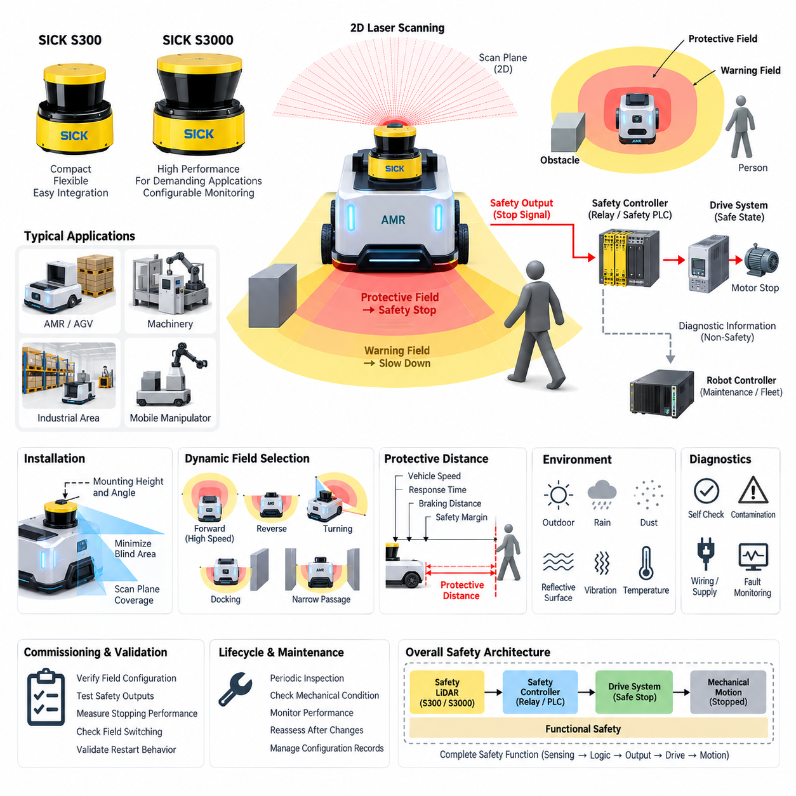
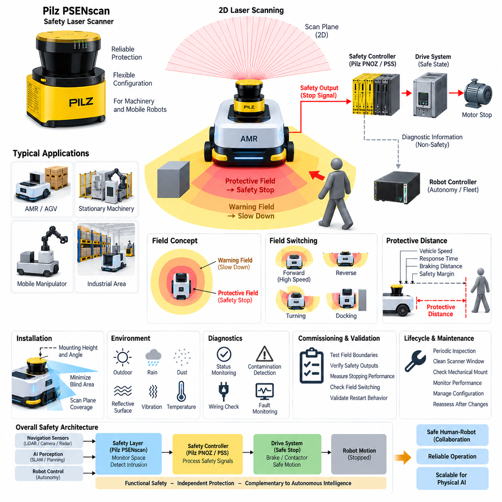
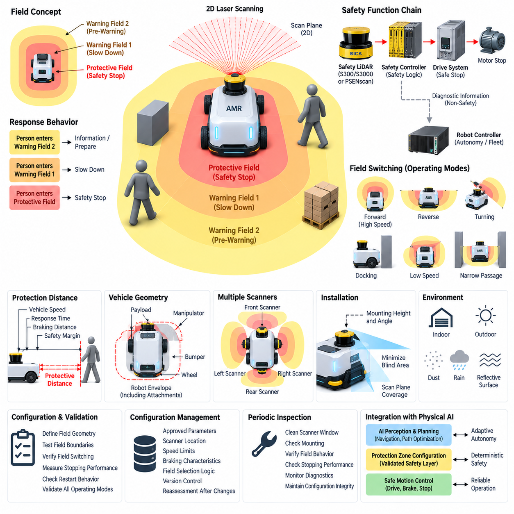
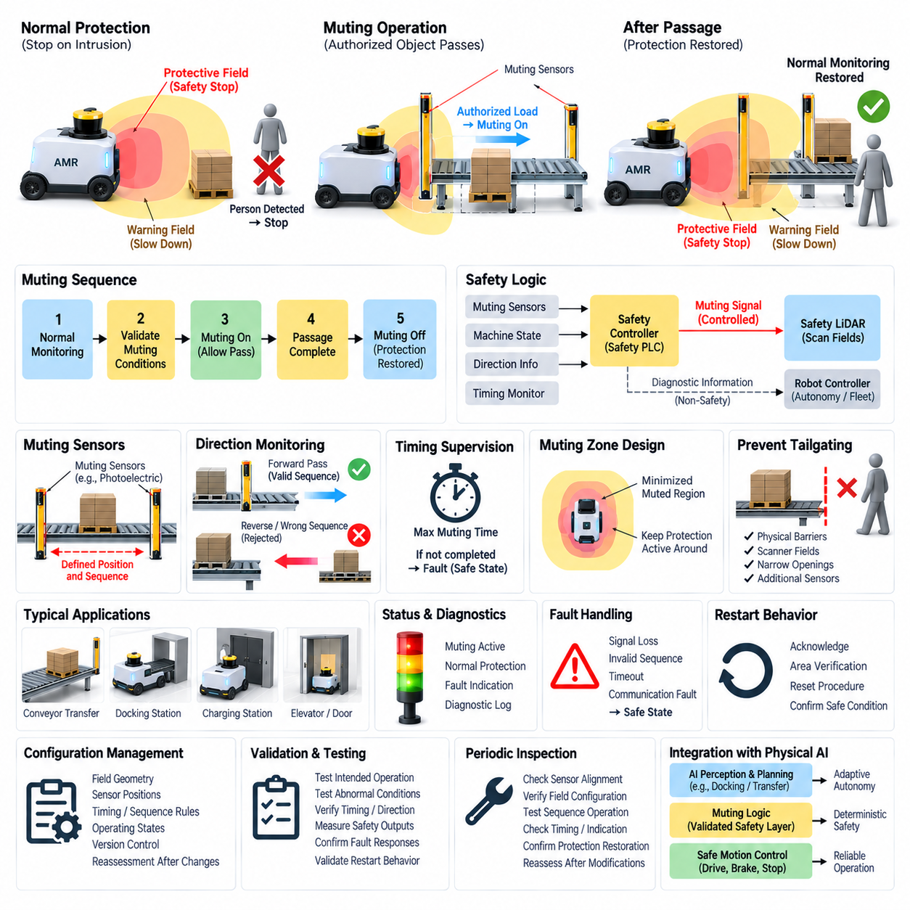
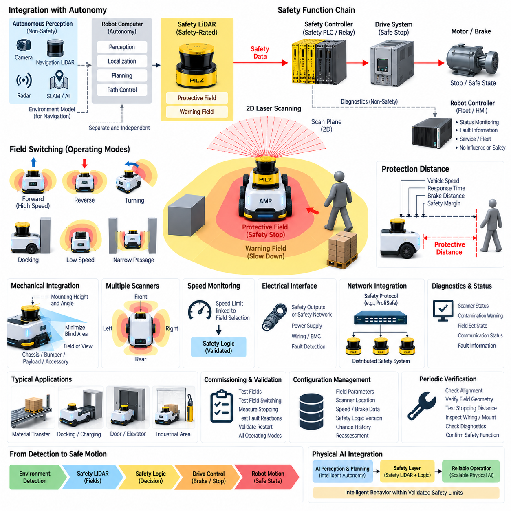

**Volume 12. Safety Architecture**

# Chapter 08. Safety LiDAR

## 08.01. SICK S300/S3000 Series

{width="7.268055555555556in" height="7.268055555555556in"}

The SICK S300 and S3000 series represent an important generation of safety laser scanners used for safeguarding mobile robots, automated guided vehicles, machinery, and industrial work areas. These devices combine two-dimensional laser ranging with safety-rated evaluation logic, allowing a machine to detect people or obstacles entering predefined monitored regions. In robotics, their main value is not ordinary navigation sensing but dependable protective field monitoring that can initiate a safety-related reduction of motion or a controlled stop.

A safety laser scanner operates by emitting laser pulses across a horizontal scanning plane and measuring the distance to surrounding objects from the returned light. The scanner continuously compares measured distances with configured safety fields. When an object enters a protective field, the scanner changes its safety output state so that the connected safety controller, relay, or drive system can remove hazardous motion. This architecture separates safety detection from higher-level autonomous perception and allows deterministic reactions even when navigation software fails.

Within the SICK family, the S300 is associated with compact safety applications where installation space, integration simplicity, and flexible protective-field configuration are important. The S3000 family addresses larger and more demanding safeguarding applications and provides a broader platform for configurable monitoring concepts. Exact capabilities depend on the individual device variant, so engineering selection must be performed using the corresponding product documentation rather than assuming that every member of a series provides identical range, interface, field-set, or diagnostic functionality.

Protective fields are the central concept in scanner-based safeguarding. A protective field defines the region in which intrusion must trigger a safety response, while warning fields can be used to initiate non-safety actions before the protective boundary is reached. For an AMR, a warning field may command gradual deceleration and a protective field may initiate the safety stop. Multiple field configurations can support different operating conditions such as forward travel, reverse travel, turning, docking, restricted passages, or different vehicle speeds.

The required protective distance cannot be selected merely by drawing a convenient geometric region around the robot. It must consider vehicle velocity, scanner response behavior, safety-controller processing, communication or output delay, drive shutdown behavior, braking time, braking distance, measurement tolerances, installation geometry, and an appropriate safety margin. The resulting field therefore represents the complete stopping behavior of the machine. Validation must demonstrate that hazardous motion is terminated before a person can reach the relevant danger zone.

Scanner placement strongly influences actual safety performance. The scanning plane must cover the region through which a person can approach the hazardous motion while minimizing blind areas created by wheels, chassis structures, payloads, forks, manipulators, or other mechanical components. Mounting height and orientation must remain controlled throughout operation. Mechanical deformation, vibration, contamination, impact, or an unintended change in scanner alignment can modify the effective detection geometry even when the electrical safety circuit remains operational.

For mobile robotics, dynamic field selection is particularly useful because the hazardous region changes with speed and direction. A robot moving quickly generally requires a longer forward protective field than a slowly moving robot, while reversing requires monitoring in another direction. Turning introduces additional swept-area hazards that may not be represented by a simple rectangular field. Safe field switching must therefore be derived from verified motion states and designed so that an incorrect or delayed selection cannot leave the robot operating with an insufficient protective region.

The safety scanner should be treated as one element of a complete safety function rather than as an independent guarantee of machine safety. Its safety-rated outputs must connect to an architecture capable of producing the required safe state, such as safety relays, safety PLCs, or safety-capable drive functions. The complete chain includes sensing, logic, output circuitry, drive control, braking behavior, and mechanical motion. The achieved safety integrity consequently depends on the architecture and validation of the entire function, not simply on the scanner certification.

A useful AMR architecture keeps safety perception independent from autonomous navigation whenever practical. Navigation LiDAR, cameras, depth sensors, radar, localization algorithms, and AI perception may provide rich environmental understanding, but their information should not automatically be considered equivalent to safety-rated detection. The S300 or S3000 can form an independent protective layer whose decision path does not depend on the main autonomy computer. This separation helps prevent failures in mapping, localization, operating systems, GPU processing, or application software from disabling essential personnel protection.

Diagnostics are equally important because a safe system must respond appropriately not only to detected people but also to internal and external faults. Scanner contamination, blocked optical paths, wiring problems, supply abnormalities, configuration errors, communication faults, or failures elsewhere in the safety chain must be considered during system design. Diagnostic information may be transferred to the robot controller for maintenance and fleet supervision, while the safety-related reaction remains implemented through the validated safety path. This distinction preserves both maintainability and functional independence.

Environmental conditions must also be evaluated carefully. Dust, condensation, rain, reflective surfaces, strong contamination, mechanical vibration, and outdoor optical conditions can affect practical scanner behavior or availability. A device suitable for controlled indoor factory operation should not automatically be assumed suitable for every outdoor AMR environment. Protective covers, installation positions, cleaning procedures, inspection intervals, environmental qualification, and alternative sensing arrangements may be necessary when the robot operates in warehouses, loading areas, yards, or partially exposed environments.

Commissioning requires more than loading field parameters into configuration software. Engineers must verify scanner mounting, field geometry, field switching, safety outputs, stopping behavior, fault responses, restart behavior, and interaction with the robot controller under representative operating conditions. Tests should include intrusion at critical field boundaries and vehicle operation at the maximum relevant speed and load. Measured stopping performance should be compared with the assumptions used to establish the protective distance, and configuration records should be controlled as safety-related engineering data.

Periodic inspection is required because the validated safety condition can change during the robot\'s service life. Tire wear, payload variation, brake degradation, mechanical modifications, scanner replacement, firmware changes, configuration updates, contamination, or altered operating surfaces can affect stopping behavior or detection geometry. Maintenance procedures should therefore verify both scanner operation and the physical response of the complete machine. Any modification affecting velocity, braking, scanner position, protective fields, or safety logic should trigger an appropriate level of safety reassessment.

In a broader safety architecture, the S300 and S3000 series illustrate the role of safety LiDAR as a deterministic protective sensor rather than merely another perception device. The scanner observes a defined physical region, evaluates intrusion according to validated safety parameters, and communicates a safety state to downstream control equipment. This provides a clear connection between environmental sensing and functional safety, complementing emergency-stop circuits, safety PLCs, safe drive functions, speed monitoring, and other protective measures within an integrated robot safety system.

For modern AMRs, these scanners are also useful reference platforms for understanding how safety requirements should remain distinct from rapidly evolving autonomous intelligence. AI can optimize trajectories and interpret complex scenes, while the safety layer enforces independently validated limits on permissible motion. Designing this boundary explicitly allows advanced autonomy to evolve without casually transferring safety responsibility to uncertified perception software. The S300/S3000 concept therefore provides both a practical safeguarding mechanism and a useful architectural model for dependable Physical AI systems.

## 08.02. Pilz PSENscan

{width="7.268055555555556in" height="7.268055555555556in"}

Pilz PSENscan is a safety laser scanner designed for safeguarding hazardous areas around stationary machinery, automated guided vehicles, and autonomous mobile robots. It combines two-dimensional optical environment monitoring with safety-rated evaluation functions so that people entering configured hazardous zones can be detected before dangerous motion reaches them. Within a robot safety architecture, PSENscan therefore serves as a protective sensing element rather than simply as a navigation LiDAR, complementing safety controllers, emergency-stop functions, and safe drive systems.

The scanner continuously emits laser light across a defined scanning plane and evaluates reflections from objects within its field of view. Measured positions are compared with configured monitoring regions, allowing the device to distinguish between conditions requiring a warning response and conditions requiring a safety-related intervention. When a person or object violates a protective field, safety outputs can transmit the resulting state to downstream safety logic, which then commands the machine or robot to enter the required safe condition.

A fundamental PSENscan design concept is the separation of warning fields and protective fields. Warning fields can support anticipatory behavior such as reducing vehicle speed before an immediate hazard exists, while protective fields form part of the safety-related stopping function. This layered approach is particularly valuable for AMRs because abrupt stopping can often be avoided when an approaching person is first detected in a larger warning region. If intrusion continues into the protective region, the safety system can then initiate the validated stop reaction.

Protective field geometry must correspond to the actual hazardous movement of the machine rather than merely surrounding the scanner with a fixed geometric boundary. For a mobile platform, the necessary monitored region changes according to travel direction, velocity, braking capability, payload, and maneuver. Forward motion normally requires protection extending ahead of the vehicle, reverse motion requires rearward coverage, and turning requires consideration of the complete swept path. Field configurations should consequently be developed together with the vehicle motion and safety concepts.

Field switching enables different monitoring configurations to be associated with different machine states. An AMR may use one field arrangement for normal forward travel, another for reduced-speed operation, another for reversing, and additional configurations for docking or maneuvering in restricted spaces. The safety architecture must ensure that field selection corresponds reliably to the actual motion state. Incorrect, delayed, or inconsistent field switching can create a situation in which the robot is moving faster or differently than the currently active protective region safely permits.

The protective distance is determined by the complete response chain between hazard detection and termination of hazardous motion. Relevant factors include vehicle speed, scanner response time, safety logic processing, output and communication delays, drive reaction time, brake response, stopping distance, measurement tolerances, and engineering safety margins. The final protective field must therefore be sufficiently large to ensure that the robot reaches its defined safe state before a person entering the monitored area can be exposed to unacceptable mechanical risk.

PSENscan integration should be considered as part of a complete safety function consisting of sensor, logic, actuator, and mechanical response. Detection by the scanner alone does not stop hazardous motion. Its safety information must be processed by appropriate safety logic, such as a safety controller, and ultimately influence drives, brakes, contactors, or safety-capable motion functions. Functional safety performance must therefore be evaluated across the complete chain from optical detection through control processing to the physical stopping behavior of the machine.

Pilz safety components can be integrated into an architecture in which scanner information and safety control functions are coordinated while maintaining a clear boundary between safety-related and ordinary automation data. Diagnostic information can be made available to the main robot controller for maintenance, visualization, and fleet management without making the non-safety controller responsible for the essential protective reaction. This separation is especially important for autonomous robots containing complex operating systems, middleware, navigation stacks, GPU processing, and AI-based perception.

Scanner mounting geometry has a direct influence on the effectiveness of personnel protection. The installation height, orientation, scanning plane, and relationship between the scanner and the robot chassis must be evaluated so that relevant approach paths are monitored. Wheels, bumpers, payload structures, forks, manipulators, body panels, or accessories can create occluded regions. Mechanical installation should therefore minimize blind areas and prevent vibration, collision, or structural deformation from unintentionally changing the validated orientation of the scanner.

For mobile robots, scanner coverage must also consider the physical dimensions of the vehicle and not only the nominal trajectory of its center point. During rotation or curved travel, corners of the chassis can sweep through regions outside the straight-line footprint. Payloads and mobile manipulators may enlarge this hazardous envelope further. The protective field concept should consequently reflect the maximum relevant machine geometry and motion envelope so that the monitored area corresponds to the actual space in which hazardous contact could occur.

The PSENscan safety layer should remain logically independent from the primary autonomous navigation system wherever the safety concept requires such independence. Navigation LiDAR, cameras, depth sensors, radar, SLAM, AI perception, and trajectory planning may determine where the robot intends to move, whereas the safety scanner determines whether motion remains permissible within validated protective constraints. A failure of localization, mapping, path planning, or high-level computing should therefore not automatically eliminate the independently implemented personnel protection function.

Environmental influences must be addressed during engineering and commissioning. Dust, contamination, reflective surfaces, vibration, optical interference, temperature conditions, condensation, and the physical characteristics of the operating environment can affect scanner availability or detection behavior. The suitability of a specific PSENscan variant must be evaluated against its documented environmental and installation specifications. Applications extending from controlled factories into loading areas or outdoor environments require particular attention to contamination, weather exposure, maintenance access, and availability requirements.

Diagnostic coverage contributes to dependable operation by allowing faults and abnormal conditions to be detected before they undermine the intended safety function. Scanner status, contamination indications, configuration state, wiring conditions, communication status, and safety output behavior should be incorporated into maintenance and fault-handling procedures as appropriate. The robot control system can record diagnostic events and report them to fleet supervision, while the safety-related path independently forces or maintains the required safe state when a relevant fault is detected.

Commissioning must verify the implemented protection rather than merely confirm that the configuration has been downloaded successfully. Engineers should test protective-field boundaries, warning behavior, field switching, safety outputs, stopping response, restart conditions, and fault reactions under representative operating states. Maximum relevant speed, payload, braking condition, and direction of travel should be included. Actual stopping measurements should confirm the assumptions used when calculating protective distances and defining the safety configuration.

Configuration management is particularly important because protective fields and scanner parameters are safety-related engineering data. Unauthorized or undocumented modification can invalidate the relationship between the configured monitoring region and the validated stopping behavior. Parameter sets, software versions, device replacement procedures, test results, and approved changes should therefore be controlled throughout the system lifecycle. Changes to speed limits, braking hardware, payload, chassis geometry, scanner location, or safety logic should initiate an appropriate safety reassessment.

Periodic inspection extends this validation into operational service. Scanner windows can become contaminated, mechanical mounts can shift, braking performance can degrade, tires can wear, and robot configurations can change over time. Maintenance should therefore verify optical condition, mechanical integrity, field behavior, safety outputs, and actual machine response. The objective is not simply to confirm that the scanner powers on, but to establish that the complete safety function continues to achieve the protective performance assumed during the original risk assessment and validation.

Within the Safety LiDAR architecture of this volume, Pilz PSENscan provides an alternative implementation of the same fundamental principle introduced by other safety laser scanner families: independently monitor physical space, detect intrusion into validated protective fields, and transfer the resulting safety state through certified safety logic toward safe machine motion. This architecture connects environmental detection directly to functional safety while keeping advanced autonomous perception available as a complementary, rather than substitutive, source of intelligence.

For Physical AI and increasingly autonomous robotic systems, this distinction becomes more important as perception and planning software grow in complexity. AI may interpret scenes, predict human movement, optimize trajectories, and adapt robot behavior, but the validated safety layer must continue to enforce independently defined motion constraints. PSENscan can therefore participate in a layered architecture where intelligent autonomy determines desired behavior while deterministic safety mechanisms restrict that behavior whenever monitored physical conditions indicate that continued motion is no longer acceptable.

## 08.03. Protection Zone Configuration

{width="7.268055555555556in" height="7.268055555555556in"}

Protection zone configuration is the engineering process of defining monitored spatial regions around hazardous machinery or mobile robots so that safety actions occur before a person can reach dangerous motion. In a safety LiDAR system, these regions transform raw distance measurements into meaningful safety decisions. The configuration must correspond to the actual machine geometry, operating modes, approach directions, velocities, and stopping characteristics rather than being treated as a simple graphical boundary around the scanner.

A typical configuration distinguishes between a protective field and one or more warning fields. The protective field represents the safety-related region in which intrusion causes a transition toward a defined safe state, normally through a safety controller and safe stopping function. A warning field can extend farther from the machine and support anticipatory actions such as speed reduction, audible or visual warning, or operational adaptation before the protective boundary is reached.

For an autonomous mobile robot, layered zones can create progressive responses instead of relying exclusively on an immediate stop. When a person enters an outer warning zone, the robot may reduce its commanded velocity while continuing controlled motion. Entry into a closer protective zone causes the safety system to initiate the validated stopping response. This arrangement can improve operational availability while preserving the independently enforced protective function required around hazardous vehicle motion.

The dimensions of a protection zone must be derived from stopping performance. Vehicle speed, safety scanner response time, safety logic processing time, communication and output delays, drive response, brake application time, physical braking distance, measurement uncertainty, and required safety margins contribute to the minimum necessary distance. A protective zone that is geometrically convenient but shorter than the actual stopping requirement cannot provide adequate protection, even when the scanner itself operates correctly.

Robot velocity has a particularly strong relationship with protection-zone dimensions because increased speed generally increases both reaction distance and braking distance. A high-speed operating state therefore requires a larger protective region than a low-speed state. If several speed ranges are supported, multiple field sets can be prepared and selected according to validated velocity states. The transition between these configurations must occur early enough that the currently active field always remains compatible with the robot\'s actual stopping capability.

Travel direction must also be reflected in field geometry. Forward movement requires sufficient monitoring ahead of the vehicle, while reverse movement requires corresponding rear protection. Bidirectional or omnidirectional robots may require several scanners or overlapping monitored regions to prevent unprotected approach paths. The configuration should consider the complete vehicle envelope, including wheels, bumpers, protruding structures, payloads, forks, manipulators, and other components capable of producing hazardous contact.

Turning introduces additional complexity because the robot does not occupy only the region directly ahead of its centerline. During rotation, corners and side structures sweep through curved areas that may extend beyond a normal forward protection field. Protection zones for turning should therefore represent the swept envelope of the vehicle at the applicable steering angle and speed. Mobile manipulators require further consideration because arm position or carried objects can significantly enlarge the effective hazardous geometry.

Field switching provides a mechanism for adapting protection zones to changing operating conditions. Different configurations can be associated with forward travel, reverse travel, high-speed motion, reduced-speed motion, turning, docking, loading, narrow passages, or stationary operation. The field-selection logic becomes part of the safety concept because activating an inappropriate configuration can reduce the available protective distance. Selection signals must therefore be dependable and consistent with the actual operating state of the machine.

The timing of field switching is as important as selecting the correct geometry. A robot accelerating from a low-speed state must not reach the higher velocity before the corresponding larger field becomes effective. Similarly, changes in travel direction or steering state require coordinated transitions so that temporary gaps do not appear between protection zones. Designers should analyze intermediate states and switching delays rather than validating only stable operating modes where the robot and scanner configuration have already settled.

Scanner placement determines which configured zones can actually be monitored. The scanning plane must intersect relevant human approach paths while avoiding excessive occlusion from the robot itself. Installation height, scanner angle, chassis geometry, wheel structures, bumpers, payload equipment, and mechanical accessories can produce blind areas. Protection-zone configuration must therefore be developed together with mechanical installation, because a correctly calculated virtual field provides little protection if physical structures prevent the scanner from observing part of it.

Multiple safety scanners may be required when a single device cannot provide sufficient coverage. Front and rear scanners can support bidirectional vehicles, while scanners positioned near opposite corners can improve coverage around larger platforms. Their protective fields may overlap so that critical approach paths remain monitored during transitions and maneuvers. The overall safety function must coordinate these regions without assuming that combining several sensors automatically eliminates blind areas or guarantees the required safety integrity.

Protection zones near walls, racks, machines, docking stations, and narrow passages require careful optimization. An unnecessarily large field may cause frequent stops because fixed infrastructure is continuously detected, whereas excessive reduction of the field may compromise stopping distance. Dedicated low-speed field sets can sometimes support restricted areas by reducing robot velocity and correspondingly reducing the required protection distance. The relationship between permitted speed and available protective space must remain explicitly controlled and validated.

Docking is a representative case where normal protection geometry may conflict with intended operation because the robot must deliberately approach a fixed structure. A dedicated docking configuration can adapt the monitored region while preserving protection for accessible human approach paths. Such a mode should not simply disable obstacle protection. Instead, the system should combine restricted geometry, controlled low speed, appropriate field selection, and other validated measures so that the docking operation remains consistent with the overall safety concept.

Restart behavior must also be considered when configuring protection zones. Clearing a protective field does not necessarily mean that immediate automatic motion is always acceptable. The safety design must determine whether restart can occur automatically, requires an acknowledgement, or depends on additional conditions related to visibility and machine state. The configuration and control logic should prevent a situation in which a person leaves the scanner field but remains within another hazardous location that is not directly observable by the safety sensor.

Warning zones should remain conceptually separated from safety-rated protective zones. Warning information can be useful for navigation adaptation, human-machine interaction, alarms, traffic management, or fleet optimization, but these functions do not automatically constitute the validated safety reaction. Maintaining this distinction allows autonomous software to use rich scanner information while preserving a clear safety path from protective-field intrusion through safety logic to the drive system and ultimately to stopped mechanical motion.

Configuration management is essential because protection-zone parameters directly influence safety performance. Approved field geometry, scanner location, response assumptions, speed limits, braking characteristics, field-selection logic, device configuration, and validation results should be maintained as controlled engineering information. Changes to vehicle mass, payload, tires, brakes, maximum speed, chassis dimensions, scanner mounting, drive parameters, or software controlling operating modes may invalidate an existing zone configuration and therefore require reassessment.

Validation should physically test the configured zones rather than relying only on the graphical representation in configuration software. Engineers should verify field boundaries at representative locations, test each operating mode and switching condition, measure stopping behavior, confirm safety outputs, and examine transitions between speed and direction states. Testing should include unfavorable combinations of speed, payload, braking conditions, and approach geometry to demonstrate that the configured protective distance remains sufficient under the intended operating envelope.

Periodic verification is necessary because the relationship between a virtual protection zone and actual machine behavior can change during service. Mechanical mounts may shift, scanner windows may become contaminated, braking performance may deteriorate, tires may wear, payload assumptions may change, and configuration files may be updated. Maintenance should therefore confirm scanner alignment, field behavior, switching logic, stopping performance, and configuration integrity so that the validated safety envelope remains effective throughout the robot lifecycle.

Within a Physical AI architecture, protection zone configuration establishes an important boundary between adaptive autonomy and deterministic safety. AI perception and planning may predict people, optimize paths, or dynamically select preferred behavior, but validated safety zones define conditions under which motion is no longer permitted. This separation allows intelligent functions to evolve while maintaining an independently engineered protective envelope connecting environmental detection, safety decision logic, safe drive response, and physical machine motion.

## 08.04. Muting Function Design

{width="7.268055555555556in" height="7.268055555555556in"}

Muting function design is a safety-engineering method that temporarily suppresses a protective device response under predefined and validated operating conditions without disabling the overall safety concept. In safety LiDAR applications, muting may be required when an authorized object, vehicle, or process must intentionally enter an area that would normally activate a protective field. The fundamental requirement is that muting remains controlled, limited in scope and duration, and incapable of creating unrestricted access to hazardous motion.

Muting differs fundamentally from simply bypassing or disabling a safety sensor. A bypass can remove protection without confirming why the protective device is being ignored, whereas a properly engineered muting function recognizes a specific permitted process condition. The safety system must determine that the expected object or operating sequence is present before suppression becomes effective. When the authorized condition disappears, normal protective monitoring must automatically resume without depending on ordinary application software.

The muting function should therefore be implemented within the safety-related control architecture. Inputs describing the permitted process condition are evaluated by safety logic, such as a safety PLC or dedicated safety controller, which determines whether temporary suppression is allowed. The safety LiDAR or associated protective function remains part of the safety chain, while the controller manages the controlled transition between normal protection, permitted muting, and restoration of full protective monitoring.

A typical muting sequence begins with the system operating under normal protective-field monitoring. When validated muting conditions are detected, the safety logic verifies the required input combination and activates the muting state. The authorized object can then pass through the otherwise protected region without unnecessarily stopping the machine. Once the defined passage or process has been completed, the muting state terminates and the protective field returns to its normal safety-related function.

Muting sensors or enabling signals must be arranged so that the safety system can distinguish an authorized object from a person entering the hazardous region. Depending on the application, this may involve multiple sensors, position information, direction information, machine-state signals, or combinations of independent conditions. Sensor placement and logic should make accidental activation difficult and prevent a single simple intrusion from satisfying all conditions required to initiate muting.

Sequence monitoring provides an important means of validating the expected movement. If an authorized load approaches a protected opening, muting inputs may be activated in a predetermined order corresponding to the permitted direction of travel. The safety controller evaluates this sequence and rejects combinations that do not correspond to the intended process. This prevents arbitrary activation of individual sensors from automatically suppressing protection and helps distinguish valid material flow from abnormal entry.

Timing constraints are equally important because a muting state should not remain active indefinitely. The safety logic can define a maximum permissible muting duration based on the expected process or passage time. If the object does not complete the sequence within that interval, the system should treat the condition as abnormal and execute the specified safety reaction. Time supervision helps detect blocked loads, failed sensors, unexpected stops, or attempts to maintain muting longer than intended.

Direction monitoring can further strengthen muting logic where objects are expected to move through a protected region in a known direction. The activation order of muting sensors or verified motion-state information can establish whether the object is entering or leaving as expected. Reverse movement, unexpected stopping, or contradictory signals may require termination of muting or transition to a safe state. Direction-dependent logic is particularly useful around conveyors, transfer stations, and controlled robot passages.

The geometric design of the muted region must be minimized. Muting should suppress only the protective function necessary for the authorized process and should not unnecessarily disable monitoring over a large surrounding area. Where configurable safety scanners are used, dedicated field sets can sometimes maintain protection around accessible human approach paths while modifying only the region required for the process. This selective approach preserves as much active protection as practical during the muting interval.

Human access represents the central hazard in muting design. The configuration must prevent a person from following an authorized object through the muted region and reaching hazardous machinery without detection. Physical barriers, scanner fields, supplementary sensors, restricted openings, controlled geometry, or additional safety functions may be necessary to prevent such tailgating. The muting concept must therefore consider not only correct object recognition but also realistic ways in which people could enter during the permitted passage.

For an AMR, muting may become relevant at interfaces where normal safety fields conflict with an intentionally close approach to equipment. Docking stations, charging interfaces, automated doors, transfer mechanisms, elevators, or material-handling stations may require controlled modification of protective monitoring. The robot should not simply disable its safety LiDAR when approaching these locations. Instead, muting or equivalent controlled safety behavior should be linked to validated position, motion, interface, and operating-state conditions.

Docking illustrates why speed and muting conditions should be coordinated. As the robot enters a docking interface, a validated low-speed state may first be established, followed by confirmation that the robot is within the designated docking region. Only the necessary protective function can then be modified for final approach. Protection against accessible human approach directions should remain active wherever possible, and normal field monitoring should be restored automatically when the robot leaves the docking state.

Muting status should be clearly distinguishable from normal protective operation. Operators and maintenance personnel need to understand when a safety function is temporarily suppressed and why. Appropriate status indication can support troubleshooting and reduce the risk of assuming that normal protection is active when the system is actually muted. Diagnostic information should also record abnormal sequences, timeouts, contradictory inputs, or failed restoration so that faults can be investigated systematically.

Fault handling must follow a fail-safe principle. Loss of a required muting signal, inconsistent sensor combinations, communication faults, timeout conditions, invalid operating states, or safety-controller diagnostics should not leave the system permanently muted. The defined response should restore protective monitoring when possible or place the machine in an appropriate safe state. Muting logic should be designed so that ordinary component failures cannot easily create a sustained unprotected operating condition.

Restart behavior requires particular attention after muting faults or interrupted sequences. Automatic restoration of machine motion may be inappropriate if the system cannot determine whether a person has entered the hazardous region during the abnormal condition. Depending on the risk assessment, acknowledgement, area verification, reset procedures, or additional presence detection may be required before operation resumes. Resetting the muting logic must not itself initiate hazardous movement without the required safety conditions being satisfied.

Configuration management is essential because muting logic combines sensor geometry, timing, sequence rules, operating states, and safety-controller parameters. Changes to conveyor speed, robot velocity, docking geometry, scanner fields, muting sensor positions, process timing, payload dimensions, or controller software can invalidate previously verified assumptions. Approved parameter sets and safety logic versions should therefore be controlled, documented, and linked to the corresponding validation evidence throughout the system lifecycle.

Validation must test both intended muting operation and foreseeable abnormal conditions. Engineers should confirm correct activation, termination, timing supervision, direction recognition, protective-field restoration, safety outputs, fault responses, and restart behavior. Tests should deliberately introduce incorrect sensor sequences, missing signals, excessive passage time, stopped objects, reverse motion, and representative human approaches to demonstrate that muting cannot be obtained or maintained outside its intended conditions.

Periodic inspection should verify that the physical and logical conditions supporting muting remain unchanged. Sensor alignment can shift, mechanical structures can be modified, scanner configurations can change, and process timing can evolve during production. Maintenance should therefore confirm sensor positions, field geometry, sequence operation, timeout behavior, indication, safety reactions, and restoration of normal protection. Any significant modification should trigger an appropriate reassessment of the muting safety function.

Within a Physical AI system, muting demonstrates an important principle: safety functions may adapt to operational context, but adaptation must remain constrained by deterministic and validated safety logic. AI planning may recognize a docking station or predict an intended material transfer, yet such recognition alone should not authorize suppression of personnel protection. The validated safety layer must independently establish the conditions permitting muting and automatically restore protection when those conditions are no longer satisfied.

## 08.05. Safety LiDAR Integration

{width="7.268055555555556in" height="7.268055555555556in"}

Safety LiDAR integration is the system-level engineering process of incorporating a safety-rated laser scanner into the complete functional safety architecture of a robot or autonomous mobile platform. The scanner must not be treated as an isolated obstacle sensor. Its protective fields, safety outputs, mounting geometry, controller interfaces, drive reactions, diagnostics, and validation procedures must collectively form a safety function capable of detecting hazardous access and bringing the machine to a defined safe state.

The integration begins with the risk assessment and identification of hazardous robot motions that require protective sensing. Engineers determine where people can approach the machine, which motions create unacceptable risk, and what reaction must occur when intrusion is detected. These safety requirements establish the foundation for scanner positioning, protective-zone geometry, warning fields, stopping performance, field switching, and the architecture connecting the LiDAR to safety logic and motion-control components.

A fundamental architectural principle is separation between safety sensing and ordinary autonomous perception. Navigation LiDAR, cameras, radar, depth sensors, SLAM, and AI perception may construct detailed environmental models, but their outputs should not automatically replace safety-rated protective detection. Safety LiDAR provides an independently engineered monitoring path whose protective decisions remain available even when the main autonomy computer, navigation stack, operating system, middleware, GPU processing, or AI software experiences a failure.

The basic safety chain consists of the safety LiDAR, safety logic, safe drive response, and mechanical motion. When an object enters a configured protective field, the scanner generates a safety-related output that is evaluated by a safety relay, safety PLC, or other certified controller. The resulting command is transferred to the drive system, where functions such as torque removal, controlled deceleration, braking, or another validated safe state terminate or restrict hazardous motion according to the system safety concept.

Warning fields can be integrated alongside protective fields to provide progressive robot behavior. An outer warning region may trigger speed reduction or operational adaptation, while intrusion into the inner protective region initiates the safety-related stop. This arrangement improves availability by avoiding unnecessary emergency-like stops when sufficient separation still exists. However, warning behavior implemented by the normal robot controller must remain clearly distinguished from the validated protective reaction executed through the safety-related control path.

Protective-field dimensions must be coordinated with the complete stopping behavior of the robot. Scanner response time, safety-controller processing, output or network latency, drive reaction time, brake application, vehicle velocity, physical braking distance, measurement tolerance, and required safety margins contribute to the necessary protective distance. Integration is incomplete until measured machine stopping performance demonstrates that the robot reaches its defined safe condition before a person can encounter the hazardous motion.

Mechanical integration determines whether the calculated protection fields correspond to real physical coverage. Scanner height, orientation, field of view, chassis geometry, wheels, bumpers, payload structures, manipulators, forks, and accessories can influence the effective scanning plane. Designers must minimize blind areas and evaluate possible occlusion. Mounting structures should resist vibration, impact, and displacement so that the scanner maintains the orientation used during safety validation throughout normal robot operation.

Large or bidirectional mobile robots may require multiple safety LiDAR units. Front and rear scanners can provide directional protection, while corner-mounted devices can improve coverage during turning and lateral movement. Their protective fields should be coordinated to cover the complete hazardous vehicle envelope, including swept regions during rotation. Overlapping fields can reduce coverage gaps, but each scanner and its associated safety path must still be analyzed as part of the complete safety function.

Dynamic field selection allows the safety configuration to follow the robot\'s operating state. Different field sets may be associated with high-speed forward travel, low-speed operation, reversing, turning, docking, narrow passages, loading, or stationary conditions. The field-selection mechanism must reliably correspond to actual vehicle velocity and direction. A robot must never accelerate or change motion into a state whose required protective field has not yet become active.

Integration with speed monitoring is therefore especially important. If a smaller protective field is permitted because the robot is operating at reduced speed, the safety architecture must ensure that the assumed speed limit is actually maintained. Otherwise, the stopping distance may exceed the available protection zone. Safety-rated speed information or appropriately validated safety logic can link permitted velocity to field selection, establishing a controlled relationship between motion energy and available protective space.

Docking and close-proximity operations require additional integration logic because normal protection fields may intersect intentionally approached infrastructure. Dedicated low-speed modes, restricted field sets, controlled muting, position verification, or supplementary protective measures can allow the robot to approach chargers, conveyors, doors, elevators, or transfer stations. Safety protection should not simply be disabled. Only the necessary monitoring region should be modified, while accessible human approach paths remain protected wherever practical.

The electrical interface between the scanner and safety controller must preserve the required safety characteristics. Depending on the system architecture, safety-related states may be transmitted through dedicated safety outputs or supported safety communication mechanisms. Power supply integrity, wiring, connector selection, grounding, electromagnetic compatibility, channel architecture, fault detection, and diagnostic behavior must be considered because failures in these supporting electrical elements can affect the availability or integrity of the protective function.

Safety network integration can extend scanner information across distributed robot architectures, but communication must preserve the required functional safety behavior. Safety protocols can transport safety data while the underlying communication medium is treated according to an appropriate safety communication concept. Network latency and fault reaction must be incorporated into stopping calculations. Loss, corruption, repetition, delay, or other communication abnormalities must result in behavior consistent with the defined safe-state strategy.

Diagnostic information should be integrated separately from essential safety decisions where appropriate. Scanner status, contamination warnings, field-selection state, communication condition, and detected faults can be transmitted to the robot controller or fleet-management system for visualization and maintenance. These systems can generate service requests or operational reports, but failure of the diagnostic or fleet layer should not prevent the independent safety path from executing the required protective response.

The safety controller acts as the coordination point between scanner information and other safety functions. Emergency-stop circuits, bumper switches, access sensors, safe speed monitoring, drive safety functions, and multiple scanners may all contribute to the final machine state. The controller must combine these inputs according to validated safety logic so that no single operating mode unintentionally overrides another required protective function. Safety priorities and transition behavior should remain deterministic and explicitly defined.

Restart logic forms another important part of integration. Clearing the protective field does not always justify immediate motion. Depending on the application, automatic restart may be permissible only when additional conditions demonstrate that the hazardous area is clear. Other systems may require manual acknowledgement or a controlled reset. The restart concept must prevent unexpected movement and ensure that reset actions restore safety logic without themselves directly initiating hazardous machine motion.

Commissioning verifies the complete integrated chain rather than only individual devices. Engineers should test protective and warning fields, field switching, multiple-scanner interaction, safety-controller logic, safe drive reactions, braking performance, diagnostics, fault behavior, muting where applicable, and restart conditions. Tests should cover representative maximum speeds, payloads, directions, turning states, and operating surfaces so that calculated assumptions can be compared with measured physical performance.

Fault-injection testing provides additional evidence that integration remains safe when components do not behave normally. Wiring interruptions, scanner faults, communication loss, inconsistent field-selection signals, invalid speed states, controller faults, and drive-related abnormalities should produce predictable safety reactions. The objective is to verify that foreseeable failures cannot silently convert the safety LiDAR system into an ordinary sensor path while hazardous robot motion continues without the required protection.

Configuration management maintains the validated relationship among scanner parameters, field geometry, robot speed, braking characteristics, safety logic, and mechanical installation. Firmware updates, field modifications, controller software changes, scanner replacement, drive tuning, payload changes, tire changes, or mechanical redesign can alter this relationship. Approved configurations, version records, test evidence, and change history should therefore remain controlled throughout the operational lifecycle.

Periodic verification ensures that the integrated safety function continues to perform after deployment. Scanner windows, mounting alignment, wiring, protective fields, field switching, stopping distance, brakes, diagnostic functions, and safety-controller reactions should be inspected at appropriate intervals. Maintenance must evaluate the complete chain from environmental detection to physical motion rather than merely confirming that each electronic component powers on and reports a healthy status.

For Physical AI systems, Safety LiDAR integration establishes a dependable boundary between intelligent autonomy and independently enforced safety. AI perception, world models, planning, and adaptive control can determine sophisticated robot behavior, while the safety architecture continuously constrains that behavior according to validated physical limits. The resulting structure connects safety LiDAR, deterministic safety logic, safe motion control, diagnostics, and lifecycle validation into an independent protection layer supporting increasingly capable autonomous robots.
