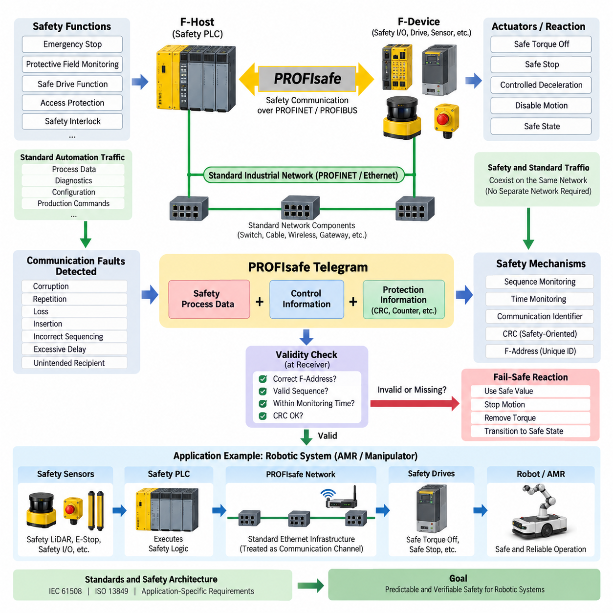
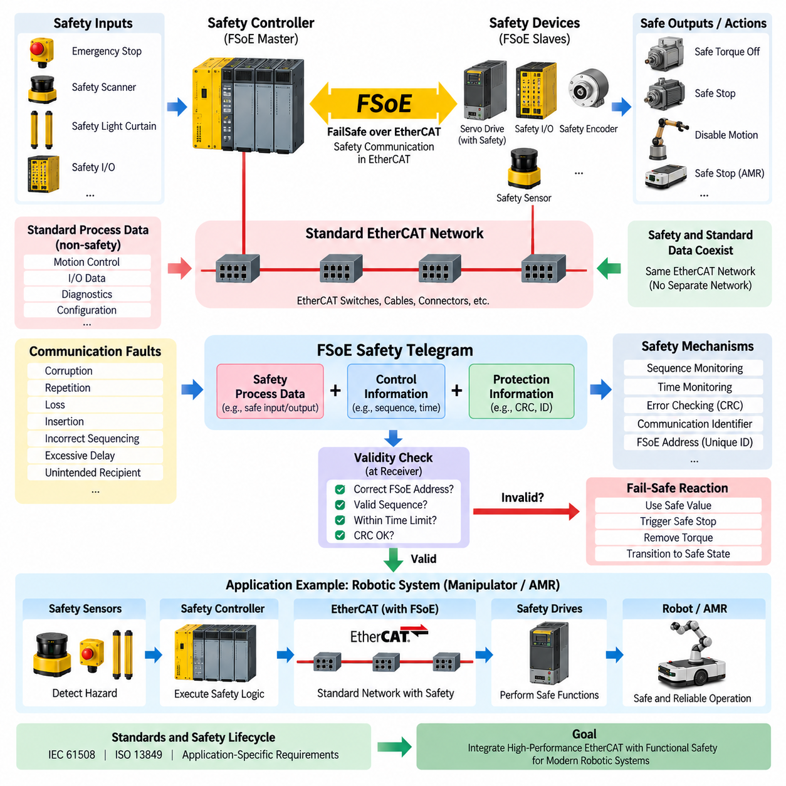
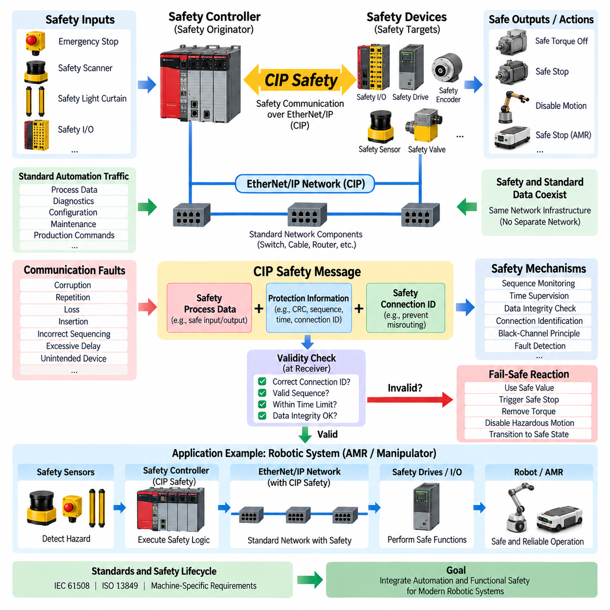
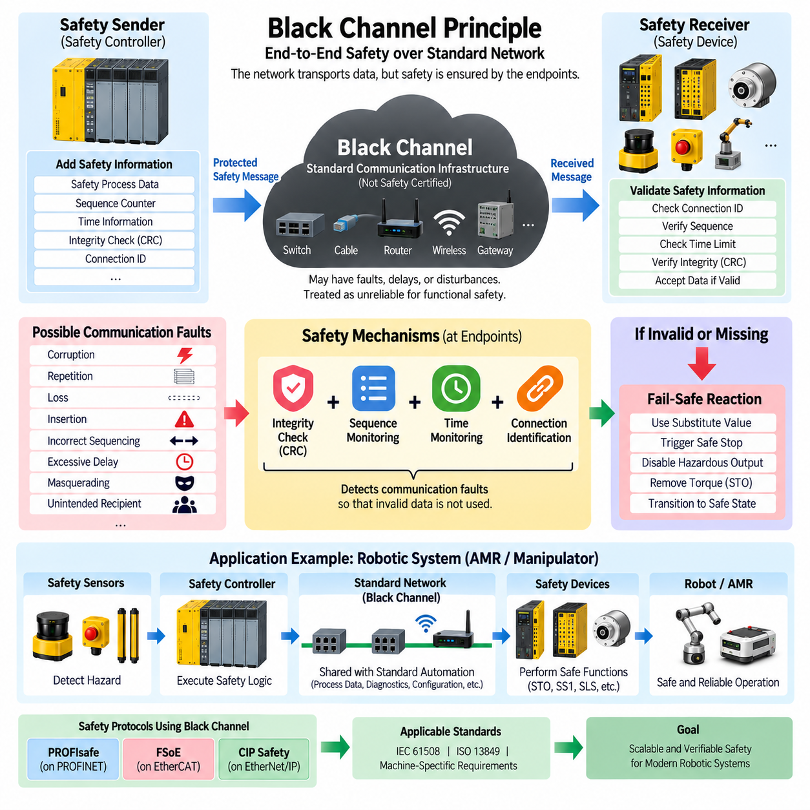
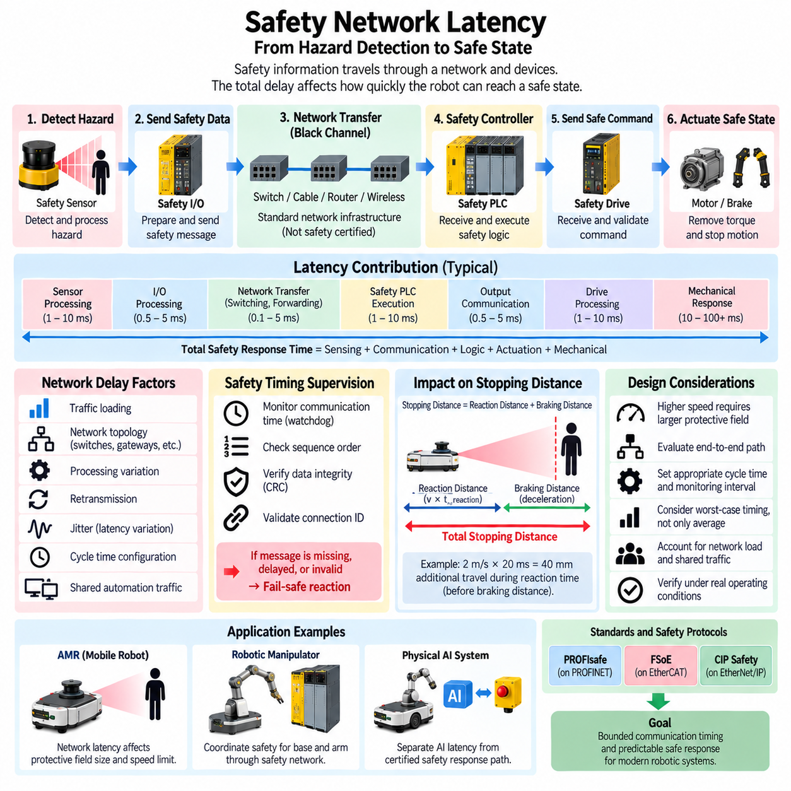

**Volume 12. Safety Architecture**

# Chapter 09. Safety Network

## 09.01. PROFIsafe Protocol

{width="7.268055555555556in" height="7.268055555555556in"}

PROFIsafe is a functional-safety communication profile designed to transmit safety-related information over standard industrial communication networks. It extends PROFINET and PROFIBUS environments without requiring a physically separate network for every safety function. In robotics and automated machinery, it enables safety controllers, remote I/O, drives, sensors, and actuators to exchange safety data through the same infrastructure used for conventional automation communication.

The fundamental idea of PROFIsafe is that safety must not depend on the underlying communication network behaving perfectly. Ethernet switches, cables, wireless bridges, gateways, and ordinary communication components may therefore remain standard devices. Safety integrity is established between PROFIsafe endpoints by adding safety mechanisms to the transmitted process data, allowing the intermediate communication system to be treated as a communication channel rather than as part of the safety logic itself.

A PROFIsafe communication relationship normally connects an F-Host with an F-Device. The F-Host is typically implemented in a safety PLC or safety controller and executes the safety application, while the F-Device can be a safety I/O module, safety drive, scanner interface, valve terminal, or another certified field device. Each endpoint processes the additional PROFIsafe information and determines whether the received safety telegram can be accepted as valid safety data.

PROFIsafe protects safety communication against communication faults such as corruption, repetition, loss, insertion, incorrect sequencing, excessive delay, and delivery to an unintended communication partner. These faults cannot simply be handled by assuming that Ethernet or PROFINET will always deliver packets correctly. Instead, the safety layer uses mechanisms including sequence monitoring, time expectation, communication identifiers, and cyclic redundancy checking to detect dangerous communication behavior.

The PROFIsafe telegram contains safety-related process information together with additional control and protection information. A consecutive monitoring mechanism helps detect repeated, missing, or incorrectly ordered messages, while a safety-oriented CRC provides strong detection of data corruption and certain addressing or sequencing errors. The receiver evaluates these elements before allowing the received process value to influence a safety function, preventing ordinary network errors from silently becoming hazardous commands.

A particularly important concept is the F-Address, which contributes to uniquely identifying safety communication relationships. Correct parameterization is essential because a safety telegram must not accidentally be accepted by the wrong device or connection. PROFIsafe configuration therefore involves more than assigning conventional network addresses. Safety parameters, watchdog behavior, device identities, and validated configuration data must collectively maintain the intended relationship between the F-Host and each F-Device.

Time monitoring provides another major defense mechanism. A safety controller cannot wait indefinitely for a valid telegram because delayed information may no longer represent the physical state of the machine. PROFIsafe therefore supervises communication within an established monitoring time. If valid safety data does not arrive within the permitted interval, the receiving safety function detects the communication fault and transitions the affected information toward a defined safe reaction rather than continuing operation using stale data.

This behavior is closely related to the fail-safe principle. When communication integrity cannot be demonstrated, the system substitutes or activates predefined safe values instead of trusting uncertain process information. The actual physical consequence depends on the safety function and machine design. A mobile robot might request controlled deceleration or torque removal, while a manipulator could disable hazardous motion. PROFIsafe provides safe communication, but the machine-level safety concept determines what safe state must ultimately be achieved.

PROFIsafe is especially useful because safety and standard automation traffic can coexist on the same communication infrastructure. Standard diagnostics, production commands, configuration information, and ordinary process data may travel alongside safety telegrams. This reduces duplicated wiring and permits distributed safety architectures. Nevertheless, logical coexistence does not eliminate engineering requirements concerning network loading, topology, availability, electromagnetic compatibility, latency, and deterministic behavior.

In a robotic system, a safety PLC can use PROFIsafe to coordinate distributed safety functions such as emergency stopping, protective-field monitoring, safe drive functions, access protection, and safety-related interlocks. Safety LiDAR or safety I/O can report hazardous conditions, while certified drives can execute functions such as Safe Torque Off or Safe Stop. This creates a distributed safety architecture in which safety decisions and safety actions can be communicated across the machine rather than concentrated entirely in hardwired circuits.

The distinction between safety communication and safety control is important. PROFIsafe does not independently make a robot safe, nor does it replace hazard analysis, safety-function design, certified controllers, safe drives, or validated sensors. It provides a protected communication mechanism through which those safety components exchange information. Overall safety performance therefore depends on the complete safety chain, including sensing, communication, logic processing, output control, actuator behavior, diagnostics, wiring, and the resulting machine response.

PROFIsafe also supports diagnostic behavior that is valuable during commissioning and operation. Communication faults, parameter inconsistencies, device failures, or safety-related status changes can be reported to the control architecture. However, diagnostic availability must not be confused with the safety mechanism itself. A diagnostic message helps maintenance personnel understand a problem, whereas the fail-safe reaction must occur automatically whenever the safety communication relationship can no longer satisfy its validity conditions.

Engineering a PROFIsafe network requires careful consideration of response time. The complete safety reaction includes sensor detection time, safety communication delay, F-Host processing, output communication, actuator response, and mechanical stopping behavior. Network latency is therefore only one component of the total safety response time. For an AMR, this total response directly influences the required protective distance because the robot continues moving while sensing, communication, computation, braking, and mechanical deceleration take place.

PROFIsafe should consequently be evaluated together with the wider safety architecture described by standards such as IEC 61508, ISO 13849, and application-specific machinery requirements. Required SIL or PL targets influence the design of the safety functions, while PROFIsafe provides an established mechanism for safety-related communication between compliant components. Certification of individual devices simplifies integration, but the resulting machine or robot still requires system-level verification and validation against its defined safety requirements.

Within an AMR or mobile-manipulator architecture, PROFIsafe can form the safety communication backbone connecting a safety PLC, distributed I/O, safety scanners, drive controllers, and machine interfaces. The normal autonomy computer may continue executing localization, perception, planning, and mission logic, while the safety system independently supervises conditions requiring deterministic protective action. This separation prevents high-level AI or navigation software from becoming the sole authority responsible for personnel protection.

The architecture becomes particularly effective when combined with independent emergency-stop paths and certified local safety functions. PROFIsafe can distribute safety states and commands efficiently, while hardwired or locally executed mechanisms can provide protection where communication dependency would be undesirable. Designers can therefore allocate each safety function according to required reaction time, fault tolerance, architecture category, and certification objectives instead of assuming that every protective function should use exactly the same implementation.

For Physical AI robots, PROFIsafe illustrates an important architectural principle: intelligent behavior and safety authority should remain distinguishable. AI systems may generate trajectories, manipulate objects, or adapt robot behavior, but safety-certified communication and control paths can supervise whether those actions remain within permissible operating conditions. When an unsafe condition or communication failure is detected, the safety architecture can override normal autonomy and force the relevant subsystem toward its predefined safe condition.

A robust PROFIsafe implementation therefore emerges from coordinated design rather than protocol selection alone. Safety requirements must first define hazards, required reactions, allowable response times, safe states, and integrity targets. Engineers can then allocate certified sensors, F-Devices, F-Hosts, network paths, drives, and actuators while verifying parameterization and timing. The resulting architecture combines standardized safety communication with independent safety engineering to provide predictable protection throughout robot operation.

## 09.02. FSoE (EtherCAT Safety)

{width="7.268055555555556in" height="7.268055555555556in"}

FSoE, or FailSafe over EtherCAT, is a functional-safety communication protocol designed to transport safety-related data across EtherCAT networks. Within the safety-network structure of robotic and industrial systems, it provides a mechanism for connecting safety controllers, distributed safety I/O, sensors, servo drives, and other safety-capable devices while preserving the high-performance communication characteristics of EtherCAT.

The central architectural principle of FSoE is that safety communication is implemented independently of the reliability of the underlying EtherCAT transport mechanism. EtherCAT carries the safety information between communicating endpoints, but the safety protocol itself provides mechanisms that detect communication faults. Consequently, ordinary EtherCAT infrastructure can transport both standard process information and safety-related information without every intermediate network component becoming a safety-certified device.

This approach follows the black-channel principle, in which the communication medium between safety endpoints is treated as potentially unreliable from the perspective of functional safety. Ethernet physical layers, EtherCAT communication hardware, cables, connectors, and intermediate communication functions transport the data, while FSoE adds end-to-end protection. Safety therefore depends primarily on the ability of the safety endpoints to detect communication failures rather than on assuming error-free behavior throughout the network.

An FSoE communication relationship is established between safety-capable endpoints, commonly involving a safety controller and one or more safety devices. The controller executes the safety logic, while devices may include safe digital I/O, safety encoders, servo drives, safety sensors, or other certified equipment. Each endpoint interprets the safety-specific information and accepts process data only when the communication satisfies the required validity conditions.

FSoE encapsulates safety information within EtherCAT communication rather than creating an entirely separate physical safety network. Additional safety information accompanies the actual safe process data so that the receiver can determine whether a received message is authentic within the intended communication relationship, correctly sequenced, timely, and free from detectable corruption. This protected container allows safety data to coexist with ordinary EtherCAT process data.

Communication faults must be considered systematically because an apparently valid Ethernet frame does not necessarily represent valid safety information. Possible faults include corrupted messages, repeated telegrams, lost information, incorrectly sequenced messages, unacceptable delays, inserted messages, and information delivered through an unintended communication relationship. FSoE safety mechanisms are intended to detect such communication failures before erroneous information can create a hazardous machine response.

Sequence monitoring is particularly important for cyclic safety communication. Each safety message belongs to an expected communication progression, allowing the receiver to identify repeated, missing, or incorrectly ordered information. If the observed sequence differs from the expected state, the safety endpoint does not simply continue using the received process value. Instead, the communication relationship can be considered invalid and the corresponding safety reaction can be initiated.

Error-detection mechanisms provide another layer of protection against data corruption. Safety-related checking information is evaluated together with the transmitted process data, allowing the receiving endpoint to determine whether the safety telegram has maintained its integrity during communication. These checks complement the error-detection mechanisms already present in Ethernet and EtherCAT because functional safety cannot rely exclusively on the lower communication layers to identify every potentially dangerous failure.

Time monitoring ensures that safety information remains relevant to the current physical state of the machine. Even correctly formatted data can become unsafe if it arrives too late. Safety communication therefore operates within defined timing expectations. When valid information is not received within the permitted interval, the affected safety function must treat the communication as failed rather than continuing indefinitely with previously received values.

This timing behavior is especially important for robotics because total stopping performance depends on more than network transmission speed. The complete safety response includes sensor detection, communication, safety-controller processing, output transmission, drive reaction, and mechanical deceleration. EtherCAT provides high-performance cyclic communication, but engineers must evaluate the complete safety response chain when determining protective distances, allowable robot speeds, and stopping behavior.

When an FSoE communication fault is detected, the system must transition toward a predefined safe condition according to the relevant safety function. A servo axis might execute Safe Torque Off, Safe Stop, or another certified drive function, while a mobile platform could disable propulsion or perform an engineered safe stopping sequence. FSoE communicates safety information, but the required physical safe state remains a property of the overall machine safety design.

FSoE is particularly valuable in servo-intensive robotic systems because EtherCAT is widely suited to deterministic, cyclic communication between controllers and distributed motion devices. Safety communication can therefore be integrated into an architecture that already carries real-time process data for servo control, distributed I/O, encoders, and machine synchronization. This reduces the need to construct an independent communication network solely for safety-related information.

A robotic manipulator provides a representative application. Normal EtherCAT communication can coordinate servo commands, position feedback, distributed I/O, and machine states, while FSoE transports safety-related information between the safety controller and safety-capable drives. When a protective device detects a hazardous condition, the safety path can request an appropriate safe drive function independently of the normal trajectory generation and motion-control software.

For an AMR or mobile manipulator, FSoE can similarly connect distributed safety components when EtherCAT is used inside the robot. Safety scanners, emergency-stop circuits, safety I/O, wheel or steering drives, and manipulator drives can participate in the safety architecture through appropriate certified interfaces. High-level navigation, perception, planning, and AI computation can remain outside the safety authority while the safety network independently supervises hazardous motion.

This separation is particularly significant for Physical AI systems. AI-based perception or policy models may generate complex actions, but their outputs should not automatically become safety-certified decisions. A dedicated safety controller and certified safety devices can supervise operating limits and hazardous conditions. FSoE then provides the protected communication path through which safety states and commands are distributed independently of the intelligence and autonomy layers.

Safety communication should also remain conceptually distinct from ordinary EtherCAT communication performance. Fast cycle times and deterministic data exchange are valuable engineering properties, but high communication performance alone does not establish functional safety. Safety integrity requires defined fault assumptions, error detection, timing supervision, safe reactions, certified implementations, configuration control, and verification of the complete safety function from sensing through final actuation.

System integration therefore requires more than enabling FSoE communication between compatible products. Engineers must define the required safety functions, identify hazardous events, establish safe states, calculate allowable response times, select appropriate safety components, configure communication relationships, and verify the resulting behavior. Safety-network configuration becomes part of the overall safety lifecycle rather than simply another industrial Ethernet configuration task.

FSoE should consequently be evaluated together with applicable functional-safety frameworks and machine-specific safety requirements. Required SIL or PL targets influence the architecture of the complete safety function, while certified FSoE components provide the communication portion of that architecture. Device certification can reduce integration complexity, but it does not eliminate system-level validation of sensors, logic, communication, drives, actuators, stopping performance, and fault reactions.

Within the broader safety-network architecture, FSoE represents the EtherCAT-oriented counterpart to other safety communication approaches such as PROFIsafe and CIP Safety. The protocols differ in their ecosystems and implementations, but they share the objective of transporting safety-related information over industrial communication infrastructure while detecting dangerous communication failures. The surrounding machine architecture ultimately determines which protocol best matches the controller, drive, sensor, and network environment.

A well-engineered FSoE architecture therefore combines EtherCAT communication performance with an independent functional-safety layer. Standard process communication can support high-speed control and synchronization, while FSoE protects the information required for safety decisions and safe actuator reactions. For modern AMRs, manipulators, and Physical AI machines, this separation provides a practical foundation for integrating sophisticated autonomy with deterministic, independently enforceable safety behavior.

## 09.03. CIP Safety Protocol

{width="7.268055555555556in" height="7.268055555555556in"}

CIP Safety is a functional-safety communication protocol built on the Common Industrial Protocol, or CIP, and is commonly associated with EtherNet/IP and other CIP-based industrial networks. Within a robotic safety architecture, it enables safety controllers, distributed safety I/O, drives, sensors, and protective devices to exchange safety-related information while standard automation communication continues on the same network infrastructure.

The fundamental concept of CIP Safety is to separate the integrity of safety communication from the reliability of the underlying transport network. Ethernet switches, cables, routers, and other communication components can carry safety traffic without individually providing the complete safety function. Safety protection is implemented end-to-end between CIP Safety nodes, allowing the underlying network to operate as a communication channel rather than as the primary source of safety integrity.

This architecture follows the black-channel principle, where intermediate communication infrastructure is not assumed to be inherently safe. Instead, safety endpoints apply additional mechanisms capable of detecting communication faults that could otherwise produce hazardous behavior. The same physical network can consequently carry ordinary control information, diagnostics, configuration data, and safety messages while the safety protocol independently verifies the validity of safety-related communication.

A typical CIP Safety architecture includes a safety originator and one or more safety targets. The originator is generally associated with a safety controller that executes safety logic, while targets may include safety I/O modules, drives, valves, scanners, or other safety-capable field devices. The safety relationship between these endpoints establishes the context in which transmitted safety data is evaluated before it is accepted for use by a safety function.

CIP Safety adds protective information to safety process data so that the receiving endpoint can determine whether a message belongs to the intended safety connection and remains valid. The protection mechanisms are designed to detect errors such as data corruption, unintended repetition, message loss, insertion, incorrect sequencing, excessive delay, and communication with an unintended device. Detecting these failure modes is essential because a correctly transported Ethernet packet is not automatically valid safety information.

Safety connection identification is therefore an important part of the protocol. CIP Safety uses information associated with the safety communication relationship to prevent safety data from being incorrectly accepted by another connection or device. This principle is especially important in complex automation systems where many controllers and field devices share network infrastructure and ordinary network addressing alone cannot provide sufficient protection for functional-safety communication.

Sequence and timing supervision provide additional protection against repeated, missing, stale, or incorrectly ordered information. The receiving safety endpoint expects communication to progress according to defined conditions. When the expected relationship is violated, the data cannot simply be treated as current safety information. The safety function instead recognizes the communication fault and applies the predefined fault-handling behavior associated with that safety connection.

Data-integrity checking provides protection against corruption that may occur during transmission, storage, forwarding, or processing. Safety-oriented error-detection information accompanies the safety data and is checked by the receiving endpoint. These mechanisms complement the error detection already available in Ethernet and CIP communication because functional safety requires protection against communication failure modes beyond those normally considered sufficient for conventional industrial control.

Time expectation is particularly important because even logically correct safety information may become hazardous when delivered too late. CIP Safety communication therefore includes mechanisms that allow endpoints to detect unacceptable timing behavior. If valid safety information does not arrive within the expected interval, the receiver must not indefinitely continue using an old value as though it represented the current physical condition of the machine.

When communication validity can no longer be established, the affected safety function must transition toward an engineered safe condition. Depending on the application, this may cause a drive to perform Safe Torque Off, initiate a safe stopping function, disable hazardous motion, or force safety outputs to predefined values. CIP Safety provides protected communication for initiating these responses, while the required physical safe state is determined by the overall machine safety architecture.

CIP Safety is particularly useful in automation environments already based on EtherNet/IP and CIP devices. Standard process control, diagnostics, configuration, and safety-related communication can share the industrial Ethernet infrastructure, reducing the need for completely separate communication systems. However, sharing the network does not remove engineering requirements for network availability, topology, traffic loading, response time, fault containment, and appropriate separation of safety and non-safety responsibilities.

For robotic systems, a safety controller can use CIP Safety to coordinate emergency-stop information, protective devices, safety I/O, and certified drive functions across distributed equipment. A safety scanner may detect entry into a hazardous zone, the safety controller may evaluate the condition, and safety-capable drives may execute the required protective response. The safety communication path therefore connects sensing, decision, and actuation while remaining distinct from ordinary robot control.

In an AMR, safety-related communication can connect safety scanners, emergency-stop interfaces, distributed safety I/O, propulsion controllers, and other certified components. Meanwhile, the autonomy computer can continue handling localization, mapping, perception, path planning, and mission management. This division allows personnel-protection functions to remain under dedicated safety authority instead of depending directly on the correctness of high-level navigation or AI software.

The same principle applies to mobile manipulators and other Physical AI machines. AI models may select actions, predict environmental behavior, or generate motion trajectories, but these capabilities should remain distinguishable from certified safety functions. CIP Safety can provide a protected communication path between the components responsible for enforcing safety limits, allowing the safety system to override normal autonomy whenever hazardous conditions are detected.

Network speed alone must not be interpreted as safety performance. High-bandwidth Ethernet and rapid controller cycles can reduce communication delay, but functional safety depends on defined failure assumptions, safety communication mechanisms, controller execution, actuator response, diagnostic coverage, and verified fault reactions. The safety engineer must therefore evaluate the complete safety function rather than treating the communication protocol as an isolated guarantee of machine safety.

Total safety response time is particularly important for moving robotic equipment. The complete reaction includes sensor detection time, network communication, safety-controller processing, output communication, drive response, brake behavior, and mechanical deceleration. For an AMR, this combined time influences protective-field dimensions and allowable travel speed because the vehicle continues moving for some distance after the hazardous condition is first detected.

System integration consequently requires careful configuration and validation of the complete safety connection. Engineers must define hazards, safe states, required safety functions, allowable response times, and applicable integrity targets before selecting and configuring safety components. Communication parameters, endpoint relationships, controller logic, output behavior, and physical stopping performance must then be verified as parts of a coordinated functional-safety lifecycle rather than as independent configuration activities.

CIP Safety should therefore be applied within the broader framework of functional-safety standards and machine-specific requirements. Required SIL or PL objectives influence the architecture of sensors, logic, communication, and final control elements. Certified CIP Safety products can simplify implementation of the communication portion, but certification of individual components does not replace system-level verification and validation of the resulting robot or machine safety function.

Within the safety-network structure, CIP Safety complements other industrial safety communication approaches such as PROFIsafe and FSoE. PROFIsafe is closely associated with PROFINET environments, while FSoE provides safety communication within EtherCAT architectures and CIP Safety fits naturally within the CIP and EtherNet/IP ecosystem. The appropriate choice therefore depends strongly on the controller, drive, field-device, and industrial-network architecture selected for the machine.

A robust CIP Safety architecture ultimately combines shared industrial networking with independently protected safety communication. Standard automation traffic can support production control, diagnostics, and normal robotic operation, while safety endpoints continuously verify the information responsible for protective actions. This separation provides a practical foundation for AMRs, manipulators, and Physical AI systems in which advanced autonomy can operate alongside deterministic and independently enforceable functional-safety mechanisms.

## 09.04. Black Channel Principle

{width="7.268055555555556in" height="7.268055555555556in"}

The black channel principle is a functional-safety communication concept in which the underlying communication system is not required to provide the complete safety integrity of transmitted information. Instead, safety is established end-to-end between safety-capable communication endpoints. Within the safety-network structure, this principle provides the architectural foundation for protocols such as PROFIsafe, FSoE, and CIP Safety.

The term "black channel" means that the internal behavior of the transport network does not need to be trusted as inherently safe by the safety application. Ethernet switches, fieldbus controllers, cables, connectors, wireless links, gateways, and other intermediate components may transport safety information. The safety layer assumes that communication faults can occur inside this channel and therefore detects them independently at the endpoints.

This approach separates communication transport from safety responsibility. The underlying network is responsible for moving information from one location to another, while the safety protocol is responsible for determining whether the received information can safely be accepted. As a result, conventional industrial communication infrastructure can often be shared by standard automation traffic and safety-related traffic without requiring every intermediate component to become a safety-certified element.

A black-channel safety architecture normally contains a safety sender, an arbitrary communication channel, and a safety receiver. Before transmission, the sender adds safety-related protection information to the process data. The communication channel transports the resulting message without being considered the primary safety mechanism. At the destination, the receiver evaluates the safety information and accepts the process data only when all required validity conditions have been satisfied.

The principle is based on explicitly considering communication failure modes rather than assuming perfect message delivery. Possible failures include corruption, repetition, loss, insertion, incorrect sequencing, excessive delay, masquerading, and delivery to an unintended recipient. A safety communication protocol must provide sufficient measures to detect the relevant failure modes before erroneous information can cause a dangerous action in the controlled machine.

Data corruption occurs when transmitted information changes somewhere between sender and receiver. Conventional networks already include mechanisms for detecting many transmission errors, but functional safety does not rely exclusively on these lower-layer protections. Safety protocols therefore add safety-oriented integrity checks, commonly involving cyclic redundancy checking and additional contextual information, so that the receiver can independently evaluate the integrity of safety-related data.

Message repetition and incorrect sequencing can be dangerous because an old but otherwise correctly formatted command may be interpreted as current information. Safety communication protocols therefore use sequence-related mechanisms that allow the receiver to determine whether messages follow the expected progression. Repeated, skipped, or incorrectly ordered safety messages can consequently be detected rather than silently accepted as valid process information.

Message loss and excessive delay are handled through timing supervision. Safety information represents a physical condition that may change rapidly, so its validity cannot be assumed indefinitely. The receiver expects valid safety communication within a defined time window. If the expected information does not arrive before the monitoring limit expires, the communication relationship is considered faulty and the associated safety function initiates its predefined reaction.

Insertion and masquerading require mechanisms that associate safety information with the correct communication relationship. A valid-looking message must not be accepted simply because its data format is correct. Safety identifiers, connection information, addresses, or comparable protocol-specific mechanisms allow endpoints to verify that safety data belongs to the intended sender, receiver, and safety connection rather than another device or communication session.

The combination of integrity checking, sequence supervision, time monitoring, and connection identification transforms an ordinary communication path into a usable transport mechanism for functional-safety information. Importantly, these mechanisms do not make the black channel itself safe. Instead, they make communication faults within that channel sufficiently detectable so that the safety endpoints can prevent uncertain information from being used as trusted safety data.

When the receiver cannot establish the validity of a safety message, the system follows the fail-safe principle rather than attempting to continue normal operation with uncertain information. Depending on the safety function, predefined substitute values may be used, hazardous outputs may be disabled, or a safe stopping function may be initiated. The communication protocol detects the invalid condition, while the machine safety architecture defines the resulting physical safe state.

The black channel principle also permits safety and non-safety communication to coexist on the same network. Standard process data, diagnostics, configuration information, motion commands, and production messages may share infrastructure with protected safety data. This can significantly simplify distributed automation architectures, but coexistence does not eliminate requirements for adequate bandwidth, network availability, topology design, electromagnetic compatibility, and predictable communication performance.

Network performance and functional safety must nevertheless remain conceptually separate. A deterministic industrial Ethernet network may provide extremely low latency and stable cycle times, but deterministic communication alone does not prove safety integrity. Conversely, a safety protocol can detect many communication faults without controlling every internal network mechanism. Functional safety therefore depends on the protected end-to-end relationship rather than merely on raw network performance.

This distinction is especially important when calculating total safety response time. The black channel may introduce communication delay and variation that must remain within the assumptions of the safety function. Sensor detection time, network transfer, safety-controller processing, output communication, drive response, brake activation, and mechanical stopping time collectively determine how quickly the machine reaches its required safe state after a hazardous event.

For an AMR, these timing relationships directly affect protective-field dimensions and allowable speed. A safety scanner may detect a person, but the vehicle continues moving while information travels through the safety network, the safety controller evaluates the condition, the drive receives the safe command, and the mechanical system decelerates. Black-channel protection ensures communication validity, while system-level engineering ensures that the resulting stopping distance remains acceptable.

In a robotic manipulator, the same architecture can connect safety sensors, distributed safety I/O, safety controllers, and certified servo drives through shared industrial communication infrastructure. Ordinary motion control may operate through the same physical network, while protected safety messages supervise functions such as emergency stopping, safe torque removal, safe speed, or protective-zone reactions. The safety path therefore remains logically independent even when physical infrastructure is shared.

The principle becomes particularly valuable for Physical AI systems because it supports separation between intelligent computation and certified safety authority. AI-based perception, world models, planners, or policies may operate through complex computing and networking infrastructure that cannot practically be treated as entirely safety-certified. Independent safety endpoints can instead supervise hazardous conditions and exchange protected safety information across a communication channel whose internal behavior is not trusted for safety.

Black-channel architecture does not mean that network engineering can be ignored. Communication components must still satisfy environmental, electrical, bandwidth, availability, cybersecurity, and interoperability requirements appropriate to the system. The principle specifically addresses functional-safety communication integrity; it does not automatically solve congestion, physical link failure, malicious attacks, power loss, electromagnetic interference, or inappropriate system-level network architecture.

PROFIsafe, FSoE, and CIP Safety demonstrate how the same architectural principle can be implemented within different industrial ecosystems. PROFIsafe commonly operates with PROFINET, FSoE provides functional-safety communication over EtherCAT, and CIP Safety is associated with CIP-based networks such as EtherNet/IP. Their detailed mechanisms differ, but each protects safety communication without requiring the ordinary transport infrastructure itself to provide the complete end-to-end safety function.

System validation must therefore examine both the safety protocol and the complete safety function surrounding it. Engineers must establish hazards, required safe states, safety integrity targets, allowable response times, communication assumptions, fault reactions, and final actuator behavior. Certified communication components can support this process, but system-level verification remains necessary to demonstrate that sensing, communication, logic, and actuation collectively achieve the required safety performance.

The black channel principle ultimately provides a scalable way to integrate functional safety with modern distributed robotic networks. By placing safety integrity at the communication endpoints, standard network infrastructure can transport both conventional and safety-related information while faults are detected by dedicated safety mechanisms. This separation enables AMRs, manipulators, and Physical AI systems to combine advanced networked intelligence with independently enforceable and verifiable safety behavior.

## 09.05. Safety Network Latency

{width="7.268055555555556in" height="7.268055555555556in"}

Safety network latency is the time required for safety-related information to travel through the communication path from hazard detection to the device responsible for executing a protective action. In robotic systems, this delay forms part of the total safety response time and directly influences how quickly an AMR, manipulator, or automated machine can reach a defined safe state after a hazardous condition occurs.

Safety latency must not be interpreted simply as the transmission time of a single Ethernet frame. The complete communication delay may include sensor processing, local safety-device execution, protocol cycle time, network transfer, switching or forwarding, safety-controller processing, output communication, and destination-device processing. Each contribution consumes part of the time available for the overall safety function to respond.

A useful system-level representation is to consider total safety response time as the accumulation of sensing, communication, logic, actuation, and mechanical response. The network component may be only a fraction of this total, but its delay and variation must remain bounded. A fast network cannot compensate for a slow sensor or mechanical brake, while a fast actuator cannot compensate for safety information that arrives outside its permitted communication window.

Latency becomes safety-critical because a moving machine continues to travel while the safety chain is responding. If an AMR detects a person entering its protective field, the vehicle does not stop instantaneously. Time is required to recognize the event, transfer safety information, execute safety logic, command the drive, remove or reduce torque, and mechanically decelerate the vehicle until the required safe condition is achieved.

The relationship between latency and stopping distance can therefore be understood through two major components. During reaction time, the robot continues moving approximately according to its current velocity, creating a reaction distance. After the braking action begins, additional braking distance is required. Increasing communication latency increases the first component and can consequently require a larger protective field even when the mechanical braking capability remains unchanged.

For example, an AMR traveling at 2 m/s moves approximately 2 mm during every millisecond of uncompensated reaction time. An additional 20 ms of system delay can therefore correspond to roughly 40 mm of additional travel before considering braking distance and safety margins. This illustrates why apparently small timing differences become significant when designing high-speed mobile robots operating close to personnel.

Average latency alone is insufficient for safety engineering. A network may provide an excellent average response while occasionally producing substantially longer delays because of traffic loading, scheduling, retransmission, processing variation, or other disturbances. Functional safety must therefore consider bounded behavior and worst-relevant timing rather than relying only on typical or mean communication performance.

Latency variation is commonly described as jitter. In ordinary automation, moderate jitter may primarily affect control quality or synchronization accuracy, but in safety communication it can consume part of the available timing margin. Safety architectures therefore require timing assumptions that account for communication variation so that the safety function remains valid even when individual messages do not arrive at exactly the nominal cycle time.

Safety protocols use time supervision to prevent excessively delayed information from being treated as valid current information. PROFIsafe, FSoE, and CIP Safety implement protocol-specific mechanisms for supervising safety communication relationships. If valid information is not received within the expected timing conditions, the safety endpoint identifies the communication as faulty and initiates the defined fail-safe behavior instead of indefinitely trusting stale process data.

This behavior reflects the black channel principle used by modern safety networks. The underlying network is not assumed to provide perfect timing or error-free delivery for functional safety. Safety endpoints supervise message integrity, sequence, communication identity, and timing independently. Consequently, an ordinary industrial communication infrastructure can transport safety information provided that the end-to-end safety protocol detects communication behavior that violates its permitted assumptions.

Communication cycle time and safety watchdog time must be distinguished. The cycle time describes how frequently information is normally exchanged, whereas the watchdog or monitoring interval defines how long the safety relationship can tolerate the absence of valid information before declaring a communication fault. Selecting these parameters requires balancing rapid fault detection against realistic network and device timing behavior.

Setting the monitoring interval too long increases the time required to recognize a failed communication relationship and can enlarge the total safety response time. Setting it unrealistically short can produce unnecessary safety trips when normal timing variation occurs. The selected value must therefore reflect the actual communication architecture, device processing times, cycle configuration, network behavior, required safety reaction, and validated timing assumptions.

Network topology can also influence latency. Safety information may pass through controllers, switches, couplers, gateways, remote I/O stations, or other communication elements before reaching the final actuator. Each stage can contribute processing or forwarding delay. A safety network should therefore be evaluated as an end-to-end path rather than assuming that nominal Ethernet bandwidth alone determines the response of the safety function.

Traffic loading is another important engineering consideration when safety and standard automation information share network infrastructure. Motion data, diagnostics, cameras, configuration traffic, logging, and other communication may compete for network resources depending on the architecture. Functional-safety communication must remain within its validated timing assumptions even under the expected operating load rather than only during lightly loaded laboratory conditions.

Deterministic industrial networks can simplify this problem by providing predictable cyclic communication and controlled scheduling behavior. EtherCAT, PROFINET, and EtherNet/IP architectures offer different mechanisms and performance characteristics, while their associated safety protocols provide the safety layer. Deterministic communication can improve timing predictability, but deterministic performance and functional-safety integrity remain separate engineering properties.

Safety network latency must also be evaluated together with the Safety PLC execution cycle. A safety message arriving immediately after the relevant logic cycle may wait until subsequent processing, depending on controller architecture and scheduling. Similarly, an output command may require another communication cycle before reaching a safety drive. These phase relationships can become important when calculating realistic worst-case end-to-end response time.

The actuator side introduces additional delay after network communication has completed. A safety drive must receive and validate the command, execute functions such as Safe Torque Off or Safe Stop, and cause the electromechanical system to respond. Contactors, brakes, motors, wheels, joints, and mechanical loads each introduce physical response characteristics that must be included when translating communication timing into actual machine stopping performance.

For an AMR, total response time influences the design of protective fields used by safety LiDAR and other protective sensors. Higher vehicle speed, longer communication delay, slower braking, and uncertainty margins generally require greater separation between the detected obstacle and the hazardous moving structure. Safety network engineering therefore becomes directly connected to perception geometry, vehicle dynamics, braking performance, and operational speed limits.

Mobile manipulators introduce an additional challenge because the mobile base and robotic arm can have different dynamic characteristics and safety reactions. A protective event may require stopping the base, disabling manipulator motion, or coordinating both. Distributed safety communication must deliver the relevant state to each safety-capable subsystem within the timing assumptions established for its particular hazard and required safe reaction.

Physical AI systems further emphasize the need to separate AI communication latency from certified safety response paths. Perception models, world models, planners, and policy networks may operate at variable execution rates and may experience substantial computational latency. Personnel protection should therefore not depend solely on an AI inference loop when a dedicated safety sensor, safety controller, safety network, and certified drive function can provide an independently bounded protective path.

Verification should measure safety response under representative and adverse operating conditions rather than relying exclusively on nominal specifications. Engineers should evaluate communication timing with realistic network loading, controller execution, distributed devices, and configured safety functions. The resulting measurements can then be combined with sensor and actuator response characteristics to confirm that the complete safety function remains within its required response-time budget.

Safety network latency is therefore best treated as a budget within the complete safety chain rather than as an isolated network benchmark. Each stage consumes part of the allowable response time, and adequate margin must remain for variation and physical stopping behavior. A robust robotic safety architecture combines bounded communication timing, time-supervised safety protocols, validated controller execution, certified actuators, and measured machine dynamics to achieve predictable and verifiable protection.
