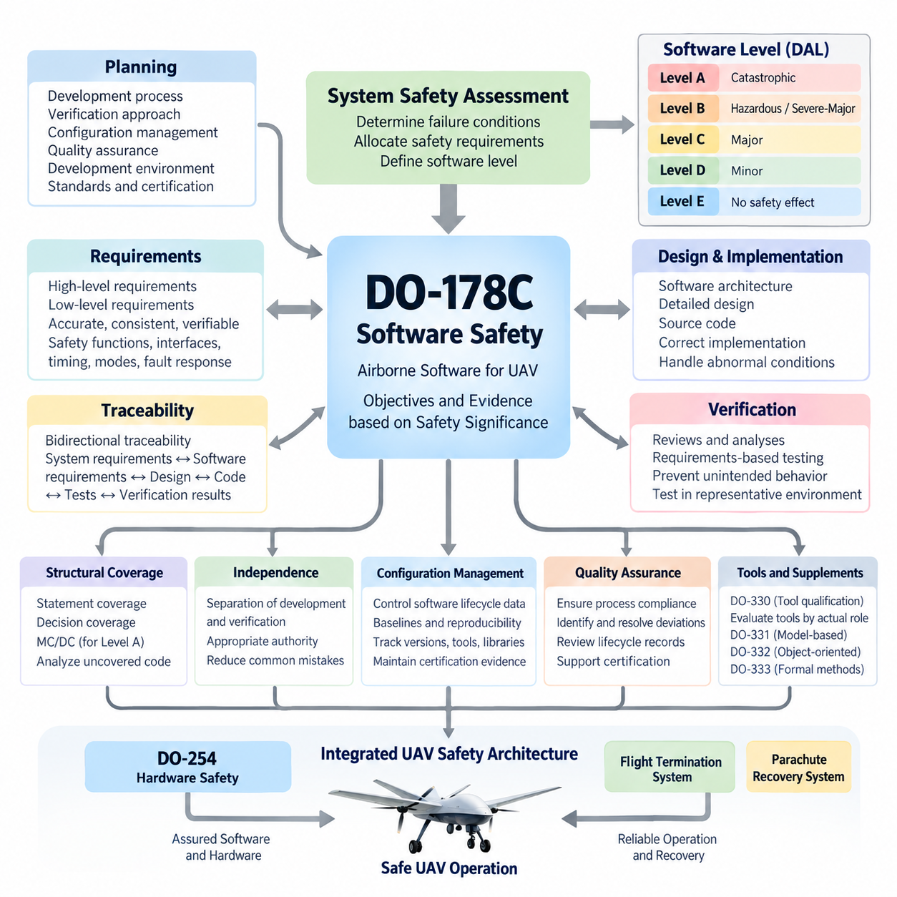
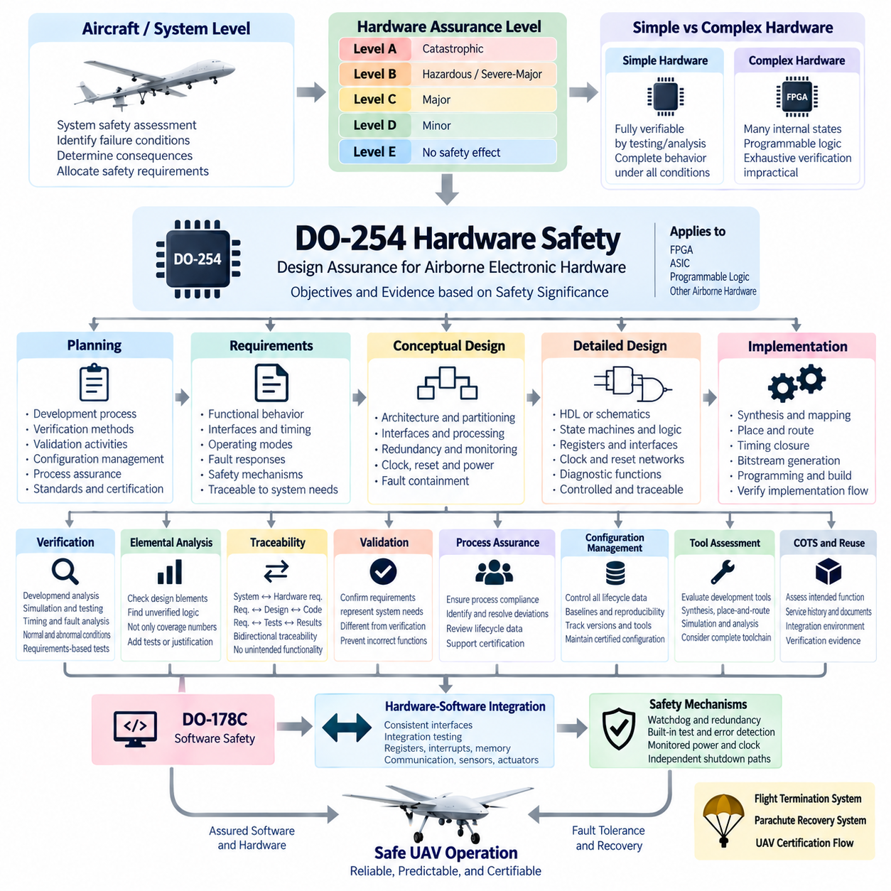
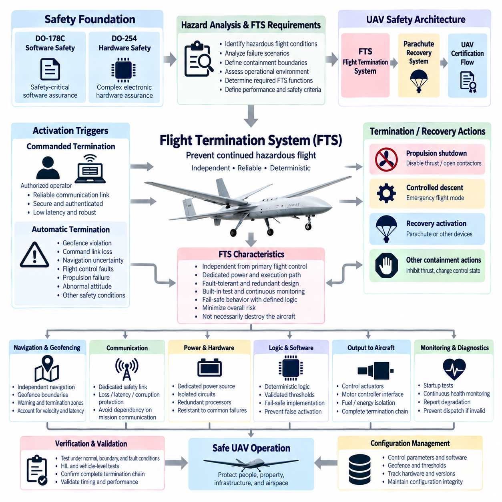
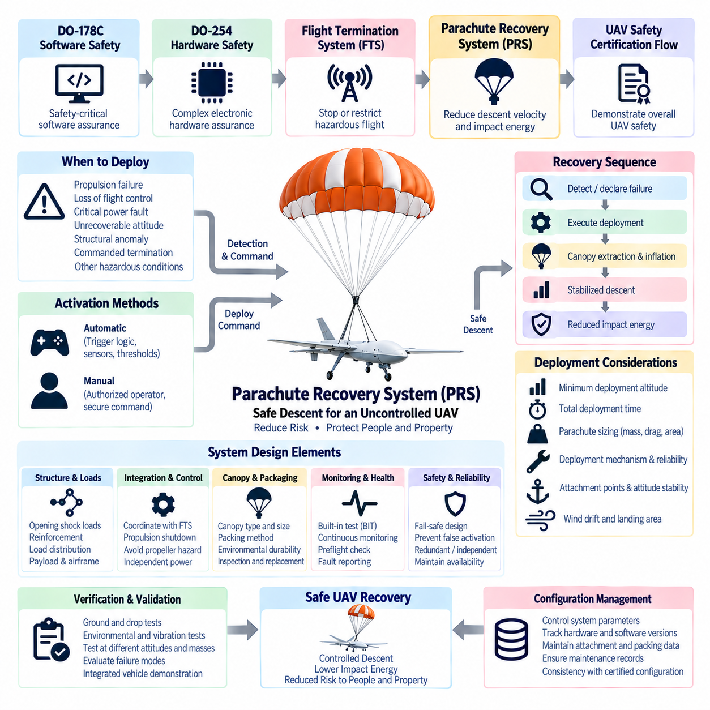
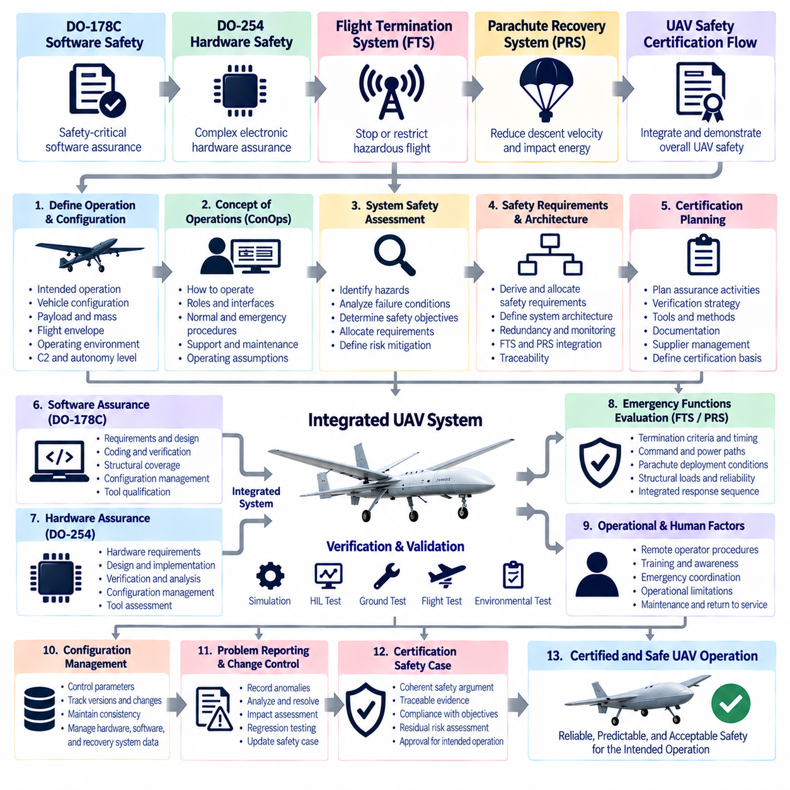

**Volume 12. Safety Architecture**

# Chapter 10. UAV Safety Architecture

## 10.01. DO-178C Software Safety

{width="7.268055555555556in" height="7.268055555555556in"}

DO-178C establishes a disciplined framework for developing airborne software whose behavior can affect aircraft or UAV safety. Rather than defining a particular programming language, operating system, or software architecture, it specifies objectives and evidence needed to demonstrate that software has been developed with rigor appropriate to its safety significance. Within the supplied structure, it forms the software-safety foundation of the UAV safety architecture alongside DO-254 hardware safety and system-level recovery mechanisms.

The central concept is the software level, commonly expressed as Design Assurance Level A through E. Level A applies when anomalous software behavior could contribute to a catastrophic failure condition, while Levels B, C, and D correspond progressively to hazardous/severe-major, major, and minor consequences. Level E applies when software behavior has no effect on aircraft operational capability or safety. Increasing criticality therefore produces progressively stronger development, verification, independence, traceability, and assurance expectations.

DO-178C does not establish the aircraft-level failure condition by itself. System safety assessment determines the consequences of functional failures and allocates safety requirements to systems, hardware, and software. The resulting software level then determines which DO-178C objectives must be satisfied. This relationship is important for cargo UAVs because flight control, propulsion management, navigation supervision, communication, payload handling, and recovery functions can have very different safety consequences even when they execute on interconnected computing platforms.

A compliant lifecycle begins with planning. The development organization defines how software will be produced, verified, configured, and certified before implementation evidence accumulates. Typical planning information describes the software development process, verification approach, configuration management, quality assurance activities, development environment, standards, and certification considerations. Certification authorities or their representatives can therefore evaluate not merely the final executable software, but whether the complete lifecycle provides credible assurance.

Software requirements provide the first major engineering bridge between aircraft functions and executable code. High-level requirements describe software behavior derived from allocated system requirements, while low-level requirements refine that behavior into sufficient detail for implementation. Requirements should be accurate, consistent, verifiable, and traceable. Safety-relevant interfaces, timing behavior, operating modes, state transitions, fault responses, initialization, monitoring, and degraded operation must be defined precisely enough that verification can determine whether the implementation behaves as intended.

Traceability connects system requirements, software requirements, design information, source code, executable behavior, and verification results. Bidirectional traceability helps demonstrate that every required behavior has been implemented and tested while also exposing code that cannot be justified by an approved requirement. This is particularly valuable in complex UAV controllers, where autonomous functions may interact with navigation, actuator control, communication, health monitoring, and emergency functions through many software interfaces.

Verification is intentionally more rigorous than simply executing functional tests. Reviews and analyses examine requirements, architecture, design, source code, traceability, and verification artifacts, while testing demonstrates behavior in representative environments. Verification must establish both that the software satisfies its requirements and that unintended behavior has not been introduced through implementation errors, incorrect interfaces, numerical problems, resource conflicts, timing defects, or inadequate handling of abnormal conditions.

Structural coverage analysis provides evidence that requirements-based testing has exercised the implemented software structure to the degree required by its assurance level. Statement coverage, decision coverage, and Modified Condition/Decision Coverage become relevant at progressively stronger assurance levels. MC/DC is particularly important for Level A software because it demonstrates that individual Boolean conditions within decisions can independently affect the decision outcome, providing stronger evidence for logic-intensive flight-critical software.

When requirements-based tests fail to exercise portions of code, the uncovered structure must be analyzed rather than automatically accepted. The organization determines whether the code is associated with missing test cases, incomplete requirements, deactivated functionality, defensive programming, or unintended implementation. This analysis can reveal software that has no legitimate requirements basis. Such unintended or inadequately justified code is especially significant because testing alone cannot establish safety assurance for behavior whose intended purpose is undefined.

Independence strengthens verification for higher-criticality software. Certain activities must be performed with sufficient separation between the person or organization producing an artifact and the party verifying it. Independence reduces the probability that the same misunderstanding will influence both implementation and verification. It does not necessarily require completely separate companies or teams, but responsibilities, authority, reviews, and evidence must demonstrate the degree of independence required for applicable objectives.

Configuration management preserves the identity and reproducibility of software lifecycle data. Source code, requirements, verification procedures, test results, build information, tools, configuration files, generated data, and executable objects must remain under controlled configuration appropriate to their safety significance. Baselines make it possible to determine exactly which requirements, code, compiler options, libraries, and test evidence correspond to a particular airborne software release and to reproduce that release when necessary.

Software quality assurance provides confidence that defined processes are actually followed and that deviations are identified, recorded, evaluated, and resolved. This function complements technical verification by examining process compliance, lifecycle records, transition criteria, configuration controls, and certification evidence. In a UAV program, such discipline prevents rapid prototype practices from silently propagating into flight-critical releases without the additional controls required for airborne safety assurance.

DO-178C also addresses the consequences of using software tools in lifecycle activities. When a tool could introduce an error into airborne software or could fail to detect an error that would otherwise require verification, qualification considerations become important. DO-330 provides a dedicated framework for tool qualification. Compilers, code generators, test automation systems, model-based development environments, coverage tools, and verification utilities must therefore be evaluated according to their actual role rather than assumed trustworthy because they are commercially established.

Modern airborne software development may additionally rely on supplementary guidance associated with DO-178C. DO-331 addresses model-based development and verification, DO-332 addresses object-oriented technology and related techniques, and DO-333 addresses formal methods. These supplements do not eliminate the fundamental assurance philosophy. Instead, they explain how particular development technologies can satisfy or modify applicable lifecycle objectives while preserving requirements traceability, verification rigor, configuration control, and certification evidence.

For UAV architectures, DO-178C should be treated as one component of a larger safety argument rather than an isolated software coding standard. Flight-control software ultimately interacts with processors, sensors, communication networks, actuators, power systems, and independent safety mechanisms. The supplied volume therefore places DO-178C immediately beside DO-254 hardware safety, the Flight Termination System, Parachute Recovery System, and UAV certification flow, reflecting the need to integrate software assurance with hardware and vehicle-level safety mechanisms.

Partitioning and architectural containment can help prevent software of different criticalities from adversely interfering with one another, but such mechanisms themselves require assurance. Memory protection, scheduling, communication boundaries, resource allocation, fault containment, and initialization behavior must support the assumptions made by the system safety architecture. For highly integrated UAV computers, credible separation between flight-critical control and lower-criticality mission or payload applications can significantly influence certification complexity.

DO-178C assurance ultimately depends on evidence rather than a claim that the software is error-free. Requirements, design and implementation data, verification results, coverage analyses, problem reports, configuration records, quality assurance records, and certification data collectively establish confidence that the prescribed objectives have been satisfied. The resulting evidence allows reviewers to reconstruct how safety requirements became executable software and how each important transformation was independently checked where required.

For autonomous cargo UAVs, this distinction becomes increasingly important as conventional deterministic control software is combined with perception, planning, optimization, and AI-based functionality. DO-178C was fundamentally structured around software whose required behavior can be specified and verified with appropriate rigor. Consequently, safety-critical autonomous architectures should maintain clearly defined assurance boundaries, deterministic safety monitors, validated interfaces, controlled fallback behavior, and independently assured protection functions wherever complex autonomy cannot provide equivalent certifiable evidence.

The practical engineering value of DO-178C is therefore its end-to-end assurance chain. Aircraft-level safety analysis determines the consequence of failure, the software level establishes the required rigor, requirements define intended behavior, implementation realizes that behavior, verification challenges the implementation, structural coverage evaluates test completeness, and configuration and quality processes preserve trustworthy evidence. In a UAV safety architecture, this chain provides the software foundation upon which hardware assurance, emergency termination, recovery systems, and vehicle-level certification can be integrated.

## 10.02. DO-254 Hardware Safety

{width="7.268055555555556in" height="7.268055555555556in"}

DO-254 provides design assurance guidance for airborne electronic hardware whose failure or unintended behavior can affect aircraft safety. Formally associated with RTCA DO-254 and EUROCAE ED-80, it addresses complex airborne electronic hardware such as FPGAs, ASICs, programmable logic devices, and other hardware whose complete behavior cannot always be demonstrated solely through conventional component testing. Within a UAV safety architecture, it complements DO-178C by applying structured assurance principles to the hardware executing, interfacing with, or supporting safety-critical software.

The assurance process begins at the aircraft and system level rather than with an FPGA schematic or circuit implementation. System safety assessments identify failure conditions and determine their consequences, after which safety requirements are allocated to hardware and software elements. Hardware Design Assurance Levels are then associated with the criticality of the implemented function. Higher safety significance requires stronger planning, requirements capture, design control, verification, traceability, configuration management, and process assurance.

Hardware assurance levels are commonly associated with failure-condition severity from Level A through Level E. Level A corresponds to hardware whose anomalous behavior could contribute to a catastrophic failure condition, while Levels B, C, and D correspond to progressively lower safety consequences. Level E applies when failure has no safety effect. The assigned level influences the objectives, independence, verification rigor, and evidence expected from the hardware development lifecycle rather than simply defining a component reliability rating.

DO-254 distinguishes between simple and complex electronic hardware because the assurance strategy depends strongly on whether all relevant behavior can be comprehensively determined through testing and analysis. A simple device may permit complete verification of its intended functionality under all foreseeable operating conditions. Complex hardware, by contrast, contains sufficient internal states, logic, programmability, or implementation complexity that exhaustive verification is impractical, making disciplined lifecycle assurance essential.

Planning establishes how the hardware development and certification activities will be controlled before detailed implementation begins. The organization defines development processes, verification methods, validation activities, configuration management, process assurance, standards, tool usage, and certification interaction. A strong planning baseline is especially important for UAV avionics because flight-control computers can combine processors, FPGAs, communication interfaces, sensor processing, actuator interfaces, watchdogs, and safety-monitoring circuitry within tightly integrated hardware.

Hardware requirements define what the electronic hardware must accomplish and provide the basis for design and verification. Requirements should address functional behavior, interfaces, timing, initialization, operating modes, fault responses, resource constraints, environmental assumptions, and safety mechanisms where applicable. Requirements allocated from higher-level system functions must remain traceable so that engineers can demonstrate how each safety-relevant behavior is realized by the resulting electronic hardware.

Conceptual design transforms hardware requirements into an architecture capable of satisfying the allocated functions and safety constraints. Engineers determine functional partitioning, interfaces, processing paths, redundancy, monitoring, clocking, reset behavior, power dependencies, communication channels, and fault-containment boundaries. For UAV flight electronics, architectural decisions must consider not only normal operation but also whether a single internal failure can propagate into flight control, propulsion commands, navigation, or emergency functions.

Detailed design converts the conceptual architecture into implementable hardware descriptions and physical electronic structures. For programmable logic, this may include HDL source code, state machines, arithmetic logic, registers, interfaces, clock-domain structures, reset networks, and diagnostic functions. For other electronic hardware, implementation information can include schematics and component-level definitions. Design data must remain sufficiently controlled and traceable to support verification and later certification evidence.

Implementation transforms detailed design data into the physical or programmed hardware configuration that will operate in the airborne system. FPGA development, for example, may involve synthesis, technology mapping, placement, routing, timing closure, bitstream generation, and programming of the target device. Assurance must therefore consider the transformation from human-readable design information to the final implementation rather than assuming that verified HDL automatically guarantees correct programmed hardware.

Verification demonstrates that hardware requirements and design objectives have been correctly implemented. Reviews, analyses, simulations, laboratory tests, hardware testing, timing analysis, and other verification techniques may be combined according to hardware complexity and assurance level. Verification should examine normal operation, boundary conditions, abnormal inputs, fault responses, interfaces, timing constraints, initialization behavior, and other conditions relevant to the safety requirements assigned to the hardware.

Requirements-based verification is essential because successful hardware operation alone does not establish that every required behavior has been verified. Test cases and analyses should originate from defined requirements, with results traceable back to those requirements. Conversely, implemented functions that cannot be traced to legitimate requirements require investigation. This bidirectional relationship helps expose unintended functionality, missing requirements, incomplete verification, and implementation features that could otherwise remain hidden inside complex programmable logic.

Elemental analysis can provide additional assurance for complex hardware by examining whether individual design elements have been exercised or otherwise adequately verified. The objective is not merely to achieve a numerical coverage target, but to identify design elements that lack requirements-based verification evidence. Uncovered or insufficiently verified logic must be analyzed to determine whether additional requirements, verification activities, design justification, or corrective action are necessary.

Traceability creates a continuous assurance chain from system-level safety requirements through hardware requirements, conceptual design, detailed design, implementation, and verification evidence. Bidirectional traceability demonstrates both completeness and absence of unjustified implementation. In complex UAV electronics, this becomes particularly valuable when FPGA logic combines sensor acquisition, timestamping, communication gateways, actuator interfaces, health monitoring, voting logic, and emergency-control functions within a single programmable device.

Validation and verification serve related but different purposes. Validation provides confidence that the hardware requirements correctly represent the intended system needs, while verification determines whether the resulting design and implementation correctly satisfy those requirements. Maintaining this distinction prevents a technically correct FPGA or electronic circuit from being accepted when the requirement itself incorrectly represents the safety function required by the aircraft or UAV architecture.

Process assurance provides confidence that the approved hardware lifecycle processes are followed consistently. It evaluates compliance with plans and standards, identifies deviations, ensures that corrective actions are managed, and confirms that lifecycle data reaches the required level of completeness and control. This organizational discipline is important because hardware assurance depends not only on technical test results but also on demonstrating that the development evidence was generated through controlled and repeatable processes.

Configuration management protects hardware lifecycle data from uncontrolled change. Requirements, design descriptions, HDL sources, schematics, constraint files, simulation environments, verification procedures, test results, synthesis settings, tool versions, device configurations, and released programming files may all require identification and control. Reproducible baselines allow an organization to determine exactly which hardware configuration was verified and which evidence corresponds to the configuration installed in a particular UAV release.

Tool assessment is important when automated tools perform transformations or verification activities that can influence safety-related hardware. FPGA synthesis, place-and-route, timing analysis, simulation, code-generation, and verification tools may therefore require evaluation according to how their output is used and whether errors could escape subsequent verification. The assurance strategy should consider the complete toolchain rather than treating commercial electronic design automation tools as inherently error-free.

Commercial off-the-shelf components and previously developed hardware can reduce development effort, but their use does not automatically eliminate assurance obligations. The integration environment, intended function, available service history, component documentation, failure behavior, configuration control, and verification evidence must be evaluated against system safety requirements. For UAV systems, particular attention is needed when processors, communication devices, power-management components, or programmable modules participate directly in flight-critical functions.

Hardware-software integration represents a critical boundary between DO-254 and DO-178C assurance activities. Correct software cannot guarantee safe behavior if registers, interrupts, memory interfaces, clocks, communication channels, sensor inputs, or actuator outputs behave differently from their specified hardware interfaces. Likewise, correctly implemented hardware cannot compensate for incorrect software assumptions. Interface requirements and integration testing must therefore establish consistent behavior across the hardware-software boundary.

Fault detection and containment mechanisms can be incorporated into airborne electronic hardware to support system-level safety objectives. Watchdogs, redundant channels, voting logic, built-in tests, error-detection codes, monitored power rails, clock supervision, reset mechanisms, and independent shutdown paths can reduce the effects of internal failures. Their effectiveness must nevertheless be supported by requirements and verification evidence rather than assumed merely because redundant or diagnostic circuitry has been included.

For autonomous cargo UAVs, DO-254 becomes especially important when programmable hardware participates in deterministic safety functions below higher-level autonomy. FPGA-based sensor synchronization, actuator interfaces, communication supervision, flight-control I/O, independent watchdogs, or emergency logic can provide predictable execution boundaries around complex computing platforms. Such architectures can separate highly deterministic protection functions from computationally intensive perception, planning, and AI workloads while maintaining explicit safety interfaces.

DO-254 should therefore be viewed as part of an integrated UAV safety architecture rather than an isolated FPGA or electronics development standard. In the supplied volume structure, DO-254 hardware safety follows DO-178C software safety and is followed by the Flight Termination System, Parachute Recovery System, and UAV Safety Certification Flow. This organization reflects the broader engineering principle that safe UAV operation depends on coordinated software assurance, hardware assurance, independent emergency mechanisms, recovery capability, and vehicle-level certification.

## 10.03. Flight Termination System

{width="7.268055555555556in" height="7.268055555555556in"}

A Flight Termination System (FTS) is an independent safety mechanism designed to prevent an unmanned aircraft from continuing uncontrolled or unauthorized flight when continued operation presents an unacceptable hazard. Within the supplied UAV safety architecture, it follows DO-178C software assurance and DO-254 hardware assurance and precedes parachute recovery and certification activities. Its purpose is therefore not normal flight control, but decisive containment of a vehicle that can no longer be maintained within established safety boundaries.

The fundamental FTS concept is based on terminating or restricting flight before a hazardous vehicle can reach protected people, property, infrastructure, or airspace. Activation may be commanded by a remote safety operator or initiated automatically when predefined termination criteria are satisfied. Because the system represents a final protective layer, its architecture should remain sufficiently independent from the primary flight-control chain so that failures affecting normal guidance, navigation, or control do not simultaneously eliminate termination capability.

An FTS should be derived from system-level hazard analysis rather than added after the UAV design has been completed. Engineers first identify hazardous flight conditions, credible failure scenarios, containment boundaries, operational environments, and the consequences of uncontrolled continuation. These analyses establish what the termination system must detect, how quickly it must respond, what actions are acceptable, and which failures must not prevent the system from reaching a defined safe or lower-risk state.

Termination does not necessarily mean physically destroying an aircraft. For modern UAVs, the required action depends on vehicle configuration, energy, altitude, environment, propulsion architecture, and operational concept. An FTS may command propulsion shutdown, inhibit thrust, force a controlled descent, transition to an emergency flight mode, activate recovery equipment, or execute another predefined containment action. The selected strategy must minimize overall risk rather than merely stop normal mission execution.

A major design consideration is the distinction between flight termination and flight recovery. Flight termination focuses on preventing continued hazardous flight, whereas recovery attempts to preserve the aircraft or reduce impact energy through controlled landing, parachute deployment, autorotation, or another survivable response. These functions can cooperate, but they should not be treated as identical. A termination decision may trigger a recovery sequence when sufficient altitude, system capability, and environmental conditions remain available.

Commanded termination requires a dependable communication path between the authorized safety function and the aircraft. The command architecture should protect against loss, excessive latency, corruption, unintended activation, and unauthorized commands. Depending on the operational risk, independent communication channels or dedicated safety links may be appropriate. The termination path should avoid unnecessary dependence on mission communication infrastructure if failure of that infrastructure is itself one of the hazards requiring termination.

Automatic termination logic can monitor conditions that indicate loss of containment or loss of safe controllability. Examples include violation of geographic boundaries, excessive navigation uncertainty, prolonged command-link loss, critical flight-control faults, unrecoverable propulsion failures, abnormal attitude, or other vehicle-specific safety conditions. Thresholds must be carefully engineered because an excessively sensitive FTS can create hazardous unnecessary terminations, while an insensitive system can allow the aircraft to escape the intended operational volume.

Geofencing can provide an important input to automatic flight termination. A containment boundary defines the region within which the UAV is permitted to operate, while warning and termination boundaries can provide staged responses as the aircraft approaches prohibited space. The design must account for aircraft velocity, stopping or turning capability, navigation uncertainty, communication delay, processing latency, wind, and the time required for termination or recovery to become effective.

Position-dependent termination requires trustworthy navigation information. Relying exclusively on the same navigation source used by the primary flight controller can create a common-cause vulnerability if that source fails or becomes corrupted. Safety-oriented architectures may therefore employ independent navigation monitoring, diverse sensors, plausibility checks, or separate processing paths. The required independence should be determined from the hazard analysis and the consequences of an undetected containment violation.

Independence is particularly important for the FTS power supply and execution path. A termination system that shares every power rail, processor, communication interface, and software dependency with the primary avionics can become unavailable during exactly the failure that requires it. Dedicated power sources, protected electrical distribution, independent receivers, separate processing hardware, isolated output circuits, or appropriately partitioned implementations can improve resistance to common-mode and cascading failures.

The termination output must ultimately produce a deterministic physical effect on the vehicle. Depending on the UAV, this may involve disabling propulsion enable signals, opening safety contactors, commanding motor controllers, isolating fuel or energy delivery, changing actuator states, or initiating a recovery mechanism. The complete path from termination decision to physical response must therefore be considered, including electrical interfaces, relays, contactors, communication links, actuator behavior, and residual stored energy.

Fail-safe behavior must be selected carefully because simply removing electrical power is not always the safest response for an aircraft. Immediate propulsion shutdown at high altitude or above populated areas can create greater risk than maintaining limited controlled flight long enough to reach a recovery condition. The FTS should consequently implement a termination philosophy derived from vehicle dynamics and operational hazards, with clearly defined priorities between continued control, controlled descent, recovery deployment, and final propulsion isolation.

Redundancy can increase availability, but duplicated components do not automatically create an independent safety architecture. Two termination processors using the same software, sensor, power source, and communication channel can remain vulnerable to a single common cause. Effective redundancy considers functional diversity, electrical separation, independent monitoring, voting where appropriate, fault containment, and the possibility that one channel could generate an erroneous termination request while another remains healthy.

Built-in test and continuous health monitoring are important because the FTS may remain inactive during almost the entire mission yet must operate correctly when demanded. Startup tests can verify processor, memory, communication, output, and power conditions, while continuous diagnostics can supervise critical paths during flight. Detected degradation should be reported to the operator or vehicle safety manager and may prevent dispatch when the required termination capability cannot be demonstrated before takeoff.

False activation is itself a safety hazard. An unintended termination command can cause loss of the vehicle, uncontrolled descent, payload damage, or danger to people on the ground. Designs therefore require protection against single-point erroneous commands, transient signals, corrupted messages, software faults, and operator mistakes. Command authentication, deliberate activation logic, confirmation mechanisms, signal validation, state checks, and appropriate redundancy can reduce inadvertent activation without creating excessive delay during a genuine emergency.

Human interaction must also be engineered as part of the termination system. Ground-control interfaces should make FTS status, availability, faults, and activation state unambiguous while preventing accidental operation. Operators need clear procedures defining when termination is justified and what vehicle response will follow. For large cargo UAVs, the consequences can be substantial enough that interface design, authorization, training, operational procedures, and emergency coordination become integral elements of the safety concept.

Timing is a critical FTS parameter. The total response includes hazard detection, decision processing, communication, command validation, output actuation, propulsion or flight-dynamics response, and any recovery deployment time. The aircraft may continue moving throughout this sequence. Safety analysis must therefore use the complete worst-case response rather than only processor or network latency when determining containment margins and allowable operating distances from protected boundaries.

Verification must demonstrate the complete termination chain under normal, boundary, degraded, and fault conditions. Testing can include command-link loss, corrupted messages, navigation faults, power interruptions, processor failures, interface failures, propulsion abnormalities, geofence excursions, and recovery interactions. Hardware-in-the-loop and vehicle-level tests are particularly useful because a termination function that operates correctly in isolated electronics may still produce unexpected behavior when integrated with flight controllers, propulsion systems, and aircraft dynamics.

Configuration management is essential because FTS effectiveness depends on both hardware and operational parameters. Geofence definitions, thresholds, communication settings, software versions, hardware configurations, output mappings, timing values, and recovery logic must correspond to the approved aircraft configuration. Unauthorized or uncontrolled parameter changes can invalidate safety assumptions even when the termination hardware itself remains unchanged, making configuration integrity part of the operational safety case.

For autonomous cargo UAVs, the FTS forms a critical boundary between high-level autonomy and deterministic vehicle protection. AI-based perception, planning, route optimization, and mission decision-making may command normal operation, but they should not be the sole authority determining whether an uncontrollable aircraft can continue flying. An independently assured termination layer can supervise fundamental safety constraints and intervene when autonomous behavior exceeds the conditions under which continued flight has been accepted as safe.

The FTS should consequently be integrated with, but not unnecessarily dependent upon, other safety mechanisms. DO-178C-oriented software assurance supports safety-critical software, while DO-254-oriented hardware assurance supports complex airborne electronic hardware. The Flight Termination System provides independent containment when continued flight becomes unacceptable, and a Parachute Recovery System can subsequently reduce descent energy when appropriate. Together these mechanisms form complementary rather than interchangeable layers.

A robust FTS architecture therefore connects hazard analysis, independent monitoring, reliable command paths, deterministic termination logic, protected power, physical actuation, recovery coordination, diagnostics, verification, and configuration control into one safety function. Its effectiveness is measured not simply by whether a termination command can be issued, but by whether the UAV can be predictably prevented from creating a greater hazard after primary control and normal operational protections have failed.

## 10.04. Parachute Recovery System

{width="7.268055555555556in" height="7.268055555555556in"}

A Parachute Recovery System (PRS) is an emergency safety mechanism intended to reduce the kinetic energy and consequences of an uncontrolled or severely degraded UAV descent. Within the supplied UAV safety architecture, it follows the Flight Termination System and precedes the UAV safety certification flow. Its purpose is not to restore normal mission capability, but to provide a controlled means of reducing descent velocity when continued powered flight is no longer safe or reliable.

The fundamental safety principle of a PRS is energy reduction. When an aircraft loses stable flight, its potential energy is converted into kinetic energy during descent, creating a potentially severe impact hazard. A correctly sized parachute increases aerodynamic drag and establishes a lower terminal descent velocity. The design objective is therefore to limit impact energy to an acceptable level considering aircraft mass, payload, operating environment, structural characteristics, and risks to people and property.

Parachute recovery should be derived from system-level hazard analysis rather than treated as an accessory added after vehicle development. Engineers must identify failure conditions for which recovery is beneficial, including propulsion failure, loss of flight control, critical power faults, unrecoverable attitude conditions, structural anomalies, or commanded flight termination. The analysis should determine when deployment is required, what residual risks remain, and whether parachute recovery can provide meaningful risk reduction for each scenario.

The recovery sequence normally begins with detection or declaration of an unrecoverable flight condition. A safety controller, independent monitor, flight controller, or authorized ground operator can initiate deployment according to the approved architecture. Once the deployment decision is accepted, the system must transition rapidly from normal flight to recovery while preventing conflicting propulsion or actuator commands from creating additional hazards during parachute extraction, inflation, and stabilized descent.

A PRS can operate as part of the Flight Termination System while retaining a distinct safety function. The FTS determines that continued hazardous flight must be prevented, whereas the parachute system provides one possible method for managing the resulting descent. An FTS command may therefore disable propulsion and initiate parachute deployment as a coordinated sequence. The exact order depends on aircraft dynamics because premature propulsion shutdown or parachute deployment into operating propellers can introduce additional hazards.

Minimum deployment altitude is one of the most important parameters in parachute recovery design. The system requires sufficient vertical distance for detection, decision processing, deployment initiation, canopy extraction, inflation, stabilization, and deceleration. If deployment occurs too close to the ground, the parachute may not reach an effective aerodynamic state before impact. Minimum safe altitude must therefore be established from worst-case timing and flight-condition analysis rather than nominal deployment performance.

Deployment time includes more than the mechanical release of the parachute container. It includes failure detection, command generation, signal transmission, actuator response, canopy extraction, line extension, canopy inflation, and the time required for the UAV to decelerate toward its stabilized descent velocity. Vehicle vertical speed and attitude can change substantially during this interval. Safety calculations should therefore consider total altitude loss from the initiating event until effective recovery is achieved.

Parachute sizing depends strongly on total aircraft mass, desired descent velocity, atmospheric density, canopy drag coefficient, and effective parachute area. Increasing canopy area generally reduces stabilized descent speed, but also increases package volume, structural loads, deployment complexity, and sensitivity to wind. Cargo UAVs create an additional challenge because vehicle mass can change substantially with payload, requiring the recovery design to remain effective throughout the certified operating mass range.

Deployment loads can be severe even when the final descent velocity is acceptable. Rapid canopy inflation creates an opening shock that transfers force through suspension lines, attachment points, airframe structure, and payload interfaces. These loads can exceed normal flight loads for a short period. Structural design must therefore evaluate parachute opening loads, load distribution, attachment geometry, local reinforcement, and the possibility that asymmetric deployment could introduce damaging moments or vehicle rotation.

Attachment-point geometry strongly influences the attitude of the UAV during descent. A poorly positioned connection can cause excessive pitch, roll, oscillation, or inversion, increasing impact risk and potentially damaging the canopy or suspension lines. Multiple attachment points or bridles can distribute loads and establish a more favorable descending attitude. For cargo UAVs, the center of gravity may shift with payload configuration, so recovery stability must be evaluated across the permitted loading envelope.

The deployment mechanism must provide rapid and dependable canopy extraction under abnormal vehicle conditions. Depending on aircraft size and architecture, deployment can use spring-based mechanisms, compressed gas, ballistic extraction devices, drogue-assisted systems, or other stored-energy mechanisms. The chosen approach must be evaluated for deployment time, reliability, environmental sensitivity, maintenance requirements, inadvertent activation risk, and compatibility with the vehicle\'s operational and certification constraints.

Parachute packaging is itself an important engineering problem. The canopy and suspension lines may remain stored for long periods while exposed to vibration, temperature cycling, humidity, contamination, and aging. Packing methods must support predictable extraction and inflation after the specified maintenance interval. Inspection, repacking, replacement schedules, storage-life limitations, and environmental controls should therefore be defined as part of the recovery system rather than left solely to operational practice.

Independent power and triggering can improve PRS availability during severe electrical failures. A parachute system that depends entirely on the primary flight computer, main battery, or mission communication link may become unavailable during a failure that simultaneously removes those resources. Depending on the safety assessment, the recovery system can incorporate dedicated energy storage, an independent controller, separate sensors, protected wiring, or a direct ground-command path to reduce common-cause dependencies.

Automatic deployment requires carefully validated trigger logic. Possible inputs include excessive attitude, extreme angular rates, unrecoverable descent rate, propulsion loss, critical flight-controller faults, geofence-related termination, or other conditions indicating that normal recovery is no longer credible. Trigger thresholds must distinguish genuine emergencies from aggressive but recoverable maneuvers. False deployment during otherwise controllable flight can itself create a hazardous condition and must be addressed in the safety analysis.

Manual deployment provides an additional path when a ground operator recognizes a dangerous condition before automatic logic acts. The command should be authenticated, clearly distinguished from normal controls, and protected against accidental activation. At the same time, excessive confirmation steps can consume critical altitude during an emergency. Human-machine interface design must therefore balance deliberate activation with rapid response and provide clear indications of PRS readiness, faults, command acceptance, and deployment status.

Propulsion interaction is particularly important for multirotor and distributed-electric-propulsion UAVs. A deployed canopy or suspension line can become entangled with rotating propellers, while active thrust can destabilize the recovery sequence. The safety architecture may therefore coordinate motor shutdown, propeller braking, actuator positioning, or other actions with parachute deployment. The sequence must be validated for different attitudes, rotor speeds, airspeeds, and failure conditions rather than assumed safe from static tests.

Wind introduces another important risk because parachute recovery controls vertical speed more effectively than horizontal landing position. Once deployed, a UAV may drift significantly before reaching the ground. Operational planning must therefore consider wind speed, deployment altitude, descent time, nearby population, obstacles, roads, power lines, buildings, and restricted areas. Reducing impact energy does not eliminate ground risk if the aircraft can drift into an unsuitable landing region.

For heavy cargo UAVs, parachute recovery becomes progressively more challenging as aircraft mass and stored energy increase. Larger canopies, stronger attachment structures, higher opening loads, longer inflation distances, and greater drift can result. A single-canopy architecture may not always provide the most practical solution, and staged, multiple, or distributed recovery concepts may be considered. The selected architecture must nevertheless be supported by vehicle-specific analysis and verification rather than simple scaling from smaller UAV systems.

Built-in test and health monitoring help ensure that a rarely activated recovery system remains available when needed. Electrical continuity, trigger circuitry, controller status, dedicated energy storage, deployment actuator condition, and communication interfaces can be monitored where practical. Preflight checks should detect conditions that invalidate recovery capability, while maintenance records should preserve information about packing date, service life, inspections, replacements, and any deployment-system anomalies.

Verification requires more than demonstrating that a parachute opens successfully once. Ground deployment tests, drop tests, environmental tests, vibration exposure, temperature testing, deployment from representative attitudes and velocities, maximum-mass tests, minimum-altitude tests, and integrated vehicle demonstrations can provide evidence of performance. Testing should address both successful recovery and failure modes such as delayed extraction, partial inflation, line entanglement, asymmetric loading, or unsuccessful triggering.

Integration with DO-178C and DO-254 principles becomes relevant when safety-critical software or complex electronic hardware participates in recovery decisions and deployment. Software responsible for detecting recovery conditions or generating deployment commands requires appropriate assurance, while programmable hardware used in independent monitoring or trigger circuitry requires corresponding hardware assurance. The PRS safety argument therefore extends beyond the mechanical parachute to the complete detection-to-deployment chain.

Configuration management must control the parameters that determine recovery performance. Aircraft mass limits, approved payload configurations, parachute type, canopy size, packing configuration, deployment hardware, software thresholds, firmware versions, attachment points, minimum deployment altitude, and maintenance status should remain consistent with the approved vehicle configuration. A change in payload or airframe design can alter recovery behavior even when the parachute assembly itself remains unchanged.

A robust Parachute Recovery System therefore combines hazard analysis, reliable triggering, rapid deployment, aerodynamic deceleration, structural load management, stable attachment geometry, propulsion coordination, independent energy, diagnostics, maintenance, verification, and operational planning. Together with DO-178C software assurance, DO-254 hardware assurance, and the Flight Termination System, it provides another complementary safety layer intended to reduce the consequences of failures that cannot be safely managed through normal UAV flight control.

## 10.05. UAV Safety Certification Flow

{width="7.268055555555556in" height="7.268055555555556in"}

UAV safety certification is a system-level assurance process that demonstrates an unmanned aircraft can perform its intended operation with an acceptable level of safety. Within the supplied structure, the certification flow concludes the UAV Safety Architecture chapter after DO-178C software safety, DO-254 hardware safety, the Flight Termination System, and the Parachute Recovery System. The flow therefore integrates these individual assurance mechanisms into a coherent aircraft-level body of evidence rather than treating certification as a final inspection.

The certification process begins by defining the intended operation and the aircraft configuration to be assessed. Vehicle mass, payload, propulsion architecture, flight envelope, operating altitude, airspace, command-and-control concept, autonomy level, ground infrastructure, environmental limits, and emergency capabilities establish the certification context. Safety cannot be evaluated independently of these assumptions because the same UAV can present substantially different risks when its operational environment or mission changes.

A clear Concept of Operations (ConOps) provides the foundation for certification planning. It describes how the UAV will be launched, controlled, monitored, operated, recovered, maintained, and supported throughout its mission. The ConOps should also identify interactions with remote pilots, autonomous functions, ground-control stations, communication networks, airspace services, and emergency organizations. Certification evidence is meaningful only when the operating assumptions associated with the approved aircraft configuration are explicitly defined.

System safety assessment translates the operational concept into hazards, failure conditions, safety objectives, and derived requirements. Engineers analyze how failures in propulsion, power, flight control, navigation, communication, sensors, structures, software, hardware, or human interaction could affect the aircraft and surrounding environment. Severity and likelihood considerations then support allocation of safety requirements to individual subsystems and determine where redundancy, monitoring, containment, or recovery mechanisms are required.

Safety requirements must flow from aircraft-level objectives into systems, hardware, software, and operational procedures. This decomposition creates an assurance chain connecting identified hazards to specific engineering controls. A hazardous loss of flight control, for example, may lead to requirements for redundant sensing, independent monitoring, fault detection, flight termination, parachute recovery, or operational containment. Each allocated requirement must ultimately be supported by verification evidence.

Certification planning should begin early because assurance requirements influence architecture, development methods, verification strategy, tools, documentation, and supplier responsibilities. Attempting to create certification evidence only after prototype development can expose requirements gaps, uncontrolled design decisions, missing traceability, or insufficient independence. Early planning allows the program to define certification objectives and evidence expectations before hardware and software architectures become difficult or expensive to modify.

Software assurance forms one important branch of the certification flow. Safety-critical airborne software should be developed and verified with rigor appropriate to its assigned safety significance, with DO-178C providing the principal framework addressed in the preceding section. Requirements, design, source code, verification, structural coverage, traceability, configuration management, quality assurance, and applicable tool considerations collectively provide evidence that software behavior is adequately controlled.

Complex airborne electronic hardware forms another assurance branch. DO-254 principles support structured development and verification of FPGAs, ASICs, programmable logic, and other complex electronic hardware participating in safety-related functions. Hardware requirements, conceptual and detailed design, implementation, verification, elemental analysis, traceability, process assurance, configuration management, and tool assessment contribute evidence that the physical computing and interface architecture correctly implements its allocated safety requirements.

Hardware-software integration must then demonstrate that independently assured components behave correctly when combined. Registers, interrupts, communication interfaces, sensor inputs, actuator outputs, memory, clocks, timing, power states, and fault responses should match the assumptions made by both hardware and software development processes. Integration testing is particularly important because an individually compliant software or hardware component can still create unsafe behavior when interface assumptions are inconsistent.

The Flight Termination System provides an independent containment mechanism when continued flight becomes unacceptable. Certification must demonstrate that termination criteria, command paths, independent power, communication, processing, physical outputs, and timing are appropriate for the defined hazards. The complete response from detection to physical vehicle effect must be considered because a logically correct termination command provides little protection if the aircraft travels beyond its containment boundary before the action becomes effective.

The Parachute Recovery System provides another complementary layer by reducing descent velocity and impact energy when normal flight cannot be safely maintained. Certification evidence should address deployment conditions, minimum altitude, activation timing, canopy performance, opening loads, structural attachment, propulsion interaction, wind drift, triggering reliability, maintenance, and configuration control. Recovery effectiveness must be demonstrated for the approved vehicle mass and operating envelope rather than assumed from nominal parachute characteristics.

Emergency functions must also be evaluated as an integrated sequence. A hazardous condition may first be detected by the flight-control or safety-monitoring architecture, followed by an attempt to enter a degraded but controllable state. If containment cannot be maintained, the FTS may intervene, and when appropriate the PRS may manage the resulting descent. Certification should demonstrate that these transitions are coordinated and that one safety mechanism does not unintentionally defeat another.

Verification and validation provide the evidence that requirements and operational assumptions have been satisfied. Analysis, simulation, software testing, hardware testing, Hardware-in-the-Loop (HIL), environmental testing, ground testing, subsystem integration, and progressively representative flight testing can be combined according to the risk and maturity of the system. Validation addresses whether the requirements correctly represent the intended safety needs, while verification confirms that the implementation satisfies those requirements.

Flight testing should be approached progressively rather than using full mission capability as the first integrated demonstration. Initial tests can establish basic controllability and system behavior within restricted conditions before expanding speed, altitude, payload, autonomy, communication range, and environmental exposure. Emergency functions and degraded modes require particular attention because successful nominal missions alone provide limited evidence about the aircraft\'s behavior after failures.

Fault-injection testing can strengthen the safety argument by demonstrating how the integrated UAV responds when assumptions are deliberately challenged. Representative sensor faults, communication loss, navigation degradation, processor failures, power disturbances, actuator anomalies, or propulsion failures can be introduced where testing can be conducted safely. The purpose is not simply to produce failures, but to confirm detection, isolation, reconfiguration, containment, termination, or recovery behavior predicted by the safety analysis.

Environmental qualification demonstrates that safety-related equipment remains suitable under the physical conditions expected in service. Temperature, vibration, shock, electromagnetic interference, power disturbances, humidity, altitude, and other relevant environments can affect sensors, computers, communication equipment, power electronics, connectors, and recovery mechanisms. Environmental evidence should therefore remain linked to the operating envelope and installation conditions assumed by the aircraft safety assessment.

Configuration management maintains the relationship between the aircraft that was evaluated and the aircraft that is actually operated. Software versions, FPGA images, electronic hardware revisions, flight-control parameters, geofence definitions, payload configurations, sensor calibrations, FTS thresholds, parachute configurations, and maintenance status can all influence safety. Certification evidence loses validity if operational aircraft are changed without determining whether the approved safety assumptions remain applicable.

Problem reporting and change control continue throughout development and certification. Test anomalies, requirement defects, unexpected flight behavior, hardware failures, software problems, and operational observations should be recorded, analyzed, resolved, and traced to affected lifecycle data. A modification may require regression testing or renewed safety assessment when it changes interfaces, timing, failure behavior, redundancy assumptions, vehicle mass, flight envelope, or emergency-system performance.

The certification safety case organizes evidence into a defensible argument that the UAV is acceptably safe for its defined operation. Rather than relying on one test report or one standard, the safety case connects hazards, requirements, architecture, development assurance, analyses, verification results, operational limitations, maintenance controls, and residual risks. Traceability allows reviewers to move from a safety objective to the engineering implementation and then to the evidence demonstrating that the objective has been satisfied.

Autonomous UAVs introduce additional certification challenges because perception, planning, decision-making, and AI-based functions can exhibit complexity that is difficult to characterize through conventional deterministic requirements alone. A practical safety architecture should therefore define clear assurance boundaries between autonomy and deterministic protection functions. Independent monitors, operational constraints, verified interfaces, fallback modes, FTS functions, and recovery mechanisms can limit the consequences of behavior that cannot be assured solely through the autonomy stack.

Human and operational factors remain part of the certification flow even for highly autonomous aircraft. Remote operators must understand vehicle status, safety-system availability, degraded modes, emergency commands, and recovery behavior. Procedures for dispatch, preflight checks, communication loss, abnormal conditions, emergency coordination, maintenance, and return to service should correspond to the assumptions used in the technical safety analysis. Automation does not remove the need to certify the surrounding operational system.

Certification is therefore not complete when individual software, hardware, termination, or recovery subsystems have independently passed their respective assessments. Aircraft-level evidence must show that these elements interact correctly within the approved configuration and operational environment. Interfaces, common-cause failures, timing dependencies, power architecture, communication paths, human actions, maintenance assumptions, and emergency transitions must all remain consistent with the overall safety argument.

The resulting UAV Safety Certification Flow is an iterative chain connecting ConOps, hazard analysis, safety requirements, architecture, DO-178C software assurance, DO-254 hardware assurance, FTS containment, PRS recovery, verification, flight testing, configuration control, and the final safety case. Certification evidence is progressively accumulated and refined as the aircraft matures, providing traceable justification that normal operation, foreseeable failures, degraded states, emergency actions, and residual risks have been systematically addressed.

For cargo UAVs, this integrated approach becomes increasingly important as aircraft mass, payload energy, autonomy, propulsion complexity, and operational range increase. The final objective is not merely to demonstrate that the UAV can fly successfully, but to establish that it behaves predictably when systems fail, remains within defined safety boundaries whenever possible, transitions to deterministic protection when necessary, and provides sufficient evidence for safe operation throughout the approved lifecycle.
