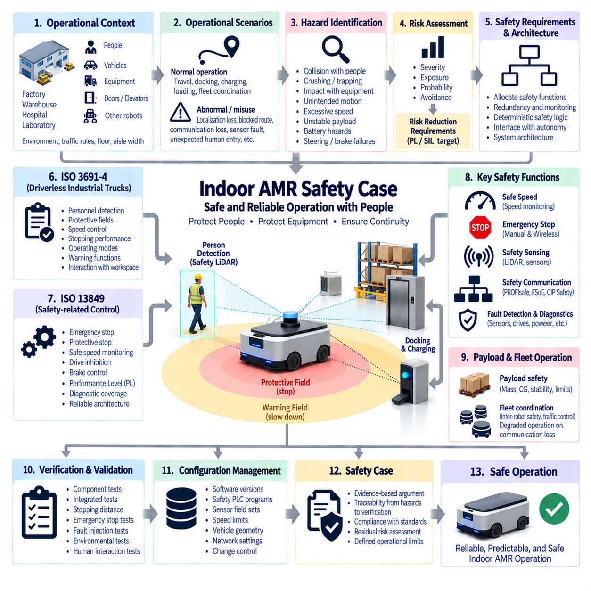
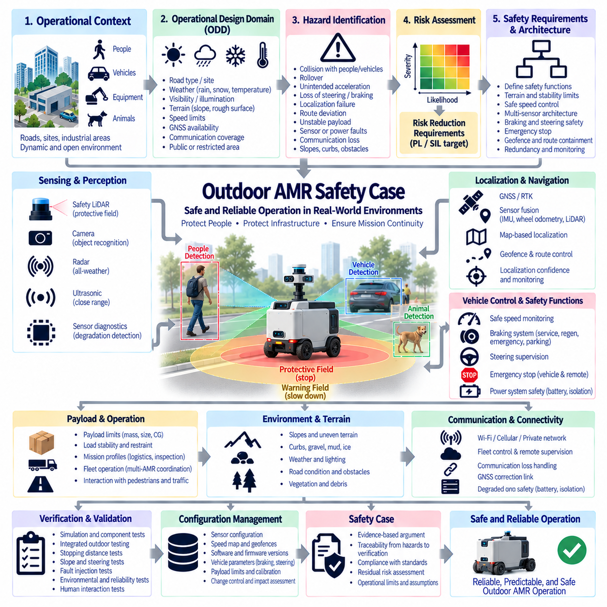
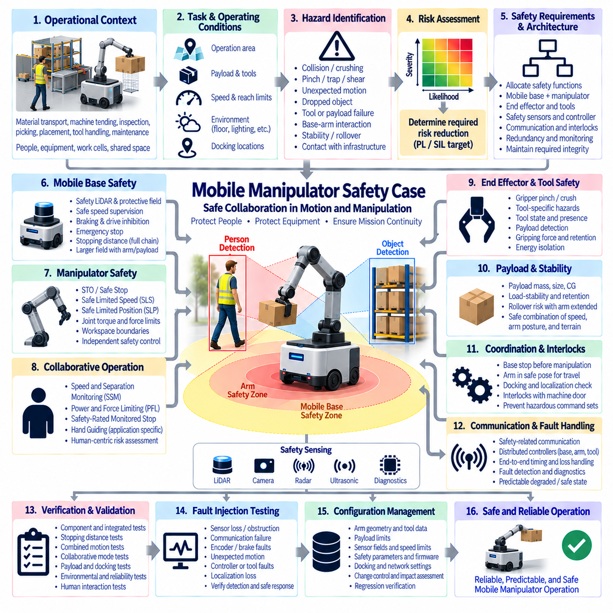
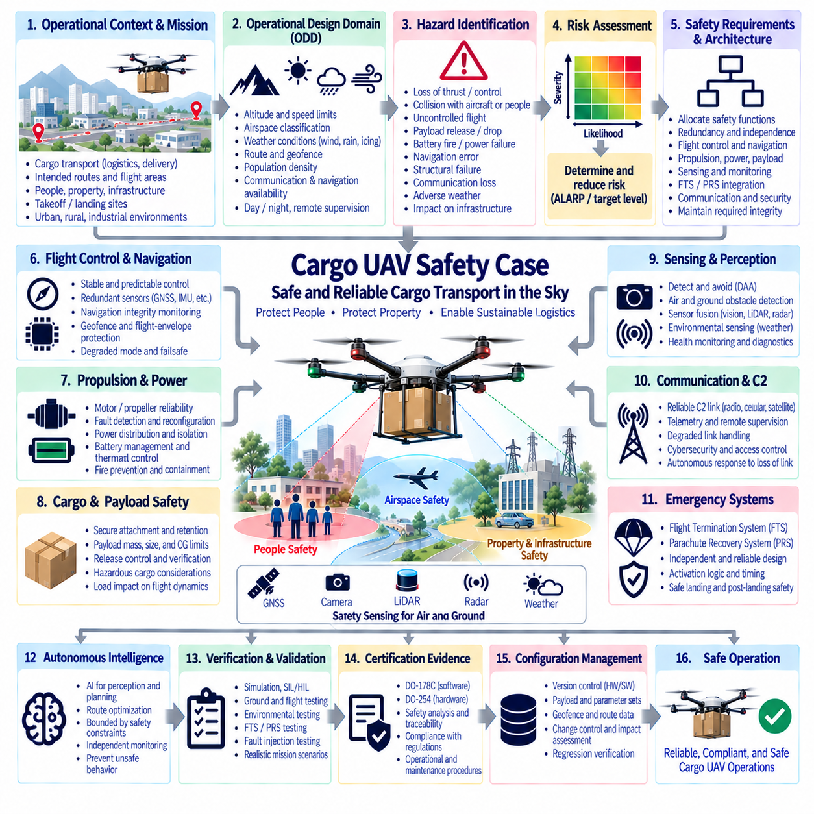
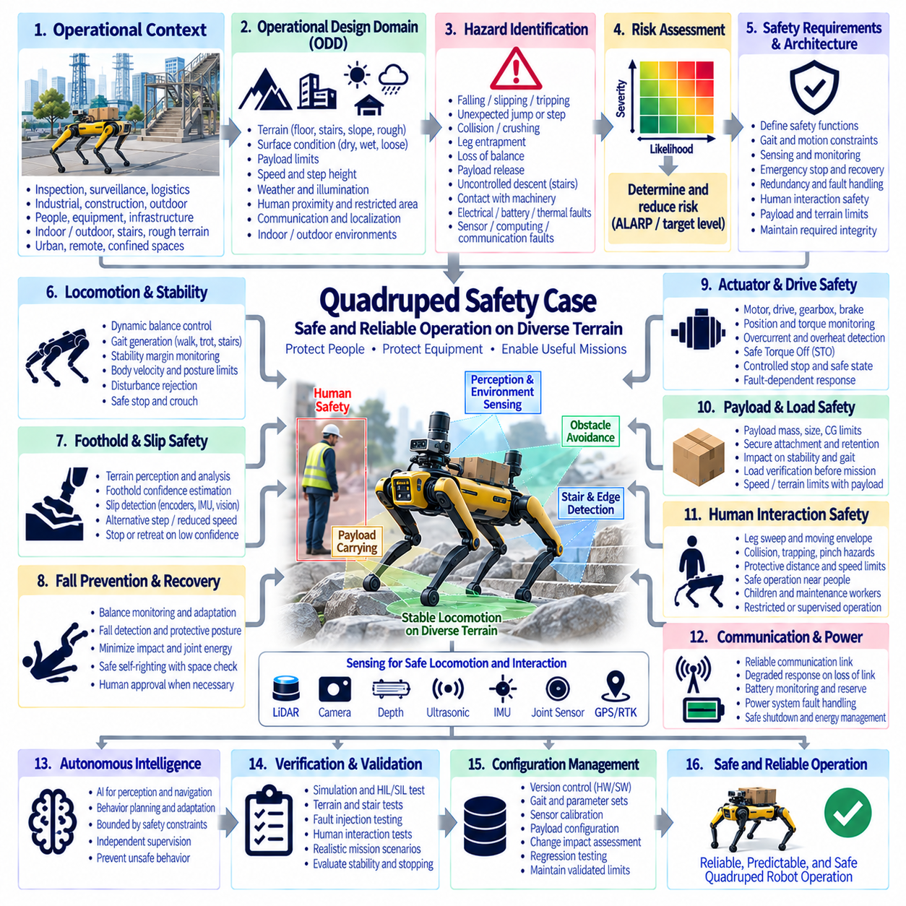
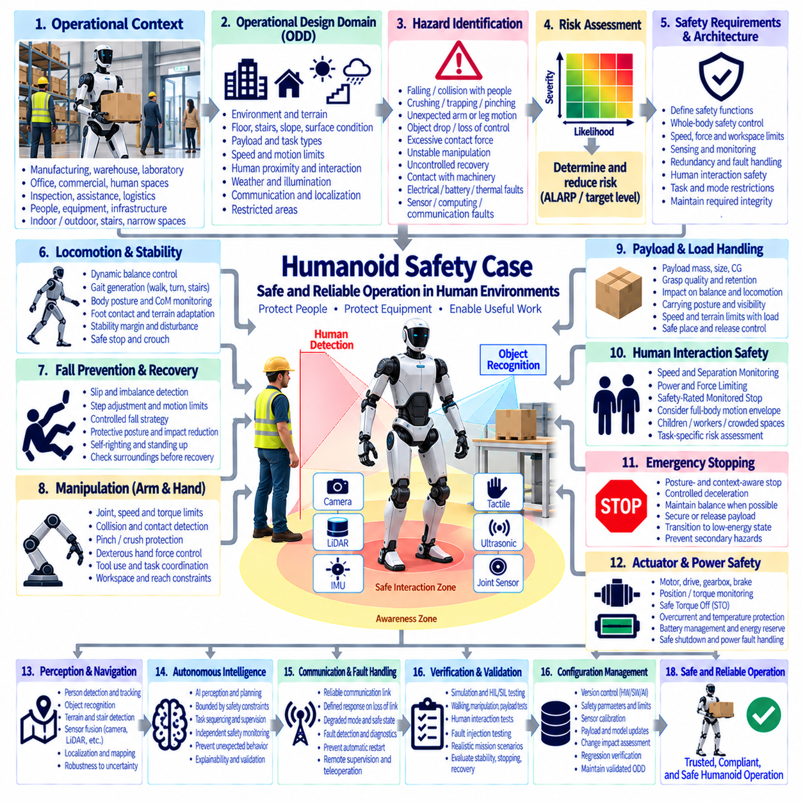

**Volume 12. Safety Architecture**

# Chapter 11. Functional Safety Case Studies

## 11.01. Indoor AMR Safety Case

{width="7.268055555555556in" height="7.268055555555556in"}

An Indoor Autonomous Mobile Robot (AMR) safety case provides a structured argument that the robot can perform its intended material-handling, inspection, logistics, or service functions without creating unacceptable risk to people, equipment, or infrastructure. Within the supplied Safety Architecture structure, the indoor AMR case represents the first application-level case study, integrating ISO 3691-4, ISO 13849, IEC 61508 concepts, safety sensing, emergency stopping, safety communication, and system-level verification into one defensible assurance argument.

The safety case begins with a clearly defined operational context. Indoor AMRs typically share factories, warehouses, laboratories, hospitals, or logistics facilities with pedestrians, manually operated vehicles, fixed machinery, doors, elevators, racks, and other robots. Vehicle dimensions, payload, maximum speed, braking capability, operating surfaces, aisle width, traffic rules, environmental conditions, and human interaction patterns establish the boundaries within which safety claims remain valid.

A complete operational description must distinguish normal operation from foreseeable abnormal and misuse conditions. Normal scenarios include autonomous travel, localization, obstacle avoidance, docking, charging, loading, unloading, and fleet coordination. Abnormal scenarios can include localization degradation, blocked routes, communication loss, sensor obstruction, actuator faults, unexpected human entry, payload displacement, or loss of power. The safety case must demonstrate that these conditions do not lead directly to uncontrolled hazardous motion.

Hazard identification establishes the foundation of the safety argument. Important hazards include collision with pedestrians, crushing or trapping between the AMR and fixed structures, impact with equipment, unexpected startup, excessive speed, insufficient stopping distance, unstable payloads, unintended movement during loading, battery hazards, and failures of steering or braking. Each hazard should be associated with credible initiating events, exposed persons, operating situations, and potential consequences.

Risk assessment determines which hazards require safety-related control measures and the integrity expected from those controls. Severity, frequency or duration of exposure, probability of occurrence, and possibility of avoidance can be considered according to the applicable safety methodology. The resulting risk reduction requirements provide the basis for selecting safety functions and, where appropriate, determining required Performance Level (PL) or Safety Integrity Level (SIL) targets for safety-related control functions.

ISO 3691-4 provides an important framework for driverless industrial trucks and their systems, including AMRs operating in industrial environments. The safety case should connect applicable vehicle behavior to requirements for personnel detection, protective fields, speed control, stopping, operating modes, warning functions, and interaction with the surrounding workspace. Compliance should not be presented merely as possession of safety-rated components; their installation and integrated behavior must satisfy the intended safety function.

Safety-related control functions can be engineered using ISO 13849 principles where applicable. Emergency stopping, protective stopping, safe speed monitoring, drive inhibition, brake control, and safety sensor processing may require defined Performance Levels. Architecture category, component reliability, diagnostic coverage, and common-cause failure measures contribute to achieved performance. The safety case must connect these calculations to the actual electrical, logical, and mechanical implementation of the AMR.

Personnel detection is normally one of the most important protective functions. Safety LiDAR can establish warning and protective fields around the moving robot, while additional safety sensors may protect blind zones or specialized operating areas. Field geometry should account for vehicle speed, direction, braking performance, sensor response time, control-system latency, payload overhang, and localization or steering uncertainty. A detected person must result in a predictable response before hazardous contact becomes possible.

Protective fields should adapt safely when AMR operating conditions change. A vehicle traveling quickly through an open aisle generally requires a different protective distance from one approaching a docking station or turning through a constrained area. Dynamic field switching may use speed, steering direction, travel direction, or operational state. The safety argument must demonstrate that incorrect field selection, delayed switching, or inconsistent state information cannot silently eliminate required protection.

Stopping performance links perception directly to physical safety. Total stopping distance includes sensor detection time, safety-controller processing, communication latency, drive response, brake actuation, and mechanical deceleration distance. Payload mass, floor friction, tire condition, gradient, speed, and brake temperature can change the result. Safety validation should therefore use worst-case or appropriately bounded conditions rather than relying on nominal braking performance measured on an ideal floor.

Emergency stop and protective stop functions serve different purposes. Protective stopping is generally initiated automatically by safety sensing when a hazardous approach is detected, while emergency stopping provides a deliberate means of responding to an emergency condition. The AMR architecture should define how propulsion torque is removed or controlled, how brakes respond, how steering behaves, and under what conditions motion can restart. Resetting a safety function must not automatically create unexpected movement.

The emergency-stop circuit should remain dependable despite failures elsewhere in the robot. Hardwired safety paths, safety relays, safety PLCs, or certified safety controllers may be used depending on the architecture and required integrity. Accessible emergency-stop devices should be positioned according to vehicle configuration and foreseeable interaction. Where wireless emergency stopping is used, communication supervision, link loss behavior, command integrity, latency, and independence require explicit treatment in the safety argument.

Safety communication becomes important when safety sensors, distributed I/O, drives, or controllers exchange safety-related information over industrial networks. Protocols such as PROFIsafe, FailSafe over EtherCAT (FSoE), or CIP Safety can provide protected safety communication using the black-channel principle. However, protocol certification alone does not establish vehicle safety. End-to-end timing, communication faults, configuration, watchdog behavior, network loading, and transition to safe states must be verified within the actual AMR architecture.

Safe speed is a central control variable because collision energy and stopping distance increase as vehicle velocity rises. The AMR may require different speed limits for open aisles, pedestrian zones, intersections, docking areas, maintenance modes, or restricted spaces. Safety-rated speed monitoring can provide an independent check against commanded velocity. If the navigation or autonomy software requests an excessive speed, the safety layer should remain capable of detecting the violation and initiating an appropriate protective response.

The safety architecture should maintain a clear boundary between autonomous intelligence and safety enforcement. Localization, path planning, obstacle prediction, fleet optimization, and AI-based perception can improve operational performance, but they should not be the sole means of protecting people from hazardous motion. Independent safety sensors and deterministic safety logic can supervise fundamental constraints such as permitted speed, protected-zone intrusion, drive enable, braking, and emergency stopping even when higher-level autonomy behaves incorrectly.

Fault detection and diagnostics support both safety and availability. Safety sensors, controllers, communication links, motor drives, encoders, brakes, power supplies, and emergency-stop circuits should be monitored where appropriate. Detected faults can require reduced speed, protective stop, drive inhibition, or maintenance intervention depending on their consequences. Diagnostic messages should distinguish operational faults from safety faults so that operators do not bypass or repeatedly reset protection without understanding the underlying condition.

Power-system failures must also be considered because loss of electrical power does not automatically guarantee a safe state. An AMR moving with significant momentum can continue travelling after propulsion power disappears, and electrically released brakes may behave differently during undervoltage. Battery isolation, contactors, DC/DC supplies, brake power, safety-controller hold-up time, and shutdown sequencing should therefore support the intended safe response during undervoltage, short circuit, emergency isolation, or battery-management faults.

Payload behavior can significantly alter the safety case. A robot that is safe when unloaded may have longer stopping distance, different center of gravity, reduced stability, or larger hazardous geometry when carrying its rated payload. Loads can also shift, fall, protrude beyond the chassis, or interfere with safety sensor fields. The approved payload envelope should therefore define mass, dimensions, center-of-gravity limits, restraint requirements, and any corresponding changes in speed or operating restrictions.

Fleet operation introduces hazards that do not exist for a single isolated AMR. Multiple robots can converge at intersections, block emergency routes, interact with shared doors or elevators, or create congestion that encourages unsafe human behavior. Fleet management can coordinate traffic and mission priorities, but vehicle-level safety should not depend entirely on a central server remaining available. Loss of fleet communication should result in defined degraded behavior while local safety functions remain effective.

Verification and validation must demonstrate the complete safety chain from hazard detection to physical response. Component certificates can support the argument but cannot replace integrated testing. Tests should measure protective-field behavior, detection coverage, stopping distance, emergency-stop response, speed supervision, communication faults, sensor failures, brake faults, power interruptions, restart behavior, payload effects, and representative human interactions under defined operating conditions.

Fault-injection testing can demonstrate whether the AMR reaches the safe state predicted by the safety analysis. Engineers can introduce representative sensor disconnections, encoder discrepancies, network interruption, controller faults, invalid speed information, emergency-stop circuit faults, or power disturbances under controlled conditions. The objective is to confirm detection, diagnostic response, fault containment, stopping behavior, and prevention of unintended restart rather than simply demonstrating that individual components report errors.

Environmental and floor conditions must remain consistent with safety assumptions. Dust, reflective surfaces, contamination, lighting, vibration, temperature, floor joints, ramps, wet surfaces, and reduced friction can influence sensors, braking, traction, localization, and electrical systems. Validation should identify the environmental limits within which the safety functions remain effective. Operational restrictions are appropriate when safe performance cannot be demonstrated outside those validated conditions.

Configuration management preserves the validity of the safety case throughout deployment. Safety PLC programs, LiDAR field sets, speed limits, drive parameters, firmware, braking configuration, vehicle geometry, payload limits, network settings, and safety-related software versions must correspond to the validated configuration. Changes require controlled impact assessment because apparently minor modifications can alter stopping distance, sensor coverage, diagnostic behavior, or the integrity of a safety function.

The resulting Indoor AMR Safety Case is therefore an evidence-based argument connecting operational context, hazard analysis, risk assessment, safety requirements, ISO 3691-4 vehicle protection, ISO 13849 safety functions, safety LiDAR, emergency stopping, safe communication, deterministic motion constraints, diagnostics, verification, and configuration control. Its objective is not to claim that failures cannot occur, but to demonstrate that foreseeable failures and human interactions are systematically detected, controlled, or mitigated before they produce unacceptable harm.

## 11.02. Outdoor AMR Safety Case

{width="7.268055555555556in" height="7.268055555555556in"}

An Outdoor Autonomous Mobile Robot (AMR) safety case provides a structured argument that the vehicle can perform autonomous transportation, inspection, patrol, logistics, or industrial missions without creating unacceptable risk to people, vehicles, equipment, infrastructure, or the environment. In the supplied structure, it is the second functional safety case study and complements the Indoor AMR Safety Case while connecting naturally to the separate Outdoor Autonomous Vehicle architecture.

Outdoor operation expands the safety problem because the environment is less controlled than an indoor factory or warehouse. The robot may encounter pedestrians, automobiles, construction equipment, bicycles, animals, curbs, slopes, potholes, vegetation, standing water, debris, and temporary obstacles. Weather, illumination, road condition, GNSS availability, communication coverage, and terrain can change continuously, so the safety case must explicitly define the validated Operational Design Domain (ODD).

The ODD establishes where and under what conditions autonomous operation is permitted. It can define road or site types, maximum gradient, surface condition, temperature, precipitation, visibility, illumination, wind, permitted speed, communication availability, localization quality, and interaction with public or restricted areas. When conditions move outside validated limits, the AMR should detect the degradation and transition to a defined restricted, stopped, remotely supervised, or other minimum-risk state.

Hazard identification must consider both vehicle failures and external environmental events. Important hazards include collision with people or vehicles, rollover, unintended acceleration, loss of steering, inadequate braking, localization failure, departure from the permitted route, unstable payloads, obstacle-detection failure, battery or power faults, communication loss, and uncontrolled movement on slopes. Each hazard should be linked to initiating causes, exposure conditions, severity, and appropriate risk-control measures.

Outdoor mobility introduces terrain-dependent hazards that are less significant for indoor AMRs. Longitudinal and lateral slopes change traction, braking distance, steering behavior, and rollover margin. Curbs, holes, loose gravel, mud, ice, wet surfaces, or abrupt elevation changes can destabilize the vehicle or reduce tire forces. Safety requirements should therefore include terrain limits and define how the vehicle detects or avoids conditions beyond its mechanical and control capabilities.

Vehicle stability becomes particularly important for high-clearance, heavy, or payload-carrying outdoor platforms. Center-of-gravity position, payload distribution, wheelbase, track width, suspension behavior, tire characteristics, speed, steering angle, and terrain inclination influence rollover risk. The safety case should define an approved loading envelope and operating limits so that path planning or autonomous control cannot intentionally command maneuvers outside validated stability boundaries.

Safe speed must be adapted to environmental and vehicle conditions rather than represented by a single maximum value. Higher speed increases stopping distance, collision energy, and the distance traveled during perception or control latency. Speed limits can depend on pedestrian proximity, visibility, curvature, terrain, slope, payload, localization confidence, weather, and available stopping distance. Independent speed supervision can prevent autonomy software from exceeding safety-defined motion constraints.

Outdoor perception normally requires complementary sensing because no single sensing technology remains equally reliable in every environmental condition. Safety LiDAR can provide deterministic protective sensing in suitable applications, while 3D LiDAR, radar, cameras, ultrasonic sensors, or other sensors can extend environmental understanding. The safety argument must distinguish safety-rated protective functions from performance-oriented perception and avoid assuming that sophisticated AI perception automatically provides certified personnel protection.

Sensor degradation must be explicitly addressed. Rain, fog, dust, snow, direct sunlight, darkness, mud, condensation, vibration, contamination, and physical obstruction can reduce sensing performance. Diagnostic functions can monitor sensor availability, communication, contamination indicators, plausibility, or disagreement between diverse sensing channels. When perception capability falls below the level required for the current speed or environment, the vehicle should reduce its operating envelope or transition toward a safe state.

Localization is another safety-critical consideration because outdoor AMRs frequently combine GNSS or GNSS-RTK with IMU, wheel odometry, LiDAR, cameras, or map-based localization. The supplied architecture separately identifies GNSS RTK, sensor fusion, and time synchronization as major robotics architecture topics. The safety case should therefore evaluate localization confidence rather than treating every estimated position as equally trustworthy.

Loss or corruption of GNSS must not automatically produce uncontrolled motion. Multipath, blockage, interference, antenna faults, correction-link loss, or inconsistent sensor data can degrade position accuracy. A robust architecture compares multiple information sources, monitors uncertainty, and defines thresholds for degraded operation. Geofencing and route-containment functions should incorporate localization uncertainty so that the physical vehicle remains inside the intended operational boundary despite estimation error.

Stopping performance must be validated under representative outdoor conditions. Total stopping distance includes perception latency, safety processing, communication delay, drive response, brake actuation, and mechanical deceleration. Vehicle mass, payload, tire pressure, tire-road friction, slope, surface contamination, and brake condition can substantially change the result. Protective distances and allowable speed should therefore be based on validated worst-case or appropriately bounded stopping behavior.

Braking architecture should remain effective after credible faults. Service braking, regenerative braking, mechanical brakes, motor torque control, and parking brakes may participate differently during normal deceleration, protective stopping, emergency stopping, or power loss. The safety case should define which braking mechanisms are safety-related and how the vehicle behaves after loss of propulsion power, undervoltage, motor-controller faults, communication failures, or operation on an incline.

Steering faults require equivalent attention because stopping alone may not always occur before the vehicle leaves its safe corridor. Steering angle sensors, actuator feedback, command monitoring, mechanical limits, and plausibility checks can detect inconsistencies between requested and actual steering. Depending on vehicle architecture, detected steering faults may require speed limitation, controlled deceleration, propulsion inhibition, or immediate stopping while preserving sufficient directional stability during the transition.

Emergency stopping must remain available independently of ordinary autonomous planning. Accessible vehicle-mounted emergency-stop devices can be combined with remote or wireless emergency-stop capability where required by the operating concept. The complete path from command generation to removal or control of hazardous motion should be analyzed for latency, communication loss, power faults, unintended activation, reset behavior, and restart prevention. A reset should authorize recovery procedures rather than automatically command motion.

Outdoor communication links are inherently more variable than fixed industrial networks. Fleet control, teleoperation, remote supervision, GNSS corrections, diagnostics, and mission management may use Wi-Fi, private cellular networks, public cellular networks, or dedicated radios. Safety should not depend on uninterrupted cloud or fleet connectivity unless the communication system is itself appropriately assured. Loss of a non-safety communication channel should trigger predefined degraded behavior while local protection remains available.

Power-system safety is significant because outdoor AMRs can carry large traction batteries and operate far from fixed infrastructure. Battery management, contactors, fuses, power distribution, DC/DC conversion, charging interfaces, insulation, thermal monitoring, and emergency isolation must support safe behavior during electrical faults. Water ingress, connector contamination, mechanical impact, thermal extremes, vibration, and charging faults should be considered because environmental exposure can alter electrical failure mechanisms.

Payload safety extends beyond maximum mass. Payload position changes the center of gravity and can alter braking, steering, stability, obstacle-clearance geometry, and structural loads. Cargo can shift or detach during acceleration, braking, turning, or travel over rough terrain. The safety case should define permitted mass, dimensions, restraint, center-of-gravity region, and operating restrictions, and should ensure that mission software does not assume unloaded vehicle dynamics when a heavy payload is present.

Interaction with pedestrians and conventional vehicles requires predictable behavior. The AMR should use clearly defined right-of-way assumptions, speed limits, stopping behavior, warning devices, lighting, and signaling appropriate to the site. At intersections, blind corners, gates, crossings, loading zones, or shared roads, additional operational controls may be required. Safety validation should consider realistic human behavior rather than assuming that surrounding people will always recognize or correctly interpret autonomous vehicle intentions.

Fleet operation introduces system-level dependencies. Multiple outdoor AMRs may share roads, charging stations, loading areas, narrow passages, or intersections. Central fleet management can coordinate traffic and missions, but collision protection should remain available locally when fleet communication fails. The architecture should prevent stale route permissions, duplicated reservations, network delays, or server faults from creating unsafe vehicle conflicts, while defining a recoverable degraded operating mode.

Autonomous intelligence and deterministic safety enforcement should remain clearly separated. AI-based perception, terrain classification, trajectory prediction, route planning, and mission optimization can improve capability, but fundamental limits such as safe speed, emergency stop, braking, geofence containment, and safety-zone intrusion should remain enforceable by sufficiently dependable mechanisms. This separation limits the consequences of unexpected autonomy behavior and simplifies the safety argument around essential vehicle constraints.

Verification and validation should progressively move from component and simulation testing toward integrated outdoor trials. Tests should measure sensing coverage, localization degradation, stopping distance, steering faults, slope behavior, emergency stopping, communication loss, power faults, payload effects, environmental exposure, and interaction with representative obstacles and people. The broader source structure also identifies environmental, reliability, and field testing as dedicated validation areas, reinforcing the importance of evidence under realistic conditions.

Fault-injection testing can demonstrate whether the outdoor AMR actually reaches the state predicted by the safety analysis. Representative GNSS loss, sensor obstruction, encoder disagreement, network interruption, motor-controller faults, brake degradation, steering anomalies, low-voltage events, or compute failures can be introduced under controlled conditions. The objective is to verify detection, isolation, controlled degradation, stopping, and restart prevention across the complete vehicle rather than only confirming component diagnostics.

Configuration management preserves the relationship between the validated vehicle and the deployed vehicle. Safety sensor configurations, speed maps, geofences, GNSS parameters, braking settings, steering calibration, tire specification, firmware, software, payload limits, network configuration, and safety-controller logic can all influence risk. Changes should undergo impact assessment because even a software parameter or tire change can alter stopping distance, stability, localization performance, or protective-zone effectiveness.

The resulting Outdoor AMR Safety Case is an evidence-based argument connecting the ODD, hazard and risk analysis, terrain and stability limits, multi-sensor perception, localization confidence, safe speed, braking and steering supervision, emergency stopping, communication degradation, electrical safety, payload control, deterministic safety enforcement, verification, and configuration management. Its purpose is to demonstrate predictable risk control not only during nominal autonomy, but also when environmental conditions, infrastructure, sensors, communications, or vehicle subsystems degrade.

## 11.03. Mobile Manipulator Safety Case

{width="7.268055555555556in" height="7.268055555555556in"}

A Mobile Manipulator combines an Autonomous Mobile Robot (AMR) with one or more robotic manipulators, creating a system capable of navigating through a workspace and physically interacting with objects, equipment, and people. Its safety case must therefore integrate mobile-platform hazards with manipulation hazards. Safety cannot be established by independently certifying the base and arm because their combined motion creates new reach, collision, stability, and coordination risks.

The operational context defines where the mobile manipulator may travel and what physical tasks it may perform. Typical operations include material transport, machine tending, inspection, picking, placement, tool handling, loading, and maintenance support. The safety case should define permitted areas, floor conditions, payloads, manipulator tools, human interaction, maximum speeds, reach envelopes, docking locations, and environmental assumptions that establish the validated operating boundary.

Hazard identification must consider the complete robot as a moving kinematic system. The mobile base can collide with or crush a person, while the manipulator can strike, pinch, trap, shear, or apply excessive force. Combined motion can extend the hazardous region beyond the footprint of the AMR. Additional hazards arise from dropped objects, tool failures, unstable payloads, unexpected arm motion, base movement during manipulation, and contact between the manipulator and surrounding infrastructure.

Risk assessment determines the safety functions needed to reduce these hazards to an acceptable level. Severity, exposure, probability of occurrence, and possibility of avoidance should be evaluated for representative operating scenarios. Safety requirements may then be allocated to the mobile base, manipulator, end effector, safety sensors, safety controller, communication network, or supervisory logic. The resulting architecture must preserve the required safety integrity across subsystem boundaries.

The mobile platform should retain the fundamental protections expected from an AMR. Safety LiDAR, protective fields, safe speed supervision, braking, emergency stopping, and drive inhibition can protect people from hazardous vehicle motion. Protective distances must consider the complete stopping chain, including sensing, safety processing, communication, drive response, and mechanical braking. Manipulator position and payload geometry may require larger protective zones than those used for the base alone.

Manipulator safety introduces requirements associated with joint motion, reach, speed, force, torque, and workspace boundaries. Depending on the application, safety functions can include Safe Torque Off (STO), Safe Stop, Safe Limited Speed (SLS), Safe Limited Position (SLP), or other monitored limits. These functions provide deterministic constraints that remain effective when ordinary robot motion planning or higher-level task software generates an unsafe command or behaves unexpectedly.

Collaborative operation requires particular attention when humans can intentionally enter the robot workspace. Concepts such as Speed and Separation Monitoring (SSM), Power and Force Limiting (PFL), Safety-Rated Monitored Stop, and Hand Guiding may be applicable depending on the task and manipulator design. The selected collaborative strategy must be supported by application-specific risk assessment rather than assuming that use of a collaborative robot arm automatically makes the complete mobile system collaborative and safe.

Speed and Separation Monitoring can dynamically relate robot motion to the distance between the robot and a person. As separation decreases, the system can progressively reduce speed and ultimately initiate a protective stop before the required separation distance is violated. For a mobile manipulator, the calculation must consider both base and arm motion because simultaneous movement can close the separation distance considerably faster than either subsystem would when operating independently.

Power and Force Limiting addresses situations in which physical contact may occur despite other protective measures. Robot mass, effective inertia, joint velocity, tool geometry, contact location, clamping conditions, and body region influence potential injury. A mobile base can change the effective collision condition of the manipulator by adding translational motion or preventing a person from moving away. Validation must therefore consider the integrated robot rather than relying solely on manipulator specifications.

The end effector introduces task-specific hazards that can dominate the safety case. Grippers can create pinch or crushing points, while sharp tools, powered tools, suction systems, welding devices, inspection probes, or carried components can create additional mechanical or process hazards. Tool presence, tool state, payload detection, gripping force, retention capability, and energy isolation should therefore be included in the safety architecture and verified for the intended task.

Payload handling affects both manipulation safety and mobile-platform stability. A heavy object held at extended reach can move the combined center of gravity and reduce rollover margin during acceleration, braking, turning, or travel over uneven surfaces. Manipulator posture can therefore influence allowable vehicle speed and acceleration. The safety architecture should define safe combinations of payload mass, arm configuration, base velocity, steering behavior, and terrain or floor conditions.

Base-arm coordination is a central safety challenge. During precise manipulation, unintended base motion can convert a controlled arm trajectory into a hazardous collision. The architecture may therefore require the mobile base to enter a verified stationary state before certain manipulation tasks begin. Brake status, drive enable, localization confidence, docking state, and manipulator permission can be interlocked so that task execution proceeds only after required safety conditions are satisfied.

Conversely, manipulator configuration can constrain when the mobile base is permitted to travel. Driving with the arm extended may enlarge the swept volume, shift the center of gravity, obstruct sensors, or expose the arm to collisions with infrastructure. A defined transport pose can reduce these risks. Safety logic can supervise whether the manipulator is within an approved travel envelope before allowing higher-speed base motion or passage through restricted areas.

Perception must cover hazards created by both mobility and manipulation. Safety LiDAR can protect the base travel zone, while additional scanners, safety cameras, proximity sensors, joint sensing, or workspace monitoring may be required around the manipulator. Sensor placement must account for self-occlusion caused by the arm, payload, mast, or tooling. A protective sensor that becomes blocked during a normal manipulation posture cannot be assumed to provide continuous protection.

The system should maintain a clear distinction between performance perception and safety-rated sensing. AI vision can recognize objects, estimate poses, identify grasp points, predict human motion, and support task planning, but uncertainty or misclassification must not directly defeat fundamental safety constraints. Deterministic safety mechanisms should remain capable of enforcing protective stops, safe speeds, joint limits, drive inhibition, and emergency stopping independently of ordinary autonomy whenever required by the risk assessment.

Emergency stopping must coordinate the mobile base, manipulator, end effector, and associated process equipment. An emergency-stop command should produce a defined system response without introducing secondary hazards such as dropping a heavy object or releasing a suspended load. Depending on the application, stopping motion while maintaining gripping force may be safer than removing all electrical power. The safe state must therefore be derived from the actual hazardous energy and task configuration.

Safety-related communication is important because mobile manipulators often contain distributed controllers. The AMR controller, robot-arm controller, safety PLC, drives, sensors, end-effector controller, and external machinery may exchange safety-relevant states. Safety protocols or hardwired interfaces can support this coordination, but the safety case must address end-to-end timing, stale data, communication loss, incorrect state transitions, watchdog behavior, and the safe response when communication cannot be trusted.

Functional interlocks can prevent hazardous combinations of otherwise valid subsystem commands. The manipulator may be prohibited from entering a defined region unless the base is stopped, a machine door is secured, or a docking condition is confirmed. Similarly, the base may be prevented from moving until the arm is retracted and the payload is secured. These interlocks should be derived from hazards and implemented with integrity appropriate to the risk they control.

Localization and docking accuracy can become safety-relevant when manipulation occurs near machinery, shelves, workstations, or people. A navigation system may position the base accurately enough for travel while still being insufficient for safe manipulation. Docking references, local sensors, mechanical alignment features, or independent position checks can establish the manipulator\'s relationship to the workcell before motion is enabled. Loss of localization confidence should prevent hazardous task continuation.

Fault detection must cover interactions between subsystems rather than only individual component failures. Encoder disagreement, brake failure, joint faults, safety sensor obstruction, lost communication, end-effector faults, unexpected payload state, localization degradation, or controller failure can require different responses depending on the current task. The system should transition to a predictable degraded or safe state while preventing automatic restart until the relevant safety conditions have been restored.

Verification and validation must test the complete mobile manipulation sequence. Testing should include base stopping distance, manipulator stopping behavior, combined motion, protective-field transitions, collaborative modes, emergency stopping, interlocks, docking, payload handling, sensor occlusion, communication faults, power interruptions, and restart behavior. Representative human interactions and worst-case robot configurations are essential because many integration hazards cannot be demonstrated by testing the AMR and manipulator separately.

Fault-injection testing can provide evidence that integrated safety mechanisms respond correctly to abnormal conditions. Representative failures can include safety sensor loss, network interruption, invalid joint position, brake faults, unexpected base movement, manipulator-controller failure, tool-state errors, or localization loss. The objective is to verify detection, containment, coordinated stopping, energy control, diagnostic reporting, and prevention of unintended motion throughout the combined system.

Configuration management preserves the validated relationship between the mobile base, manipulator, end effector, payload, software, and safety parameters. Changes to arm geometry, tool mass, payload limits, LiDAR fields, speed limits, braking parameters, joint limits, firmware, safety PLC logic, docking configuration, or communication settings can alter the safety argument. Every safety-relevant modification should therefore undergo controlled impact assessment and appropriate regression verification.

The resulting Mobile Manipulator Safety Case is an evidence-based argument connecting AMR mobility safety, manipulator functional safety, collaborative operation, safe speed and separation, force limitation, payload stability, base-arm interlocks, safety sensing, emergency stopping, communication, fault handling, verification, and configuration control. Its purpose is to demonstrate that mobility and manipulation remain predictably constrained even when humans, autonomous intelligence, subsystem failures, and changing task conditions interact within the same physical workspace.

## 11.04. Cargo UAV Safety Case

{width="7.268055555555556in" height="7.268055555555556in"}

A Cargo Unmanned Aerial Vehicle (UAV) safety case provides a structured argument that the aircraft can transport payloads through its approved operating environment without creating unacceptable risk to people, property, other airspace users, or critical infrastructure. It integrates flight safety, cargo containment, propulsion and energy hazards, autonomous operation, emergency response, and certification evidence into a single aircraft-level assurance framework.

The safety case begins with the intended operation and Operational Design Domain (ODD). Aircraft mass, payload range, flight altitude, speed, route structure, population exposure, airspace classification, weather limits, launch and landing sites, communication coverage, navigation availability, and remote supervision define the conditions under which safety claims remain valid. Operations outside these boundaries require restriction, additional mitigation, or transition to a defined safe response.

Cargo missions introduce consequences that can be significantly greater than those of small observation UAVs. Higher vehicle mass increases kinetic and potential energy, while the payload can introduce additional mechanical, electrical, chemical, or economic hazards. Safety assessment must therefore consider not only aircraft impact but also payload release, shifting center of gravity, structural overload, fire, damaged cargo, and secondary hazards created after an emergency landing or crash.

System-level hazard analysis identifies failure conditions that can lead to loss of safe flight. Representative hazards include loss of thrust, uncontrolled attitude, flight-control failure, navigation corruption, structural failure, battery or power-system faults, command-and-control loss, erroneous autonomous decisions, payload detachment, and departure from the approved flight corridor. Each hazard should be connected to prevention, detection, containment, recovery, or operational mitigation measures.

Risk assessment considers both the probability of a hazardous event and the severity of its consequences. Ground risk depends strongly on vehicle mass, impact energy, population density, route geometry, and the effectiveness of emergency recovery. Air risk depends on the possibility of conflict with other aircraft and the capability to maintain airspace containment. These factors establish the assurance rigor required for flight-critical functions and emergency protection mechanisms.

The flight-control architecture must maintain stable and predictable vehicle behavior during normal and reasonably foreseeable degraded conditions. Redundant or monitored sensors, computing resources, propulsion channels, power distribution, and communication paths can reduce vulnerability to individual failures. Redundancy alone is insufficient, however, when duplicated channels share common software, power, timing, sensors, or environmental dependencies that can produce common-cause failures.

Propulsion safety is particularly important for multirotor or distributed-electric-propulsion cargo UAVs. Motor, inverter, propeller, wiring, power-distribution, and control failures can produce asymmetric thrust and rapid loss of controllability. The safety case should establish which failures remain controllable, how propulsion degradation is detected, whether thrust can be reallocated, and when continued powered flight must be abandoned in favor of termination or recovery.

Battery and electrical energy require dedicated safety consideration because cargo UAVs may carry substantial stored energy. Battery-management faults, internal short circuits, thermal runaway, connector failures, contactor faults, insulation problems, overcurrent, and crash damage can create hazards beyond loss of propulsion. Electrical protection, thermal monitoring, isolation, enclosure design, fault containment, charging control, and emergency procedures should support both flight safety and post-landing safety.

Navigation integrity is essential for maintaining the approved flight corridor. GNSS or GNSS-RTK may be combined with inertial sensing, vision, LiDAR, radar, or other localization sources to improve robustness. The architecture should monitor navigation uncertainty and detect inconsistent information rather than treating every position estimate as valid. Multipath, blockage, interference, correction-link loss, or sensor faults must lead to predictable degraded behavior before containment is lost.

Geofencing and flight-envelope protection can provide deterministic constraints around autonomous mission execution. Horizontal boundaries, altitude limits, restricted areas, speed limits, attitude limits, and other operational constraints should remain enforceable even when high-level route planning behaves incorrectly. Boundary calculations should consider navigation uncertainty, aircraft velocity, wind, control latency, stopping or turning capability, and the time required for an emergency response to become effective.

Weather can alter both flight performance and safety margins. Wind and gusts influence control authority, energy consumption, route tracking, landing accuracy, and parachute drift, while precipitation, icing, temperature, visibility, and atmospheric conditions can affect propulsion, sensors, batteries, communication, and structures. The safety case should define validated environmental limits and require restriction or mission termination when conditions exceed the demonstrated operating envelope.

Cargo attachment and retention form a safety-critical interface between payload and aircraft. The payload must remain secured during acceleration, maneuvering, turbulence, emergency braking of rotors, landing, and foreseeable abnormal conditions. Retention mechanisms, locks, latches, sensors, structural interfaces, and loading procedures should prevent unintended release. Where payload release is intentional, authorization and release-zone constraints must prevent hazardous activation at an incorrect location.

Payload mass and position directly influence flight dynamics. Changes in center of gravity can affect stability, actuator authority, control allocation, energy consumption, and emergency recovery performance. The approved payload envelope should therefore define mass, dimensions, center-of-gravity limits, mounting configuration, and any corresponding restrictions on speed, altitude, range, or weather. Payload verification before dispatch can prevent missions from beginning with an invalid aircraft configuration.

Autonomous intelligence should remain bounded by deterministic safety mechanisms. AI-based perception, route optimization, landing-site assessment, mission planning, or decision-making can improve operational capability, but uncertain AI behavior should not be the sole protection against catastrophic outcomes. Independent monitoring can supervise fundamental constraints such as flight envelope, geofence containment, propulsion health, energy reserve, emergency state transitions, and authorization of safety-critical actions.

Command-and-control communication must support predictable behavior during degradation or loss. The aircraft may use radio, cellular, satellite, or other communication technologies for supervision, telemetry, mission updates, or remote intervention. Safety should not assume continuous connectivity unless that assumption is explicitly assured. Link degradation, excessive latency, corrupted commands, unauthorized access, or complete communication loss should trigger predefined autonomous responses consistent with the approved operation.

The Flight Termination System (FTS) provides a final containment layer when continued flight presents unacceptable risk. It should remain sufficiently independent from ordinary flight-control and mission functions so that failures requiring termination do not simultaneously disable the termination path. Detection, decision logic, command communication, dedicated power, physical actuation, response timing, and protection against inadvertent activation must be addressed as one complete safety chain.

The Parachute Recovery System (PRS) can complement flight termination by reducing descent velocity and impact energy when powered recovery is no longer credible. Deployment altitude, aircraft attitude, vertical speed, canopy inflation time, opening loads, attachment geometry, propulsion interaction, wind drift, and payload mass determine effectiveness. The safety case must demonstrate recovery performance across the approved operating envelope rather than relying only on nominal parachute specifications.

FTS and PRS functions should be coordinated with degraded flight-control modes. A fault may initially permit controlled flight to a diversion or emergency landing location. If controllability deteriorates, the aircraft may transition to containment or flight termination, followed by parachute deployment when appropriate. Safety analysis should define these transitions so that emergency functions cooperate instead of creating conflicting commands or eliminating a still-viable lower-risk recovery option.

Software assurance is essential because flight control, navigation, monitoring, communication, and emergency functions depend heavily on software. DO-178C principles provide a framework for requirements, design, implementation, verification, traceability, configuration management, and process assurance according to assigned safety significance. Safety evidence should demonstrate that critical software behavior is controlled and that failures cannot silently violate aircraft-level safety requirements.

Complex airborne electronic hardware requires corresponding assurance. DO-254 principles can support development and verification of FPGAs, programmable logic, and other complex hardware used in flight-control, monitoring, communication, or safety functions. Hardware requirements, design, implementation, verification, traceability, configuration management, and process assurance must remain connected to the system-level hazards and safety objectives allocated to the equipment.

Verification and validation should progressively combine analysis, simulation, Software-in-the-Loop, Hardware-in-the-Loop, ground testing, subsystem integration, tethered or restricted flight, and increasingly representative flight trials. Normal operation alone is insufficient. Testing should include propulsion degradation, navigation faults, communication loss, power disturbances, payload effects, environmental limits, emergency landing, FTS activation, and PRS deployment where these functions form part of the approved safety architecture.

Fault-injection testing strengthens the safety argument by deliberately challenging assumptions under controlled conditions. Sensor corruption, GNSS loss, processor faults, communication interruption, propulsion anomalies, power degradation, incorrect payload information, or actuator faults can be introduced to confirm detection and response. The objective is to demonstrate fault containment, controlled degradation, emergency transition, and prevention of uncontrolled continuation rather than simply generating diagnostic messages.

Configuration management preserves the relationship between the certified aircraft and the aircraft actually dispatched. Software, firmware, hardware revisions, propulsion configuration, battery type, sensor calibration, geofence data, payload limits, FTS parameters, parachute configuration, communication settings, and maintenance status can all influence safety. Changes require impact assessment and appropriate regression evidence before the modified configuration is accepted for operation.

The resulting Cargo UAV Safety Case is an evidence-based argument connecting the ODD, hazard analysis, ground and air risk, flight control, propulsion, electrical energy, navigation integrity, payload containment, autonomous intelligence, communication, FTS, PRS, DO-178C software assurance, DO-254 hardware assurance, verification, and configuration control. Its purpose is to demonstrate that normal flight, foreseeable failures, degraded states, and emergency responses remain predictably constrained throughout the approved cargo mission.

## 11.05. Quadruped Safety Case

{width="7.268055555555556in" height="7.268055555555556in"}

A Quadruped Robot safety case provides a structured argument that a four-legged autonomous robot can perform inspection, surveillance, logistics, exploration, or industrial support tasks without creating unacceptable risk to people, equipment, infrastructure, or the environment. Unlike wheeled AMRs, quadrupeds continuously manage whole-body balance, foothold selection, leg contact, and dynamic stability, making locomotion safety a central part of the system-level assurance argument.

The operational context defines the environments and missions for which safety has been demonstrated. A quadruped may operate indoors or outdoors on floors, stairs, ramps, rough terrain, construction sites, industrial facilities, or confined passages. Surface condition, slope, step height, obstacle geometry, payload, speed, weather, illumination, communication coverage, human proximity, and restricted areas should therefore form part of the validated Operational Design Domain (ODD).

Hazard identification must consider both ordinary robotic hazards and hazards unique to legged locomotion. Representative events include falling, slipping, tripping, unexpected jumping or stepping, collision, crushing, leg entrapment, unstable recovery motion, loss of balance near people, payload release, uncontrolled descent on stairs, and contact with machinery. Electrical, battery, thermal, communication, sensing, computing, and actuator failures can initiate or amplify these mechanical hazards.

Risk assessment should evaluate the severity and likelihood of each hazardous scenario together with human exposure and the possibility of avoidance. A slowly walking robot on a level restricted floor presents a different risk from the same robot climbing stairs beside personnel or carrying equipment over rough terrain. The resulting risk reduction requirements should determine safety functions, operating restrictions, protective measures, required integrity, and conditions requiring human supervision or mission termination.

Dynamic stability is fundamental because a quadruped cannot normally rely on a fixed support polygon in the same manner as a stationary machine. The support region changes continuously as feet lift and contact the ground. Body velocity, center of mass, foot placement, ground reaction forces, joint torque, terrain inclination, and disturbances influence stability. Safety monitoring should identify when the robot approaches conditions from which controlled balance recovery is no longer credible.

Gait generation must remain within validated mechanical and dynamic limits. Walking, trotting, stair climbing, turning, obstacle traversal, and recovery maneuvers impose different loads on joints, transmissions, structures, and contact surfaces. Limits on body speed, joint velocity, torque, acceleration, step length, foot clearance, and allowable terrain should constrain the locomotion controller so that mission planning cannot demand motions beyond the demonstrated capability of the platform.

Foothold safety is especially important on irregular terrain. A geometrically valid foothold may still be unsafe when the surface is loose, wet, compliant, inclined, narrow, or structurally weak. Perception can estimate terrain geometry and surface characteristics, while proprioceptive sensing can identify unexpected contact behavior. When foothold confidence decreases, the robot should reduce speed, select an alternative step, increase stability margin, retreat, or stop rather than continue an uncertain traversal.

Slip detection requires rapid comparison between commanded and observed leg or body motion. Joint encoders, inertial sensing, motor current or torque estimation, foot contact sensors, and visual or LiDAR-based motion estimates can contribute to identifying loss of traction. Once slip is detected, the control system may modify foot forces, reposition a leg, lower the body, increase the support area, or stop progression according to the remaining stability margin and terrain condition.

Fall prevention and fall response should be treated as related but distinct safety functions. Prevention attempts to maintain balance through gait adaptation, disturbance rejection, foothold correction, and speed limitation. When a fall becomes unavoidable, the objective changes to minimizing consequences. The robot may reduce joint energy, adopt a protective posture, stop leg motion, protect sensitive equipment, and avoid aggressive recovery actions that could create a greater hazard to nearby people.

Recovery after a fall requires explicit safety control. Autonomous self-righting can involve large, rapid leg and body movements with a significantly larger swept volume than ordinary walking. Before recovery begins, the system should evaluate whether sufficient free space exists and whether people or obstacles are inside the recovery zone. When the environment cannot be confirmed as safe, recovery may require remote authorization or human intervention rather than immediate autonomous motion.

Joint and actuator safety directly influence whole-body behavior. Electric motors, drives, gearboxes, brakes, encoders, torque sensors, and mechanical structures should be monitored for conditions that can produce unexpected motion or loss of support. Position disagreement, excessive torque, overheating, communication faults, current anomalies, or actuator saturation can indicate degraded capability. A single leg fault may require a controlled stop, stable stance, body lowering, or other fault-dependent response.

Safe Torque Off (STO), safe stopping, torque limitation, and other drive-level safety functions can contribute to hazard mitigation, but removing torque is not automatically the safest response for a legged robot. Immediate torque removal while standing on stairs or a slope can cause collapse or uncontrolled descent. The safe state must therefore be defined according to the physical situation, potentially requiring controlled torque to maintain posture before transitioning to a lower-energy mechanically stable condition.

Perception supports terrain understanding, obstacle avoidance, person detection, and navigation. LiDAR, depth cameras, conventional cameras, ultrasonic sensing, or other modalities may be combined with proprioceptive information. However, performance-oriented perception and safety-rated protection should be distinguished. AI perception can improve terrain classification and semantic understanding, but uncertainty, occlusion, or misclassification must not silently disable fundamental constraints intended to prevent hazardous motion.

Human interaction requires consideration of the robot\'s complete moving envelope. Legs can extend beyond the body footprint and create impact, trapping, or pinch hazards close to the ground where people may not expect rapid motion. Protective distances and speed restrictions should consider gait phase, leg sweep, stopping behavior, payload geometry, and possible balance-recovery motion. Operation near children, seated personnel, maintenance workers, or crowded spaces may require additional restrictions.

Emergency stopping presents a special challenge because a quadruped cannot always stop safely by instantaneously freezing every actuator. The safety architecture should define how locomotion transitions from normal gait to controlled deceleration, stable stance, crouch, or another appropriate condition. Emergency-stop behavior should minimize hazardous kinetic energy while preserving sufficient control to prevent collapse where possible. Restart should require confirmation that the cause of the stop has been resolved.

Payloads modify both stability and locomotion performance. Payload mass, mounting height, position, dimensions, and movement change the center of gravity and inertial characteristics of the robot. A load that is acceptable during level walking may become unsafe during stair climbing, turning, or recovery from disturbance. The approved payload envelope should therefore be connected to allowable gait, speed, slope, step height, acceleration, and recovery behavior.

Stair and edge operation requires dedicated protection because a localization or foothold error can produce a fall from height rather than a simple loss of balance. Terrain perception should identify stair geometry, platform edges, drop-offs, holes, and insufficient support surfaces. The system should maintain appropriate margins from edges and reduce speed when geometric uncertainty increases. Loss of reliable terrain information near a drop should result in conservative behavior rather than speculative motion.

Localization and navigation must account for the robot\'s ability to physically traverse the planned route. A global planner may identify a geometrically open path that contains terrain unsuitable for the current gait, payload, stability state, or available traction. Navigation should therefore incorporate traversability information rather than obstacle clearance alone. Localization uncertainty should also influence behavior near stairs, ledges, narrow passages, hazardous equipment, or restricted operational boundaries.

Communication loss should produce a predefined degraded response appropriate to mission risk. Remote supervision, teleoperation, fleet management, and mission updates may rely on wireless networks that become unreliable inside industrial structures or remote outdoor areas. Essential local safety functions should remain available without continuous external connectivity. Depending on the environment, communication loss may cause the robot to stop, return, hold a stable posture, or move to a predetermined safe location.

Battery and power-system faults can directly affect the ability to maintain posture. Undervoltage, battery-management faults, contactor failures, damaged wiring, overheating, or sudden power interruption can reduce actuator capability while the robot is moving or supporting its own mass. Energy monitoring should therefore provide sufficient reserve for controlled mission termination where possible, and power architecture should consider the energy required to reach a mechanically safe condition after a detected fault.

Autonomous intelligence should remain bounded by deterministic safety constraints. AI-based terrain interpretation, navigation, object recognition, behavior planning, or learned locomotion policies can substantially improve capability, but their output should remain subject to limits on speed, torque, joint position, body attitude, operating region, and other safety-related variables. Independent supervision can prevent an unexpected policy output from directly commanding a physically hazardous state.

Fault detection should consider interactions across perception, computation, communication, power, and motion control. IMU disagreement, encoder errors, sensor obstruction, actuator degradation, localization loss, excessive body attitude, unexpected foot contact, or processor faults can have different consequences depending on gait and terrain. The robot should classify its remaining capability and transition to an appropriate degraded mode instead of applying the same generic stop response to every failure.

Verification and validation must reproduce representative locomotion and failure conditions. Testing should include level walking, slopes, stairs, rough surfaces, low-friction terrain, obstacles, payload variation, human proximity, emergency stopping, communication loss, perception degradation, actuator faults, and recovery behavior. Stability margins, stopping behavior, foot placement, joint loads, sensor performance, and fall consequences should be evaluated under controlled but realistically challenging conditions.

Fault-injection testing can demonstrate whether the quadruped reaches the state predicted by the safety analysis. Representative tests may introduce sensor loss, corrupted localization, actuator degradation, communication interruption, unexpected foot slip, reduced traction, power faults, or incorrect terrain information. The objective is to verify detection, controlled degradation, balance management, fault containment, safe stopping, and prevention of uncontrolled autonomous recovery.

Configuration management preserves the relationship between the validated quadruped and the deployed system. Changes to gait parameters, learned policies, joint limits, motor-control firmware, perception models, payload configuration, sensor calibration, safety thresholds, terrain maps, battery configuration, or recovery behavior can modify the safety argument. Safety-relevant changes therefore require impact assessment, regression testing, and confirmation that validated operating limits remain applicable.

The resulting Quadruped Safety Case is an evidence-based argument connecting the ODD, hazard and risk analysis, dynamic stability, gait constraints, foothold and slip monitoring, fall protection, actuator safety, perception, human interaction, emergency stopping, payload control, terrain awareness, communication, energy management, deterministic supervision, verification, and configuration control. Its purpose is to demonstrate that a legged robot remains predictably constrained when locomotion, autonomy, environmental uncertainty, and failures interact.

## 11.06. Humanoid Safety Case

{width="7.268055555555556in" height="7.268055555555556in"}

A Humanoid Robot safety case provides a structured argument that a human-shaped autonomous robot can perform manipulation, transportation, inspection, assistance, or industrial tasks without creating unacceptable risk to people, equipment, infrastructure, or itself. Humanoids combine legged locomotion, whole-body balance, articulated arms, dexterous manipulation, and close human interaction, so safety must be demonstrated at the integrated whole-body system level.

The operational context defines the environments, tasks, and interactions for which safety has been demonstrated. A humanoid may work in factories, warehouses, laboratories, offices, commercial facilities, or human-centered spaces containing stairs, doors, tools, machinery, and narrow passages. Floor conditions, workspace geometry, payload, task type, human proximity, speed, environmental conditions, and restricted areas should form part of the validated Operational Design Domain (ODD).

Hazard identification must consider the humanoid as a tall, articulated, dynamically balanced machine with a large changing motion envelope. Representative hazards include falling onto a person, collision, crushing, trapping, pinching, unexpected arm or leg motion, object dropping, excessive contact force, unstable manipulation, uncontrolled recovery, and contact with machinery. Electrical, battery, thermal, sensing, computing, communication, and actuator failures can initiate or amplify these physical hazards.

Risk assessment should evaluate severity, exposure, probability of occurrence, and possibility of avoidance for representative tasks and human interactions. A humanoid walking through an isolated industrial corridor presents a different risk from the same robot manipulating heavy objects beside a worker. Risk reduction requirements should therefore determine permitted operating modes, safety functions, speed and force limits, separation requirements, supervision, protective measures, and conditions requiring task termination.

Whole-body stability is fundamental because humanoid robots normally have a relatively high center of mass and a limited support region. Walking continuously changes the support relationship between the feet and the ground, while arm motion and payload handling alter body momentum and balance. Safety monitoring should supervise body attitude, center-of-mass behavior, foot contact, joint states, and stability margins so that hazardous loss of balance can be detected before recovery becomes impossible.

Walking and gait generation must remain within validated dynamic and mechanical limits. Step length, walking speed, foot clearance, acceleration, joint velocity, torque, body posture, turning rate, and terrain geometry influence stability. The locomotion controller should remain bounded so that high-level autonomy cannot request motions exceeding demonstrated capability. Reduced speed, shorter steps, wider stance, or stopping may be required when terrain or state uncertainty increases.

Fall prevention should combine terrain perception, balance control, disturbance rejection, foot-placement adaptation, and motion limitation. A humanoid may lose stability because of slipping, unexpected contact, payload movement, actuator degradation, or collision with an external object. The control system should recognize declining stability margins and modify gait, reposition the feet, reduce momentum, release noncritical task objectives, or enter a stable posture before a fall becomes unavoidable.

When a fall cannot be prevented, fall management should minimize consequences to both the robot and surrounding people. Simply removing actuator torque can produce an uncontrolled collapse of a tall and heavy structure. A controlled fall strategy may reduce joint energy, select a safer direction, protect the head and critical components, avoid extending limbs toward people, and limit impact where possible. The acceptable strategy depends strongly on nearby humans, obstacles, stairs, and carried objects.

Recovery from the floor introduces a separate hazardous motion phase. Self-righting and standing-up movements can require wide arm and leg sweeps, high joint torque, shifting support contacts, and rapid changes in body posture. Before autonomous recovery begins, the robot should determine whether the surrounding recovery zone is clear. If reliable confirmation is unavailable, recovery may require remote authorization or human intervention instead of immediate automatic execution.

Arm and hand motion creates manipulation hazards similar to those of industrial and collaborative robots, but the moving humanoid body changes the effective interaction geometry. Hands, fingers, wrists, elbows, and carried tools can generate pinching, trapping, impact, or crushing hazards. Safe joint limits, speed limits, torque limits, monitored workspace boundaries, and collision detection should therefore be coordinated with whole-body position rather than treated as isolated arm functions.

Dexterous hands introduce additional hazards because many actuated joints operate close to people and objects. Finger mechanisms can create small but significant pinch and trapping points, while strong grasping can apply damaging forces. Grasp force, finger velocity, object geometry, contact state, and release behavior should be controlled according to the task. A fault should not cause uncontrolled gripping, unexpected release, or continued manipulation when object state is uncertain.

Payload handling affects balance, contact forces, visibility, and locomotion. Object mass, dimensions, center of gravity, grip quality, and carrying posture change whole-body dynamics. A load that is safe while standing may become unsafe during walking, turning, stair use, or disturbance recovery. The approved payload envelope should therefore be connected to allowable gait, arm posture, speed, acceleration, visibility, and the robot\'s ability to place or retain the object safely.

Human interaction safety is central because humanoids are designed to operate in environments built for people. Protective behavior should account for human position, movement, reach, and possible unexpected actions. Speed and Separation Monitoring (SSM), Power and Force Limiting (PFL), Safety-Rated Monitored Stop, or related collaborative principles may support particular applications. Their use must be justified through task-specific risk assessment rather than assumed from human-like appearance.

Speed and Separation Monitoring should consider the motion of the entire humanoid rather than only the hands. Walking, torso rotation, arm extension, and balance recovery can simultaneously reduce separation from a person. Protective distance calculations should therefore consider robot approach velocity, human approach assumptions, sensing latency, control response, stopping behavior, and possible body motion after stopping begins. Uncertain person detection should lead to conservative operating behavior.

Power and Force Limiting becomes important where physical human-robot contact is foreseeable. Injury potential depends on effective mass, joint velocity, contact geometry, body region, clamping conditions, and the ability of the person to move away. Whole-body momentum can make contact more severe than predicted from an individual arm joint alone. Validation should therefore evaluate representative integrated contact conditions rather than relying solely on actuator torque limits.

Perception supports person detection, object recognition, terrain understanding, manipulation, navigation, and interaction. Cameras, depth sensors, LiDAR, force sensing, tactile sensing, IMUs, joint encoders, and other modalities can contribute complementary information. Safety architecture should distinguish performance-oriented AI perception from safety-related sensing. Misclassification, occlusion, lighting changes, or model uncertainty must not silently remove fundamental protection against hazardous motion.

Autonomous intelligence may control complex sequences involving walking, reaching, grasping, carrying, tool use, and interaction. AI-based perception, planning, learned policies, or foundation-model-based reasoning can improve capability but can also generate actions that are difficult to exhaustively predict. Deterministic safety supervision should therefore enforce limits on speed, force, joint position, workspace, balance state, protected zones, and authorization of hazardous actions independently of task-level intelligence.

Task planning should account for safety transitions between locomotion and manipulation. A humanoid may need to establish a stable stance before applying significant manipulation force, lifting a heavy object, or operating a tool. Conversely, walking may be prohibited while the arms are in configurations that obstruct sensing, destabilize the body, or create an excessive swept volume. Interlocks can ensure that each task phase begins only when the required physical safety conditions are satisfied.

Emergency stopping is particularly complex because immediately disabling all joints can cause the robot to collapse. The safe response should depend on posture, motion, terrain, payload, and proximity to people. The system may first require controlled deceleration, placement of both feet, stabilization of the body, securing or releasing a payload when appropriate, and transition to a low-energy posture. Emergency-stop design must therefore control hazardous energy without creating a more dangerous secondary event.

Actuator and joint safety must support the complete body. Motors, drives, gearboxes, brakes, encoders, torque sensors, and mechanical structures should be monitored for excessive torque, position disagreement, overheating, communication faults, or saturation. Safe Torque Off (STO) and related drive functions can contribute to protection, but the safety case should define when torque removal is appropriate and when controlled torque is temporarily necessary to maintain balance or safely lower the body.

Battery and power-system failures can rapidly affect the robot\'s ability to remain upright. Undervoltage, battery-management faults, contactor failures, wiring faults, overheating, or sudden power loss may reduce actuator authority while the robot is supporting itself or carrying an object. Energy management should maintain sufficient reserve for controlled task termination where practical, while power architecture should support predictable transition toward a mechanically stable and low-energy condition.

Communication loss must have a defined response when remote supervision, teleoperation, fleet management, or external task coordination is used. Local safety functions should remain effective without continuous network connectivity. Depending on the mission and environment, communication loss may cause the humanoid to stop, assume a stable posture, complete only a limited safe action, or move to a predetermined safe location. Loss of connectivity should never result in uncontrolled continuation of a hazardous task.

Fault detection should evaluate the remaining capability of the complete robot. IMU disagreement, joint encoder faults, tactile sensor loss, camera obstruction, actuator degradation, localization errors, communication failures, or computing faults can have different consequences depending on posture and task. The system should select an appropriate degraded state rather than applying one generic reaction, while preventing automatic restart until required safety conditions and diagnostic checks have been restored.

Verification and validation must evaluate integrated whole-body behavior under realistic operating conditions. Testing should include walking, turning, stairs, manipulation, payload handling, human proximity, contact, emergency stopping, perception degradation, communication loss, power faults, actuator faults, falling, and recovery. Combined scenarios are particularly important because hazards may emerge only when locomotion, manipulation, balance, perception, and human interaction occur simultaneously.

Fault-injection testing can demonstrate whether safety mechanisms respond correctly when critical assumptions fail. Representative tests may introduce sensor loss, invalid joint information, actuator degradation, localization faults, communication interruption, reduced traction, unexpected contact, or power disturbances. The objective is to verify fault detection, controlled degradation, balance management, coordinated stopping, energy limitation, safe-state transition, and prevention of unintended autonomous recovery or restart.

Configuration management preserves the validated relationship among hardware, software, learned models, safety parameters, payload limits, sensors, and mechanical configuration. Changes to gait policies, perception models, joint limits, torque thresholds, manipulation software, motor firmware, payload configuration, sensor calibration, or recovery behavior can alter safety. Safety-relevant modifications therefore require impact assessment, regression verification, and confirmation that validated operating limits remain applicable.

The resulting Humanoid Safety Case is an evidence-based argument connecting the ODD, hazard and risk analysis, whole-body stability, locomotion, fall management, manipulation, dexterous hands, payload handling, collaborative interaction, perception, bounded autonomous intelligence, emergency stopping, actuator and energy safety, fault handling, verification, and configuration control. Its purpose is to demonstrate predictable safety when mobility, manipulation, human interaction, autonomy, and physical uncertainty coexist within one highly articulated robotic system.
